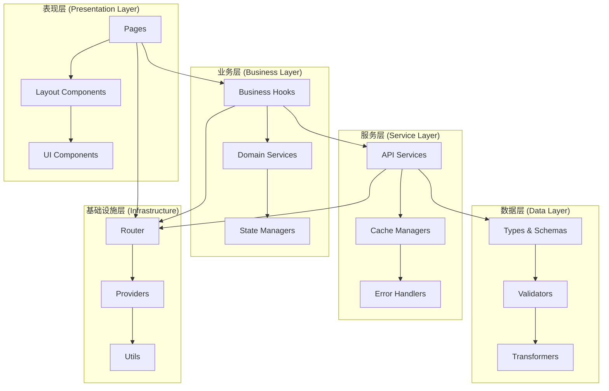

# 前端架构优化设计文档

## 概述

本设计文档基于需求文档，详细描述了土地物业资产管理系统前端架构优化的技术设计方案。设计以业务价值为导向，通过系统性的架构重构，解决当前系统在资产管理业务流程中的痛点，提升管理效率和决策支持能力。

## 业务价值分析

### 当前业务痛点
1. **数据孤岛问题**: 资产信息、租赁数据、财务记录分散在不同模块，缺乏统一视图
2. **决策支持不足**: 缺乏实时的业务指标和趋势分析，影响管理决策
3. **操作效率低下**: 重复性操作多，批量处理能力不足
4. **用户体验差**: 页面加载慢，操作流程复杂，学习成本高
5. **数据质量问题**: 缺乏有效的数据验证和一致性保障

### 业务价值目标
1. **提升管理效率**: 通过优化的工作流程，减少50%的重复操作时间
2. **增强决策支持**: 提供实时业务指标，支持数据驱动的决策
3. **改善用户体验**: 页面响应时间减少70%，操作流程简化30%
4. **保障数据质量**: 建立完整的数据验证体系，减少90%的数据错误
5. **支持业务扩展**: 架构支持快速添加新功能，开发效率提升40%

## 架构设计

### 整体架构图



### 分层架构详细设计

#### 1. 表现层 (Presentation Layer)

**职责**: 负责UI渲染、用户交互处理、路由管理

**组件结构**:
```
src/
├── pages/                  # 路由页面
│   ├── dashboard/
│   ├── assets/
│   └── analytics/
├── widgets/                # 业务小部件
│   ├── asset-card/
│   ├── data-table/
│   └── chart-widgets/
└── shared/ui/              # 基础UI组件
    ├── components/
    ├── layouts/
    └── primitives/
```

**设计原则**:
- 组件只关注展示逻辑，不包含业务逻辑
- 通过props接收数据和回调函数
- 支持主题定制和响应式设计
- 遵循无障碍访问标准

#### 2. 业务层 (Business Layer)

**职责**: 封装业务逻辑、管理应用状态、处理数据转换

**组件结构**:
```
src/
├── entities/               # 业务实体
│   ├── asset/
│   │   ├── model/          # 数据模型
│   │   ├── hooks/          # 业务Hooks
│   │   └── store/          # 状态管理
│   ├── rental/
│   └── finance/
└── features/               # 功能模块
    ├── asset-management/
    ├── dashboard/
    └── analytics/
```

**设计原则**:
- 业务逻辑与UI逻辑完全分离
- 使用自定义Hooks封装业务逻辑
- 状态管理遵循单一数据源原则
- 支持业务规则的灵活配置

#### 3. 服务层 (Service Layer)

**职责**: 处理API调用、数据缓存、错误处理

**组件结构**:
```
src/
├── shared/
│   ├── api/                # API客户端
│   ├── cache/              # 缓存管理
│   ├── errors/             # 错误处理
│   └── monitoring/         # 性能监控
```

**设计原则**:
- 抽象数据访问逻辑
- 提供统一的错误处理机制
- 实现智能缓存策略
- 支持离线模式和重试机制

#### 4. 数据层 (Data Layer)

**职责**: 定义数据模型、验证数据、转换数据格式

**组件结构**:
```
src/
├── shared/
│   ├── types/              # 类型定义
│   ├── schemas/            # 数据模式
│   ├── validators/         # 数据验证
│   └── transformers/       # 数据转换
```

**设计原则**:
- 确保类型安全
- 提供数据验证机制
- 支持数据格式转换
- 维护数据一致性

## 组件和接口设计

### 1. 基础组件设计

#### Button 组件
```typescript
interface ButtonProps {
  variant: 'primary' | 'secondary' | 'danger' | 'ghost'
  size: 'small' | 'medium' | 'large'
  loading?: boolean
  disabled?: boolean
  icon?: React.ReactNode
  children: React.ReactNode
  onClick?: (event: React.MouseEvent) => void
  className?: string
  testId?: string
}

export const Button: React.FC<ButtonProps> = ({
  variant = 'primary',
  size = 'medium',
  loading = false,
  disabled = false,
  icon,
  children,
  onClick,
  className,
  testId
}) => {
  const handleClick = useCallback((event: React.MouseEvent) => {
    if (loading || disabled) return
    onClick?.(event)
  }, [loading, disabled, onClick])

  return (
    <button
      className={cn(
        'btn',
        `btn--${variant}`,
        `btn--${size}`,
        { 'btn--loading': loading, 'btn--disabled': disabled },
        className
      )}
      onClick={handleClick}
      disabled={disabled}
      data-testid={testId}
      aria-busy={loading}
    >
      {loading && <Spinner size="small" />}
      {icon && <span className="btn__icon">{icon}</span>}
      <span className="btn__content">{children}</span>
    </button>
  )
}
```

#### DataTable 组件
```typescript
interface Column<T> {
  key: keyof T
  title: string
  width?: number
  render?: (value: any, record: T, index: number) => React.ReactNode
  sorter?: boolean | ((a: T, b: T) => number)
  filter?: {
    type: 'text' | 'select' | 'date'
    options?: Array<{ label: string; value: any }>
  }
}

interface DataTableProps<T> {
  data: T[]
  columns: Column<T>[]
  loading?: boolean
  pagination?: PaginationConfig
  selection?: SelectionConfig<T>
  onSelectionChange?: (selectedRows: T[]) => void
  onSort?: (field: keyof T, order: 'asc' | 'desc') => void
  onFilter?: (filters: Record<keyof T, any>) => void
  virtualized?: boolean
  rowHeight?: number
}

export const DataTable = <T extends Record<string, any>>({
  data,
  columns,
  loading,
  pagination,
  selection,
  onSelectionChange,
  onSort,
  onFilter,
  virtualized = false,
  rowHeight = 48
}: DataTableProps<T>) => {
  // 实现虚拟化表格逻辑
  const [sortConfig, setSortConfig] = useState<SortConfig>()
  const [filterConfig, setFilterConfig] = useState<FilterConfig>()
  const [selectedRows, setSelectedRows] = useState<T[]>([])

  // 处理排序
  const handleSort = useCallback((field: keyof T) => {
    const order = sortConfig?.field === field && sortConfig.order === 'asc' ? 'desc' : 'asc'
    setSortConfig({ field, order })
    onSort?.(field, order)
  }, [sortConfig, onSort])

  // 处理筛选
  const handleFilter = useCallback((field: keyof T, value: any) => {
    const newFilters = { ...filterConfig, [field]: value }
    setFilterConfig(newFilters)
    onFilter?.(newFilters)
  }, [filterConfig, onFilter])

  // 渲染表格内容
  if (virtualized && data.length > 100) {
    return <VirtualizedTable {...props} />
  }

  return <StandardTable {...props} />
}
```

### 2. 业务组件设计

#### AssetCard 组件
```typescript
interface AssetCardProps {
  asset: Asset
  variant: 'compact' | 'detailed' | 'grid'
  actions?: AssetAction[]
  onAction?: (action: AssetAction, asset: Asset) => void
  selectable?: boolean
  selected?: boolean
  onSelect?: (asset: Asset, selected: boolean) => void
}

export const AssetCard: React.FC<AssetCardProps> = ({
  asset,
  variant = 'detailed',
  actions = [],
  onAction,
  selectable = false,
  selected = false,
  onSelect
}) => {
  const { formatCurrency, formatArea, formatDate } = useFormatters()
  const { trackEvent } = useAnalytics()

  const handleAction = useCallback((action: AssetAction) => {
    trackEvent('asset_action', {
      action: action.type,
      assetId: asset.id,
      assetType: asset.type
    })
    onAction?.(action, asset)
  }, [asset, onAction, trackEvent])

  const handleSelect = useCallback((event: React.ChangeEvent<HTMLInputElement>) => {
    const isSelected = event.target.checked
    onSelect?.(asset, isSelected)
  }, [asset, onSelect])

  return (
    <Card
      className={cn('asset-card', `asset-card--${variant}`, {
        'asset-card--selected': selected
      })}
      data-testid={`asset-card-${asset.id}`}
    >
      {selectable && (
        <Checkbox
          checked={selected}
          onChange={handleSelect}
          className="asset-card__checkbox"
        />
      )}

      <div className="asset-card__header">
        <h3 className="asset-card__title">{asset.name}</h3>
        <AssetStatusBadge status={asset.status} />
      </div>

      <div className="asset-card__content">
        <AssetMetrics
          area={formatArea(asset.area)}
          value={formatCurrency(asset.value)}
          occupancyRate={asset.occupancyRate}
        />
        
        {variant === 'detailed' && (
          <AssetDetails
            address={asset.address}
            owner={asset.owner}
            lastUpdated={formatDate(asset.updatedAt)}
          />
        )}
      </div>

      {actions.length > 0 && (
        <div className="asset-card__actions">
          <AssetActions
            actions={actions}
            onAction={handleAction}
          />
        </div>
      )}
    </Card>
  )
}
```

### 3. 状态管理设计

#### 全局状态管理
```typescript
// 用户状态
interface UserState {
  profile: UserProfile | null
  permissions: Permission[]
  preferences: UserPreferences
  isAuthenticated: boolean
}

// 应用状态
interface AppState {
  theme: ThemeConfig
  locale: string
  sidebarCollapsed: boolean
  notifications: Notification[]
}

// 全局Store
interface GlobalState {
  user: UserState
  app: AppState
}

export const useGlobalStore = create<GlobalState>((set, get) => ({
  user: {
    profile: null,
    permissions: [],
    preferences: {},
    isAuthenticated: false
  },
  app: {
    theme: { mode: 'light', primaryColor: '#1890ff' },
    locale: 'zh-CN',
    sidebarCollapsed: false,
    notifications: []
  },
  
  // Actions
  setUserProfile: (profile: UserProfile) => 
    set(state => ({ user: { ...state.user, profile, isAuthenticated: true } })),
    
  setTheme: (theme: Partial<ThemeConfig>) =>
    set(state => ({ app: { ...state.app, theme: { ...state.app.theme, ...theme } } })),
    
  toggleSidebar: () =>
    set(state => ({ app: { ...state.app, sidebarCollapsed: !state.app.sidebarCollapsed } })),
    
  addNotification: (notification: Notification) =>
    set(state => ({ app: { ...state.app, notifications: [...state.app.notifications, notification] } }))
}))
```

#### 实体状态管理
```typescript
// 资产状态
interface AssetState {
  // 数据状态
  entities: Record<string, Asset>
  ids: string[]
  
  // UI状态
  selectedIds: string[]
  filters: AssetFilters
  sorting: SortConfig
  pagination: PaginationState
  
  // 加载状态
  loading: {
    list: boolean
    detail: boolean
    create: boolean
    update: boolean
    delete: boolean
  }
  
  // 错误状态
  errors: {
    list: string | null
    detail: string | null
    create: string | null
    update: string | null
    delete: string | null
  }
}

export const useAssetStore = create<AssetState>((set, get) => ({
  // 初始状态
  entities: {},
  ids: [],
  selectedIds: [],
  filters: {},
  sorting: { field: 'createdAt', order: 'desc' },
  pagination: { page: 1, limit: 20, total: 0 },
  loading: {
    list: false,
    detail: false,
    create: false,
    update: false,
    delete: false
  },
  errors: {
    list: null,
    detail: null,
    create: null,
    update: null,
    delete: null
  },
  
  // Selectors
  getAssetById: (id: string) => get().entities[id],
  getSelectedAssets: () => {
    const { entities, selectedIds } = get()
    return selectedIds.map(id => entities[id]).filter(Boolean)
  },
  getFilteredAssets: () => {
    const { entities, ids, filters } = get()
    return ids
      .map(id => entities[id])
      .filter(asset => applyFilters(asset, filters))
  },
  
  // Actions
  setAssets: (assets: Asset[]) => set(state => {
    const entities = assets.reduce((acc, asset) => ({ ...acc, [asset.id]: asset }), {})
    const ids = assets.map(asset => asset.id)
    return { ...state, entities, ids }
  }),
  
  addAsset: (asset: Asset) => set(state => ({
    ...state,
    entities: { ...state.entities, [asset.id]: asset },
    ids: [asset.id, ...state.ids]
  })),
  
  updateAsset: (id: string, updates: Partial<Asset>) => set(state => ({
    ...state,
    entities: {
      ...state.entities,
      [id]: { ...state.entities[id], ...updates }
    }
  })),
  
  removeAsset: (id: string) => set(state => {
    const { [id]: removed, ...entities } = state.entities
    return {
      ...state,
      entities,
      ids: state.ids.filter(assetId => assetId !== id),
      selectedIds: state.selectedIds.filter(assetId => assetId !== id)
    }
  }),
  
  setFilters: (filters: AssetFilters) => set(state => ({ ...state, filters })),
  setSorting: (sorting: SortConfig) => set(state => ({ ...state, sorting })),
  setPagination: (pagination: PaginationState) => set(state => ({ ...state, pagination })),
  
  setLoading: (operation: keyof AssetState['loading'], loading: boolean) =>
    set(state => ({ ...state, loading: { ...state.loading, [operation]: loading } })),
    
  setError: (operation: keyof AssetState['errors'], error: string | null) =>
    set(state => ({ ...state, errors: { ...state.errors, [operation]: error } }))
}))
```

### 4. 服务层设计

#### API服务设计
```typescript
// 基础API客户端
class ApiClient {
  private baseURL: string
  private timeout: number
  private retryConfig: RetryConfig

  constructor(config: ApiConfig) {
    this.baseURL = config.baseURL
    this.timeout = config.timeout || 10000
    this.retryConfig = config.retry || { attempts: 3, delay: 1000 }
  }

  async request<T>(config: RequestConfig): Promise<ApiResponse<T>> {
    const controller = new AbortController()
    const timeoutId = setTimeout(() => controller.abort(), this.timeout)

    try {
      const response = await this.executeWithRetry(() =>
        fetch(this.buildURL(config.url), {
          method: config.method || 'GET',
          headers: this.buildHeaders(config.headers),
          body: config.data ? JSON.stringify(config.data) : undefined,
          signal: controller.signal
        })
      )

      clearTimeout(timeoutId)

      if (!response.ok) {
        throw new ApiError(response.status, response.statusText)
      }

      const data = await response.json()
      return { data, status: response.status, headers: response.headers }
    } catch (error) {
      clearTimeout(timeoutId)
      throw this.normalizeError(error)
    }
  }

  private async executeWithRetry<T>(operation: () => Promise<T>): Promise<T> {
    let lastError: Error

    for (let attempt = 1; attempt <= this.retryConfig.attempts; attempt++) {
      try {
        return await operation()
      } catch (error) {
        lastError = error as Error
        
        if (attempt === this.retryConfig.attempts || !this.shouldRetry(error)) {
          throw error
        }

        await this.delay(this.retryConfig.delay * attempt)
      }
    }

    throw lastError!
  }

  private shouldRetry(error: any): boolean {
    // 网络错误或5xx错误才重试
    return error.name === 'NetworkError' || 
           (error.status >= 500 && error.status < 600)
  }
}

// 资产服务
export class AssetService {
  constructor(private apiClient: ApiClient) {}

  async getAssets(params: AssetSearchParams): Promise<AssetListResponse> {
    const response = await this.apiClient.request<AssetListResponse>({
      url: '/assets',
      method: 'GET',
      params
    })
    return response.data
  }

  async getAsset(id: string): Promise<Asset> {
    const response = await this.apiClient.request<Asset>({
      url: `/assets/${id}`,
      method: 'GET'
    })
    return response.data
  }

  async createAsset(data: CreateAssetRequest): Promise<Asset> {
    const response = await this.apiClient.request<Asset>({
      url: '/assets',
      method: 'POST',
      data
    })
    return response.data
  }

  async updateAsset(id: string, data: UpdateAssetRequest): Promise<Asset> {
    const response = await this.apiClient.request<Asset>({
      url: `/assets/${id}`,
      method: 'PUT',
      data
    })
    return response.data
  }

  async deleteAsset(id: string): Promise<void> {
    await this.apiClient.request({
      url: `/assets/${id}`,
      method: 'DELETE'
    })
  }
}
```

#### 缓存管理设计
```typescript
// 缓存策略接口
interface CacheStrategy<T> {
  get(key: string): T | null
  set(key: string, value: T, ttl?: number): void
  delete(key: string): void
  clear(): void
  size(): number
}

// LRU缓存实现
export class LRUCache<T> implements CacheStrategy<T> {
  private cache = new Map<string, CacheItem<T>>()
  private accessOrder: string[] = []

  constructor(
    private maxSize: number = 100,
    private defaultTTL: number = 5 * 60 * 1000 // 5分钟
  ) {}

  get(key: string): T | null {
    const item = this.cache.get(key)
    
    if (!item) return null
    
    // 检查是否过期
    if (Date.now() > item.expiry) {
      this.delete(key)
      return null
    }
    
    // 更新访问顺序
    this.updateAccessOrder(key)
    
    return item.value
  }

  set(key: string, value: T, ttl?: number): void {
    const expiry = Date.now() + (ttl || this.defaultTTL)
    
    // 如果缓存已满，删除最久未使用的项
    if (this.cache.size >= this.maxSize && !this.cache.has(key)) {
      const oldestKey = this.accessOrder[0]
      this.delete(oldestKey)
    }
    
    this.cache.set(key, { value, expiry })
    this.updateAccessOrder(key)
  }

  delete(key: string): void {
    this.cache.delete(key)
    this.accessOrder = this.accessOrder.filter(k => k !== key)
  }

  clear(): void {
    this.cache.clear()
    this.accessOrder = []
  }

  size(): number {
    return this.cache.size
  }

  private updateAccessOrder(key: string): void {
    // 移除旧位置
    this.accessOrder = this.accessOrder.filter(k => k !== key)
    // 添加到末尾
    this.accessOrder.push(key)
  }
}

// 查询缓存管理器
export class QueryCacheManager {
  private cache = new LRUCache<any>(200, 10 * 60 * 1000) // 10分钟TTL
  private invalidationRules = new Map<string, string[]>()

  constructor() {
    // 设置失效规则
    this.invalidationRules.set('assets:create', ['assets:list', 'assets:stats'])
    this.invalidationRules.set('assets:update', ['assets:list', 'assets:detail', 'assets:stats'])
    this.invalidationRules.set('assets:delete', ['assets:list', 'assets:stats'])
  }

  get<T>(key: string): T | null {
    return this.cache.get(key)
  }

  set<T>(key: string, value: T, ttl?: number): void {
    this.cache.set(key, value, ttl)
  }

  invalidate(pattern: string): void {
    const keysToInvalidate = this.invalidationRules.get(pattern) || []
    
    keysToInvalidate.forEach(keyPattern => {
      // 支持通配符匹配
      if (keyPattern.includes('*')) {
        this.invalidateByPattern(keyPattern)
      } else {
        this.cache.delete(keyPattern)
      }
    })
  }

  private invalidateByPattern(pattern: string): void {
    const regex = new RegExp(pattern.replace('*', '.*'))
    
    // 这里需要遍历所有缓存键，实际实现中可能需要优化
    // 可以考虑使用更高效的数据结构来支持模式匹配
  }
}
```

## 数据模型设计

### 1. 核心数据模型

#### Asset 模型
```typescript
// 基础资产接口
interface BaseAsset {
  id: string
  name: string
  type: AssetType
  status: AssetStatus
  createdAt: string
  updatedAt: string
}

// 完整资产模型
export interface Asset extends BaseAsset {
  // 基本信息
  description?: string
  address: string
  coordinates?: Coordinates
  
  // 面积信息
  totalArea: number
  buildingArea: number
  landArea: number
  rentableArea: number
  rentedArea: number
  
  // 权属信息
  owner: string
  ownershipType: OwnershipType
  ownershipStatus: OwnershipStatus
  ownershipCertificate?: string
  
  // 财务信息
  purchasePrice?: number
  currentValue: number
  monthlyRent?: number
  
  // 使用信息
  usageType: UsageType
  businessCategory?: string
  tenants: Tenant[]
  
  // 计算属性
  occupancyRate: number
  monthlyIncome: number
  roi: number
  
  // 元数据
  tags: string[]
  attachments: Attachment[]
  lastInspectionDate?: string
  nextInspectionDate?: string
}

// 资产类型枚举
export enum AssetType {
  COMMERCIAL = 'commercial',
  RESIDENTIAL = 'residential',
  INDUSTRIAL = 'industrial',
  OFFICE = 'office',
  RETAIL = 'retail',
  WAREHOUSE = 'warehouse',
  LAND = 'land'
}

// 资产状态枚举
export enum AssetStatus {
  ACTIVE = 'active',
  INACTIVE = 'inactive',
  MAINTENANCE = 'maintenance',
  DISPOSED = 'disposed'
}

// 使用状态枚举
export enum UsageType {
  RENTED = 'rented',
  VACANT = 'vacant',
  SELF_USED = 'self_used',
  UNDER_RENOVATION = 'under_renovation'
}
```

#### 数据验证模式
```typescript
import { z } from 'zod'

// 资产验证模式
export const AssetSchema = z.object({
  id: z.string().uuid(),
  name: z.string().min(1, '资产名称不能为空').max(100, '资产名称不能超过100个字符'),
  type: z.nativeEnum(AssetType),
  status: z.nativeEnum(AssetStatus),
  description: z.string().max(500, '描述不能超过500个字符').optional(),
  address: z.string().min(1, '地址不能为空'),
  
  // 面积验证
  totalArea: z.number().positive('总面积必须大于0'),
  buildingArea: z.number().nonnegative('建筑面积不能为负数'),
  landArea: z.number().nonnegative('土地面积不能为负数'),
  rentableArea: z.number().nonnegative('可租面积不能为负数'),
  rentedArea: z.number().nonnegative('已租面积不能为负数'),
  
  // 财务验证
  currentValue: z.number().positive('当前价值必须大于0'),
  monthlyRent: z.number().nonnegative('月租金不能为负数').optional(),
  
  // 其他字段验证
  owner: z.string().min(1, '权属方不能为空'),
  ownershipType: z.nativeEnum(OwnershipType),
  usageType: z.nativeEnum(UsageType),
  
  createdAt: z.string().datetime(),
  updatedAt: z.string().datetime()
}).refine(data => data.rentedArea <= data.rentableArea, {
  message: '已租面积不能超过可租面积',
  path: ['rentedArea']
}).refine(data => data.buildingArea + data.landArea <= data.totalArea, {
  message: '建筑面积和土地面积之和不能超过总面积',
  path: ['buildingArea', 'landArea']
})

// 创建资产请求验证
export const CreateAssetRequestSchema = AssetSchema.omit({
  id: true,
  createdAt: true,
  updatedAt: true,
  occupancyRate: true,
  monthlyIncome: true,
  roi: true
})

// 更新资产请求验证
export const UpdateAssetRequestSchema = CreateAssetRequestSchema.partial()

// 类型推导
export type CreateAssetRequest = z.infer<typeof CreateAssetRequestSchema>
export type UpdateAssetRequest = z.infer<typeof UpdateAssetRequestSchema>
```

### 2. 数据转换器

```typescript
// 数据转换器接口
interface DataTransformer<TInput, TOutput> {
  transform(input: TInput): TOutput
  reverse(output: TOutput): TInput
}

// 资产数据转换器
export class AssetTransformer implements DataTransformer<AssetDTO, Asset> {
  transform(dto: AssetDTO): Asset {
    return {
      ...dto,
      // 计算衍生属性
      occupancyRate: this.calculateOccupancyRate(dto.rentableArea, dto.rentedArea),
      monthlyIncome: this.calculateMonthlyIncome(dto.tenants),
      roi: this.calculateROI(dto.monthlyIncome, dto.currentValue),
      
      // 格式化日期
      createdAt: new Date(dto.created_at).toISOString(),
      updatedAt: new Date(dto.updated_at).toISOString(),
      
      // 转换嵌套对象
      tenants: dto.tenants.map(tenant => this.transformTenant(tenant)),
      attachments: dto.attachments.map(attachment => this.transformAttachment(attachment))
    }
  }

  reverse(asset: Asset): AssetDTO {
    return {
      ...asset,
      created_at: asset.createdAt,
      updated_at: asset.updatedAt,
      tenants: asset.tenants.map(tenant => this.reverseTenant(tenant)),
      attachments: asset.attachments.map(attachment => this.reverseAttachment(attachment))
    }
  }

  private calculateOccupancyRate(rentableArea: number, rentedArea: number): number {
    if (rentableArea === 0) return 0
    return Math.round((rentedArea / rentableArea) * 100 * 100) / 100 // 保留两位小数
  }

  private calculateMonthlyIncome(tenants: Tenant[]): number {
    return tenants.reduce((total, tenant) => total + (tenant.monthlyRent || 0), 0)
  }

  private calculateROI(monthlyIncome: number, currentValue: number): number {
    if (currentValue === 0) return 0
    const annualIncome = monthlyIncome * 12
    return Math.round((annualIncome / currentValue) * 100 * 100) / 100
  }
}
```

## 错误处理设计

### 1. 错误分类和处理策略

```typescript
// 错误类型定义
export enum ErrorType {
  // 网络错误
  NETWORK_ERROR = 'NETWORK_ERROR',
  TIMEOUT_ERROR = 'TIMEOUT_ERROR',
  
  // 客户端错误
  VALIDATION_ERROR = 'VALIDATION_ERROR',
  PERMISSION_ERROR = 'PERMISSION_ERROR',
  NOT_FOUND_ERROR = 'NOT_FOUND_ERROR',
  
  // 服务器错误
  SERVER_ERROR = 'SERVER_ERROR',
  SERVICE_UNAVAILABLE = 'SERVICE_UNAVAILABLE',
  
  // 业务错误
  BUSINESS_RULE_ERROR = 'BUSINESS_RULE_ERROR',
  CONFLICT_ERROR = 'CONFLICT_ERROR',
  
  // 未知错误
  UNKNOWN_ERROR = 'UNKNOWN_ERROR'
}

// 应用错误类
export class AppError extends Error {
  constructor(
    public type: ErrorType,
    public code: string,
    message: string,
    public details?: any,
    public recoverable: boolean = true
  ) {
    super(message)
    this.name = 'AppError'
  }

  static fromHttpError(status: number, message: string, details?: any): AppError {
    switch (status) {
      case 400:
        return new AppError(ErrorType.VALIDATION_ERROR, 'BAD_REQUEST', message, details)
      case 401:
        return new AppError(ErrorType.PERMISSION_ERROR, 'UNAUTHORIZED', message, details)
      case 403:
        return new AppError(ErrorType.PERMISSION_ERROR, 'FORBIDDEN', message, details)
      case 404:
        return new AppError(ErrorType.NOT_FOUND_ERROR, 'NOT_FOUND', message, details)
      case 409:
        return new AppError(ErrorType.CONFLICT_ERROR, 'CONFLICT', message, details)
      case 500:
        return new AppError(ErrorType.SERVER_ERROR, 'INTERNAL_SERVER_ERROR', message, details, false)
      case 503:
        return new AppError(ErrorType.SERVICE_UNAVAILABLE, 'SERVICE_UNAVAILABLE', message, details)
      default:
        return new AppError(ErrorType.UNKNOWN_ERROR, 'UNKNOWN', message, details, false)
    }
  }
}

// 错误处理器
export class ErrorHandler {
  private static instance: ErrorHandler
  private errorReporters: ErrorReporter[] = []

  static getInstance(): ErrorHandler {
    if (!ErrorHandler.instance) {
      ErrorHandler.instance = new ErrorHandler()
    }
    return ErrorHandler.instance
  }

  addReporter(reporter: ErrorReporter): void {
    this.errorReporters.push(reporter)
  }

  handle(error: Error | AppError, context?: ErrorContext): void {
    const appError = error instanceof AppError ? error : this.normalizeError(error)
    
    // 记录错误
    console.error('Error handled:', appError, context)
    
    // 显示用户反馈
    this.showUserFeedback(appError)
    
    // 报告错误
    this.reportError(appError, context)
  }

  private normalizeError(error: Error): AppError {
    if (error.name === 'NetworkError') {
      return new AppError(ErrorType.NETWORK_ERROR, 'NETWORK', '网络连接失败，请检查网络设置')
    }
    
    if (error.name === 'TimeoutError') {
      return new AppError(ErrorType.TIMEOUT_ERROR, 'TIMEOUT', '请求超时，请稍后重试')
    }
    
    return new AppError(ErrorType.UNKNOWN_ERROR, 'UNKNOWN', error.message, undefined, false)
  }

  private showUserFeedback(error: AppError): void {
    switch (error.type) {
      case ErrorType.NETWORK_ERROR:
        notification.error({
          message: '网络错误',
          description: error.message,
          duration: 0, // 不自动关闭
          btn: (
            <Button size="small" onClick={() => window.location.reload()}>
              刷新页面
            </Button>
          )
        })
        break
        
      case ErrorType.VALIDATION_ERROR:
        message.error(error.message)
        break
        
      case ErrorType.PERMISSION_ERROR:
        Modal.error({
          title: '权限不足',
          content: error.message,
          onOk: () => {
            // 可以跳转到登录页面或权限申请页面
          }
        })
        break
        
      case ErrorType.SERVER_ERROR:
        notification.error({
          message: '系统错误',
          description: '系统暂时不可用，我们正在努力修复中',
          duration: 5
        })
        break
        
      default:
        notification.error({
          message: '操作失败',
          description: error.message,
          duration: 4
        })
    }
  }

  private reportError(error: AppError, context?: ErrorContext): void {
    // 只报告非验证错误
    if (error.type === ErrorType.VALIDATION_ERROR) return
    
    const errorReport: ErrorReport = {
      error: {
        type: error.type,
        code: error.code,
        message: error.message,
        stack: error.stack,
        details: error.details
      },
      context: {
        ...context,
        url: window.location.href,
        userAgent: navigator.userAgent,
        timestamp: new Date().toISOString(),
        userId: this.getCurrentUserId(),
        sessionId: this.getSessionId()
      }
    }
    
    this.errorReporters.forEach(reporter => {
      reporter.report(errorReport).catch(console.error)
    })
  }
}
```

### 2. React错误边界

```typescript
// 全局错误边界
interface ErrorBoundaryState {
  hasError: boolean
  error: Error | null
  errorInfo: ErrorInfo | null
}

export class GlobalErrorBoundary extends Component<
  { children: React.ReactNode; fallback?: ComponentType<ErrorFallbackProps> },
  ErrorBoundaryState
> {
  constructor(props: any) {
    super(props)
    this.state = {
      hasError: false,
      error: null,
      errorInfo: null
    }
  }

  static getDerivedStateFromError(error: Error): Partial<ErrorBoundaryState> {
    return {
      hasError: true,
      error
    }
  }

  componentDidCatch(error: Error, errorInfo: ErrorInfo) {
    this.setState({ errorInfo })
    
    // 报告错误
    ErrorHandler.getInstance().handle(error, {
      componentStack: errorInfo.componentStack,
      errorBoundary: this.constructor.name
    })
  }

  render() {
    if (this.state.hasError) {
      const FallbackComponent = this.props.fallback || DefaultErrorFallback
      
      return (
        <FallbackComponent
          error={this.state.error}
          errorInfo={this.state.errorInfo}
          resetError={() => this.setState({ hasError: false, error: null, errorInfo: null })}
        />
      )
    }

    return this.props.children
  }
}

// 默认错误回退组件
const DefaultErrorFallback: React.FC<ErrorFallbackProps> = ({
  error,
  resetError
}) => {
  return (
    <div className="error-fallback">
      <div className="error-fallback__content">
        <h2>出现了一些问题</h2>
        <p>应用遇到了意外错误，请尝试刷新页面或联系技术支持。</p>
        
        {process.env.NODE_ENV === 'development' && (
          <details className="error-fallback__details">
            <summary>错误详情</summary>
            <pre>{error?.stack}</pre>
          </details>
        )}
        
        <div className="error-fallback__actions">
          <Button onClick={resetError}>重试</Button>
          <Button onClick={() => window.location.reload()}>刷新页面</Button>
        </div>
      </div>
    </div>
  )
}
```

## 测试策略设计

### 1. 测试金字塔结构

```
     /\
    /  \    E2E Tests (10%)
   /____\   - 核心用户流程
  /      \  - 关键业务场景
 /        \
/__________\ Integration Tests (20%)
/          \ - 组件集成
/            \ - API集成
/              \ - 状态管理集成
/________________\
/                \ Unit Tests (70%)
/                  \ - 组件单元测试
/                    \ - 工具函数测试
/______________________\ - 业务逻辑测试
```

### 2. 测试工具配置

```typescript
// Jest配置
export default {
  testEnvironment: 'jsdom',
  setupFilesAfterEnv: ['<rootDir>/src/test/setup.ts'],
  moduleNameMapping: {
    '^@/(.*)$': '<rootDir>/src/$1',
    '\\.(css|less|scss|sass)$': 'identity-obj-proxy'
  },
  collectCoverageFrom: [
    'src/**/*.{ts,tsx}',
    '!src/**/*.d.ts',
    '!src/**/*.stories.{ts,tsx}',
    '!src/test/**/*'
  ],
  coverageThreshold: {
    global: {
      branches: 70,
      functions: 70,
      lines: 70,
      statements: 70
    }
  },
  testMatch: [
    '<rootDir>/src/**/__tests__/**/*.{ts,tsx}',
    '<rootDir>/src/**/*.{test,spec}.{ts,tsx}'
  ]
}

// 测试工具函数
export const renderWithProviders = (
  ui: React.ReactElement,
  options?: {
    preloadedState?: Partial<RootState>
    store?: AppStore
    ...RenderOptions
  }
) => {
  const {
    preloadedState = {},
    store = setupStore(preloadedState),
    ...renderOptions
  } = options || {}

  const Wrapper: React.FC<{ children: React.ReactNode }> = ({ children }) => (
    <Provider store={store}>
      <BrowserRouter>
        <QueryClient client={queryClient}>
          <ConfigProvider locale={zhCN}>
            {children}
          </ConfigProvider>
        </QueryClient>
      </BrowserRouter>
    </Provider>
  )

  return {
    store,
    ...render(ui, { wrapper: Wrapper, ...renderOptions })
  }
}

// Mock工厂
export const createMockAsset = (overrides?: Partial<Asset>): Asset => ({
  id: faker.string.uuid(),
  name: faker.company.name(),
  type: faker.helpers.enumValue(AssetType),
  status: faker.helpers.enumValue(AssetStatus),
  address: faker.location.streetAddress(),
  totalArea: faker.number.int({ min: 100, max: 10000 }),
  buildingArea: faker.number.int({ min: 50, max: 5000 }),
  landArea: faker.number.int({ min: 50, max: 5000 }),
  rentableArea: faker.number.int({ min: 50, max: 4000 }),
  rentedArea: faker.number.int({ min: 0, max: 3000 }),
  currentValue: faker.number.int({ min: 100000, max: 10000000 }),
  owner: faker.company.name(),
  ownershipType: faker.helpers.enumValue(OwnershipType),
  ownershipStatus: faker.helpers.enumValue(OwnershipStatus),
  usageType: faker.helpers.enumValue(UsageType),
  occupancyRate: faker.number.float({ min: 0, max: 100, precision: 0.01 }),
  monthlyIncome: faker.number.int({ min: 0, max: 100000 }),
  roi: faker.number.float({ min: 0, max: 20, precision: 0.01 }),
  tenants: [],
  tags: [],
  attachments: [],
  createdAt: faker.date.past().toISOString(),
  updatedAt: faker.date.recent().toISOString(),
  ...overrides
})
```

## 性能优化设计

### 1. 代码分割策略

```typescript
// 路由级代码分割
const DashboardPage = lazy(() => import('@/pages/dashboard/DashboardPage'))
const AssetListPage = lazy(() => import('@/features/asset-management/pages/AssetListPage'))
const AssetDetailPage = lazy(() => import('@/features/asset-management/pages/AssetDetailPage'))

// 组件级代码分割
const ChartWidget = lazy(() => import('@/widgets/chart-widgets/ChartWidget'))
const DataExportModal = lazy(() => import('@/features/data-export/DataExportModal'))

// 预加载策略
export const preloadRoutes = {
  '/dashboard': () => import('@/pages/dashboard/DashboardPage'),
  '/assets': () => import('@/features/asset-management/pages/AssetListPage'),
  '/assets/:id': () => import('@/features/asset-management/pages/AssetDetailPage')
}

// 路由预加载Hook
export const useRoutePreload = () => {
  const location = useLocation()
  
  useEffect(() => {
    // 预加载相关路由
    const currentPath = location.pathname
    const relatedRoutes = getRelatedRoutes(currentPath)
    
    relatedRoutes.forEach(route => {
      const preloader = preloadRoutes[route]
      if (preloader) {
        // 延迟预加载，避免影响当前页面性能
        setTimeout(preloader, 2000)
      }
    })
  }, [location.pathname])
}
```

### 2. 渲染优化

```typescript
// 虚拟化列表组件
import { FixedSizeList as List, VariableSizeList } from 'react-window'

interface VirtualizedListProps<T> {
  items: T[]
  height: number
  itemHeight: number | ((index: number) => number)
  renderItem: (props: { index: number; style: React.CSSProperties; data: T }) => React.ReactNode
  overscan?: number
}

export const VirtualizedList = <T,>({
  items,
  height,
  itemHeight,
  renderItem,
  overscan = 5
}: VirtualizedListProps<T>) => {
  const Row = useCallback(({ index, style }: { index: number; style: React.CSSProperties }) => {
    return renderItem({ index, style, data: items[index] })
  }, [items, renderItem])

  const ListComponent = typeof itemHeight === 'number' ? List : VariableSizeList

  return (
    <ListComponent
      height={height}
      itemCount={items.length}
      itemSize={itemHeight}
      overscanCount={overscan}
      width="100%"
    >
      {Row}
    </ListComponent>
  )
}

// 智能重渲染控制
export const useSmartMemo = <T>(
  factory: () => T,
  deps: React.DependencyList,
  options: {
    deep?: boolean
    maxAge?: number
    compare?: (prev: React.DependencyList, next: React.DependencyList) => boolean
  } = {}
): T => {
  const { deep = false, maxAge = 5000, compare } = options
  const cacheRef = useRef<{
    value: T
    deps: React.DependencyList
    timestamp: number
  }>()

  return useMemo(() => {
    const now = Date.now()
    const cache = cacheRef.current

    // 检查缓存有效性
    if (cache && (now - cache.timestamp < maxAge)) {
      const isEqual = compare 
        ? compare(cache.deps, deps)
        : deep 
          ? isDeepEqual(cache.deps, deps)
          : isShallowEqual(cache.deps, deps)
      
      if (isEqual) {
        return cache.value
      }
    }

    // 重新计算
    const value = factory()
    cacheRef.current = { value, deps: [...deps], timestamp: now }
    
    return value
  }, deps)
}

// 防抖Hook
export const useDebounce = <T>(value: T, delay: number): T => {
  const [debouncedValue, setDebouncedValue] = useState<T>(value)

  useEffect(() => {
    const handler = setTimeout(() => {
      setDebouncedValue(value)
    }, delay)

    return () => {
      clearTimeout(handler)
    }
  }, [value, delay])

  return debouncedValue
}

// 节流Hook
export const useThrottle = <T>(value: T, limit: number): T => {
  const [throttledValue, setThrottledValue] = useState<T>(value)
  const lastRan = useRef<number>(Date.now())

  useEffect(() => {
    const handler = setTimeout(() => {
      if (Date.now() - lastRan.current >= limit) {
        setThrottledValue(value)
        lastRan.current = Date.now()
      }
    }, limit - (Date.now() - lastRan.current))

    return () => {
      clearTimeout(handler)
    }
  }, [value, limit])

  return throttledValue
}
```

### 3. 内存管理

```typescript
// 内存监控Hook
export const useMemoryMonitor = (threshold: number = 100 * 1024 * 1024) => {
  const [memoryUsage, setMemoryUsage] = useState<MemoryInfo | null>(null)
  const [isHighUsage, setIsHighUsage] = useState(false)

  useEffect(() => {
    if (!('memory' in performance)) return

    const checkMemory = () => {
      const memory = (performance as any).memory as MemoryInfo
      setMemoryUsage(memory)
      setIsHighUsage(memory.usedJSHeapSize > threshold)
    }

    const interval = setInterval(checkMemory, 5000) // 每5秒检查一次
    checkMemory() // 立即检查一次

    return () => clearInterval(interval)
  }, [threshold])

  return { memoryUsage, isHighUsage }
}

// 资源清理Hook
export const useCleanup = (cleanupFn: () => void, deps: React.DependencyList = []) => {
  useEffect(() => {
    return cleanupFn
  }, deps)
}

// 大数据处理Hook
export const useLargeDataset = <T>(
  data: T[],
  options: {
    pageSize?: number
    searchFields?: (keyof T)[]
    sortField?: keyof T
    sortOrder?: 'asc' | 'desc'
  } = {}
) => {
  const {
    pageSize = 50,
    searchFields = [],
    sortField,
    sortOrder = 'asc'
  } = options

  const [currentPage, setCurrentPage] = useState(1)
  const [searchTerm, setSearchTerm] = useState('')
  const [sortConfig, setSortConfig] = useState<{
    field: keyof T
    order: 'asc' | 'desc'
  } | null>(sortField ? { field: sortField, order: sortOrder } : null)

  // 使用Web Worker进行数据处理（如果数据量很大）
  const processedData = useMemo(() => {
    let result = [...data]

    // 搜索过滤
    if (searchTerm && searchFields.length > 0) {
      result = result.filter(item =>
        searchFields.some(field =>
          String(item[field]).toLowerCase().includes(searchTerm.toLowerCase())
        )
      )
    }

    // 排序
    if (sortConfig) {
      result.sort((a, b) => {
        const aVal = a[sortConfig.field]
        const bVal = b[sortConfig.field]
        
        if (aVal < bVal) return sortConfig.order === 'asc' ? -1 : 1
        if (aVal > bVal) return sortConfig.order === 'asc' ? 1 : -1
        return 0
      })
    }

    return result
  }, [data, searchTerm, searchFields, sortConfig])

  // 分页数据
  const paginatedData = useMemo(() => {
    const startIndex = (currentPage - 1) * pageSize
    return processedData.slice(startIndex, startIndex + pageSize)
  }, [processedData, currentPage, pageSize])

  const totalPages = Math.ceil(processedData.length / pageSize)

  return {
    data: paginatedData,
    totalItems: processedData.length,
    totalPages,
    currentPage,
    setCurrentPage,
    searchTerm,
    setSearchTerm,
    sortConfig,
    setSortConfig: (field: keyof T) => {
      setSortConfig(prev => ({
        field,
        order: prev?.field === field && prev.order === 'asc' ? 'desc' : 'asc'
      }))
    }
  }
}
```

这个设计文档涵盖了前端架构优化的所有关键方面，包括分层架构、组件设计、状态管理、数据模型、错误处理、测试策略和性能优化。每个部分都提供了详细的技术实现方案和代码示例。