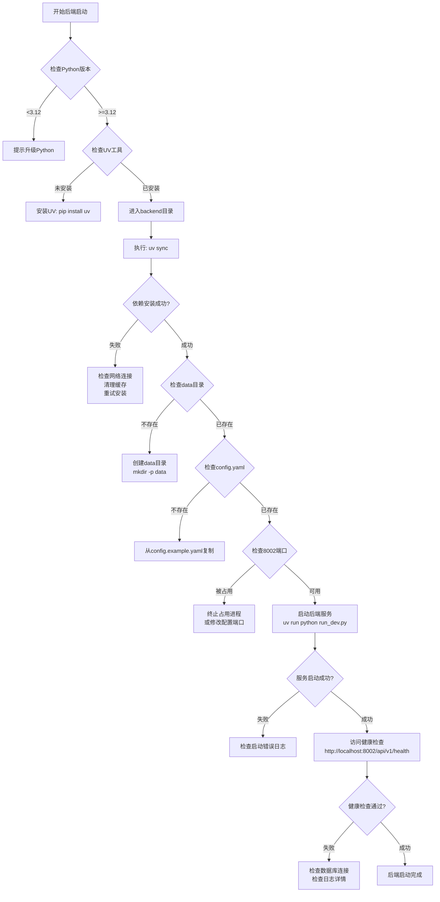
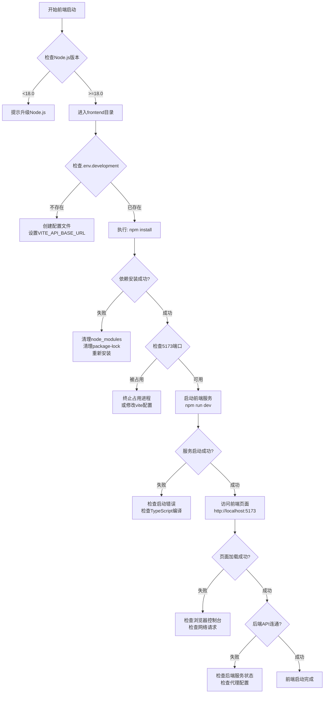

# 项目启动诊断与问题排查方案

## 一、诊断目标

对土地物业资产管理系统的前端和后端进行全面的启动诊断,系统化排查和解决启动过程中可能遇到的问题,确保项目能够正常运行。

## 二、启动前置条件检查

### 2.1 环境依赖验证

#### 后端环境要求
- Python版本: ≥3.12
- UV包管理器: 已安装并可执行
- 数据库目录: backend/data/ 目录存在且有写权限
- 配置文件: backend/config.yaml 存在

#### 前端环境要求
- Node.js版本: ≥18.0
- npm包管理器: 已安装
- 环境配置文件: frontend/.env.development 存在

### 2.2 网络端口检查

需确保以下端口可用且未被占用:
- 前端开发服务器: 5173
- 后端API服务器: 8002
- PostgreSQL (Docker): 5432
- Redis (Docker): 6379

### 2.3 依赖包完整性检查

#### 后端依赖
- 核心框架: FastAPI, SQLAlchemy, Pydantic
- PDF处理: pdfplumber, PyMuPDF (可选: PaddleOCR)
- 数据处理: pandas, polars, openpyxl
- 认证安全: python-jose, passlib

#### 前端依赖
- 核心框架: React 18, React Router Dom
- UI组件: Ant Design 5.x, Ant Design Icons
- 数据管理: Axios, TanStack React Query, Zustand
- 工具库: dayjs, lodash, xlsx

## 三、启动流程诊断方案

### 3.1 后端启动诊断流程



### 3.2 前端启动诊断流程



## 四、常见问题诊断策略

### 4.1 后端启动问题

#### 问题类型1: 数据库连接失败

**症状识别**
- 启动日志显示 "database connection failed"
- 健康检查返回 database status: unknown
- SQLAlchemy 抛出连接异常

**诊断步骤**
1. 检查 DATABASE_URL 配置
   - 环境变量: `echo $DATABASE_URL`
   - config.yaml: database.url 字段
   - 默认值: sqlite:///./data/land_property.db

2. 验证数据库文件/服务状态
   - SQLite: 检查 backend/data/ 目录权限
   - PostgreSQL: 验证服务运行状态和连接参数

3. 测试数据库访问
   - 创建测试连接脚本
   - 验证用户权限和数据库存在性

**解决方案**
- SQLite: 确保 data 目录存在且可写
- PostgreSQL: 启动 Docker 容器或检查服务配置
- 更新 DATABASE_URL 为正确格式

#### 问题类型2: 端口被占用

**症状识别**
- 启动失败提示 "Address already in use"
- 8002端口被其他进程占用

**诊断步骤**
1. 检查端口占用情况
   - Windows: `netstat -ano | findstr :8002`
   - Linux/Mac: `lsof -i :8002`

2. 识别占用进程
   - 查看进程ID和程序名称
   - 判断是否为旧的服务实例

**解决方案**
- 终止占用进程: 杀死进程或正常关闭服务
- 修改服务端口: 设置 API_PORT 环境变量或修改 run_dev.py

#### 问题类型3: 依赖包缺失或版本冲突

**症状识别**
- 导入错误: ImportError, ModuleNotFoundError
- 版本不兼容警告
- 某些可选功能无法使用 (如 PaddleOCR)

**诊断步骤**
1. 检查已安装依赖
   - 执行: `uv pip list`
   - 对比 pyproject.toml 要求的版本

2. 识别缺失的依赖组
   - pdf-basic: PDF基础处理
   - pdf-ocr: OCR文字识别
   - nlp: NLP增强功能
   - llm-local: 本地大模型

3. 检查Python版本兼容性
   - 要求: Python >=3.12

**解决方案**
- 安装核心依赖: `uv sync`
- 安装可选依赖: `uv sync --extra pdf-basic`
- 清理缓存重装: `uv cache clean && uv sync`
- 降级/升级冲突包: 修改 pyproject.toml 版本约束

#### 问题类型4: 配置文件错误

**症状识别**
- 启动时提示配置验证失败
- 缺少必需的配置字段
- 配置类型不匹配

**诊断步骤**
1. 验证 config.yaml 格式
   - YAML语法正确性
   - 缩进和结构完整性

2. 检查必需字段
   - secret_key: JWT密钥
   - database.url: 数据库连接
   - middleware.cors: 跨域配置

3. 验证环境变量覆盖
   - 优先级: 环境变量 > config.yaml > 默认值

**解决方案**
- 从示例复制: `cp config.example.yaml config.yaml`
- 修正格式错误: 使用YAML验证工具
- 设置环境变量: 导出关键配置项

### 4.2 前端启动问题

#### 问题类型1: 依赖安装失败

**症状识别**
- npm install 报错
- 网络超时或连接失败
- 包版本冲突

**诊断步骤**
1. 检查网络连接
   - 测试npm镜像可达性
   - 验证代理配置

2. 检查npm配置
   - 镜像源: `npm config get registry`
   - 缓存状态: `npm cache verify`

3. 验证package.json完整性
   - 依赖版本范围合理性
   - 锁文件与package.json一致性

**解决方案**
- 清理缓存: `npm cache clean --force`
- 删除重装: `rm -rf node_modules package-lock.json && npm install`
- 切换镜像: `npm config set registry https://registry.npmmirror.com`
- 分步安装: 先安装核心依赖,再安装开发依赖

#### 问题类型2: TypeScript编译错误

**症状识别**
- 启动时显示类型错误
- import语句找不到模块
- 类型定义缺失

**诊断步骤**
1. 检查TypeScript版本
   - package.json: typescript: ^5.3.2

2. 验证tsconfig.json配置
   - 路径别名映射: @/* 指向 src/*
   - 编译目标和模块系统

3. 检查类型定义文件
   - @types/* 包的安装情况
   - vite-env.d.ts 存在性

**解决方案**
- 重新生成类型: `npm run type-check`
- 安装缺失类型: `npm install --save-dev @types/...`
- 修正tsconfig路径: 确保paths配置与vite.config.ts一致

#### 问题类型3: 代理配置问题

**症状识别**
- 前端页面加载但API请求失败
- 控制台显示404或CORS错误
- 网络面板显示请求未代理

**诊断步骤**
1. 检查vite.config.ts代理设置
   - target: http://127.0.0.1:8002
   - 路径重写规则
   - changeOrigin 和 ws 配置

2. 验证后端服务状态
   - 访问 http://localhost:8002/api/v1/health
   - 检查后端服务是否运行

3. 检查环境变量配置
   - .env.development: VITE_API_BASE_URL=/api/v1

**解决方案**
- 修正代理目标: 确保指向正确的后端地址
- 更新CORS配置: 后端 config.yaml 允许 localhost:5173
- 重启开发服务: 配置更改后重启 npm run dev

#### 问题类型4: 端口冲突

**症状识别**
- 启动失败提示 "Port 5173 is already in use"
- Vite无法绑定端口

**诊断步骤**
1. 检查端口占用
   - Windows: `netstat -ano | findstr :5173`
   - Linux/Mac: `lsof -i :5173`

2. 识别占用进程
   - 可能是之前未关闭的开发服务器

**解决方案**
- 终止旧进程: 杀死占用端口的进程
- 修改端口: vite.config.ts 中设置 server.port
- 自动查找端口: Vite会自动尝试下一个可用端口

### 4.3 前后端联调问题

#### 问题类型1: CORS跨域错误

**症状识别**
- 浏览器控制台显示 "CORS policy blocked"
- 预检请求 (OPTIONS) 失败

**诊断步骤**
1. 检查后端CORS配置
   - config.yaml: middleware.cors.allow_origins
   - 是否包含 http://localhost:5173

2. 检查前端请求源
   - 确认请求从正确的源发起

3. 验证凭证设置
   - 后端: allow_credentials: true
   - 前端: axios withCredentials 配置

**解决方案**
- 添加前端源到后端白名单
- 更新环境变量 CORS_ORIGINS
- 重启后端服务使配置生效

#### 问题类型2: 认证令牌问题

**症状识别**
- 登录后立即失效
- 接口返回401未授权
- Token解析失败

**诊断步骤**
1. 检查JWT配置
   - secret_key 一致性
   - 过期时间设置

2. 验证token存储
   - localStorage/sessionStorage 存储情况
   - 请求头是否携带 Authorization

3. 检查时区和时间
   - 服务器与客户端时间同步

**解决方案**
- 统一密钥: 确保 SECRET_KEY 配置正确
- 延长过期时间: 调整 access_token_expire_minutes
- 检查token格式: Bearer {token}

#### 问题类型3: 接口路径不匹配

**症状识别**
- 404接口不存在
- 路由未注册
- 版本号不一致

**诊断步骤**
1. 检查API版本
   - 后端: /api/v1/*
   - 前端: VITE_API_BASE_URL=/api/v1

2. 验证路由注册
   - 后端: register_api_routes 执行成功
   - 查看 /docs 接口列表

3. 检查路径拼接
   - 前端服务调用的完整URL
   - 代理转发路径

**解决方案**
- 统一API前缀: 确保前后端路径一致
- 检查路由注册: 查看启动日志确认路由加载
- 访问文档: http://localhost:8002/docs 确认可用接口

## 五、数据库初始化诊断

### 5.1 SQLite数据库

**初始化流程**
1. 自动创建data目录
2. 首次启动时创建数据库文件
3. 执行表结构创建 (create_tables)
4. 初始化系统数据

**诊断要点**
- 目录权限: backend/data/ 可写
- 文件生成: land_property.db 创建成功
- 表结构完整: 所有模型对应的表存在
- 数据完整性: 字典数据、默认角色等已初始化

**验证方法**
- 检查文件存在: `ls backend/data/land_property.db`
- 查看表结构: SQLite工具或Python脚本
- 访问健康检查: 数据库状态为 enhanced_active: false

### 5.2 PostgreSQL数据库

**初始化流程**
1. 启动Docker容器: `docker-compose up postgres`
2. 等待健康检查通过: service_healthy
3. 执行初始化脚本: database/init.sql (如有)
4. 后端连接并创建表结构

**诊断要点**
- 容器运行: `docker ps | grep postgres`
- 健康状态: docker health-check 通过
- 连接参数: DATABASE_URL 配置正确
- 用户权限: zcgl_user 拥有建表权限

**验证方法**
- 容器日志: `docker logs zcgl-postgres`
- 连接测试: psql 或 Python测试脚本
- 健康检查: 后端返回 enhanced_active: true

## 六、日志分析诊断策略

### 6.1 后端日志

**日志位置**
- 控制台输出: 启动命令终端
- 文件日志: logs/app.log (如配置)
- 访问日志: 请求日志中间件输出

**关键日志识别**

#### 成功启动标志
- "Initializing configuration manager"
- "Database status: {...}"
- "FastAPI应用启动完成"
- "Uvicorn running on http://0.0.0.0:8002"

#### 错误信息类型
- ImportError: 依赖缺失
- ConnectionError: 数据库连接失败
- ValidationError: 配置验证失败
- OSError: 端口占用或文件权限问题

**诊断技巧**
- 查找第一个错误: 通常是根本原因
- 检查堆栈跟踪: 定位具体文件和行号
- 关注WARNING级别: 可能的潜在问题
- 验证INFO日志: 确认组件初始化顺序

### 6.2 前端日志

**日志位置**
- 浏览器控制台: Console面板
- 网络面板: Network查看请求
- Vite输出: 终端启动日志

**关键日志识别**

#### 成功启动标志
- "VITE ready in xxx ms"
- "Local: http://localhost:5173/"
- "Network: http://192.168.x.x:5173/"

#### 错误信息类型
- 404 Not Found: 路由或资源不存在
- Failed to fetch: 网络请求失败
- CORS error: 跨域配置问题
- Type error: TypeScript类型错误

**诊断技巧**
- 检查红色错误: 阻塞性问题
- 查看黄色警告: 性能或兼容性问题
- 分析网络请求: 查看状态码和响应
- 检查Source Map: 定位源代码位置

## 七、系统健康检查方案

### 7.1 后端健康检查

**检查端点**: GET /api/v1/health

**预期响应结构**
```
{
  "success": true,
  "data": {
    "status": "healthy",
    "version": "2.0.0",
    "service": "土地物业资产管理系统",
    "database": {
      "enhanced_active": false,
      "enhanced_available": false,
      "engine_type": "Engine"
    }
  },
  "message": "系统运行正常",
  "timestamp": "2024-01-01T00:00:00Z"
}
```

**诊断标准**
- HTTP状态码: 200
- success字段: true
- database.engine_type: 非 "Unknown"
- 响应时间: <500ms

**异常响应处理**
- 5xx错误: 服务器内部错误,检查后端日志
- 超时: 数据库查询缓慢或网络问题
- database status unknown: 数据库连接失败

### 7.2 前端健康检查

**检查方式**
1. 页面加载: http://localhost:5173
2. 静态资源: CSS/JS文件加载成功
3. API调用: 首页数据获取成功
4. 路由导航: 页面切换正常

**诊断标准**
- 页面完整渲染: 无白屏或错误页
- 控制台无错误: Console无红色错误
- 网络请求成功: API调用返回200
- 交互功能正常: 点击、输入响应

### 7.3 集成健康检查

**完整流程验证**
1. 后端健康检查通过
2. 前端页面加载成功
3. 登录功能验证
4. 数据CRUD操作测试
5. 文件上传功能测试

## 八、故障恢复策略

### 8.1 快速重启策略

**后端服务**
1. 停止服务: Ctrl+C 或终止进程
2. 清理缓存: `rm -rf __pycache__` (可选)
3. 重新启动: `cd backend && uv run python run_dev.py`

**前端服务**
1. 停止服务: Ctrl+C
2. 清理缓存: `rm -rf .vite` (可选)
3. 重新启动: `cd frontend && npm run dev`

### 8.2 完全重置策略

**后端完全重置**
1. 停止服务
2. 删除数据库: `rm backend/data/land_property.db`
3. 清理依赖: `rm -rf .venv`
4. 重新安装: `uv sync`
5. 重新启动: `uv run python run_dev.py`

**前端完全重置**
1. 停止服务
2. 删除依赖: `rm -rf node_modules package-lock.json`
3. 清理缓存: `npm cache clean --force`
4. 重新安装: `npm install`
5. 重新启动: `npm run dev`

### 8.3 数据备份恢复

**数据库备份**
- SQLite: 复制 backend/data/land_property.db
- PostgreSQL: `pg_dump` 导出SQL

**数据恢复**
- SQLite: 替换数据库文件
- PostgreSQL: `psql` 导入SQL

## 九、预防性维护建议

### 9.1 定期检查项

**每日检查**
- 服务运行状态
- 错误日志回顾
- 磁盘空间使用

**每周检查**
- 依赖包更新
- 安全漏洞扫描
- 性能指标分析

**每月检查**
- 数据库备份验证
- 配置文件审查
- 文档更新维护

### 9.2 监控指标

**后端指标**
- API响应时间
- 数据库连接池使用率
- 错误率和异常统计
- 内存和CPU使用

**前端指标**
- 页面加载时间
- API请求成功率
- 用户交互响应时间
- 浏览器兼容性

### 9.3 优化建议

**性能优化**
- 启用数据库连接池
- 配置Redis缓存
- 前端代码分割
- 静态资源CDN

**安全加固**
- 更新SECRET_KEY为强密钥
- 限制CORS源为具体域名
- 启用HTTPS (生产环境)
- 定期更新依赖包

## 十、诊断工作流总结

### 10.1 标准启动流程

**步骤顺序**
1. 环境检查: Python, Node.js, 端口可用性
2. 后端启动: uv sync → uv run python run_dev.py
3. 后端验证: 访问 /api/v1/health
4. 前端启动: npm install → npm run dev
5. 前端验证: 访问 http://localhost:5173
6. 集成测试: 登录 → 数据查询 → 功能验证

### 10.2 问题诊断优先级

**P0 - 阻塞性问题**
- 服务无法启动
- 数据库连接失败
- 端口冲突无法绑定

**P1 - 严重问题**
- 核心功能不可用
- 认证授权失败
- 数据无法保存

**P2 - 一般问题**
- 可选功能异常
- 性能较慢
- 日志警告

**P3 - 优化建议**
- 配置优化
- 代码质量
- 文档完善

### 10.3 升级路径

**从开发环境到生产环境**
1. 环境变量配置: 使用环境变量替代 config.yaml
2. 数据库迁移: SQLite → PostgreSQL
3. 缓存启用: 配置Redis
4. 安全加固: 更新密钥、限制CORS
5. 性能优化: 连接池、负载均衡
6. 容器部署: Docker Compose 或 Kubernetes

## 十一、快速参考

### 11.1 关键命令

**后端**
```bash
# 安装依赖
cd backend && uv sync

# 启动开发服务器
uv run python run_dev.py

# 检查健康状态
curl http://localhost:8002/api/v1/health

# 查看API文档
打开浏览器: http://localhost:8002/docs
```

**前端**
```bash
# 安装依赖
cd frontend && npm install

# 启动开发服务器
npm run dev

# 类型检查
npm run type-check

# 代码检查
npm run lint
```

### 11.2 关键配置文件

| 文件路径 | 用途 | 重要字段 |
|---------|------|---------|
| backend/config.yaml | 后端配置 | database.url, security.secret_key, middleware.cors |
| backend/run_dev.py | 启动脚本 | port: 8002 |
| frontend/.env.development | 前端环境变量 | VITE_API_BASE_URL |
| frontend/vite.config.ts | Vite配置 | server.port, server.proxy |
| docker-compose.yml | 容器编排 | 端口映射, 健康检查 |

### 11.3 关键端口

| 端口 | 服务 | 访问方式 |
|-----|------|---------|
| 8002 | 后端API | http://localhost:8002 |
| 5173 | 前端开发服务器 | http://localhost:5173 |
| 5432 | PostgreSQL (Docker) | 数据库连接 |
| 6379 | Redis (Docker) | 缓存连接 |

### 11.4 诊断清单

**启动前**
- [ ] Python ≥3.12 已安装
- [ ] Node.js ≥18.0 已安装
- [ ] UV 工具已安装
- [ ] 端口 8002, 5173 未被占用
- [ ] backend/data/ 目录存在
- [ ] config.yaml 配置正确

**后端启动**
- [ ] uv sync 执行成功
- [ ] run_dev.py 启动无错误
- [ ] 健康检查返回 200
- [ ] 数据库连接正常
- [ ] API文档可访问

**前端启动**
- [ ] npm install 执行成功
- [ ] npm run dev 启动无错误
- [ ] 页面加载成功
- [ ] 控制台无错误
- [ ] API请求成功

**集成验证**
- [ ] 登录功能正常
- [ ] 数据查询成功
- [ ] 页面导航流畅
- [ ] 文件上传功能可用
