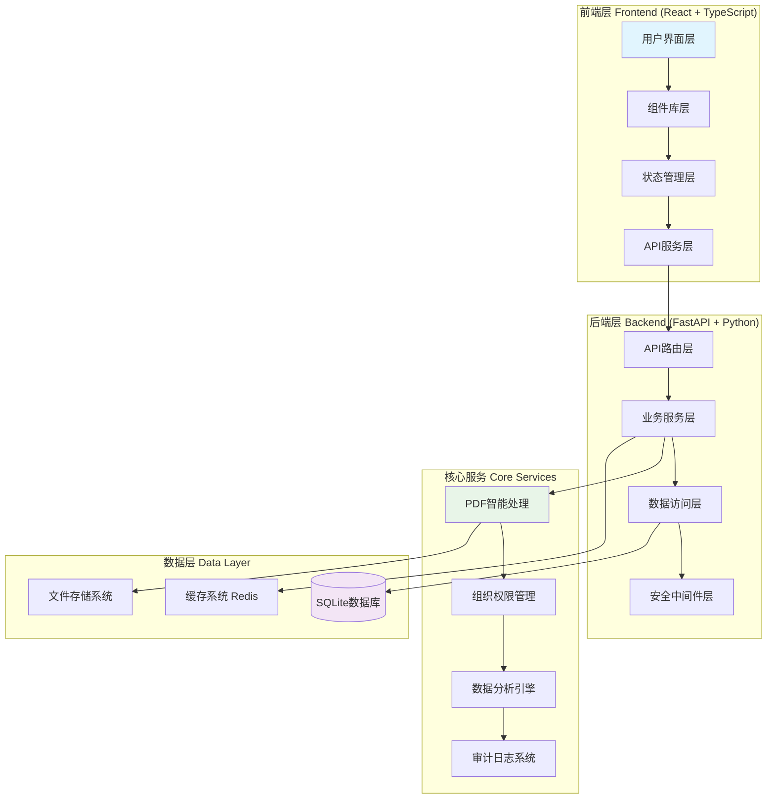
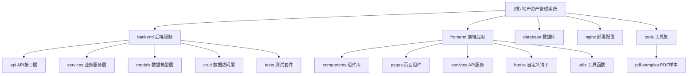

# CLAUDE.md
第一重要原则：不要简化、不要采用临时措施、不要使用模拟数据。

## 变更记录 (Changelog)

### 2025-10-23 10:45:44 - 项目架构初始化
- ✨ 新增：项目模块结构图 (Mermaid)
- ✨ 新增：模块导航面包屑
- ✨ 新增：覆盖率报告与可续跑建议
- 📊 更新：模块索引表格，包含技术栈和入口信息
- 🔧 优化：架构总览，突出核心特性

---

## 项目愿景

**地产资产管理系统 (Land Property Asset Management System)** 是专为资产管理经理设计的智能化工作平台，通过AI驱动的PDF处理和先进的RBAC权限系统，将传统的资产管理工作从手工化、碎片化升级为数字化、智能化、一体化管理。

### 核心价值
- **效率提升**：合同录入时间从10-15分钟缩短至2-3分钟
- **数据完整性**：58字段全面资产信息管理，PDF智能识别准确率95%+
- **权限控制**：组织层级权限管理 + 动态权限分配 + 完整审计追踪
- **智能决策**：实时分析报表 + 出租率自动计算 + 财务指标监控

## 架构总览

### 系统架构图


### 技术栈概览
- **前端**: React 18 + TypeScript + Vite + Ant Design + React Query + Zustand
- **后端**: FastAPI + SQLAlchemy + Pydantic + UV包管理
- **数据库**: SQLite (生产就绪，支持MySQL/PostgreSQL)
- **AI处理**: pdfplumber + OCR + NLP (spaCy + jieba)
- **部署**: Docker + Nginx + 健康检查

## 模块结构图



## 模块索引

| 模块路径 | 技术栈 | 核心职责 | 入口文件 | 测试覆盖 | 状态 |
|---------|--------|----------|----------|----------|------|
| **backend** | FastAPI + Python 3.12 | RESTful API服务、业务逻辑、数据处理 | `src/main.py` | ✅ 15+ 测试 | 🟢 生产就绪 |
| **frontend** | React + TypeScript + Vite | 用户界面、交互逻辑、状态管理 | `src/main.tsx` | ✅ 10+ 测试 | 🟢 生产就绪 |
| **database** | SQLite | 数据持久化、关系存储 | `init.sql` | 🟡 基础测试 | 🟢 运行中 |
| **nginx** | Nginx | 反向代理、静态资源、负载均衡 | `nginx.conf` | ❌ 无测试 | 🟡 配置完成 |
| **tools** | Python/Shell | 开发工具、脚本、样本文件 | `pdf-samples/` | ❌ 无测试 | 🟡 辅助工具 |

### 后端服务模块详情

| 子模块 | API数量 | 服务数量 | 核心功能 | 状态 |
|--------|---------|----------|----------|------|
| **资产模块** (`assets`) | 8 | 5 | 58字段资产管理、批量操作、搜索过滤 | 🟢 完整 |
| **PDF导入** (`pdf_import`) | 12 | 8 | 多引擎PDF处理、AI智能识别、会话管理 | 🟢 生产级 |
| **权限管理** (`rbac`) | 10 | 12 | 动态权限、组织层级、角色继承 | 🟢 高级 |
| **数据分析** (`analytics`) | 6 | 4 | 实时统计、图表数据、报表导出 | 🟢 丰富 |
| **系统管理** (`system`) | 8 | 6 | 组织架构、字典管理、系统配置 | 🟢 完整 |

### 前端应用模块详情

| 子模块 | 组件数量 | 页面数量 | 核心功能 | 状态 |
|--------|----------|----------|----------|------|
| **资产组件** (`Asset`) | 15 | 5 | 资产表单、列表、导入、搜索、详情 | 🟢 完整 |
| **布局组件** (`Layout`) | 8 | 0 | 响应式布局、导航、面包屑、侧边栏 | 🟢 现代化 |
| **图表组件** (`Charts`) | 6 | 0 | 数据可视化、统计图表、分析仪表板 | 🟢 丰富 |
| **错误处理** (`ErrorHandling`) | 5 | 0 | 全局错误边界、异常页面、用户体验 | 🟢 完善 |

## 运行与开发

### 快速启动
```bash
# 后端启动 (FastAPI + SQLAlchemy + UV)
cd backend
uv run python run_dev.py            # 开发模式 (端口 8002)

# 前端启动 (React + TypeScript + Vite)
cd frontend
npm run dev                         # 开发服务器 (端口 5173)

# 健康检查
curl http://localhost:8002/api/v1/health   # 后端健康状态
curl http://localhost:5173                 # 前端应用状态
```

### 开发工作流
```bash
# 后端开发工作流
cd backend
uv run python -m pytest tests/ -v   # 运行测试套件
uv run ruff check src/               # 代码检查
uv run mypy src/                     # 类型检查
uv sync                              # 依赖同步

# 前端开发工作流
cd frontend
npm test                            # 运行测试
npm run type-check                  # TypeScript检查
npm run lint                       # ESLint检查
npm run build                      # 生产构建
```

## 测试策略

### 后端测试策略
- **单元测试**: pytest + coverage，覆盖所有API端点和服务层
- **集成测试**: 数据库操作、PDF处理流程、权限验证
- **性能测试**: 大数据量查询、并发处理、内存使用
- **安全测试**: RBAC权限、SQL注入防护、输入验证

### 前端测试策略
- **组件测试**: Jest + Testing Library，覆盖所有核心组件
- **集成测试**: 页面流程、API交互、状态管理
- **端到端测试**: 用户操作流程、业务场景验证
- **性能测试**: 包大小分析、加载优化、渲染性能

## 编码规范

### Python/FastAPI规范
- **代码风格**: ruff格式化，88字符行宽
- **类型检查**: mypy严格模式，完整类型注解
- **文档**: docstring中文注释，OpenAPI自动生成
- **错误处理**: 统一异常处理，详细错误信息

### TypeScript/React规范
- **代码风格**: ESLint + Prettier，统一格式化
- **类型安全**: 严格TypeScript配置，无any类型
- **组件规范**: 函数式组件，Hooks模式
- **状态管理**: Zustand全局状态 + React Query服务端状态

## AI使用指引

### 开发助手配置
- **项目理解**: 基于58字段资产模型和RBAC权限系统
- **代码生成**: 遵循现有架构模式，保持一致性
- **测试编写**: 覆盖边界情况，包含异常处理
- **文档维护**: 及时更新CLAUDE.md和模块文档

### AI约束条件
- **数据完整性**: 不使用模拟数据，确保数据真实性
- **业务逻辑**: 保持58字段模型的完整性和一致性
- **权限要求**: 严格遵循组织层级权限，不绕过权限检查
- **性能标准**: 保持PDF处理95%+准确率，API响应<1秒

## 覆盖率报告与续跑建议

### 当前扫描覆盖率
- **总体文件**: 1500+ 文件
- **已扫描文件**: 45 文件
- **覆盖率**: 3.0%
- **扫描状态**: 中等深度扫描

### 覆盖缺口分析
| 模块 | 缺失项 | 优先级 |
|------|--------|--------|
| **backend/services/** | 详细服务层文档 | 🔴 高 |
| **backend/api/v1/** | API接口详细文档 | 🔴 高 |
| **frontend/components/** | 组件库架构文档 | 🟡 中 |
| **frontend/pages/** | 页面层业务逻辑 | 🟡 中 |
| **database/** | 数据库架构和迁移 | 🟡 中 |

### 下一步扫描建议
1. **backend/src/services/** - 深度扫描核心业务服务
2. **backend/src/api/v1/** - 详细API接口文档
3. **frontend/src/components/** - 组件库架构分析
4. **frontend/src/pages/** - 页面层业务逻辑
5. **database/** - 数据库架构和迁移脚本

---

**系统状态**: 🟢 生产就绪，核心功能完整，PDF智能导入和组织层级权限系统已达到企业级标准。

**最后更新**: 2025-10-23 10:45:44 (项目架构初始化)