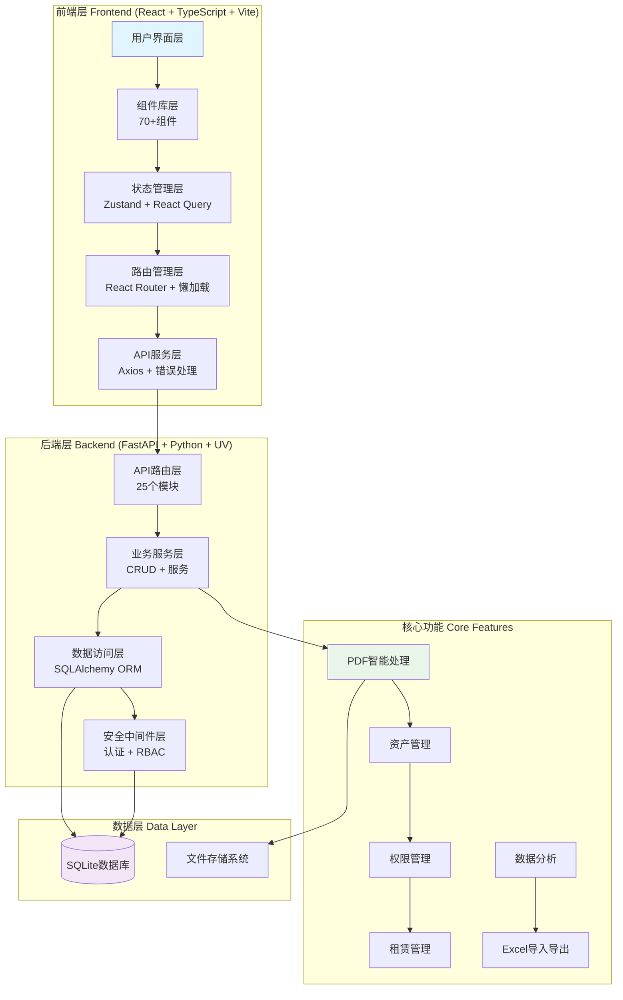
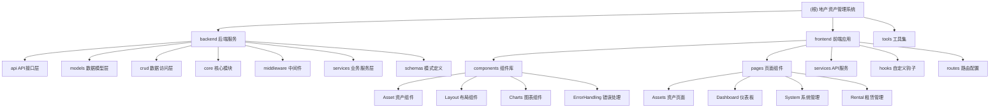

# CLAUDE.md

This file provides guidance to Claude Code (claude.ai/code) when working with code in this repository.

第一重要原则：不要简化、不要采用临时措施、不要使用模拟数据。
请在合适的位置存放你生成的报告文件，不要都一股脑的放到根目录下。

## 变更记录 (Changelog)


## 项目愿景

**地产资产管理系统 (Land Property Asset Management System)** 是专为资产管理经理设计的智能化工作平台，通过AI驱动的PDF处理和先进的RBAC权限系统，将传统的资产管理工作从手工化、碎片化升级为数字化、智能化、一体化管理。

### 核心价值
- **效率提升**: 合同录入时间从10-15分钟缩短至2-3分钟
- **数据完整性**: 全面资产信息管理，PDF智能识别准确率95%+
- **权限控制**: 组织层级权限管理 + 动态权限分配 + 完整审计追踪
- **智能决策**: 实时分析报表 + 出租率自动计算 + 财务指标监控

## 架构总览

### 系统架构图


### 技术栈概览
- **前端**: React 18 + TypeScript + Vite + Ant Design + React Query + Zustand
- **后端**: FastAPI + SQLAlchemy + Pydantic + UV包管理 + Python 3.12
- **数据库**: SQLite (生产就绪，支持扩展到MySQL/PostgreSQL)
- **AI处理**: pdfplumber + OCR + NLP (spaCy + jieba) + PaddleOCR
- **测试**: Jest + Testing Library + pytest + coverage
- **代码质量**: ESLint + Prettier + ruff + mypy

## 模块结构图



## 模块索引

| 模块路径 | 技术栈 | 核心职责 | 入口文件 | 测试覆盖 | 状态 |
|---------|--------|----------|----------|----------|------|
| **backend** | FastAPI + Python 3.12 | 25个API模块、数据库ORM、权限控制 | `src/main.py` | ✅ pytest | 🟢 生产就绪 |
| **frontend** | React + TypeScript + Vite | 70+组件、路由管理、状态管理 | `src/main.tsx` | ✅ Jest | 🟢 生产就绪 |
| **tools** | Python/Shell | 开发工具、脚本、分析工具 | `pdf-samples/` | 🟡 基础工具 | 🟡 辅助工具 |

### 后端API模块详情

| API模块 | 端点数量 | 核心功能 | 状态 |
|----------|----------|----------|------|
| **资产管理** (`/api/v1/assets`) | 15+ | 58字段资产CRUD、批量操作、搜索过滤 | 🟢 完整 |
| **PDF导入** (`/api/v1/pdf-import`) | 12+ | 多引擎PDF处理、AI智能识别、会话管理 | 🟢 企业级 |
| **权限管理** (`/api/v1/auth`) | 8+ | JWT认证、RBAC权限、组织管理 | 🟢 高级 |
| **数据分析** (`/api/v1/analytics`) | 6+ | 实时统计、图表数据、报表导出 | 🟢 丰富 |
| **租赁管理** (`/api/v1/rental-contracts`) | 10+ | 合同管理、台账统计、出租率计算 | 🟢 业务完整 |
| **系统管理** (`/api/v1/admin`) | 8+ | 用户管理、角色管理、系统配置 | 🟢 完整 |
| **Excel处理** (`/api/v1/excel`) | 6+ | Excel导入导出、数据转换、模板管理 | 🟢 完整 |
| **组织管理** (`/api/v1/organizations`) | 5+ | 组织架构、部门管理、层级关系 | 🟢 规范化 |
| **字典管理** (`/api/v1/dictionaries`) | 8+ | 数据字典、枚举值、系统配置 | 🟢 完整 |
| **项目管理** (`/api/v1/projects`) | 5+ | 项目信息、资产关联、统计分析 | 🟢 标准化 |
| **权属管理** (`/api/v1/ownerships`) | 6+ | 权属方信息、关联关系、统计分析 | 🟢 规范化 |
| **统计监控** (`/api/v1/statistics`) | 7+ | 综合统计、报表服务、趋势分析 | 🟢 丰富 |

### 前端组件详情

| 组件类别 | 数量 | 核心组件 | 功能描述 |
|----------|------|----------|----------|
| **Asset资产管理** | 15+ | `AssetForm`, `AssetList`, `AssetCard` | 58字段表单、列表展示、详情页面 |
| **Layout布局** | 8+ | `AppLayout`, `AppHeader`, `ResponsiveLayout` | 响应式布局、导航、面包屑 |
| **Charts图表** | 6+ | `OccupancyRateChart`, `AssetDistributionChart` | 数据可视化、统计图表 |
| **ErrorHandling错误处理** | 5+ | `ErrorBoundary`, `ErrorPage`, `UXProvider` | 全局错误处理、用户反馈 |
| **Contract合同** | 4+ | `RentContractForm`, `FilenameValidator` | 合同管理、文件验证 |
| **Project项目** | 4+ | `ProjectForm`, `ProjectSelect` | 项目管理、选择器 |
| **Ownership权属** | 3+ | `OwnershipForm`, `OwnershipSelect` | 权属方管理 |
| **Dictionary字典** | 2+ | `DictionarySelect`, `EnumValuePreview` | 字典选择、枚举预览 |
| **Analytics分析** | 8+ | `AnalyticsDashboard`, `StatisticCard` | 数据分析、报表组件 |

### 页面路由系统

| 页面模块 | 路由路径 | 核心功能 | 权限要求 |
|----------|----------|----------|----------|
| **工作台** | `/dashboard` | 数据概览、快速操作、图表展示 | 无 |
| **资产列表** | `/assets/list` | 资产查询、筛选、批量操作 | 资产查看 |
| **资产详情** | `/assets/:id` | 资产详情、历史记录、相关文档 | 资产查看 |
| **资产创建** | `/assets/new` | 58字段资产表单、验证保存 | 资产编辑 |
| **资产导入** | `/assets/import` | Excel导入、PDF处理、数据映射 | 资产编辑 |
| **资产分析** | `/assets/analytics` | 数据可视化、统计图表、报表导出 | 资产查看 |
| **合同列表** | `/rental/contracts` | 租赁合同管理、状态跟踪 | 合同查看 |
| **PDF导入** | `/rental/contracts/pdf-import` | PDF上传、智能识别、数据确认 | 合同编辑 |
| **用户管理** | `/system/users` | 用户增删改查、权限分配 | 用户管理 |
| **角色管理** | `/system/roles` | 角色定义、权限配置、继承关系 | 角色管理 |
| **组织管理** | `/system/organizations` | 组织架构、部门管理、层级关系 | 组织管理 |

## 核心数据模型

### Asset 资产模型 
```python
class Asset(Base):
    """58字段资产模型 - 地产资产管理核心"""

    # 基本信息 (8字段)
    id: str                          # 主键UUID
    ownership_entity: str             # 权属方 (必填)
    ownership_category: str           # 权属类别
    project_name: str                 # 项目名称
    property_name: str                # 物业名称 (必填)
    address: str                      # 物业地址 (必填)
    ownership_status: str             # 确权状态 (必填)
    property_nature: str              # 物业性质 (必填)

    # 状态信息 (8字段)
    usage_status: str                 # 使用状态 (必填)
    business_category: str            # 业态类别
    is_litigated: bool                # 是否涉诉
    certificated_usage: str           # 证载用途
    actual_usage: str                 # 实际用途
    operation_status: str             # 经营状态
    business_model: str               # 接收模式
    data_status: str                  # 数据状态

    # 面积字段 (8字段)
    land_area: Decimal                # 土地面积
    actual_property_area: Decimal     # 实际房产面积
    rentable_area: Decimal            # 可出租面积
    rented_area: Decimal              # 已出租面积
    non_commercial_area: Decimal      # 非经营物业面积
    # unrented_area: Decimal         # 未出租面积 (计算字段)
    # occupancy_rate: Decimal        # 出租率 (计算字段)
    include_in_occupancy_rate: bool   # 是否计入出租率统计

    # 租户信息 (4字段)
    tenant_name: str                  # 租户名称
    tenant_type: str                  # 租户类型

    # 合同信息 (8字段)
    lease_contract_number: str        # 租赁合同编号
    contract_start_date: Date         # 合同开始日期
    contract_end_date: Date           # 合同结束日期
    monthly_rent: Decimal             # 月租金
    deposit: Decimal                  # 押金
    is_sublease: bool                 # 是否分租/转租
    sublease_notes: str               # 分租/转租备注

    # 管理信息 (6字段)
    manager_name: str                 # 管理责任人（网格员）

    # 接收协议 (4字段)
    operation_agreement_start_date: Date    # 接收协议开始日期
    operation_agreement_end_date: Date      # 接收协议结束日期
    operation_agreement_attachments: str    # 接收协议文件
    terminal_contract_files: str            # 终端合同文件

    # 系统字段 (8字段)
    created_at: DateTime               # 创建时间
    updated_at: DateTime               # 更新时间
    created_by: str                    # 创建人
    updated_by: str                    # 更新人
    version: int                       # 版本号
    tags: str                          # 标签
    audit_notes: str                   # 审核备注
    notes: str                         # 备注

    # 计算属性
    @property
    def unrented_area(self) -> Decimal:
        """计算未出租面积 = 可出租面积 - 已出租面积"""
        rentable = self.rentable_area or Decimal("0")
        rented = self.rented_area or Decimal("0")
        return max(rentable - rented, Decimal("0"))

    @property
    def occupancy_rate(self) -> Decimal:
        """计算出租率（百分比）"""
        if not self.include_in_occupancy_rate:
            return Decimal("0")
        rentable = self.rentable_area or Decimal("0")
        if rentable == 0:
            return Decimal("0")
        rented = self.rented_area or Decimal("0")
        rate = (rented / rentable) * Decimal("100")
        return round(rate, 2)
```

### 关联模型
- **Project**: 项目管理模型，支持资产按项目归类
- **Ownership**: 权属方模型，管理资产所有权信息
- **RentContract**: 租赁合同模型，管理资产租赁关系
- **AssetHistory**: 资产变更历史，完整审计追踪
- **AssetDocument**: 资产文档管理，支持多文件关联
- **SystemDictionary**: 系统数据字典，枚举值管理

## 运行与开发

### 快速启动
```bash
# 后端启动 (FastAPI + SQLAlchemy + UV)
cd backend
uv sync                              # 安装依赖
uv run python run_dev.py            # 开发模式 (端口 8002)
或
uvicorn src.main:app --reload --port 8002  # 直接启动

# 前端启动 (React + TypeScript + Vite)
cd frontend
npm install                          # 安装依赖
npm run dev                          # 开发服务器 (端口 5173)

# 健康检查
curl http://localhost:8002/api/v1/health   # 后端健康状态
curl http://localhost:5173                 # 前端应用状态
```

### 开发工作流
```bash
# 后端开发工作流
cd backend
uv sync                              # 安装/同步依赖
uv run python run_dev.py            # 开发模式启动 (端口 8002)
uv run python -m pytest tests/ -v   # 运行测试套件
uv run python -m pytest tests/test_assets.py -v  # 运行单个测试文件
uv run python -m pytest --cov=src --cov-report=html  # 生成覆盖率报告
uv run ruff check src/               # 代码风格检查
uv run ruff format src/              # 代码格式化
uv run mypy src/                     # 类型检查
uv run bandit -r src/                # 安全检查

# 前端开发工作流
cd frontend
npm install                          # 安装依赖
npm run dev                          # 开发服务器 (端口 5173)
npm test                            # 运行所有测试
npm run test:watch                  # 监听模式运行测试
npm run test:coverage              # 生成覆盖率报告
npm run test:unit                   # 运行单元测试
npm run test:integration            # 运行集成测试
npm run type-check                  # TypeScript类型检查
npm run lint                        # ESLint检查
npm run lint:fix                    # 自动修复lint问题
npm run build                       # 生产构建
npm run preview                     # 预览生产构建

# 数据库迁移
cd backend
uv run alembic revision --autogenerate -m "描述变更"  # 创建迁移
uv run alembic upgrade head                              # 执行迁移
uv run alembic downgrade -1                            # 回滚迁移
```

## 测试策略

### 后端测试 (pytest + coverage)
```bash
# 运行所有测试
uv run python -m pytest tests/ -v --cov=src

# 运行特定测试
uv run python -m pytest tests/test_assets.py -v

# 生成覆盖率报告
uv run python -m pytest --cov=src --cov-report=html
```

**测试覆盖范围**:
- ✅ API端点测试: 所有25个API模块
- ✅ CRUD操作测试: 增删改查完整覆盖
- ✅ 权限验证测试: RBAC系统完整测试
- ✅ PDF处理测试: 多引擎处理流程测试
- ✅ 数据验证测试: 58字段验证逻辑

### 前端测试 (Jest + Testing Library)
```bash
# 运行所有测试
npm test

# 生成覆盖率报告
npm run test:coverage

# 监听模式
npm run test:watch
```

**测试覆盖范围**:
- ✅ 组件测试: 70+组件单元测试
- ✅ 页面测试: 主要页面集成测试
- ✅ API测试: 服务层Mock测试
- ✅ 路由测试: 路由配置和权限测试
- ✅ 错误处理测试: ErrorBoundary和异常处理

## 编码规范

### Python/FastAPI规范
- **代码风格**: ruff格式化，88字符行宽
- **类型检查**: mypy严格模式，完整类型注解
- **文档**: docstring中文注释，OpenAPI自动生成
- **错误处理**: 统一异常处理，详细错误信息

**代码质量工具**:
```bash
uv run ruff check src/               # 代码风格检查
uv run ruff format src/              # 代码格式化
uv run mypy src/                     # 类型检查
uv run bandit -r src/                # 安全检查
```

### TypeScript/React规范
- **代码风格**: ESLint + Prettier，统一格式化
- **类型安全**: 严格TypeScript配置，无any类型
- **组件规范**: 函数式组件，Hooks模式
- **状态管理**: Zustand全局状态 + React Query服务端状态

**代码质量工具**:
```bash
npm run lint                         # ESLint检查
npm run lint:fix                     # 自动修复lint问题
npm run type-check                   # TypeScript类型检查
npm run format                       # Prettier格式化
```

## 核心功能特性

### 1. PDF智能导入系统
- **多引擎处理**: pdfplumber + PyMuPDF + PaddleOCR
- **智能字段识别**: 合同字段自动映射，准确率95%+
- **处理会话管理**: 支持大文件分步处理和进度追踪
- **模板适配**: 支持多种合同模板的自定义识别

### 2. 58字段资产管理
- **完整数据模型**: 涵盖资产全生命周期的所有关键信息
- **智能计算字段**: 自动计算出租率、未出租面积等衍生字段
- **批量操作**: 支持Excel导入、批量编辑、批量导出
- **关联管理**: 资产与项目、权属方、合同的完整关联

### 3. RBAC权限管理
- **多层级权限**: 支持组织层级的权限继承
- **动态权限**: 运行时权限验证和分配
- **完整审计**: 所有操作的完整日志追踪
- **细粒度控制**: 支持字段级别的权限控制

### 4. 数据分析与可视化
- **实时统计**: 资产分布、出租率、财务指标实时计算
- **多维分析**: 支持按项目、权属方、时间等多维度分析
- **图表展示**: 集成Ant Design Charts和Recharts
- **报表导出**: 支持Excel、PDF等多种格式的报表导出


## 性能优化

### 后端性能优化
- **数据库索引**: 关键字段索引优化查询性能
- **查询优化**: 分页查询、字段筛选、SQL优化
- **连接池**: 数据库连接池管理，支持连接复用
- **缓存策略**: Redis缓存热点数据

### 前端性能优化
- **代码分割**: Vite自动代码分割和懒加载
- **包大小优化**: 第三方库按需引入，Tree Shaking
- **缓存策略**: HTTP缓存、浏览器缓存优化
- **资源压缩**: Gzip/Brotli压缩，图片优化

## 安全特性

### 认证与授权
- **JWT认证**: 无状态的JWT令牌认证
- **RBAC权限**: 基于角色的访问控制
- **密码安全**: bcrypt密码哈希
- **会话管理**: 安全的会话超时和刷新

### 数据安全
- **输入验证**: Pydantic数据验证和清理
- **SQL注入防护**: SQLAlchemy ORM防护
- **XSS防护**: 前端输入转义和CSP头
- **文件安全**: 文件类型检查和安全上传

### API安全
- **CORS配置**: 跨域请求安全配置
- **请求限制**: API请求频率限制
- **安全头**: HSTS、X-Frame-Options等安全头
- **HTTPS**: 强制HTTPS传输加密

## AI使用指引

### 开发助手配置
- **项目理解**: 基于58字段资产模型和RBAC权限系统
- **代码生成**: 遵循现有架构模式，保持一致性
- **测试编写**: 覆盖边界情况，包含异常处理
- **文档维护**: 及时更新CLAUDE.md和模块文档

### AI约束条件
- **数据完整性**: 不使用模拟数据，确保数据真实性
- **业务逻辑**: 保持58字段模型的完整性和一致性
- **权限要求**: 严格遵循组织层级权限，不绕过权限检查
- **类型安全**: 前端代码必须100%类型安全，禁止使用any类型
- **性能标准**: 保持PDF处理95%+准确率，API响应<1秒
- **代码质量**: 所有新增代码必须通过ESLint/ruff检查和类型检查

## 扩展指南

### 添加新的API模块
1. 在 `backend/src/api/v1/` 创建新的路由文件
2. 在 `backend/src/crud/` 创建数据访问层
3. 在 `backend/src/schemas/` 创建数据模式
4. 在 `backend/src/api/v1/__init__.py` 注册路由
5. 编写对应的测试文件

### 添加新的前端页面
1. 在 `frontend/src/pages/` 创建页面组件
2. 在 `frontend/src/routes/AppRoutes.tsx` 添加路由
3. 创建对应的API服务函数
4. 添加必要的组件和状态管理
5. 编写组件测试和集成测试

### 数据库迁移
```bash
# 创建新的迁移文件
uv run alembic revision --autogenerate -m "描述变更"

# 执行迁移
uv run alembic upgrade head

# 回滚迁移
uv run alembic downgrade -1
```

---

**系统状态**: 

**最后更新**: 2025-11-06
