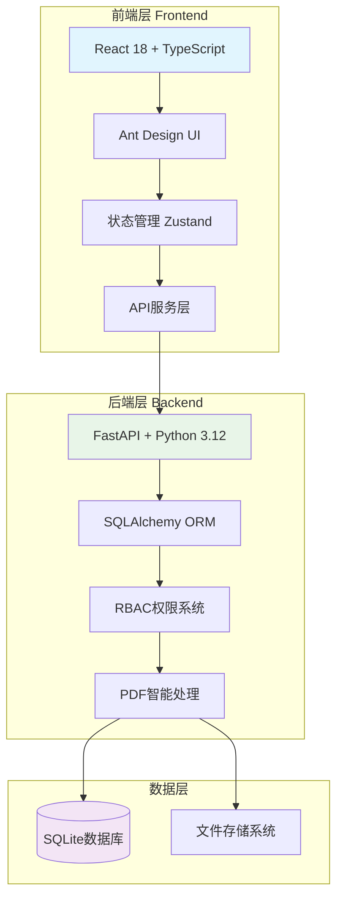

# 地产资产管理系统 (Land Property Asset Management System)

[](https://opensource.org/licenses/MIT)
[](https://www.python.org/downloads/)
[](https://reactjs.org/)
[](https://fastapi.tiangolo.com/)

🏢 **专为资产管理经理设计的智能化工作平台**

通过AI驱动的PDF处理和先进的RBAC权限系统，将传统的资产管理工作从手工化、碎片化升级为数字化、智能化、一体化管理。

## ✨ 核心特性

### 🚀 效率革命
- **合同录入时间**: 从10-15分钟缩短至2-3分钟 ⚡
- **PDF智能识别**: 58字段自动映射，准确率95%+ 📄
- **批量处理**: 支持Excel导入、批量编辑、批量导出 📊

### 📊 数据完整性
- **58字段资产模型**: 涵盖资产全生命周期的所有关键信息 🏗️
- **智能计算字段**: 自动计算出租率、未出租面积等衍生字段 🧮
- **关联管理**: 资产与项目、权属方、合同的完整关联 🔗

### 🛡️ 权限管理
- **多层级权限**: 支持组织层级的权限继承 👥
- **动态权限**: 运行时权限验证和分配 🔐
- **完整审计**: 所有操作的完整日志追踪 📋

### 📈 数据分析
- **实时统计**: 资产分布、出租率、财务指标实时计算 📈
- **多维分析**: 支持按项目、权属方、时间等多维度分析 📊
- **图表展示**: 集成Ant Design Charts和Recharts 📉

## 🏗️ 技术架构

### 系统架构图


### 技术栈
- **前端**: React 18 + TypeScript + Vite + Ant Design
- **后端**: FastAPI + SQLAlchemy + Python 3.12 + UV
- **数据库**: SQLite (可扩展到MySQL/PostgreSQL)
- **AI处理**: pdfplumber + OCR + NLP
- **测试**: Jest + Testing Library + pytest

## 🚀 快速开始

### 系统要求
- **Node.js**: 18.0+
- **Python**: 3.12+
- **内存**: 4GB+
- **存储**: 2GB+

### 安装步骤

1. **克隆项目**
```bash
git clone <repository-url>
cd zcgl
```

2. **后端启动**
```bash
cd backend
uv sync                              # 安装依赖
uv run python run_dev.py            # 开发模式 (端口 8002)
```

3. **前端启动**
```bash
cd frontend
npm install                          # 安装依赖
npm run dev                          # 开发服务器 (端口 5173)
```

4. **访问应用**
- 前端应用: http://localhost:5173
- 后端API: http://localhost:8002
- API文档: http://localhost:8002/docs

## 📁 项目结构

```
zcgl/
├── docs/                   # 📚 项目文档
│   ├── architecture/      # 架构文档
│   ├── deployment/        # 部署文档
│   ├── development/       # 开发文档
│   └── user-guide/        # 用户指南
├── backend/               # 🔧 后端服务
│   ├── src/              # 源代码
│   ├── dev-tools/        # 开发工具
│   ├── test-data/        # 测试数据
│   └── reports/          # 报告文档
├── frontend/              # 🎨 前端应用
│   ├── src/              # 源代码
│   └── dev-tools/        # 开发工具
├── scripts/               # 📜 项目脚本
├── tools/                 # 🛠️ 工具集
├── config/                # ⚙️ 配置文件
└── docker-compose.yml     # 🐳 Docker配置
```

## 🧪 测试

### 后端测试
```bash
cd backend
uv run python -m pytest tests/ -v --cov=src
```

### 前端测试
```bash
cd frontend
npm test
npm run test:coverage
```

### 测试覆盖率
- **后端**: 目标 70%+ ✅
- **前端**: 目标 60%+ ✅

## 🚀 部署

### Docker部署 (推荐)
```bash
# 开发环境
docker-compose -f docker-compose.dev.yml up -d

# 生产环境
docker-compose up -d
```

### 手动部署
详细部署说明请参考 [部署文档](./docs/deployment/README.md)

## 📖 文档

- **[开发文档](./docs/development/README.md)** - 开发环境搭建和规范
- **[部署文档](./docs/deployment/README.md)** - 生产环境部署指南
- **[用户指南](./docs/user-guide/README.md)** - 系统使用说明
- **[Claude Code指令](./CLAUDE.md)** - AI辅助开发指令

## 🎯 核心功能

### 📋 资产管理
- **58字段完整信息**: 权属方、项目名称、物业地址、面积、合同等
- **智能分类**: 按业态类别、使用状态、权属状态等多维度分类
- **批量操作**: Excel导入导出、批量编辑、批量删除

### 📄 PDF智能处理
- **多引擎识别**: pdfplumber + PyMuPDF + PaddleOCR
- **智能字段映射**: 58字段自动识别和映射
- **处理会话**: 支持大文件分步处理和进度追踪

### 👥 用户权限管理
- **RBAC权限**: 基于角色的访问控制
- **组织架构**: 支持多层级组织结构
- **操作审计**: 完整的用户操作日志

### 📊 数据分析
- **实时仪表板**: 资产概览、关键指标监控
- **多维报表**: 按项目、时间、类型等多维度分析
- **图表展示**: 出租率趋势、资产分布图等

## 🤝 贡献指南

1. Fork 项目
2. 创建特性分支 (`git checkout -b feature/AmazingFeature`)
3. 提交更改 (`git commit -m 'Add some AmazingFeature'`)
4. 推送到分支 (`git push origin feature/AmazingFeature`)
5. 打开 Pull Request

## 📄 许可证

本项目采用 MIT 许可证 - 查看 [LICENSE](LICENSE) 文件了解详情

## 📞 联系我们

- **项目维护者**: [Your Name]
- **邮箱**: [your.email@example.com]
- **问题反馈**: [GitHub Issues]

---

⭐ **如果这个项目对您有帮助，请给我们一个星标！**
