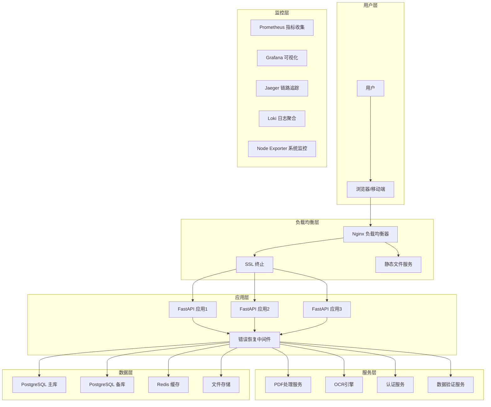

# 生产环境部署指南

## 概述

本指南提供地产资产管理系统的完整生产环境部署方案，包括容器化部署、监控配置、安全设置和高可用性保障。

## 部署架构

### 系统架构图


## 部署前置条件

### 系统要求

#### 硬件要求
- **CPU**: 最低4核，推荐8核
- **内存**: 最低8GB，推荐16GB
- **存储**: 最低100GB SSD，推荐500GB SSD
- **网络**: 带宽100Mbps以上

#### 软件要求
- **操作系统**: CentOS 7.9+, Ubuntu 18.04+, 或 RHEL 7.9+
- **容器**: Docker 20.10+, Docker Compose 2.0+
- **代理**: Nginx 1.18+ (如果不用容器)
- **数据库**: PostgreSQL 13+ (如果不用容器)

#### 网络要求
- **端口**: 80, 443, 8080-8090, 3000, 9090, 3100, 16686
- **域名**: 配置DNS解析和SSL证书
- **防火墙**: 开放必要端口

## 快速部署

### 1. 克隆代码
```bash
git clone https://github.com/your-org/asset-management.git
cd asset-management
```

### 2. 环境配置
```bash
# 复制环境配置模板
cp .env.production.example .env.production

# 编辑环境配置
vim .env.production
```

**环境配置示例** (`.env.production`):
```env
# 数据库配置
DB_HOST=postgres
DB_PORT=5432
DB_NAME=asset_management
DB_USER=asset_user
DB_PASSWORD=your_secure_password_here
DB_POOL_SIZE=20
DB_MAX_OVERFLOW=30

# Redis配置
REDIS_HOST=redis
REDIS_PORT=6379
REDIS_PASSWORD=your_redis_password_here
REDIS_DB=0
REDIS_POOL_SIZE=50

# 应用配置
ENVIRONMENT=production
DEBUG=false
LOG_LEVEL=INFO
MAX_CONNECTIONS=1000
RATE_LIMIT_PER_MINUTE=1000

# SSL证书配置
SSL_CERT_PATH=/app/ssl/cert.pem
SSL_KEY_PATH=/app/ssl/key.pem
DOMAIN=your-domain.com

# 监控配置
GRAFANA_USER=admin
GRAFANA_PASSWORD=your_grafana_password
PROMETHEUS_RETENTION=30d
ENABLE_MONITORING=true

# 安全配置
SECRET_KEY=your_super_secret_key_here
ALLOWED_HOSTS=your-domain.com,www.your-domain.com
CORS_ORIGINS=https://your-domain.com

# 文件上传配置
MAX_FILE_SIZE=100MB
UPLOAD_PATH=/app/uploads
ALLOWED_EXTENSIONS=pdf,doc,docx,xls,xlsx

# 错误恢复配置
ERROR_RECOVERY_ENABLED=true
MAX_RETRY_ATTEMPTS=3
CIRCUIT_BREAKER_THRESHOLD=5
```

### 3. 一键部署
```bash
# 确保脚本可执行
chmod +x scripts/deploy.sh

# 运行部署脚本
./scripts/deploy.sh production v1.0.0
```

### 4. 验证部署
```bash
# 检查服务状态
docker-compose -f docker/production/docker-compose.yml ps

# 检查健康状态
curl http://localhost/api/v1/health

# 查看服务日志
docker-compose -f docker/production/docker-compose.yml logs -f
```

## 详细部署步骤

### 步骤1: 基础环境准备

#### 1.1 安装Docker
```bash
# Ubuntu/Debian
curl -fsSL https://get.docker.com -o get-docker.sh
sudo sh get-docker.sh
sudo usermod -aG $USER docker

# CentOS/RHEL
sudo yum install -y yum-utils
sudo yum-config-manager --add-repo https://download.docker.com/linux/centos/docker-ce.repo
sudo yum install -y docker-ce docker-ce-cli containerd.io
sudo systemctl start docker
sudo systemctl enable docker
```

#### 1.2 安装Docker Compose
```bash
sudo curl -L "https://github.com/docker/compose/releases/latest/download/docker-compose-$(uname -s)-$(uname -m)" -o /usr/local/bin/docker-compose
sudo chmod +x /usr/local/bin/docker-compose
```

### 步骤2: 安全配置

#### 2.1 创建应用用户
```bash
sudo useradd -r -s /bin/false appuser
sudo groupadd -r appuser
```

#### 2.2 设置目录权限
```bash
# 创建应用目录
sudo mkdir -p /opt/asset-management/{logs,data,uploads,cache,ssl}

# 设置权限
sudo chown -R appuser:appuser /opt/asset-management
sudo chmod -R 755 /opt/asset-management
```

#### 2.3 配置防火墙
```bash
# Ubuntu (UFW)
sudo ufw allow 22/tcp    # SSH
sudo ufw allow 80/tcp    # HTTP
sudo ufw allow 443/tcp   # HTTPS
sudo ufw allow 8080/tcp  # 管理后台
sudo ufw enable

# CentOS (firewalld)
sudo firewall-cmd --permanent --add-service=http
sudo firewall-cmd --permanent --add-service=https
sudo firewall-cmd --permanent --add-port=8080/tcp
sudo firewall-cmd --reload
```

### 步骤3: SSL证书配置

#### 3.1 生成自签名证书（测试用）
```bash
openssl req -x509 -nodes -days 365 -newkey rsa:2048 \
    -keyout /opt/asset-management/ssl/key.pem \
    -out /opt/asset-management/ssl/cert.pem \
    -subj "/C=CN/ST=Beijing/L=Beijing/O=Asset Management/OU=IT/CN=your-domain.com"
```

#### 3.2 使用Let's Encrypt证书（生产推荐）
```bash
# 安装Certbot
sudo apt-get install -y certbot

# 获取证书
sudo certbot certonly --standalone -d your-domain.com -d www.your-domain.com

# 复制证书
sudo cp /etc/letsencrypt/live/your-domain.com/fullchain.pem /opt/asset-management/ssl/cert.pem
sudo cp /etc/letsencrypt/live/your-domain.com/privkey.pem /opt/asset-management/ssl/key.pem
```

### 步骤4: 数据库配置

#### 4.1 PostgreSQL优化配置
```bash
# 创建PostgreSQL配置
cat > /opt/asset-management/postgresql.conf << EOF
# 内存配置
shared_buffers = 256MB
effective_cache_size = 1GB
work_mem = 4MB
maintenance_work_mem = 64MB

# 连接配置
max_connections = 200
superuser_reserved_connections = 3

# 检查点配置
checkpoint_completion_target = 0.9
checkpoint_segments = 32
wal_buffers = 16MB

# 日志配置
log_destination = 'stderr'
logging_collector = on
log_directory = '/var/log/postgresql'
log_filename = 'postgresql-%Y-%m-%d_%H%M%S.log'
log_min_duration_statement = 1000

# 自动清理配置
autovacuum = on
autovacuum_naptime = 60
autovacuum_analyze_threshold = 50
EOF
```

#### 4.2 数据库备份配置
```bash
# 创建备份脚本
cat > /opt/asset-management/scripts/backup_db.sh << 'EOF'
#!/bin/bash
BACKUP_DIR="/opt/asset-management/backups"
DATE=$(date +%Y%m%d_%H%M%S)
BACKUP_FILE="$BACKUP_DIR/asset_management_backup_$DATE.sql"

# 创建备份目录
mkdir -p $BACKUP_DIR

# 备份数据库
docker-compose exec -T postgres pg_dump -U asset_user asset_management > $BACKUP_FILE

# 压缩备份
gzip $BACKUP_FILE

# 删除7天前的备份
find $BACKUP_DIR -name "asset_management_backup_*.sql.gz" -mtime +7 -delete

echo "备份完成: $BACKUP_FILE.gz"
EOF

chmod +x /opt/asset-management/scripts/backup_db.sh

# 设置定时备份
crontab -l | grep -q "backup_db.sh" || (crontab -l 2>/dev/null; echo "0 2 * * * /opt/asset-management/scripts/backup_db.sh") | crontab -
```

### 步骤5: 性能优化配置

#### 5.1 系统内核参数优化
```bash
# 添加系统优化参数
cat >> /etc/sysctl.conf << EOF
# 网络优化
net.core.rmem_max = 16777216
net.core.wmem_max = 16777216
net.ipv4.tcp_rmem = 4096 65536 16777216
net.ipv4.tcp_wmem = 4096 65536 16777216
net.ipv4.tcp_congestion_control = 1
net.ipv4.tcp_no_metrics_save = 1

# 文件描述符限制
fs.file-max = 1000000

# 虚拟内存优化
vm.swappiness = 1
vm.dirty_ratio = 15
EOF

# 应用配置
sudo sysctl -p
```

#### 5.2 Docker资源限制优化
```yaml
# docker-compose.yml 优化配置
services:
  backend:
    deploy:
      resources:
        limits:
          cpus: '2.0'        # CPU限制
          memory: 2G          # 内存限制
        reservations:
          cpus: '1.0'        # CPU预留
          memory: 1G          # 内存预留
    ulimits:
      nofile:
        soft: 65536
        hard: 65536
      nproc:
        soft: 32768
        hard: 32768
```

### 步骤6: 监控配置

#### 6.1 Prometheus配置
```yaml
# monitoring/prometheus.yml
global:
  scrape_interval: 15s
  evaluation_interval: 15s

rule_files:
  - "alert_rules.yml"

scrape_configs:
  - job_name: 'asset-management'
    static_configs:
      - targets: ['backend:8002']
    metrics_path: '/metrics'
    scrape_interval: 5s

  - job_name: 'postgres'
    static_configs:
      - targets: ['postgres-exporter:9187']

  - job_name: 'nginx'
    static_configs:
      - targets: ['nginx-exporter:9113']

  - job_name: 'redis'
    static_configs:
      - targets: ['redis-exporter:9121']
```

#### 6.2 Grafana仪表板配置
```json
{
  "dashboard": {
    "title": "Asset Management Dashboard",
    "panels": [
      {
        "title": "API请求量",
        "type": "graph",
        "targets": [
          {
            "expr": "rate(http_requests_total[5m])",
            "legendFormat": "{{method}} {{status}}"
          }
        ]
      },
      {
        "title": "数据库连接数",
        "type": "singlestat",
        "targets": [
          {
            "expr": "database_connections_active"
          }
        ]
      },
      {
        "title": "错误率",
        "type": "singlestat",
        "targets": [
          {
            "expr": "rate(http_errors_total[5m]) * 100"
          }
        ]
      },
      {
        "title": "响应时间",
        "type": "graph",
        "targets": [
          {
            "expr": "histogram_quantile(0.95, rate(http_request_duration_seconds_bucket[5m]))"
          }
        ]
      }
    ]
  }
}
```

### 步骤7: 日志配置

#### 7.1 日志轮转配置
```bash
# 创建logrotate配置
cat > /etc/logrotate.d/asset-management << EOF
/opt/asset-management/logs/*.log {
    daily
    missingok
    rotate 30
    compress
    delaycompress
    notifempty
    create 644 appuser appuser
    postrotate
        docker-compose -f /opt/asset-management/docker/production/docker-compose.yml exec backend kill -USR1 1
    endscript
}
EOF
```

#### 7.2 日志聚合配置
```yaml
# docker-compose.yml 中添加Loki配置
volumes:
  app_logs:
    driver: local

services:
  loki:
    image: grafana/loki:latest
    volumes:
      - app_logs:/loki/app_logs
    command: -config.file=/etc/loki/local-config.yaml
```

## 高可用部署

### 负载均衡配置

#### 多节点部署
```bash
# 生产环境多节点部署
docker swarm init
docker stack deploy -c docker-compose.prod.yml asset-management
```

#### 健康检查配置
```yaml
# docker-compose.yml 健康检查配置
services:
  backend:
    healthcheck:
      test: ["CMD", "curl", "-f", "http://localhost:8002/api/v1/health"]
      interval: 30s
      timeout: 10s
      retries: 3
      start_period: 40s
```

### 灾备恢复配置

#### 主备站点部署
```bash
# 主站点配置
# 主数据中心
docker-compose -f docker-compose.prod.yml up -d

# 备站点配置
# 备数据中心
scp -r ./asset-management/ backup-server:/opt/
ssh backup-server "cd /opt/asset-management && docker-compose -f docker-compose.prod.yml up -d"
```

#### 数据同步配置
```bash
# 配置PostgreSQL主从复制
# 主库配置 (postgresql.conf)
wal_level = replica
max_wal_senders = 3
wal_keep_segments = 64
archive_mode = on
archive_command = 'cp %p /var/lib/postgresql/archive/%f'
archive_timeout = 60

# 从库配置
standby_mode = on
primary_conninfo = 'host=primary port=5432 user=replicator'
restore_command = 'cp %p %r'
```

## 安全加固

### 1. 网络安全
```yaml
# docker-compose.yml 安全配置
services:
  backend:
    networks:
      - backend-only
    deploy:
      resources:
        limits:
          cpus: '2.0'
          memory: 2G

networks:
  backend-only:
    driver: bridge
    internal: true
    ipam:
      driver: default
      config:
        - subnet: 172.20.0.0/24
```

### 2. 容器安全
```dockerfile
# 生产环境安全配置
FROM python:3.12-slim

# 创建非root用户
RUN groupadd -r appuser && useradd -r -g appuser appuser

# 最小化安装
RUN apt-get update && apt-get install -y --no-install-recommends \
    build-essential \
    && rm -rf /var/lib/apt/lists/*

USER appuser

# 只开放必要端口
EXPOSE 8002

# 安全扫描集成
RUN apt-get update && apt-get install -y \
    clamav \
    && freshclam
```

### 3. 应用安全
```python
# backend/src/core/security.py

# 安全配置
SECURITY_HEADERS = {
    'X-Frame-Options': 'SAMEORIGIN',
    'X-Content-Type-Options': 'nosniff',
    'X-XSS-Protection': '1; mode=block',
    'Referrer-Policy': 'strict-origin-when-cross-origin',
    'Content-Security-Policy': 'default-src \'self\''
}

# 速率限制
RATE_LIMIT_PER_MINUTE = 1000
RATE_LIMIT_BURST = 100

# 认证配置
SECRET_KEY = os.getenv('SECRET_KEY')
JWT_ALGORITHM = 'HS256'
JWT_EXPIRE_MINUTES = 30

# 权限控制
RBAC_ENABLED = True
ADMIN_ONLY_ENDPOINTS = [
    '/api/v1/admin/*',
    '/api/v1/system/*'
]
```

## 性能调优

### 1. 数据库性能
```sql
-- 创建索引
CREATE INDEX CONCURRENTLY idx_assets_ownership_entity ON assets(ownership_entity);
CREATE INDEX CONCURRENTLY idx_assets_status ON assets(ownership_status);
CREATE INDEX CONCURRENTLY idx_assets_name ON assets(property_name);
CREATE INDEX CONCURRENTLY idx_assets_created_at ON assets(created_at);

-- 分区表（大数据量）
CREATE TABLE audit_logs (
    id BIGSERIAL,
    created_at TIMESTAMP,
    data JSONB
) PARTITION BY RANGE (created_at);
```

### 2. 缓存策略
```python
# 缓存配置
CACHE_CONFIG = {
    'default_timeout': 3600,      # 1小时
    'session_timeout': 7200,      # 2小时
    'api_cache_timeout': 300,      # 5分钟
    'static_cache_timeout': 86400,  # 24小时
    'max_memory_size': '2GB'       # 最大缓存大小
}

# 缓存键策略
def get_cache_key(prefix, *args):
    return f"{prefix}:{':'.join(str(arg) for arg in args)}:v1"
```

### 3. API性能优化
```python
# 优化配置
PERFORMANCE_CONFIG = {
    'connection_pool_size': 20,
    'connection_timeout': 30,
    'read_timeout': 30,
    'write_timeout': 30,
    'max_request_size': 100 * 1024 * 1024,  # 100MB
    'enable_compression': True,
    'compression_level': 6
}
```

## 监控告警

### 1. 告警规则配置
```yaml
# alert_rules.yml
groups:
  - name: asset-management
    rules:
      - alert: HighErrorRate
        expr: rate(http_errors_total[5m]) > 0.1
        for: 2m
        labels:
          severity: warning
        annotations:
          summary: "错误率过高"
          description: "5分钟内错误率超过10%"

      - alert: HighResponseTime
        expr: histogram_quantile(0.95, rate(http_request_duration_seconds_bucket[5m])) > 1
        for: 5m
        labels:
          severity: critical
        annotations:
          summary: "响应时间过长"
          description: "95%的请求响应时间超过1秒"

      - alert: DatabaseDown
        expr: up{job="postgres"} == 0
        for: 1m
        labels:
          severity: critical
        annotations:
          summary: "数据库服务宕机"
          description: "PostgreSQL数据库不可用"
```

### 2. 告警通知配置
```bash
# 配置邮件告警
cat > /opt/asset-management/monitoring/alertmanager.yml << EOF
global:
  smtp_smarthost: 'smtp.gmail.com:587'
  smtp_from: 'alerts@your-domain.com'
  smtp_auth_username: 'your-email@gmail.com'
  smtp_auth_password: 'your-app-password'

route:
  group_by: ['alertname']
  group_wait: 10s
  group_interval: 10s
  receiver: 'web.hook'

receivers:
  - name: 'web.hook'
    email_configs:
      - to: 'admin@your-domain.com'
        subject: '[Asset Management] {{ .GroupLabels.alertname }}'
        body: |
          {{ range .Alerts }}
          Alert: {{ .Annotations.summary }}
          Description: {{ .Annotations.description }}
          {{ end }}
EOF
```

## 运维管理

### 1. 日常运维检查清单

#### 每日检查
- [ ] 服务健康状态检查
- [ ] 数据库连接检查
- [ ] 磁盘空间检查 (>80%告警)
- [ ] 内存使用检查 (>90%告警)
- [ ] 错误日志检查
- [ ] 备份执行检查

#### 每周检查
- [ ] 性能指标分析
- [ ] 日志轮转状态
- [ ] SSL证书有效期检查 (>30天告警)
- [ ] 安全扫描结果检查
- [ ] 监控数据清理

#### 每月检查
- [ ] 容量规划评估
- [ ] 灾备恢复测试
- [ ] 安全更新评估
- [ ] 性能基线调整
- [ ] 文档更新

### 2. 故障处理流程

#### 故障等级定义
- **P0**: 系统不可用，影响所有用户
- **P1**: 核心功能故障，影响部分用户
- **P2**: 非核心功能故障，影响少数用户
- **P3**: 体验问题，不影响功能

#### 故障响应时间要求
- **P0**: 15分钟响应，2小时恢复
- **P1**: 30分钟响应，4小时恢复
- **P2**: 2小时响应，24小时恢复
- **P3**: 8小时响应，72小时恢复

## 部署验证

### 1. 功能验证
```bash
# API健康检查
curl -f http://your-domain.com/api/v1/health

# 功能测试
./scripts/test_api.sh http://your-domain.com/api/v1

# 压力测试
./scripts/load_test.sh http://your-domain.com 100 60
```

### 2. 性能验证
```bash
# 性能基准测试
./scripts/performance_test.sh http://your-domain.com

# 监控指标验证
curl http://your-domain.com:3000/api/datasources/proxy/1/api/v1/query_range
```

### 3. 安全验证
```bash
# 安全扫描
./scripts/security_scan.sh http://your-domain.com

# SSL证书检查
./scripts/ssl_check.sh your-domain.com

# 漏洞扫描
./scripts/vulnerability_scan.sh
```

## 回滚方案

### 1. 快速回滚
```bash
# 回滚到上一版本
./scripts/rollback.sh previous

# 回滚到指定版本
./scripts/rollback.sh v1.0.0
```

### 2. 紧急回滚
```bash
# 停止当前服务
docker-compose -f docker/production/docker-compose.yml down

# 启动备份服务
docker-compose -f docker/backup/docker-compose.yml up -d

# 验证回滚
curl -f http://your-domain.com/api/v1/health
```

## 联系信息

### 技术支持
- **运维团队**: ops@your-domain.com
- **开发团队**: dev@your-domain.com
- **紧急联系**: +86-xxx-xxxx-xxxx

### 相关文档
- 系统架构文档: [链接]
- API文档: http://your-domain.com/docs
- 监控面板: http://your-domain.com:3000
- 故障处理流程: [链接]

---

**版本**: v1.0.0
**更新时间**: 2025-10-26
**维护者**: DevOps Team