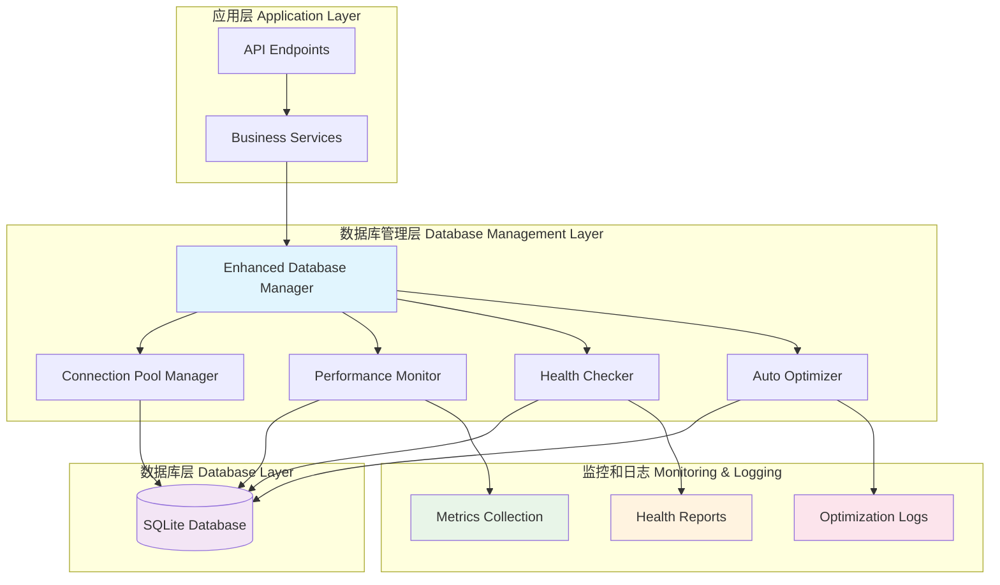

# 增强数据库管理器使用指南

## 概述

增强数据库管理器（Enhanced Database Manager）是地产资产管理系统的核心组件，提供企业级数据库连接管理、性能监控、健康检查和自动优化功能。

## 核心特性

### 1. 连接池管理
- **智能连接池**: 自动调整连接池大小
- **连接复用**: 高效的连接复用机制
- **超时控制**: 可配置的连接和查询超时
- **连接验证**: 自动验证连接有效性

### 2. 性能监控
- **实时指标**: 查询数量、响应时间、错误率
- **慢查询检测**: 自动识别和记录慢查询
- **连接池监控**: 实时连接池状态监控
- **资源使用**: 内存和CPU使用情况跟踪

### 3. 健康检查
- **多维度检查**: 连接、表访问、性能检查
- **自动诊断**: 智能问题诊断和建议
- **状态报告**: 详细的健康状态报告
- **告警机制**: 异常情况自动告警

### 4. 自动优化
- **统计信息更新**: 自动更新数据库统计信息
- **索引建议**: 基于查询模式提供索引建议
- **性能调优**: 自动性能优化建议
- **维护任务**: 定期数据库维护任务

## 架构设计



## 核心组件

### 1. EnhancedDatabaseManager

主要的数据库管理器类，负责协调所有数据库相关功能。

```python
class EnhancedDatabaseManager:
    """增强数据库管理器"""

    def __init__(self):
        self.engine: Optional[Engine] = None
        self.session_factory: Optional[sessionmaker] = None
        self.config: ConnectionPoolConfig = self._load_config()
        self.metrics: DatabaseMetrics = DatabaseMetrics()
        self._health_check_cache: Dict[str, Any] = {}
        self._last_health_check: Optional[datetime] = None
```

#### 主要方法

- `initialize_database()`: 初始化数据库连接
- `create_session()`: 创建数据库会话
- `get_connection_pool_status()`: 获取连接池状态
- `run_health_check()`: 运行健康检查
- `get_slow_queries()`: 获取慢查询列表
- `optimize_database()`: 执行数据库优化

### 2. DatabaseMetrics

数据库性能指标收集器。

```python
@dataclass
class DatabaseMetrics:
    """数据库性能指标"""
    total_queries: int = 0
    slow_queries: int = 0
    avg_response_time: float = 0.0
    active_connections: int = 0
    connection_errors: int = 0
    last_activity: Optional[datetime] = None
```

#### 指标说明

- **total_queries**: 总查询数量
- **slow_queries**: 慢查询数量（超过1秒）
- **avg_response_time**: 平均响应时间（毫秒）
- **active_connections**: 当前活跃连接数
- **connection_errors**: 连接错误次数
- **last_activity**: 最后活动时间

### 3. ConnectionPoolConfig

连接池配置管理。

```python
@dataclass
class ConnectionPoolConfig:
    """连接池配置"""
    pool_size: int = 20
    max_overflow: int = 30
    pool_timeout: int = 30
    pool_recycle: int = 3600
    pool_pre_ping: bool = True
    echo: bool = False
```

#### 配置参数

- **pool_size**: 连接池大小
- **max_overflow**: 最大溢出连接数
- **pool_timeout**: 获取连接超时时间（秒）
- **pool_recycle**: 连接回收时间（秒）
- **pool_pre_ping**: 连接预检查
- **echo**: SQL语句回显

## API接口

### 1. 数据库状态查询

**端点**: `GET /api/v1/database/status`

**描述**: 获取数据库管理器当前状态

**响应格式**:
```json
{
  "success": true,
  "data": {
    "enhanced_active": true,
    "enhanced_available": true,
    "engine_type": "SQLite",
    "connection_pool": {
      "pool_size": 20,
      "checked_in": 15,
      "checked_out": 5,
      "utilization": 25.0
    },
    "metrics": {
      "total_queries": 1000,
      "slow_queries": 5,
      "avg_response_time": 150.5,
      "active_connections": 5
    }
  }
}
```

### 2. 健康检查

**端点**: `GET /api/v1/database/health`

**描述**: 执行数据库健康检查

**响应格式**:
```json
{
  "success": true,
  "data": {
    "healthy": true,
    "checks": {
      "basic_connection": {
        "status": "healthy",
        "response_time_ms": 15
      },
      "table_access": {
        "status": "healthy",
        "table_count": 10
      },
      "performance": {
        "status": "warning",
        "avg_response_time_ms": 200.5
      }
    },
    "timestamp": "2025-11-03T13:20:00Z",
    "metrics": {
      "total_queries": 1000,
      "slow_queries": 5
    }
  }
}
```

### 3. 慢查询查询

**端点**: `GET /api/v1/database/slow-queries`

**描述**: 获取慢查询列表

**请求参数**:
- `limit`: 返回数量限制（默认10条）
- `min_time`: 最小执行时间（毫秒）

**响应格式**:
```json
{
  "success": true,
  "data": {
    "slow_queries": [
      {
        "query": "SELECT * FROM large_table WHERE condition = ?",
        "execution_time_ms": 150.0,
        "timestamp": "2025-11-03T13:15:00Z",
        "params": ["value"]
      }
    ],
    "total_count": 5
  }
}
```

### 4. 数据库优化

**端点**: `POST /api/v1/database/optimize`

**描述**: 执行数据库优化操作

**响应格式**:
```json
{
  "success": true,
  "data": {
    "timestamp": "2025-11-03T13:20:00Z",
    "actions_taken": [
      "分析了 10 个慢查询",
      "更新了SQLite统计信息",
      "重建了索引"
    ],
    "recommendations": [
      "考虑添加适当的索引来优化慢查询",
      "连接池使用率过高，考虑增加连接池大小"
    ],
    "performance_improvement": {
      "estimated_gain": "15-20%",
      "optimized_queries": 8
    }
  }
}
```

### 5. 连接池状态

**端点**: `GET /api/v1/database/pool-status`

**描述**: 获取连接池详细状态

**响应格式**:
```json
{
  "success": true,
  "data": {
    "pool_size": 20,
    "checked_in": 15,
    "checked_out": 5,
    "overflow": 0,
    "invalid": 0,
    "utilization": 25.0,
    "pool_type": "QueuePool",
    "configuration": {
      "pool_timeout": 30,
      "pool_recycle": 3600,
      "pool_pre_ping": true
    }
  }
}
```

## 使用示例

### 1. 基本使用

```python
from core.enhanced_database import get_database_manager

# 获取数据库管理器实例
db_manager = get_database_manager()

# 创建会话
with db_manager.create_session() as session:
    # 执行数据库操作
    result = session.execute(text("SELECT COUNT(*) FROM assets"))
    count = result.scalar()

print(f"总资产数量: {count}")
```

### 2. 性能监控

```python
# 获取性能指标
metrics = db_manager.metrics
print(f"总查询数: {metrics.total_queries}")
print(f"慢查询数: {metrics.slow_queries}")
print(f"平均响应时间: {metrics.avg_response_time}ms")

# 获取连接池状态
pool_status = db_manager.get_connection_pool_status()
print(f"连接池利用率: {pool_status['utilization']}%")
```

### 3. 健康检查

```python
# 执行健康检查
health_result = db_manager.run_health_check()

if health_result["healthy"]:
    print("数据库状态健康")
else:
    print("数据库存在问题:")
    for check_name, check_result in health_result["checks"].items():
        if check_result["status"] != "healthy":
            print(f"- {check_name}: {check_result['status']}")
```

### 4. 慢查询分析

```python
# 获取慢查询
slow_queries = db_manager.get_slow_queries(limit=5)

for query_info in slow_queries:
    print(f"慢查询: {query_info['query']}")
    print(f"执行时间: {query_info['execution_time_ms']}ms")
    print(f"时间戳: {query_info['timestamp']}")
    print("-" * 50)
```

### 5. 数据库优化

```python
# 执行数据库优化
optimization_result = db_manager.optimize_database()

print("优化操作:")
for action in optimization_result["actions_taken"]:
    print(f"- {action}")

print("\n优化建议:")
for recommendation in optimization_result["recommendations"]:
    print(f"- {recommendation}")
```

## 配置说明

### 1. 环境变量

```bash
# 数据库配置
DATABASE_URL=sqlite:///./data/asset_management.db

# 连接池配置
DB_POOL_SIZE=20
DB_MAX_OVERFLOW=30
DB_POOL_TIMEOUT=30
DB_POOL_RECYCLE=3600

# 性能监控
DB_SLOW_QUERY_THRESHOLD=1000  # 毫秒
DB_ENABLE_QUERY_LOGGING=true
```

### 2. 配置文件

```python
# config/database.py
DATABASE_CONFIG = {
    "url": "sqlite:///./data/asset_management.db",
    "pool_config": {
        "pool_size": 20,
        "max_overflow": 30,
        "pool_timeout": 30,
        "pool_recycle": 3600,
        "pool_pre_ping": True,
        "echo": False
    },
    "monitoring": {
        "slow_query_threshold": 1000,  # 毫秒
        "enable_query_logging": True,
        "metrics_retention_days": 30
    }
}
```

## 性能优化建议

### 1. 连接池优化

- **合理设置连接池大小**: 根据并发需求调整`pool_size`
- **配置适当的溢出连接**: 使用`max_overflow`处理突发流量
- **设置连接超时**: 避免长时间等待连接
- **启用连接预检查**: 确保连接有效性

### 2. 查询优化

- **使用索引**: 为常用查询字段创建索引
- **避免N+1查询**: 使用JOIN或预加载优化关联查询
- **分页查询**: 大数据集使用分页避免内存溢出
- **定期分析慢查询**: 识别并优化性能瓶颈

### 3. 监控和告警

- **设置监控指标**: 跟踪关键性能指标
- **配置告警阈值**: 异常情况及时通知
- **定期健康检查**: 主动发现潜在问题
- **记录性能趋势**: 长期性能分析

## 故障排除

### 1. 连接问题

**症状**: 连接超时或连接池耗尽

**解决方案**:
```python
# 检查连接池状态
pool_status = db_manager.get_connection_pool_status()
if pool_status["utilization"] > 80:
    print("连接池利用率过高，考虑增加连接池大小")

# 检查连接错误
if db_manager.metrics.connection_errors > 0:
    print("存在连接错误，检查数据库服务器状态")
```

### 2. 性能问题

**症状**: 查询响应时间过长

**解决方案**:
```python
# 分析慢查询
slow_queries = db_manager.get_slow_queries(min_time=500)
for query in slow_queries:
    print(f"慢查询: {query['query']}")
    print(f"执行时间: {query['execution_time_ms']}ms")

# 执行优化
optimization_result = db_manager.optimize_database()
for recommendation in optimization_result["recommendations"]:
    print(f"建议: {recommendation}")
```

### 3. 内存问题

**症状**: 内存使用过高

**解决方案**:
```python
# 检查活跃连接数
if db_manager.metrics.active_connections > db_manager.config.pool_size:
    print("活跃连接数超过连接池大小，可能存在连接泄漏")

# 重置连接池
db_manager.reset_connection_pool()
```

## 最佳实践

### 1. 代码规范

- **使用上下文管理器**: 确保会话正确关闭
- **异常处理**: 妥善处理数据库异常
- **事务管理**: 合理使用事务
- **资源清理**: 及时释放数据库资源

### 2. 性能优化

- **批量操作**: 使用批量插入/更新
- **索引优化**: 为查询字段创建适当索引
- **查询优化**: 避免不必要的复杂查询
- **缓存策略**: 实施适当的缓存机制

### 3. 监控和维护

- **定期监控**: 监控关键性能指标
- **健康检查**: 定期执行健康检查
- **日志记录**: 记录重要操作和异常
- **备份策略**: 定期备份数据库

## 测试覆盖

增强数据库管理器包含全面的测试覆盖：

### 1. 单元测试
- 数据库管理器初始化测试
- 连接池配置测试
- 性能指标测试
- 健康检查功能测试

### 2. 集成测试
- 数据库连接测试
- 查询执行测试
- 事务管理测试
- 错误处理测试

### 3. 性能测试
- 连接池性能测试
- 并发访问测试
- 大数据量查询测试
- 内存使用测试

测试文件位置：
- `tests/test_enhanced_database_coverage.py`

## 版本信息

- **当前版本**: v1.0.0
- **最后更新**: 2025-11-03
- **兼容性**: Python 3.8+
- **数据库支持**: SQLite, MySQL, PostgreSQL

## 相关文档

- [API文档](./API_DOCUMENTATION_ANALYSIS.md)
- [代码质量指南](./code_quality_guidelines.md)
- [安全指南](./security.md)
- [测试覆盖率报告](../COVERAGE_IMPROVEMENT_REPORT.md)