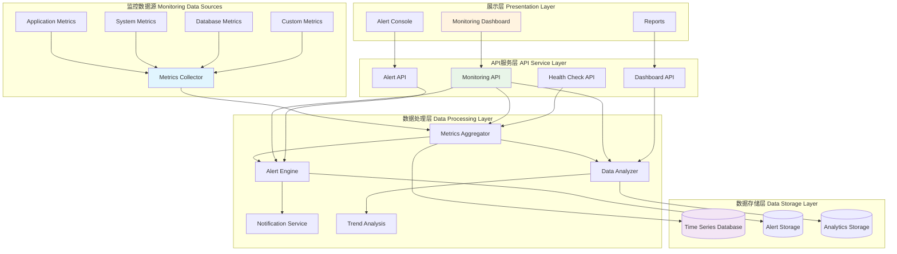

# 系统监控API使用指南

## 概述

系统监控API提供全面的应用程序和基础设施监控功能，包括性能指标收集、健康状态检查、实时监控和告警功能。该API基于现代化的监控架构设计，支持多维度指标收集和分析。

## 核心特性

### 1. 性能监控
- **实时指标**: CPU、内存、磁盘、网络使用率
- **应用性能**: 响应时间、吞吐量、错误率
- **数据库性能**: 查询时间、连接池状态、慢查询
- **缓存性能**: 命中率、内存使用、键空间统计

### 2. 健康检查
- **多层级检查**: 系统、应用、数据库、外部依赖
- **智能诊断**: 自动问题定位和根因分析
- **依赖检查**: 第三方服务可用性检查
- **状态聚合**: 整体健康状态综合评估

### 3. 告警系统
- **阈值告警**: 可配置的指标阈值告警
- **趋势告警**: 基于趋势的预测性告警
- **多渠道通知**: 邮件、短信、Webhook通知
- **告警抑制**: 防止告警风暴的智能抑制

### 4. 监控仪表板
- **实时仪表板**: 可视化监控数据展示
- **历史趋势**: 长期性能趋势分析
- **自定义视图**: 可定制的监控视图
- **导出功能**: 数据导出和报告生成

## 架构设计



## API接口详情

### 1. 系统概览监控

**端点**: `GET /api/v1/monitoring/overview`

**描述**: 获取系统整体监控概览

**响应格式**:
```json
{
  "success": true,
  "data": {
    "timestamp": "2025-11-03T13:30:00Z",
    "system_status": "healthy",
    "uptime": "15 days, 7 hours, 23 minutes",
    "overall_health_score": 95.5,
    "components": {
      "application": {
        "status": "healthy",
        "response_time_ms": 125.3,
        "error_rate": 0.02,
        "throughput_rps": 45.2
      },
      "database": {
        "status": "healthy",
        "connection_pool_utilization": 25.0,
        "avg_query_time_ms": 85.6,
        "slow_query_count": 2
      },
      "cache": {
        "status": "healthy",
        "hit_rate": 94.2,
        "memory_usage_mb": 256.7,
        "evicted_keys": 1250
      },
      "external_services": {
        "status": "warning",
        "available_services": 3,
        "total_services": 4,
        "failing_services": ["pdf_service"]
      }
    },
    "alerts": {
      "active": 2,
      "critical": 0,
      "warning": 2,
      "info": 0
    }
  }
}
```

### 2. 性能指标查询

**端点**: `GET /api/v1/monitoring/metrics`

**描述**: 获取详细的性能指标数据

**请求参数**:
- `metric_type`: 指标类型（system, application, database, cache）
- `time_range`: 时间范围（1h, 6h, 24h, 7d, 30d）
- `granularity`: 数据粒度（1m, 5m, 15m, 1h）
- `filters`: 过滤条件（可选）

**响应格式**:
```json
{
  "success": true,
  "data": {
    "metric_type": "system",
    "time_range": "1h",
    "granularity": "5m",
    "metrics": {
      "cpu_usage": {
        "current": 35.2,
        "average": 32.8,
        "max": 45.6,
        "unit": "percent",
        "datapoints": [
          {"timestamp": "2025-11-03T12:30:00Z", "value": 32.1},
          {"timestamp": "2025-11-03T12:35:00Z", "value": 35.8}
        ]
      },
      "memory_usage": {
        "current": 68.5,
        "average": 65.2,
        "max": 78.9,
        "unit": "percent",
        "datapoints": [
          {"timestamp": "2025-11-03T12:30:00Z", "value": 63.4},
          {"timestamp": "2025-11-03T12:35:00Z", "value": 68.5}
        ]
      },
      "disk_usage": {
        "current": 42.3,
        "average": 42.1,
        "max": 43.0,
        "unit": "percent",
        "datapoints": [
          {"timestamp": "2025-11-03T12:30:00Z", "value": 42.1},
          {"timestamp": "2025-11-03T12:35:00Z", "value": 42.3}
        ]
      }
    }
  }
}
```

### 3. 健康检查

**端点**: `GET /api/v1/monitoring/health`

**描述**: 执行全面的系统健康检查

**请求参数**:
- `component`: 指定检查组件（可选，默认检查所有）
- `deep_check`: 是否执行深度检查（默认false）

**响应格式**:
```json
{
  "success": true,
  "data": {
    "overall_status": "healthy",
    "health_score": 92.5,
    "check_timestamp": "2025-11-03T13:30:00Z",
    "checks": {
      "application": {
        "status": "healthy",
        "response_time_ms": 125.3,
        "error_rate": 0.02,
        "checks": {
          "api_endpoints": {
            "status": "healthy",
            "total_endpoints": 30,
            "healthy_endpoints": 30,
            "failed_endpoints": 0
          },
          "authentication": {
            "status": "healthy",
            "login_response_time_ms": 95.2
          },
          "database_connection": {
            "status": "healthy",
            "connection_time_ms": 15.3
          }
        }
      },
      "database": {
        "status": "healthy",
        "checks": {
          "connection_pool": {
            "status": "healthy",
            "utilization": 25.0,
            "active_connections": 5,
            "idle_connections": 15
          },
          "query_performance": {
            "status": "healthy",
            "avg_query_time_ms": 85.6,
            "slow_queries": 2
          },
          "storage_health": {
            "status": "healthy",
            "total_size_mb": 1250.7,
            "growth_rate_mb_per_day": 2.3
          }
        }
      },
      "cache": {
        "status": "healthy",
        "checks": {
          "memory_usage": {
            "status": "healthy",
            "usage_mb": 256.7,
            "max_usage_mb": 512.0,
            "utilization": 50.1
          },
          "performance": {
            "status": "healthy",
            "hit_rate": 94.2,
            "avg_response_time_ms": 2.3
          }
        }
      },
      "external_services": {
        "status": "warning",
        "checks": {
          "pdf_processing_service": {
            "status": "unhealthy",
            "response_time_ms": null,
            "error": "Connection timeout"
          },
          "notification_service": {
            "status": "healthy",
            "response_time_ms": 156.7
          }
        }
      }
    },
    "recommendations": [
      "PDF处理服务连接超时，建议检查服务状态",
      "数据库连接池利用率较低，可考虑优化配置"
    ]
  }
}
```

### 4. 告警管理

**端点**: `GET /api/v1/monitoring/alerts`

**描述**: 获取告警信息

**请求参数**:
- `status`: 告警状态（active, resolved, acknowledged）
- `severity`: 严重程度（critical, warning, info）
- `limit`: 返回数量限制（默认50条）

**响应格式**:
```json
{
  "success": true,
  "data": {
    "alerts": [
      {
        "id": "alert_001",
        "name": "PDF处理服务不可用",
        "severity": "warning",
        "status": "active",
        "source": "external_service_check",
        "description": "PDF处理服务连接超时",
        "first_occurrence": "2025-11-03T13:15:00Z",
        "last_occurrence": "2025-11-03T13:30:00Z",
        "count": 4,
        "affected_components": ["pdf_import"],
        "recommended_actions": [
          "检查PDF处理服务状态",
          "验证网络连接",
          "重启PDF处理服务"
        ]
      },
      {
        "id": "alert_002",
        "name": "内存使用率过高",
        "severity": "warning",
        "status": "active",
        "source": "system_monitor",
        "description": "系统内存使用率超过80%",
        "first_occurrence": "2025-11-03T13:20:00Z",
        "last_occurrence": "2025-11-03T13:30:00Z",
        "count": 3,
        "current_value": 82.5,
        "threshold": 80.0,
        "affected_components": ["application"],
        "recommended_actions": [
          "检查内存泄漏",
          "优化应用程序内存使用",
          "考虑增加系统内存"
        ]
      }
    ],
    "summary": {
      "total": 2,
      "by_severity": {
        "critical": 0,
        "warning": 2,
        "info": 0
      },
      "by_status": {
        "active": 2,
        "resolved": 0,
        "acknowledged": 0
      }
    }
  }
}
```

### 5. 告警操作

**端点**: `POST /api/v1/monitoring/alerts/{alert_id}/acknowledge`

**描述**: 确认告警

**请求体**:
```json
{
  "comment": "已知问题，正在处理中",
  "assignee": "admin@example.com"
}
```

**响应格式**:
```json
{
  "success": true,
  "data": {
    "alert_id": "alert_001",
    "status": "acknowledged",
    "acknowledged_by": "admin@example.com",
    "acknowledged_at": "2025-11-03T13:35:00Z",
    "comment": "已知问题，正在处理中"
  }
}
```

### 6. 性能趋势分析

**端点**: `GET /api/v1/monitoring/trends`

**描述**: 获取性能趋势分析

**请求参数**:
- `metric`: 指标名称
- `time_range`: 时间范围（7d, 30d, 90d）
- `comparison`: 对比周期（previous_period, same_period_last_year）

**响应格式**:
```json
{
  "success": true,
  "data": {
    "metric": "response_time",
    "time_range": "7d",
    "current_period": {
      "start_date": "2025-10-27T00:00:00Z",
      "end_date": "2025-11-03T13:30:00Z",
      "average": 125.3,
      "min": 95.2,
      "max": 185.6,
      "trend": "increasing",
      "trend_percentage": 8.5
    },
    "comparison_period": {
      "start_date": "2025-10-20T00:00:00Z",
      "end_date": "2025-10-27T13:30:00Z",
      "average": 115.5,
      "min": 88.7,
      "max": 172.3
    },
    "anomalies": [
      {
        "timestamp": "2025-11-02T15:30:00Z",
        "value": 185.6,
        "expected_range": [110.0, 140.0],
        "severity": "high",
        "possible_causes": [
          "系统负载增加",
          "数据库查询性能下降",
          "网络延迟增加"
        ]
      }
    ],
    "insights": [
      "响应时间呈上升趋势，建议关注性能优化",
      "11月2日下午出现异常高峰，需要进一步调查原因",
      "整体性能仍在可接受范围内"
    ]
  }
}
```

### 7. 自定义指标

**端点**: `POST /api/v1/monitoring/custom-metrics`

**描述**: 提交自定义监控指标

**请求体**:
```json
{
  "metric_name": "user_registration_count",
  "value": 1250,
  "tags": {
    "source": "user_service",
    "environment": "production"
  },
  "timestamp": "2025-11-03T13:30:00Z",
  "unit": "count",
  "description": "用户注册总数"
}
```

**响应格式**:
```json
{
  "success": true,
  "data": {
    "metric_id": "custom_001",
    "status": "recorded",
    "timestamp": "2025-11-03T13:30:00Z"
  }
}
```

## 使用示例

### 1. 获取系统概览

```python
import requests

# 获取系统概览
response = requests.get("http://localhost:8002/api/v1/monitoring/overview")
overview = response.json()

if overview["success"]:
    data = overview["data"]
    print(f"系统状态: {data['system_status']}")
    print(f"健康评分: {data['overall_health_score']}")
    print(f"运行时间: {data['uptime']}")

    # 检查组件状态
    for component, status in data["components"].items():
        print(f"{component}: {status['status']}")
```

### 2. 监控性能指标

```python
# 获取CPU使用率趋势
response = requests.get(
    "http://localhost:8002/api/v1/monitoring/metrics",
    params={
        "metric_type": "system",
        "time_range": "1h",
        "granularity": "5m"
    }
)

metrics = response.json()["data"]["metrics"]
cpu_metrics = metrics["cpu_usage"]

print(f"当前CPU使用率: {cpu_metrics['current']}%")
print(f"平均CPU使用率: {cpu_metrics['average']}%")
print(f"最高CPU使用率: {cpu_metrics['max']}%")
```

### 3. 执行健康检查

```python
# 执行深度健康检查
response = requests.get(
    "http://localhost:8002/api/v1/monitoring/health",
    params={"deep_check": "true"}
)

health_data = response.json()["data"]
print(f"整体状态: {health_data['overall_status']}")
print(f"健康评分: {health_data['health_score']}")

# 检查具体组件
for component, checks in health_data["checks"].items():
    print(f"\n{component}:")
    print(f"  状态: {checks['status']}")

    if isinstance(checks, dict) and "checks" in checks:
        for check_name, check_result in checks["checks"].items():
            status_icon = "✅" if check_result["status"] == "healthy" else "❌"
            print(f"  {status_icon} {check_name}: {check_result['status']}")
```

### 4. 管理告警

```python
# 获取活跃告警
response = requests.get(
    "http://localhost:8002/api/v1/monitoring/alerts",
    params={"status": "active", "severity": "warning"}
)

alerts = response.json()["data"]["alerts"]
for alert in alerts:
    print(f"告警: {alert['name']}")
    print(f"严重程度: {alert['severity']}")
    print(f"描述: {alert['description']}")
    print(f"首次发生: {alert['first_occurrence']}")

    # 确认告警
    if alert["id"] == "alert_001":
        ack_response = requests.post(
            f"http://localhost:8002/api/v1/monitoring/alerts/{alert['id']}/acknowledge",
            json={
                "comment": "正在处理中",
                "assignee": "admin@example.com"
            }
        )
        print(f"告警确认状态: {ack_response.json()['success']}")
```

### 5. 分析性能趋势

```python
# 获取响应时间趋势分析
response = requests.get(
    "http://localhost:8002/api/v1/monitoring/trends",
    params={
        "metric": "response_time",
        "time_range": "7d",
        "comparison": "previous_period"
    }
)

trend_data = response.json()["data"]
current = trend_data["current_period"]
comparison = trend_data["comparison_period"]

print(f"当前平均响应时间: {current['average']}ms")
print(f"对比期平均响应时间: {comparison['average']}ms")
print(f"趋势: {current['trend']} ({current['trend_percentage']}%)")

# 显示异常点
for anomaly in trend_data["anomalies"]:
    print(f"异常: {anomaly['timestamp']}")
    print(f"  值: {anomaly['value']}ms")
    print(f"  预期范围: {anomaly['expected_range']}")
```

## 配置说明

### 1. 监控配置

```python
# config/monitoring.py
MONITORING_CONFIG = {
    "metrics_collection": {
        "enabled": True,
        "interval_seconds": 60,
        "retention_days": 30,
        "batch_size": 1000
    },
    "health_checks": {
        "enabled": True,
        "interval_seconds": 300,
        "timeout_seconds": 10,
        "retry_count": 3
    },
    "alerts": {
        "enabled": True,
        "notification_channels": ["email", "webhook"],
        "suppression_rules": {
            "max_alerts_per_hour": 10,
            "group_similar_alerts": True
        }
    },
    "dashboard": {
        "enabled": True,
        "refresh_interval_seconds": 30,
        "default_time_range": "1h"
    }
}
```

### 2. 告警规则配置

```python
# config/alert_rules.py
ALERT_RULES = {
    "system": {
        "cpu_usage": {
            "threshold": 80.0,
            "operator": ">",
            "severity": "warning",
            "duration_minutes": 5
        },
        "memory_usage": {
            "threshold": 85.0,
            "operator": ">",
            "severity": "critical",
            "duration_minutes": 3
        },
        "disk_usage": {
            "threshold": 90.0,
            "operator": ">",
            "severity": "critical",
            "duration_minutes": 1
        }
    },
    "application": {
        "response_time": {
            "threshold": 1000.0,
            "operator": ">",
            "severity": "warning",
            "duration_minutes": 5
        },
        "error_rate": {
            "threshold": 5.0,
            "operator": ">",
            "severity": "warning",
            "duration_minutes": 2
        }
    },
    "database": {
        "connection_pool_utilization": {
            "threshold": 80.0,
            "operator": ">",
            "severity": "warning",
            "duration_minutes": 5
        },
        "slow_query_rate": {
            "threshold": 10.0,
            "operator": ">",
            "severity": "info",
            "duration_minutes": 10
        }
    }
}
```

### 3. 通知配置

```python
# config/notifications.py
NOTIFICATION_CONFIG = {
    "email": {
        "enabled": True,
        "smtp_server": "smtp.example.com",
        "smtp_port": 587,
        "username": "monitoring@example.com",
        "recipients": ["admin@example.com", "ops@example.com"]
    },
    "webhook": {
        "enabled": True,
        "url": "https://hooks.slack.com/services/...",
        "timeout_seconds": 10,
        "retry_count": 3
    },
    "sms": {
        "enabled": False,
        "provider": "twilio",
        "api_key": "...",
        "recipients": ["+1234567890"]
    }
}
```

## 性能优化建议

### 1. 指标收集优化

- **合理设置收集频率**: 平衡实时性和性能开销
- **批量处理**: 使用批量处理减少I/O开销
- **数据压缩**: 压缩历史数据节省存储空间
- **异步处理**: 使用异步处理避免阻塞主线程

### 2. 存储优化

- **时序数据库**: 使用专门的时序数据库
- **数据分区**: 按时间分区提高查询性能
- **索引优化**: 为常用查询创建合适索引
- **数据清理**: 定期清理过期数据

### 3. 告警优化

- **智能阈值**: 使用动态阈值减少误报
- **告警聚合**: 聚合相似告警减少告警风暴
- **告警抑制**: 在维护期间抑制告警
- **分级通知**: 根据严重程度分级通知

## 故障排除

### 1. 指标缺失

**症状**: 监控指标数据缺失或不完整

**解决方案**:
```python
# 检查指标收集器状态
response = requests.get("http://localhost:8002/api/v1/monitoring/collectors/status")
collectors = response.json()["data"]["collectors"]

for collector in collectors:
    if collector["status"] != "running":
        print(f"收集器 {collector['name']} 状态异常: {collector['status']}")
        print(f"最后更新: {collector['last_update']}")
        print(f"错误信息: {collector.get('error', 'Unknown error')}")
```

### 2. 健康检查失败

**症状**: 健康检查返回不健康状态

**解决方案**:
```python
# 执行详细健康检查
response = requests.get(
    "http://localhost:8002/api/v1/monitoring/health",
    params={"deep_check": "true", "component": "failing_component"}
)

health_data = response.json()["data"]
failed_checks = []

for component, checks in health_data["checks"].items():
    if checks["status"] != "healthy":
        failed_checks.append((component, checks))

for component, checks in failed_checks:
    print(f"组件 {component} 检查失败:")
    if isinstance(checks, dict) and "checks" in checks:
        for check_name, check_result in checks["checks"].items():
            if check_result["status"] != "healthy":
                print(f"  {check_name}: {check_result}")
```

### 3. 告警风暴

**症状**: 短时间内产生大量告警

**解决方案**:
```python
# 检查告警抑制规则
response = requests.get("http://localhost:8002/api/v1/monitoring/alerts/suppression-rules")
rules = response.json()["data"]["rules"]

# 启用告警抑制
for rule in rules:
    if not rule["enabled"]:
        requests.post(
            f"http://localhost:8002/api/v1/monitoring/alerts/suppression-rules/{rule['id']}/enable"
        )
        print(f"启用告警抑制规则: {rule['name']}")
```

## 最佳实践

### 1. 监控设计原则

- **全面性**: 覆盖所有关键组件和指标
- **相关性**: 监控业务相关的关键指标
- **可操作性**: 告警信息应包含可操作的建议
- **可扩展性**: 支持添加新的监控指标和告警规则

### 2. 告警管理

- **分级告警**: 根据影响程度分级处理
- **告警确认**: 及时确认告警避免重复通知
- **根因分析**: 深入分析告警根本原因
- **持续改进**: 根据告警情况持续优化系统

### 3. 性能优化

- **基准测试**: 建立性能基线用于对比
- **容量规划**: 基于监控数据进行容量规划
- **预防性维护**: 基于趋势分析进行预防性维护
- **自动化**: 自动化监控和告警处理流程

## 版本信息

- **当前版本**: v1.0.0
- **最后更新**: 2025-11-03
- **兼容性**: 与增强数据库管理器v1.0+兼容
- **依赖**: FastAPI, SQLAlchemy, Redis, Prometheus

## 相关文档

- [增强数据库管理器指南](./enhanced_database_guide.md)
- [API文档分析报告](./API_DOCUMENTATION_ANALYSIS.md)
- [代码质量指南](./code_quality_guidelines.md)
- [安全指南](./security.md)