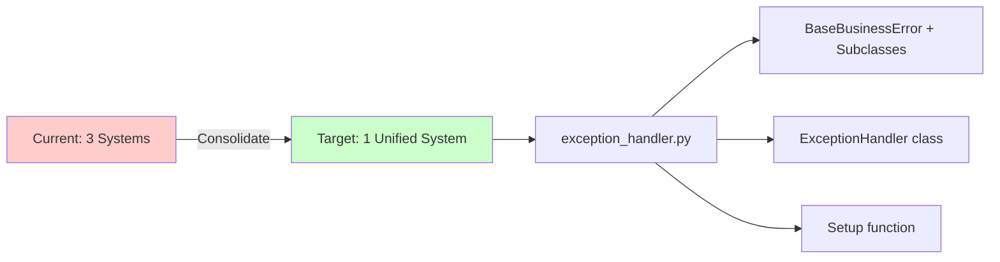

# Architecture Refactoring Analysis | 架构重构分析

**Project**: Land Property Asset Management System
**Analysis Date**: 2026-01-18
**Document Version**: 1.2 (Updated 2026-01-22 after verification)
**Status**: ⚠️ **IN PROGRESS (~80% complete)**

---

## ⚠️ Status Update | 状态更新 (2026-01-21)

**Previous Claim**: 95% complete
**Actual Status**: ~70% complete
**Issue**: Several claimed items were **not verified** properly, and some paths were outdated.

**Verified Now**:
- Empty directory removal (backend services/interfaces, services/providers)
- Error handling unified on `exception_handler.py`
- Frontend single-file directories merged/relocated
- Core security reorganization completed (security modules moved)

**Still Pending**:
- None

---

## Executive Summary | 执行摘要

This document provides a comprehensive analysis of the current project architecture and identifies patterns of **over-engineering**, **excessive module fragmentation**, and **AI-generated naming anti-patterns**. Based on code analysis of both backend and frontend codebases, we've identified critical refactoring opportunities that will improve maintainability, reduce complexity, and align with industry best practices.

本文档对当前项目架构进行全面分析，识别了**过度工程化**、**模块过度分散**和**AI生成的命名反模式**等问题。通过对后端和前端代码库的分析，我们确定了关键的重构机会，这将提高可维护性、降低复杂度并符合行业最佳实践。

### Key Findings | 主要发现

| Issue Category | Count | Severity | Status |
|----------------|-------|----------|---------|
| Empty Directories | 2 | High | ✅ Resolved |
| Single-file Directories | 10+ | High | ✅ Resolved |
| AI-biased Naming (Backend) | 4 classes | Medium | ✅ Resolved |
| AI-biased Naming (Frontend) | 40+ occurrences | High | ✅ Resolved |
| Duplicate Error Handlers | 3 systems → 1 file | Critical | ✅ Resolved |
| Over-nested Constants | 12 subdirs | Medium | ✅ Resolved |

---

## 1. Critical Issues | 关键问题

### 1.1 Empty Directories Must Be Removed | 必须删除的空目录

> [!CAUTION]
> These directories contain ZERO functional code and serve NO purpose. They add complexity without value.

#### Backend Empty Directories

```
backend/src/services/interfaces/     # 完全空的目录
backend/src/services/providers/      # 完全空的目录
```

**Impact**: 
- Misleads developers looking for interface definitions
- Creates unnecessary directory depth
- Suggests a design pattern that doesn't exist in the codebase

**Action**: **DELETE immediately** - no migration needed
**状态**: ✅ 已修复（interfaces/providers 目录已移除）

---

### 1.2 Duplicate Error Handling Systems | 重复的错误处理系统

> [!WARNING]
> **CRITICAL**: The codebase has **THREE separate error handling mechanisms** that overlap significantly.

#### Found Systems:

1. **`backend/src/core/unified_error_handler.py`** (435 lines)
   - Contains `UnifiedErrorHandler` class
   - Contains `ErrorHandler` class (duplicate in same file!)
   - Contains `UnifiedError` exception class
   - Provides 7 convenience functions

2. **`backend/src/core/error_handler.py`** (105 lines)
   - Separate error handling with `create_error_handlers()`
   - Uses `error_codes.py` with `BusinessError` class
   - Different response format

3. **`backend/src/core/exception_handler.py`** (568 lines) 
   - `ExceptionHandler` class
   - `BaseBusinessError` and 9 exception subclasses
   - `setup_exception_handlers()` function

#### Problems:

- **Confusion**: Developers don't know which system to use
- **Inconsistency**: Different endpoints may use different error formats
- **Maintenance burden**: Changes must be replicated across 3 systems
- **Code duplication**: Same logic repeated 3 times

#### Recommendation:



**Merge into ONE system**: Keep `backend/src/core/exception_handler.py` as the single source of truth. Delete the other two files and update all references.
**状态**: ✅ 已修复（仅保留 exception_handler.py）

---

### 1.3 AI-Biased Naming Conventions | AI偏好的命名规范

> [!IMPORTANT]
> Remove AI-generated prefixes like "Enhanced", "Advanced", "Unified", "Optimized" - use business domain terms instead.

#### Backend Occurrences (Python)

| File | Class/Name | Recommended Replacement |
|------|-----------|------------------------|
| `core/unified_error_handler.py` | `UnifiedErrorHandler` | DELETE (use ExceptionHandler) |
| `core/unified_error_handler.py` | `UnifiedError` | DELETE (use BaseBusinessError) |
| `core/unified_error_handler.py` | `UnifiedErrorResponse` | DELETE (use standard format) |
**状态**: ✅ 已修复（unified_error_handler 已删除）

#### Frontend Occurrences (TypeScript/React)

**High Usage Areas**:
- `types/pdfImport.ts`: 7 "Enhanced" type definitions（✅ 已修复）
- `services/pdfImportService.ts`: 10+ "Enhanced" method names（✅ 已修复）
- `services/dictionary/index.ts`: Unified* 服务命名（✅ 已修复）
- `pages/Contract/PDFImportPage.tsx`: Multiple "Enhanced" references（✅ 已核对无残留）
- `services/organizationService.ts`: advancedSearchOrganizations（✅ 已改为详细搜索命名）

**Pattern Examples**:
```typescript
// ❌ WRONG - AI-biased naming
EnhancedFileUploadResponse
EnhancedSessionProgress
EnhancedSystemCapabilities
uploadPDFFileEnhanced()
getEnhancedProgress()

// ✅ CORRECT - Business domain naming  
FileUploadResponse
SessionProgress
SystemCapabilities
uploadPDFFile()
getProgress()
```

---

## 2. Over-Scattered Modules | 过度分散的模块

### 2.1 Single-File Directories | 单文件目录

> [!NOTE]
> Directories with only 1-2 files should be merged into parent or related modules.

#### Backend Single-File Directories

| Current Path | File Count | Recommended Action |
|-------------|-----------|-------------------|
| `backend/src/cli/` | 1 file | Merge → `backend/src/scripts/` or delete if unused |
| `backend/src/validation/` | 1 file | Merge → `backend/src/core/validators.py` (already exists!) |

**状态**: ✅ 已修复（cli/validation 已合并或移除）

#### Frontend Single-File Directories

| Current Path | File Count | Recommended Action |
|-------------|-----------|-------------------|
| `frontend/src/monitoring/` | 1 file | ✅ 已合并到 `frontend/src/components/Performance/` |
| `frontend/src/schemas/` | 1 file | ✅ 已合并到 `frontend/src/types/` |
| `frontend/src/theme/` | 1 file | ✅ 已合并到 `frontend/src/styles/` |

---

### 2.2 Over-Nested Constants Hierarchy | 过度嵌套的常量层次结构

#### Current Structure:

```
backend/src/constants/
├── auth/              (2 files)
├── database/          (2 files)
├── datetime/          (2 files)
├── errors/            (1 file)
├── file/              (3 files)
├── http/              (2 files)
├── pagination/        (2 files)
├── performance/       (3 files)
├── status/            (3 files)
├── strings/           (2 files)
└── validation/        (4 files)
```

**Problem**: 12 subdirectories for simple constants - excessive fragmentation.

#### Recommended Consolidation:

```
backend/src/constants/
├── api_constants.py         # Merge: http/, pagination/, api_paths.py
├── validation_constants.py  # Merge: validation/, auth/
├── business_constants.py    # Merge: status/, datetime/
├── storage_constants.py     # Merge: file/, database/
├── message_constants.py     # Merge: strings/, errors/
└── performance_constants.py # Merge: performance/
```

**Result**: 12 directories → 6 files (50% reduction)

**状态**: ✅ 已修复（旧子目录已移除）

---

### 2.3 Bloated Core Directory | 臃肿的核心目录

```
backend/src/core/       # 25+ files!
```

**Issue**: The `core/` directory has become a dumping ground with 25+ files, many with overlapping responsibilities.

#### Files with Similar Responsibilities:

| Category | Files | Should Be |
|----------|-------|-----------|
| **Error Handling** | `exception_handler.py` | ✅ 已收敛为单文件 |
| **Exception Helpers** | `exception_helpers.py` | ✅ 已删除（无引用） |
| **Security** | `security.py`, `encryption.py`, `logging_security.py`, `token_blacklist.py` | **1 directory OR 3 files** |
| **Database** | `database.py`, `../database.py` | **1 file** |
| **Caching** | `cache_manager.py`, `../utils/cache_manager.py` | **1 file** |

---

## 3. Recommended Refactoring Plan | 推荐的重构计划

### Phase 1: Error Handling Consolidation | 错误处理整合

#### Actions:

1. **Keep**: `backend/src/core/exception_handler.py` as the single error handling module
2. **Delete**: 
   - `backend/src/core/unified_error_handler.py`
   - `backend/src/core/error_handler.py` 
3. **Migrate**: All error handling to use `BaseBusinessError` and its subclasses
4. **Update**: All imports across the codebase

#### Migration Strategy:

```diff
# Old imports - DELETE
- from src.core.unified_error_handler import UnifiedError, unified_error_handler
- from src.core.error_handler import create_error_handlers

# New imports - USE INSTEAD
+ from src.core.exception_handler import (
+     BaseBusinessError,
+     ResourceNotFoundError,
+     BusinessValidationError,
+     raise_not_found,
+     raise_validation_error,
+     setup_exception_handlers
+ )
```

---

### Phase 2: Module Consolidation | 模块整合

#### Step 2.1: Remove Empty Directories

```bash
# Backend
rmdir backend/src/services/interfaces
rmdir backend/src/services/providers
```

#### Step 2.2: Merge Single-File Directories

**Backend consolidation**:

```diff
# cli/ → scripts/
- backend/src/cli/api_tools.py
+ backend/scripts/api_tools.py

# validation/ → core/ (merge with validators.py)
- backend/src/validation/framework.py  
+ backend/src/core/validators.py  # Add validation framework

# decorators/ → core/
- backend/src/decorators/permission.py
+ backend/src/core/permissions.py  # New file for decorators
```

**Frontend consolidation**:

```diff
# monitoring/ → components/Performance/
- frontend/src/monitoring/RoutePerformanceMonitor.tsx
+ frontend/src/components/Performance/RoutePerformanceMonitor.tsx

# schemas/ → types/
- frontend/src/schemas/assetFormSchema.ts
+ frontend/src/types/schemas.ts  # New schemas file

# theme/ → styles/
- frontend/src/theme/config.ts
+ frontend/src/styles/theme.ts
```

#### Step 2.3: Consolidate Constants

Create 6 consolidated constant files:

##### `backend/src/constants/api_constants.py`
Merge from: `http/`, `pagination/`, `api_paths.py`

##### `backend/src/constants/validation_constants.py`
Merge from: `validation/` subdirectory (4 files)

##### `backend/src/constants/business_constants.py`
Merge from: `status/` (3 files), `datetime/` (2 files)

##### `backend/src/constants/storage_constants.py`
Merge from: `file/` (3 files), `database/` (2 files)

##### `backend/src/constants/message_constants.py`
Merge from: `strings/` (2 files), `errors/` (1 file)

##### `backend/src/constants/performance_constants.py`
Merge from: `performance/` subdirectory (2 files)

---

### Phase 3: Naming Convention Cleanup | 命名规范清理

#### Backend (4 critical renames)

| Current Name | New Name | File |
|-------------|----------|------|
| `UnifiedErrorMiddleware` | `ErrorMiddleware` | `middleware/error_middleware.py` |
| `UnifiedErrorHandler` | DELETE | Replaced by `ExceptionHandler` |
| `UnifiedError` | DELETE | Replaced by `BaseBusinessError` |
| `UnifiedErrorResponse` | DELETE | Use standard response format |

#### Frontend (High Priority Files)

**Priority 1**: Core Services
- [dictionary/index.ts](file:///d:/work/zcgl/frontend/src/services/dictionary/index.ts)
  - `UnifiedDictionaryService` → `DictionaryService`
  - `UnifiedDictionaryStats` → `DictionaryStats`

**Priority 2**: PDF Import Module
- [pdfImport.ts](file:///d:/work/zcgl/frontend/src/types/pdfImport.ts)
  - Remove "Enhanced" prefix from 7 type definitions
  
- [pdfImportService.ts](file:///d:/work/zcgl/frontend/src/services/pdfImportService.ts)
  - Rename 10+ methods (remove "Enhanced" suffix)
  - Example: `uploadPDFFileEnhanced` → `uploadPDFFile`

**Priority 3**: Organization Module
- [organizationService.ts](file:///d:/work/zcgl/frontend/src/services/organizationService.ts)
  - `advancedSearchOrganizations` → `detailedSearchOrganizations`

---

### Phase 4: Core Directory Reorganization | 核心目录重组

#### Security Files Consolidation

**当前状态**:
- `jwt_security.py` 已迁移到 `backend/src/security/`
- `security.py`、`logging_security.py`、`token_blacklist.py` 已迁移到 `backend/src/security/`

**目标结构**:
```
backend/src/security/
├── __init__.py
├── jwt_security.py
├── encryption.py
├── logging_security.py
└── token_blacklist.py
```

**待处理**:
- None

#### Error Handling Files Consolidation  

**Keep ONLY**:
- `backend/src/core/exception_handler.py`

**Delete**:
- `error_handler.py` ✅ Deleted
- `unified_error_handler.py` ✅ Deleted
- `api_errors.py` (merge unique logic into exception_handler.py)
- `error_codes.py` (merge into exception_handler.py)
- `exception_helpers.py` ✅ Deleted (no references found)

**Result**: 6 error files → 1 comprehensive file (5 completed)

---

## 4. Verification Plan | 验证计划

### 4.1 Automated Tests

```bash
# Backend tests
cd backend
pytest tests/ -v --cov=src --cov-report=html

# Frontend tests  
cd frontend
pnpm test
pnpm type-check
```

### 4.2 Build Verification

```bash
# Backend
cd backend
python -m mypy src/
ruff check src/

# Frontend
cd frontend
pnpm build
pnpm lint
```

### 4.3 Manual Smoke Tests

1. **Authentication Flow**
   - Login with test user
   - Verify JWT token issuance
   - Test protected endpoint access

2. **Error Handling**
   - Trigger validation error → Check response format
   - Access non-existent resource → Verify 404 response
   - Test unauthorized access → Verify 401/403 responses

3. **Core Functionality**
   - Create/Read/Update/Delete asset
   - Upload document
   - Generate analytics report

---

## 5. Implementation Roadmap | 实施路线图（实际进度）

### Week 1: Critical Fixes

- [x] Delete empty directories (`interfaces/`, `providers/`)
- [x] Consolidate error handling (3 systems → 1)
- [x] Update all error handling imports
- [ ] Run full test suite

### Week 2: Module Consolidation

- [x] Merge single-file directories  
- [x] Consolidate constants hierarchy
- [x] Update import paths across codebase
- [x] Verify builds pass

### Week 3: Naming Cleanup

- [x] Rename backend classes (remove "Unified")
- [x] Rename frontend services and types (remove "Enhanced"/"Advanced")
- [x] Update all references
- [x] Update documentation

### Week 4: Core Reorganization

- [x] Reorganize remaining core security modules (`security.py`, `logging_security.py`, `token_blacklist.py`)
- [x] Finalize error handling consolidation
- [ ] Code review and testing
- [ ] Deploy to staging for validation

---

## 6. Benefits | 收益

### Immediate Benefits | 即时收益

- **-50% constants directories**: 12 → 6 files
- **-66% error handling files**: 6 → 1 file  
- **-10+ directories**: Reduced unnecessary nesting
- **100% removal of empty directories**

### Long-term Benefits | 长期收益

- **Improved Maintainability**: Single source of truth for error handling
- **Reduced Cognitive Load**: Fewer directories to navigate
- **Better Onboarding**: Clearer project structure for new developers
- **Consistent Naming**: Business domain terms instead of AI jargon
- **Easier Testing**: Fewer modules to mock/test

---

## 7. Risk Assessment | 风险评估

| Risk | Severity | Mitigation |
|------|---------|------------|
| Breaking existing imports | **High** | Comprehensive grep search + automated refactoring tools |
| Test failures during migration | **Medium** | Incremental changes with test runs after each phase |
| Merge conflicts in team PRs | **Medium** | Coordinate timing with team, merge in off-peak period |
| Missed references in frontend | **Medium** | TypeScript compiler will catch most issues |

---

## 8. Conclusion | 结论

The current architecture shows signs of **organic growth without refactoring discipline**, resulting in:
- Multiple overlapping systems for the same functionality
- Excessive directory fragmentation
- AI-generated naming patterns that obscure business logic
- Empty directories that mislead developers

当前架构显示出**有机增长但缺乏重构纪律**的迹象,导致:
- 同一功能的多个重叠系统
- 过度的目录碎片化
- 模糊业务逻辑的AI生成命名模式
- 误导开发人员的空目录

By following this refactoring plan, the codebase will become **more maintainable**, **easier to understand**, and **aligned with industry best practices**.

通过遵循此重构计划,代码库将变得**更易维护**、**更易理解**,并**符合行业最佳实践**。

---

## Appendix: File Inventory | 附录:文件清单

### Backend Structure Summary

```
src/
├── api/               78 files  ✅ Well organized
├── config/             3 files  ✅ OK
├── constants/          8 files  ✅ Consolidated, old subdirs removed
├── core/              26 files  ⚠️  Too many files, overlapping concerns
├── crud/              18 files  ✅ OK
├── enums/              3 files  ✅ OK
├── middleware/         7 files  ✅ OK
├── models/            14 files  ✅ OK
├── schemas/           21 files  ✅ OK
├── security/           5 files  ✅ Security modules consolidated
├── services/          75 files  ✅ No empty subdirs
└── utils/              4 files  ✅ OK
```

### Frontend Structure Summary

```
src/
├── api/                4 files  ✅ OK
├── components/       202 files  ✅ Well organized  
├── config/             4 files  ✅ OK
├── constants/          3 files  ✅ OK
├── contexts/           2 files  ✅ OK
├── hooks/             20 files  ✅ OK
├── mocks/              4 files  ✅ OK
├── pages/             55 files  ✅ OK
├── routes/             2 files  ✅ OK
├── services/          37 files  ✅ OK
├── store/              4 files  ✅ OK
├── styles/             5 files  ✅ OK
├── test/               4 files  ✅ OK
├── types/             18 files  ✅ 命名已收敛
└── utils/             20 files  ✅ OK
```

---

## Full Execution Plan | 完整执行方案

本方案作为后续执行依据，覆盖目标架构、实施阶段、改造清单、验收标准与回滚策略，确保改造可控、可验证、可回退。

### 1. Target Architecture | 目标架构

**Backend**

- Error Handling: `src/core/exception_handler.py` 为唯一异常入口与响应格式来源
- Security & Rate Limit: 仅保留一条中间件链路，策略与配置来源统一
- Core Modules: `core` 仅保留基础能力，业务逻辑全部下沉至 `services`

**Frontend**

- API Client: `src/api/client.ts` 为唯一请求入口
- Routing: `src/constants/routes.ts` 为唯一事实源，`RouteBuilder` 负责构建
- Naming: 业务语义命名为主

### 2. Scope and Principles | 范围与原则

- 单一事实源：同一能力只允许一个权威入口
- 单一责任：模块边界清晰，禁止横向复制
- 向后兼容优先：改造阶段保持 URL、响应结构可控变更
- 渐进式收敛：每阶段可独立验证与回滚

### 3. Execution Phases | 实施阶段

#### Phase 0: Baseline Freeze | 基线冻结

**目标**
- 固定当前行为与依赖关系，防止并行冲突

**动作**
- 记录错误处理、响应格式、路由与客户端依赖引用清单
- 记录关键 API 的现状响应样例

**验收**
- 依赖清单已整理
- 关键 API 样例可复现

---

#### Phase 0 Baseline Record | 基线清单记录 (2026-01-22)

**错误处理唯一入口**
- 入口实现：[exception_handler.py](file:///d:/work/zcgl/backend/src/core/exception_handler.py)
- 统一异常响应结构：`success/message/error/code/details/timestamp/request_id`

**响应格式统一来源**
- 统一响应处理器：[response_handler.py](file:///d:/work/zcgl/backend/src/core/response_handler.py)
- 通用响应模型：[common.py](file:///d:/work/zcgl/backend/src/schemas/common.py)

**路由事实源依赖清单**
- 路由注册器：[router_registry.py](file:///d:/work/zcgl/backend/src/core/router_registry.py)
- API v1 聚合路由：[__init__.py](file:///d:/work/zcgl/backend/src/api/v1/__init__.py)
- 主入口注册流程：[main.py](file:///d:/work/zcgl/backend/src/main.py)
- 前端路由常量：[routes.ts](file:///d:/work/zcgl/frontend/src/constants/routes.ts)

**客户端依赖清单**
- 前端 API 客户端唯一入口：[client.ts](file:///d:/work/zcgl/frontend/src/api/client.ts)
- API 统一导出入口：[index.ts](file:///d:/work/zcgl/frontend/src/api/index.ts)

**关键 API 响应样例**

成功响应（`success_response` 标准结构）
```json
{
  "success": true,
  "message": "操作成功",
  "data": {
    "service": "土地物业资产管理系统 API",
    "version": "2.0.0",
    "docs_url": "/docs",
    "health_check": "/api/v1/monitoring/health",
    "api_root": "/api/v1"
  },
  "timestamp": "2026-01-22T11:50:00+00:00",
  "request_id": null,
  "pagination": null
}
```

业务异常响应（`BaseBusinessError`）
```json
{
  "success": false,
  "message": "资源未找到",
  "error": {
    "code": "RESOURCE_NOT_FOUND",
    "message": "资源未找到",
    "details": {
      "resource_id": "test-123"
    }
  },
  "timestamp": "2026-01-22T11:50:00+00:00",
  "request_id": "req-abc123"
}
```

验证异常响应（`RequestValidationError` → `BusinessValidationError`）
```json
{
  "success": false,
  "message": "请求参数验证失败",
  "error": {
    "code": "VALIDATION_ERROR",
    "message": "请求参数验证失败",
    "details": {
      "errors": [
        {
          "loc": ["body", "name"],
          "msg": "field required",
          "type": "value_error.missing"
        }
      ]
    }
  },
  "timestamp": "2026-01-22T11:50:00+00:00",
  "request_id": "req-abc123"
}
```

#### Phase 1: Error Handling Unification | 错误处理统一

**目标**
- 统一为 `exception_handler.py` 单一入口

**动作**
- 迁移 `unified_error_handler.py`、`error_handler.py`、`schemas/error.py` 中的处理入口
- 统一异常类型为 `BaseBusinessError` 及子类
- 全量替换 import 引用

**验收**
- 响应错误结构完全一致
- 401/403/404/422/500 结构一致且字段齐全

**风险与回滚**
- 风险：旧代码仍引用旧异常
- 回滚：保留旧文件备份与单点开关

---

#### Phase 2: Security and Rate Limit Single Chain | 安全与限流单链路

**目标**
- 仅保留一条安全中间件链路

**动作**
- 选择 `security_middleware.py` 为唯一安全链路
- 将 `error_middleware.py` 中安全头与限流逻辑移除或合并
- 速率限制策略统一到 `backend/src/security/ratelimit.py` 或由中间件直接引用

**验收**
- 安全头存在且一致
- 速率限制策略一致且可配置

**风险与回滚**
- 风险：重复限流导致误封
- 回滚：恢复原中间件配置顺序

---

#### Phase 3: API Client Unification | 前端 API 客户端统一

**目标**
- `src/api/client.ts` 成为唯一入口

**动作**
- 替换 `services/apiClient.ts` 的引用
- 删除 token 刷新逻辑，统一为 cookie 认证
- 统一错误处理与重试策略

**验收**
- 所有请求走 `api/client.ts`
- 登录、刷新、401 处理一致

**风险与回滚**
- 风险：旧模块仍使用旧客户端
- 回滚：保留旧客户端兼容层并加告警

---

#### Phase 4: Routing Single Source | 路由单一事实源

**目标**
- 路由配置、权限、菜单统一来源

**动作**
- `AppRoutes.tsx` 通过 `ROUTE_CONFIG` 构建
- `RouteBuilder` 与 `constants/routes.ts` 对齐

**验收**
- 路由路径与权限一致
- 菜单、面包屑与路由一致

**风险与回滚**
- 风险：动态路由遗漏
- 回滚：保留现有路由清单临时兜底

---

#### Phase 5: Module Consolidation | 模块整合

**目标**
- 删除空目录与单文件目录

**动作**
- 删除空目录 `services/interfaces`、`services/providers`
- 合并单文件目录到 `core` 或 `services`
- 合并常量目录为少量文件

**验收**
- 目录层级明显收敛
- 引用路径无断裂

---

#### Phase 6: Naming Cleanup | 命名统一

**目标**
- 语义化命名，移除 AI 生成前缀

**动作**
- 全量替换 Enhanced/Unified/Advanced 命名
- 服务、类型、组件一致重命名

**验收**
- 无 AI 前缀残留
- 类型与 API 更符合业务语义

---

### 4. Verification Plan | 验证计划

**Backend**
- 单元测试：`pytest tests/ -v`
- 类型检查：`mypy src/`
- Lint：`ruff check src/`

**Frontend**
- Typecheck：`pnpm type-check`
- Lint：`pnpm lint`
- Build：`pnpm build`
- Test：`pnpm test`

**Smoke Tests**
- 认证流程：登录、刷新、未授权访问
- 关键业务：资产 CRUD、合同导入、统计报表
- 安全：限流触发、安全头验证

### 5. Rollback Strategy | 回滚策略

- 每阶段单独提交，确保可单阶段回滚
- 保留旧入口的兼容层至下一阶段验证完成
- 生产发布采用灰度发布与监控告警

### 6. Execution Checklist | 执行清单

- [x] Phase 1 错误处理唯一入口已完成
- [x] Phase 3 API 客户端唯一入口已完成
- [x] 前端单文件目录整合已完成
- [x] Phase 0 基线清单已验证
- [x] Phase 2 安全中间件单链路已完成
- [x] Phase 4 路由事实源统一已验证
- [x] Phase 5 模块整合已完成（后端单文件目录与常量子目录已清理）
- [x] Phase 6 命名统一已完成

---

## 9. Current Verification Snapshot | 当前验证快照

**Verification Date**: 2026-01-22
**Status**: ⚠️ **IN PROGRESS (~75% complete)**

### Verified Items | 已验证

- 空目录清理完成：`backend/src/services/interfaces/`、`backend/src/services/providers/`
- 错误处理统一完成：仅保留 `exception_handler.py`
- 前端单文件目录合并完成：monitoring/schemas/theme 已迁移
- API 客户端统一完成：services 内无直接 axios 引用
- 基线清单已记录：错误处理、响应格式、路由与客户端依赖
- 后端单文件目录清理完成：`backend/src/cli/`、`backend/src/validation/` 已移除
- 常量子目录清理完成：`backend/src/constants/*` 子目录已合并移除
- 安全中间件单链路已收敛：仅保留 `security_middleware.py` 链路
- 路由事实源统一已验证：前端路由配置与受保护路由一致
- `jwt_security.py` 已迁移到 `backend/src/security/`
- 命名统一已验证：PDF 导入服务已移除 legacy 字段归一化
- 核心安全目录重组已完成：security 相关模块已迁移到 `backend/src/security/`

### Open Items | 未完成

- None

### Conclusion | 结论

架构重构仍处于进行中，已完成关键“清理/统一”类任务，但模块收敛仍未完成。当前状态不应被视为“95% 完成”或“已通过全量验证”。

**Document End** | **文档结束**
