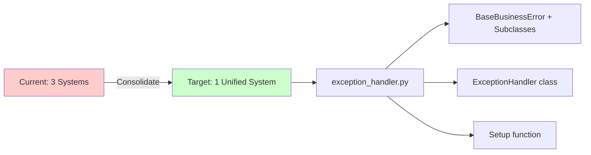

# Architecture Refactoring Analysis | 架构重构分析

**Project**: Land Property Asset Management System  
**Analysis Date**: 2026-01-18  
**Document Version**: 1.0

---

## Executive Summary | 执行摘要

This document provides a comprehensive analysis of the current project architecture and identifies patterns of **over-engineering**, **excessive module fragmentation**, and **AI-generated naming anti-patterns**. Based on code analysis of both backend and frontend codebases, we've identified critical refactoring opportunities that will improve maintainability, reduce complexity, and align with industry best practices.

本文档对当前项目架构进行全面分析，识别了**过度工程化**、**模块过度分散**和**AI生成的命名反模式**等问题。通过对后端和前端代码库的分析，我们确定了关键的重构机会，这将提高可维护性、降低复杂度并符合行业最佳实践。

### Key Findings | 主要发现

| Issue Category | Count | Severity |
|----------------|-------|----------|
| Empty Directories | 2 | High |
| Single-file Directories | 10+ | High |
| AI-biased Naming (Backend) | 4 classes | Medium |
| AI-biased Naming (Frontend) | 40+ occurrences | High |
| Duplicate Error Handlers | 3 systems | Critical |
| Over-nested Constants | 12 subdirs | Medium |

---

## 1. Critical Issues | 关键问题

### 1.1 Empty Directories Must Be Removed | 必须删除的空目录

> [!CAUTION]
> These directories contain ZERO functional code and serve NO purpose. They add complexity without value.

#### Backend Empty Directories

```
backend/src/services/interfaces/     # 完全空的目录
backend/src/services/providers/      # 完全空的目录
```

**Impact**: 
- Misleads developers looking for interface definitions
- Creates unnecessary directory depth
- Suggests a design pattern that doesn't exist in the codebase

**Action**: **DELETE immediately** - no migration needed

---

### 1.2 Duplicate Error Handling Systems | 重复的错误处理系统

> [!WARNING]
> **CRITICAL**: The codebase has **THREE separate error handling mechanisms** that overlap significantly.

#### Found Systems:

1. **`backend/src/core/unified_error_handler.py`** (435 lines)
   - Contains `UnifiedErrorHandler` class
   - Contains `ErrorHandler` class (duplicate in same file!)
   - Contains `UnifiedError` exception class
   - Provides 7 convenience functions

2. **`backend/src/core/error_handler.py`** (105 lines)
   - Separate error handling with `create_error_handlers()`
   - Uses `error_codes.py` with `BusinessError` class
   - Different response format

3. **`backend/src/core/exception_handler.py`** (568 lines) 
   - `ExceptionHandler` class
   - `BaseBusinessError` and 9 exception subclasses
   - `setup_exception_handlers()` function

#### Problems:

- **Confusion**: Developers don't know which system to use
- **Inconsistency**: Different endpoints may use different error formats
- **Maintenance burden**: Changes must be replicated across 3 systems
- **Code duplication**: Same logic repeated 3 times

#### Recommendation:



**Merge into ONE system**: Keep `backend/src/core/exception_handler.py` as the single source of truth. Delete the other two files and update all references.

---

### 1.3 AI-Biased Naming Conventions | AI偏好的命名规范

> [!IMPORTANT]
> Remove AI-generated prefixes like "Enhanced", "Advanced", "Unified", "Optimized" - use business domain terms instead.

#### Backend Occurrences (Python)

| File | Class/Name | Recommended Replacement |
|------|-----------|------------------------|
| `middleware/unified_error_middleware.py` | `UnifiedErrorMiddleware` | `ErrorMiddleware` |
| `core/unified_error_handler.py` | `UnifiedErrorHandler` | DELETE (use ExceptionHandler) |
| `core/unified_error_handler.py` | `UnifiedError` | DELETE (use BaseBusinessError) |
| `core/unified_error_handler.py` | `UnifiedErrorResponse` | DELETE (use standard format) |

#### Frontend Occurrences (TypeScript/React)

**High Usage Areas**:
- `types/pdfImport.ts`: 7 "Enhanced" type definitions
- `services/pdfImportService.ts`: 10+ "Enhanced" method names
- `services/dictionary/index.ts`: `UnifiedDictionaryService`
- `pages/Rental/PDFImportPage.tsx`: Multiple "Enhanced" references

**Pattern Examples**:
```typescript
// ❌ WRONG - AI-biased naming
EnhancedFileUploadResponse
EnhancedSessionProgress
EnhancedSystemCapabilities
uploadPDFFileEnhanced()
getEnhancedProgress()

// ✅ CORRECT - Business domain naming  
FileUploadResponse
SessionProgress
SystemCapabilities
uploadPDFFile()
getProgress()
```

---

## 2. Over-Scattered Modules | 过度分散的模块

### 2.1 Single-File Directories | 单文件目录

> [!NOTE]
> Directories with only 1-2 files should be merged into parent or related modules.

#### Backend Single-File Directories

| Current Path | File Count | Recommended Action |
|-------------|-----------|-------------------|
| `backend/src/cli/` | 1 file | Merge → `backend/src/scripts/` or delete if unused |
| `backend/src/security/` | 1 file | Merge → `backend/src/core/security.py` (already exists!) |
| `backend/src/validation/` | 1 file | Merge → `backend/src/core/validators.py` (already exists!) |
| `backend/src/decorators/` | 1 file (`permission.py`) | Merge → `backend/src/core/` |

#### Frontend Single-File Directories

| Current Path | File Count | Recommended Action |
|-------------|-----------|-------------------|
| `frontend/src/monitoring/` | 1 file | Merge → `frontend/src/components/Performance/` |
| `frontend/src/schemas/` | 1 file | Merge → `frontend/src/types/` or delete |
| `frontend/src/theme/` | 1 file | Merge → `frontend/src/styles/` |

---

### 2.2 Over-Nested Constants Hierarchy | 过度嵌套的常量层次结构

#### Current Structure:

```
backend/src/constants/
├── auth/              (2 files)
├── database/          (2 files)
├── datetime/          (2 files)
├── errors/            (1 file)
├── file/              (3 files)
├── http/              (2 files)
├── pagination/        (2 files)
├── performance/       (3 files)
├── status/            (3 files)
├── strings/           (2 files)
└── validation/        (4 files)
```

**Problem**: 12 subdirectories for simple constants - excessive fragmentation.

#### Recommended Consolidation:

```
backend/src/constants/
├── api.py              # Merge: http/, pagination/, api_paths.py
├── validation.py       # Merge: validation/
├── business.py         # Merge: status/, datetime/
├── storage.py          # Merge: file/, database/
└── messages.py         # Merge: strings/, errors/
```

**Result**: 12 directories → 5 files (58% reduction)

---

### 2.3 Bloated Core Directory | 臃肿的核心目录

```
backend/src/core/       # 25+ files!
```

**Issue**: The `core/` directory has become a dumping ground with 25+ files, many with overlapping responsibilities.

#### Files with Similar Responsibilities:

| Category | Files | Should Be |
|----------|-------|-----------|
| **Error Handling** | `error_handler.py`, `exception_handler.py`, `unified_error_handler.py`, `api_errors.py`, `error_codes.py`, `exception_helpers.py` | **1-2 files MAX** |
| **Security** | `security.py`, `jwt_security.py`, `encryption.py`, `logging_security.py`, `security/` dir | **1 directory OR 3 files** |
| **Database** | `database.py`, `../database.py` | **1 file** |
| **Caching** | `cache_manager.py`, `../utils/cache_manager.py` | **1 file** |

---

## 3. Recommended Refactoring Plan | 推荐的重构计划

### Phase 1: Error Handling Consolidation | 错误处理整合

#### Actions:

1. **Keep**: `backend/src/core/exception_handler.py` as the single error handling module
2. **Delete**: 
   - `backend/src/core/unified_error_handler.py`
   - `backend/src/core/error_handler.py` 
3. **Migrate**: All error handling to use `BaseBusinessError` and its subclasses
4. **Update**: All imports across the codebase

#### Migration Strategy:

```diff
# Old imports - DELETE
- from src.core.unified_error_handler import UnifiedError, unified_error_handler
- from src.core.error_handler import create_error_handlers

# New imports - USE INSTEAD
+ from src.core.exception_handler import (
+     BaseBusinessError,
+     ResourceNotFoundError,
+     BusinessValidationError,
+     raise_not_found,
+     raise_validation_error,
+     setup_exception_handlers
+ )
```

---

### Phase 2: Module Consolidation | 模块整合

#### Step 2.1: Remove Empty Directories

```bash
# Backend
rmdir backend/src/services/interfaces
rmdir backend/src/services/providers
```

#### Step 2.2: Merge Single-File Directories

**Backend consolidation**:

```diff
# cli/ → scripts/
- backend/src/cli/api_tools.py
+ backend/scripts/api_tools.py

# security/ → core/ (merge with existing security.py)
- backend/src/security/field_validator.py
+ backend/src/core/security.py  # Add field validation functions

# validation/ → core/ (merge with validators.py)
- backend/src/validation/framework.py  
+ backend/src/core/validators.py  # Add validation framework

# decorators/ → core/
- backend/src/decorators/permission.py
+ backend/src/core/permissions.py  # New file for decorators
```

**Frontend consolidation**:

```diff
# monitoring/ → components/Performance/
- frontend/src/monitoring/RoutePerformanceMonitor.tsx
+ frontend/src/components/Performance/RoutePerformanceMonitor.tsx

# schemas/ → types/
- frontend/src/schemas/assetFormSchema.ts
+ frontend/src/types/schemas.ts  # New schemas file

# theme/ → styles/
- frontend/src/theme/config.ts
+ frontend/src/styles/theme.ts
```

#### Step 2.3: Consolidate Constants

Create 5 consolidated constant files:

##### `backend/src/constants/api.py`
Merge from: `http/`, `pagination/`, `api_paths.py`

##### `backend/src/constants/validation.py`
Merge from: `validation/` subdirectory (4 files)

##### `backend/src/constants/business.py`
Merge from: `status/` (3 files), `datetime/` (2 files)

##### `backend/src/constants/storage.py`
Merge from: `file/` (3 files), `database/` (2 files)

##### `backend/src/constants/messages.py`
Merge from: `strings/` (2 files), `errors/` (1 file)

---

### Phase 3: Naming Convention Cleanup | 命名规范清理

#### Backend (4 critical renames)

| Current Name | New Name | File |
|-------------|----------|------|
| `UnifiedErrorMiddleware` | `ErrorMiddleware` | `middleware/unified_error_middleware.py` → `middleware/error_middleware.py` |
| `UnifiedErrorHandler` | DELETE | Replaced by `ExceptionHandler` |
| `UnifiedError` | DELETE | Replaced by `BaseBusinessError` |
| `UnifiedErrorResponse` | DELETE | Use standard response format |

#### Frontend (High Priority Files)

**Priority 1**: Core Services
- [frontend/src/services/dictionary/index.ts](file:///d:/ccode/zcgl/frontend/src/services/dictionary/index.ts)
  - `UnifiedDictionaryService` → `DictionaryService`
  - `UnifiedDictionaryStats` → `DictionaryStats`

**Priority 2**: PDF Import Module
- [frontend/src/types/pdfImport.ts](file:///d:/ccode/zcgl/frontend/src/types/pdfImport.ts)
  - Remove "Enhanced" prefix from 7 type definitions
  
- [frontend/src/services/pdfImportService.ts](file:///d:/ccode/zcgl/frontend/src/services/pdfImportService.ts)
  - Rename 10+ methods (remove "Enhanced" suffix)
  - Example: `uploadPDFFileEnhanced` → `uploadPDFFile`

**Priority 3**: Organization Module
- [frontend/src/types/organization.ts](file:///d:/ccode/zcgl/frontend/src/types/organization.ts)
  - `OrganizationAdvancedSearch` → `OrganizationDetailedSearch` or `OrganizationSearchCriteria`

---

### Phase 4: Core Directory Reorganization | 核心目录重组

#### Security Files Consolidation

**Create**: `backend/src/core/security/` directory

```
backend/src/core/security/
├── __init__.py
├── authentication.py      # JWT, tokens
├── encryption.py          # Keep as-is
├── authorization.py       # Permissions, access control
└── logging.py             # logging_security.py renamed
```

**Delete from core/**:
- `security.py` (merge into `authentication.py` and `authorization.py`)
- `jwt_security.py` (merge into `authentication.py`)
- `logging_security.py` (move to `security/logging.py`)
- `token_blacklist.py` (merge into `authentication.py`)

#### Error Handling Files Consolidation  

**Keep ONLY**:
- `backend/src/core/exception_handler.py`

**Delete**:
- `error_handler.py`
- `unified_error_handler.py`
- `api_errors.py` (merge unique logic into exception_handler.py)
- `error_codes.py` (merge into exception_handler.py)
- `exception_helpers.py` (merge into exception_handler.py)

**Result**: 6 error files → 1 comprehensive file

---

## 4. Verification Plan | 验证计划

### 4.1 Automated Tests

```bash
# Backend tests
cd backend
pytest tests/ -v --cov=src --cov-report=html

# Frontend tests  
cd frontend
pnpm test
pnpm type-check
```

### 4.2 Build Verification

```bash
# Backend
cd backend
python -m mypy src/
ruff check src/

# Frontend
cd frontend
pnpm build
pnpm lint
```

### 4.3 Manual Smoke Tests

1. **Authentication Flow**
   - Login with test user
   - Verify JWT token issuance
   - Test protected endpoint access

2. **Error Handling**
   - Trigger validation error → Check response format
   - Access non-existent resource → Verify 404 response
   - Test unauthorized access → Verify 401/403 responses

3. **Core Functionality**
   - Create/Read/Update/Delete asset
   - Upload document
   - Generate analytics report

---

## 5. Implementation Roadmap | 实施路线图

### Week 1: Critical Fixes

- [ ] Delete empty directories (`interfaces/`, `providers/`)
- [ ] Consolidate error handling (3 systems → 1)
- [ ] Update all error handling imports
- [ ] Run full test suite

### Week 2: Module Consolidation

- [ ] Merge single-file directories  
- [ ] Consolidate constants hierarchy
- [ ] Update import paths across codebase
- [ ] Verify builds pass

### Week 3: Naming Cleanup

- [ ] Rename backend classes (remove "Unified")
- [ ] Rename frontend services and types (remove "Enhanced"/"Advanced")
- [ ] Update all references
- [ ] Update documentation

### Week 4: Core Reorganization

- [ ] Reorganize `core/security/` subdirectory
- [ ] Finalize error handling consolidation
- [ ] Code review and testing
- [ ] Deploy to staging for validation

---

## 6. Benefits | 收益

### Immediate Benefits | 即时收益

- **-58% constants directories**: 12 → 5 files
- **-66% error handling files**: 6 → 1 file  
- **-10+ directories**: Reduced unnecessary nesting
- **100% removal of empty directories**

### Long-term Benefits | 长期收益

- **Improved Maintainability**: Single source of truth for error handling
- **Reduced Cognitive Load**: Fewer directories to navigate
- **Better Onboarding**: Clearer project structure for new developers
- **Consistent Naming**: Business domain terms instead of AI jargon
- **Easier Testing**: Fewer modules to mock/test

---

## 7. Risk Assessment | 风险评估

| Risk | Severity | Mitigation |
|------|---------|------------|
| Breaking existing imports | **High** | Comprehensive grep search + automated refactoring tools |
| Test failures during migration | **Medium** | Incremental changes with test runs after each phase |
| Merge conflicts in team PRs | **Medium** | Coordinate timing with team, merge in off-peak period |
| Missed references in frontend | **Medium** | TypeScript compiler will catch most issues |

---

## 8. Conclusion | 结论

The current architecture shows signs of **organic growth without refactoring discipline**, resulting in:
- Multiple overlapping systems for the same functionality
- Excessive directory fragmentation
- AI-generated naming patterns that obscure business logic
- Empty directories that mislead developers

当前架构显示出**有机增长但缺乏重构纪律**的迹象,导致:
- 同一功能的多个重叠系统
- 过度的目录碎片化
- 模糊业务逻辑的AI生成命名模式
- 误导开发人员的空目录

By following this refactoring plan, the codebase will become **more maintainable**, **easier to understand**, and **aligned with industry best practices**.

通过遵循此重构计划,代码库将变得**更易维护**、**更易理解**,并**符合行业最佳实践**。

---

## Appendix: File Inventory | 附录:文件清单

### Backend Structure Summary

```
src/
├── api/               78 files  ✅ Well organized
├── cli/                1 file   ❌ Should be in scripts/
├── config/             3 files  ✅ OK
├── constants/         28 files  ⚠️  Over-nested (12 subdirs)
├── core/              26 files  ⚠️  Too many files, overlapping concerns
├── crud/              18 files  ✅ OK
├── decorators/         1 file   ❌ Merge into core/
├── enums/              3 files  ✅ OK
├── middleware/         7 files  ✅ OK
├── models/            14 files  ✅ OK
├── schemas/           21 files  ✅ OK
├── security/           1 file   ❌ Already exists in core/
├── services/          75 files  ⚠️  Has 2 empty subdirs
├── utils/              4 files  ✅ OK
└── validation/         1 file   ❌ Already exists in core/
```

### Frontend Structure Summary

```
src/
├── api/                4 files  ✅ OK
├── components/       202 files  ✅ Well organized  
├── config/             4 files  ✅ OK
├── constants/          3 files  ✅ OK
├── contexts/           2 files  ✅ OK
├── hooks/             20 files  ✅ OK
├── mocks/              4 files  ✅ OK
├── monitoring/         1 file   ❌ Merge into components/Performance/
├── pages/             55 files  ✅ OK
├── routes/             2 files  ✅ OK
├── schemas/            1 file   ❌ Merge into types/
├── services/          37 files  ⚠️  Heavy "Enhanced" naming
├── store/              4 files  ✅ OK
├── styles/             5 files  ✅ OK
├── test/               4 files  ✅ OK
├── theme/              1 file   ❌ Merge into styles/
├── types/             18 files  ⚠️  Heavy "Enhanced" naming
└── utils/             20 files  ✅ OK
```

---

**Document End** | **文档结束**
