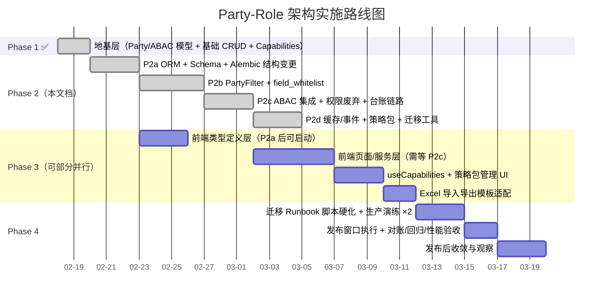
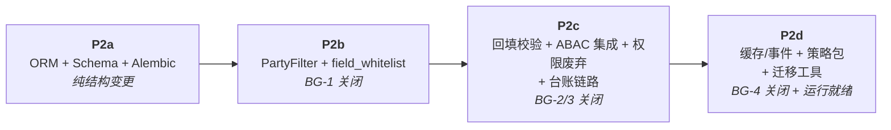

# Phase 2 实施计划：业务域模型迁移 + 数据隔离切换 + 权限服务废弃

**文档类型**: 实施计划  
**创建日期**: 2026-02-19  
**最新更新**: 2026-02-22（v1.14 对齐版）  
**上游依赖**: [Party-Role 架构设计 v3.9](./2026-02-16-party-role-architecture-design.md) / [Phase 1 v1.6](./2026-02-18-phase1-implementation-plan.md)  
**阶段定位**: Phase 1 地基之上的业务域全量改造。**破坏性变更阶段**——改动业务域模型字段、替换数据隔离层、废弃旧权限服务。前端变更不在本期（Phase 3）。

> 文档定位：历史实施计划（非需求权威基线）。  
> 文中“唯一来源/唯一约束”等表述仅限本实施计划内部，不作为全局需求裁决依据。  
> 需求权威入口：`docs/requirements-specification.md`

---

## 0. 全局路线图（4 阶段）



### 各阶段概览

| 阶段 | 核心目标 | 预估文件量 | 状态 |
|---|---|---|---|
| **Phase 1** ✅ | 地基层：Party/ABAC ORM + 基础 CRUD/Schema/Service + Capabilities 端点 + Alembic 迁移 | ~20 新增 | **已完成** |
| **Phase 2**（本文档） | 后端业务域全量改造：字段替换 + TenantFilter→PartyFilter + 权限废弃 + ABAC 集成 + 缓存/事件 + 迁移工具骨架 | ~26 新增 / ~130+ 修改（源码） | **已完成（代码就绪）** |
| **Phase 3** | 前端全量迁移：类型/服务/页面（51+ 文件）+ `usePermission`→`useCapabilities` + 策略包管理 UI + Excel 模板适配 | ~10 新增 / ~51 修改 | 未开始 |
| **Phase 4** | 发布就绪：迁移 Runbook 硬化 + 生产演练 ≥2 次 + 发布窗口执行 + 对账/回归/性能验收 + 发布后收敛 | ~5 新增 / ~10 修改 | 未开始 |

### Phase 2 执行快照（2026-02-22）

| 子阶段 | 状态 | 备注 |
|---|---|---|
| P2a ORM + Schema + Alembic | 已完成 | 新列与双列兼容落地，Phase 4 再做删列 |
| P2b PartyFilter + whitelist | 已完成 | `TenantFilter` 零引用，BG-1 通过 |
| P2c ABAC 集成 + 权限废弃 | 已完成 | 运行时废弃链路收口，BG-2/BG-3 通过 |
| P2d 缓存/事件 + 策略包 + 迁移工具 | 已完成 | `cache/events/policy package/data_policies/party_migration` 已落地，BG-4 通过 |

> [!NOTE]
> 当前口径为“代码就绪”；旧列物理删除、约束收紧和发布窗口执行仍在 Phase 4。

### Phase 2-3 并行规则

> [!IMPORTANT]
> Phase 3 与 Phase 2 的并行**仅限类型定义层**（`frontend/src/types/`、`frontend/src/schemas/`），可在 **P2a 完成后**启动。  
> 前端**页面层和服务层**必须等 **P2c**（ABAC 集成 + PartyFilter）完成后才能开始，因为需要依赖后端新接口契约。  
> Phase 4 必须在 Phase 2 + Phase 3 **全部完成**后方可进入。

---

## 1. Phase 1 → Phase 2 衔接

Phase 1 交付物（已完成）：
- ORM 模型：`party.py`, `party_role.py`, `user_party_binding.py`, `project_asset.py`, `certificate_party_relation.py`, `abac.py`
- CRUD：`party.py`, `authz.py`
- Schema：`party.py`, `authz.py`
- Service：`authz/`（engine + context_builder + service）、`party/`（service）
- API：`authz.py`（`POST /api/v1/authz/check`）、`party.py`（CRUD 端点）、capabilities（`GET /api/v1/auth/me/capabilities`）
- Alembic 迁移：Party 系表 + ABAC 表 + btree_gist 扩展
- 单元测试：模型测试 + authz engine 测试

Phase 2 **目标**：关闭设计文档 §6 Blocker Gate BG-1 ~ BG-4（代码就绪标准，列物理删除在 Phase 4），使后端具备发布就绪状态。

---

## 2. 范围界定

| 包含 | 不包含（Phase 3/4） |
|---|---|
| 业务表字段替换（`assets` / `rent_contracts` / `projects` / `rent_ledger` / `property_certificates`） | 前端类型/服务/页面切换 |
| `TenantFilter` → `PartyFilter` 全链路替换（16+ 文件） | 前端 `usePermission` → `useCapabilities` 重构 |
| `roles` 表字段迁移（`organization_id` 标记 deprecated + `scope` 值域变更，列物理删除 Phase 4） | 角色策略包管理后台 UI |
| `field_whitelist.py` 批量更新（9 字段替换 + 2 类删除） | 前端 capabilities 静默 refresh 防风暴 |
| `PermissionGrant` / `ResourcePermission` 标记 deprecated + 运行时引用清零 | 数据迁移 Runbook 脚本硬化与执行（Phase 4） |
| `OrganizationPermissionService` / `OrganizationPermissionChecker` 废弃路径 | Excel 导入导出模板适配（Phase 3） |
| `asset_management_history` 历史表新建 | 外部调用方签收（Phase 4） |
| `Asset.project_id` 标记 deprecated + `project_assets` M2M 切换（列物理删除在 Phase 4） | 完整 E2E 回归测试套件（Phase 4） |
| `RentContract.__init__` + `ledger_service.py` 台账链路修改 | — |
| ABAC 判定集成到业务 CRUD（create/read/update/delete 全链路） | — |
| ABAC 缓存键与失效事件基础设施（§4.7） | — |
| 角色策略包 seed 数据 + 配置接口（设计文档 §4.5/§4.6/§5.1-8） | — |
| 迁移工具脚本骨架（映射表生成、回填、对账） | — |
| 集成测试（关键链路） | — |

---

## 3. P0 Blocker Gates 关闭条件（设计文档 §6）

> [!IMPORTANT]
> BG 关闭标准 = **代码就绪**（无非 deprecated 运行时引用），不等于列物理删除。  
> 旧列 ORM 定义标记 `deprecated` 且保留至 Phase 4，不影响 BG 关闭判定。

> [!NOTE]
> 与设计文档对齐说明（2026-02-22）：BG 以“非 deprecated 运行时引用清零”作为统一执行口径。  
> 其中 BG-3 扩展覆盖 `OrganizationPermissionService` / `OrganizationPermissionChecker`，并与 `PermissionGrant` / `ResourcePermission` 一并纳入门禁扫描。

| # | Blocker | 关闭标准（代码就绪） | 关闭时机 | 对应章节 |
|---|---|---|---|---|
| BG-1 | PartyFilter 替代方案落地 | `_apply_party_filter` 覆盖 16+ 文件，无非 deprecated `organization_id` 引用 | P2b Exit | §4.2 |
| BG-2 | `roles.organization_id` 迁移 | 无非 deprecated `organization_id` 运行时引用 + `scope` 值域更新 + whitelist 同步 | P2c Exit | §4.1.6 |
| BG-3 | 权限判定统一为 ABAC | `PermissionGrant`/`ResourcePermission`/`OrganizationPermissionService`/`OrganizationPermissionChecker` 无非 deprecated 运行时读取 | P2c Exit | §4.7 |
| BG-4 | 台账 `ownership_id` 迁移 | 无非 deprecated `ownership_id` 运行时引用 + 回填校验通过 | P2d Exit | §4.4 |

---

## 4. 变更清单

### 4.1 业务表字段替换（Alembic 迁移）

> [!CAUTION]
> 本节为**破坏性变更**。字段迁移分 4 步执行，**跨越多个子阶段**，禁止在回填完成前删除旧列：
>
> | 步骤 | 归属阶段 | 操作 |
> |---|---|---|
> | **Step 1 — 加列** | **P2a** | 新增 `owner_party_id` / `manager_party_id` 等新列（**允许 NULL**），ORM 双列并存 |
> | **Step 2 — 回填 + 校验** | **P2c（前置）** | 执行迁移工具回填 → `SELECT count(*) WHERE new_col IS NULL` 必须 = 0 |
> | **Step 3 — 收紧约束** | **Phase 4 发布窗口** | `ALTER COLUMN SET NOT NULL` + 添加 FK 约束 |
> | **Step 4 — 删列** | **Phase 4 发布窗口** | `DROP COLUMN` 旧列 + 旧关联表物理删除 |
>
> Alembic 迁移文件拆为 3 个独立 revision：`add_columns`（P2a）、`set_not_null`（Phase 4）、`drop_columns`（Phase 4，`depends_on = [set_not_null]`）。
> **P2a-P2d 期间旧列保留不动**，开发环境新旧并存，仅 Phase 4 维护窗口内执行 Step 3+4。

#### 4.1.1 `assets` 表

| 操作 | 字段 | 说明 |
|---|---|---|
| 新增 | `owner_party_id` String FK → `parties.id` (先 NULL → 回填后 NOT NULL) | 产权方 |
| 新增 | `manager_party_id` String FK → `parties.id` (先 NULL → 回填后 NOT NULL) | 管理方 |
| 删除 | `organization_id` FK → `organizations.id` | 被 `manager_party_id` 替代（**Step 4**） |
| 删除 | `ownership_id` FK → `ownerships.id` | 被 `owner_party_id` 替代（**Step 4**） |
| 删除 | `management_entity` String(200) | 自由文本，被 `manager_party_id` 替代（**Step 4**） |
| 删除 | `project_id` FK → `projects.id` | 被 `project_assets` M2M 替代（**Step 4**） |
| 保留 | `project_name` (**deprecated**) | 仅搜索兼容，不再写入 |
| 保留 | `management_start_date`, `management_end_date`, `management_agreement` | — |

#### 4.1.2 `rent_contracts` 表

| 操作 | 字段 | 说明 |
|---|---|---|
| 新增 | `owner_party_id` String FK (先 NULL → NOT NULL) | — |
| 新增 | `manager_party_id` String FK (先 NULL → NOT NULL) | — |
| 新增 | `tenant_party_id` String FK NULL | 选填，不自动迁移 |
| 删除 | `ownership_id` FK → `ownerships.id` | **Step 4** |
| 保留 | `owner_name`, `owner_contact`, `owner_phone` (只读快照) | — |

#### 4.1.3 `projects` 表

| 操作 | 字段 | 说明 |
|---|---|---|
| 新增 | `manager_party_id` String FK (先 NULL → NOT NULL) | 项目仅有 manager |
| 删除 | `organization_id` FK → `organizations.id` | **Step 4** |
| 删除 | `management_entity` String(200) | **Step 4** |
| 删除 | `ownership_entity` String(200) | → `party_role_bindings` 模糊匹配（**Step 4**） |

#### 4.1.4 `rent_ledger` 表

| 操作 | 字段 | 说明 |
|---|---|---|
| 新增 | `owner_party_id` String FK (先 NULL → NOT NULL) | — |
| 删除 | `ownership_id` FK → `ownerships.id` | **BG-4**（**Step 4**） |

#### 4.1.5 `property_certificates` 表

| 操作 | 字段 | 说明 |
|---|---|---|
| 删除 | `organization_id` FK → `organizations.id` | 由 `certificate_party_relations`（Phase 1 已建）替代（**Step 4**） |

#### 4.1.6 `roles` 表

| 操作 | 字段 | 说明 |
|---|---|---|
| 删除 | `organization_id` FK → `organizations.id` | **BG-2**（**Step 4**） |
| 变更 | `scope` 值域 `global/organization/department` → `global/party/party_subtree` | — |
| 变更 | `scope_id` 语义：`organizations.id` → `parties.id` | — |

#### 4.1.7 新增 `asset_management_history` 表

| 字段 | 类型 |
|---|---|
| `id` | String PK (uuid4) |
| `asset_id` | String FK → `assets.id` |
| `manager_party_id` | String FK → `parties.id` |
| `start_date`, `end_date` | Date |
| `agreement`, `change_reason`, `changed_by` | String |
| `created_at`, `updated_at` | DateTime |

#### 4.1.8 旧关联表物理删除

- `project_ownership_relations` → 数据迁入 `project_assets` + `party_role_bindings`（**Step 4**）
- `property_owners` + `property_certificate_owners` → 数据迁入 `certificate_party_relations`（**Step 4**）

---

### 4.2 TenantFilter → PartyFilter（BG-1） — 子阶段 P2b

#### [MODIFY] [query_builder.py](../../backend/src/crud/query_builder.py) — 在现有实现上替换 `TenantFilter` 为 `PartyFilter`

```python
@dataclass(frozen=True)
class PartyFilter:
    party_ids: list[str | int]
    filter_mode: Literal["owner", "manager", "any"] = "any"
    mode: Literal["strict"] = "strict"
    allow_null: bool = False
```

> [!NOTE]
> `_apply_party_filter` 当前实现包含 3 级列回退（仅兼容桥接场景）：  
> 1) `owner_party_id` / `manager_party_id`（优先）  
> 2) `party_id`（通用列）  
> 3) `organization_id`（legacy 列，需标记 deprecated）

#### [MODIFY] 20+ 文件批量替换

**CRUD 层（12 文件）**：

| 文件 | 变更 |
|---|---|
| [base.py](../../backend/src/crud/base.py) | `TenantFilter` → `PartyFilter`，`_apply_tenant_filter` → `_apply_party_filter` |
| [asset.py](../../backend/src/crud/asset.py) | 同上 + `organization_id` 列 → `owner_party_id`/`manager_party_id` |
| [project.py](../../backend/src/crud/project.py) | 同上 + `organization_id` → `manager_party_id` |
| [property_certificate.py](../../backend/src/crud/property_certificate.py) | 同上 |
| [rbac.py](../../backend/src/crud/rbac.py) | 同上 + `organization_id` → `party_id` |
| [ownership.py](../../backend/src/crud/ownership.py) | 标记 deprecated |
| [custom_field.py](../../backend/src/crud/custom_field.py) | `TenantFilter` → `PartyFilter` |
| [pdf_import_session.py](../../backend/src/crud/pdf_import_session.py) | 同上 |
| [system_dictionary.py](../../backend/src/crud/system_dictionary.py) | 同上 |
| [rent_contract.py](../../backend/src/crud/rent_contract.py) | `ownership_id`/`ownership_ids` → `owner_party_id`/`owner_party_ids`（合同 + 台账统计链路） |
| [collection.py](../../backend/src/crud/collection.py) | 台账收款聚合链路使用 `owner_party_id` |
| [field_whitelist.py](../../backend/src/crud/field_whitelist.py) | 逐类字段替换清单见下（`OrganizationWhitelist` 删除，`OwnershipWhitelist` 标记 deprecated） |

**Service/API 层（10+ 文件）**：

| 文件 | 变更 |
|---|---|
| [asset_service.py](../../backend/src/services/asset/asset_service.py) | `TenantFilter` → `PartyFilter` |
| [service.py](../../backend/src/services/project/service.py) | 同上 |
| [service.py](../../backend/src/services/property_certificate/service.py) | 同上 |
| [service.py](../../backend/src/services/custom_field/service.py) | 同上 |
| [pdf_import_service.py](../../backend/src/services/document/pdf_import_service.py) | 同上 |
| [rbac_service.py](../../backend/src/services/permission/rbac_service.py) | 同上 + 权限链路改造 |
| [service.py](../../backend/src/services/rent_contract/service.py) | `ownership_id` 查询参数/查库链路迁移为 `owner_party_id`（旧参数保留 deprecated alias） |
| [statistics_service.py](../../backend/src/services/rent_contract/statistics_service.py) | `ownership_ids` 过滤链路迁移为 `owner_party_ids` |
| [processing_tracker.py](../../backend/src/services/document/processing_tracker.py) | 当前无 `TenantFilter` 直接依赖（Phase 1 已预清理）；保留 `accessible_organization_ids` 参数兼容 |
| [organization.py](../../backend/src/api/v1/auth/organization.py) | `organization_ids` 业务参数保留（不属于 TenantFilter） |
| [pdf_batch_routes.py](../../backend/src/api/v1/documents/pdf_batch_routes.py) | `accessible_organization_ids` 保留；鉴权改走 ABAC/Party 关系 |

**`field_whitelist.py` 逐类替换清单（P2b Exit 强制项）**：

- `AssetWhitelist.filter_fields`：`organization_id` → `manager_party_id`；`ownership_id` → `owner_party_id`；`project_id` 从 whitelist 移除（改 `project_assets` 关系过滤）；`management_entity` 标记 `# DEPRECATED`（Phase 3 移除）
- `RentContractWhitelist.filter_fields`：`ownership_id` → `owner_party_id`
- `RoleWhitelist.filter_fields`：`organization_id` → `party_id`
- `ProjectWhitelist.filter_fields`：`organization_id` → `manager_party_id`；`management_entity` / `ownership_entity` 从 whitelist 移除
- `PropertyCertificateWhitelist.filter_fields`：移除 `organization_id`；证件可见性改由 `certificate_party_relations` + `party_id` 过滤（不引入 `manager_party_id`）
- `PropertyOwnerWhitelist.filter_fields`：移除 `organization_id`，类标记 `# DEPRECATED`（`property_owners` 在 Phase 4 物理删除）
- `RentLedgerWhitelist.filter_fields`：`ownership_id` → `owner_party_id`
- `OrganizationWhitelist`：删除；`OwnershipWhitelist`：保留兼容并标记 `# DEPRECATED`
- `PermissionGrantWhitelist` / `ResourcePermissionWhitelist`：保留兼容并添加 `# DEPRECATED`（见 §4.7）

**BG-1 命中范围定义（防误伤）**：

- 强制清零：`TenantFilter`、`_apply_tenant_filter`、`tenant_filter.organization_ids`
- 允许保留（业务 DTO/接口参数）：`organization_ids`、`accessible_organization_ids`

---

### 4.3 ORM 模型修改 — 子阶段 P2a

> [!WARNING]
> P2a 期间 ORM **双列并存**：新增新列 + 旧列标记 `deprecated`（保留列定义，设置 `info={'deprecated': True}`）。  
> 旧列的 ORM 定义在 Phase 4 删列时才真正移除。这样 P2d 回填脚本可通过 ORM 读取旧值。

#### [MODIFY] [asset.py](../../backend/src/models/asset.py)

- 标记 deprecated：`organization_id`, `ownership_id`, `management_entity`, `project_id`（保留列定义 + `info={'deprecated': True}`）
- 新增 `owner_party_id`, `manager_party_id` FK + 关系
- 保留 `project_name` 标记 deprecated
- 修改 `__init__`, `__repr__`, `ownership_entity` 属性

#### [MODIFY] [rent_contract.py](../../backend/src/models/rent_contract.py)

- 标记 deprecated：`ownership_id`（保留列定义 + deprecated 标记）
- 新增 `owner_party_id`, `manager_party_id`, `tenant_party_id` FK + 关系
- 修改 `__init__` 必填：`ownership_id` → `owner_party_id`
- `RentLedger`：标记 `ownership_id` deprecated，新增 `owner_party_id`

#### [MODIFY] [project.py](../../backend/src/models/project.py)

- 标记 deprecated：`organization_id`, `management_entity`, `ownership_entity`
- 新增 `manager_party_id` FK + 关系
- 标记 `assets` 直接关系 deprecated（改由 `project_assets` 间接）

#### [MODIFY] [property_certificate.py](../../backend/src/models/property_certificate.py)

- 标记 deprecated：`organization_id` + `organization` 关系

#### [MODIFY] [rbac.py](../../backend/src/models/rbac.py)

- 标记 deprecated：`organization_id` FK；修改 `scope` 值域；`scope_id` → `parties.id`

#### [EXISTING] `models/asset_management_history.py`

- 经营方变更历史记录

---

### 4.4 台账链路修改（BG-4） — 子阶段 P2c

#### [MODIFY] `services/rent_contract/ledger_service.py`

- `db_ledger.ownership_id = contract.ownership_id` → `db_ledger.owner_party_id = contract.owner_party_id`

#### [MODIFY] `services/rent_contract/service.py`

- 查询入参：`ownership_id` → `owner_party_id`（旧参数保留 deprecated alias）
- `get_ownership_by_id_async()` 迁移为主体维度查询（`owner_party_id`）

#### [MODIFY] `services/rent_contract/statistics_service.py`

- `ownership_ids` 统计过滤链路 → `owner_party_ids`
- 输出结构中的 `ownership_id` 改为 `owner_party_id`（旧键保留 deprecated alias）

#### [MODIFY] `crud/rent_contract.py` + `crud/collection.py`

- 合同与台账的筛选、分组、join 条件：`ownership_id`/`ownership_ids` → `owner_party_id`/`owner_party_ids`

#### [MODIFY] `models/rent_contract.py` — `RentContract` + `RentLedger`

- `RentContract.ownership_id` 与 `RentLedger.ownership_id` 均标记 deprecated，新增并切换到 `owner_party_id`
- `RentContract.__init__` 必填验证：`ownership_id` → `owner_party_id`

---

### 4.5 Schema 修改（设计文档 §5.1 对齐） — 子阶段 P2a

> [!CAUTION]
> Phase 2 期间新旧字段**均为 `Optional`**，确保前端未迁移前无论发旧字段还是新字段都不报 422。  
> Service 层负责**自动映射**：如客户端发 `organization_id` 但未发 `manager_party_id`，优先使用 `org_to_party_map`（若已生成）；未命中则回退在线查询（`party_role_bindings` / 组织-主体关系）填入对应 `party_id`。  
> Phase 3 前端适配完成后，旧字段移除、新字段收紧为必填。

| Schema 文件 | 变更 |
|---|---|
| `schemas/asset.py` | 旧字段（`organization_id`/`ownership_id`/`management_entity`）改 `Optional` + deprecated；新增 `owner_party_id`/`manager_party_id`（**`Optional`，Phase 3 后收紧**） |
| `schemas/rent_contract.py` | `ownership_id` → `Optional` deprecated；新增 `owner_party_id`（**`Optional`**）+ `manager_party_id`/`tenant_party_id` |
| `schemas/project.py` | `organization_id` → `Optional` deprecated；新增 `manager_party_id`（**`Optional`**） |
| `schemas/rbac.py` | `PermissionGrant*` deprecated；Role `organization_id` → `Optional` deprecated |
| [EXISTING] `schemas/project_asset.py` | 绑定/解绑/历史查询 |
| [EXISTING] `schemas/asset_management_history.py` | 经营方变更历史 |

> [!NOTE]
> **自动映射与冲突决策（Service 层 validator）**：  
> 新有旧无：使用新字段；新无旧有：先查 `org_to_party_map`（若存在），未命中则在线关系查询回填；新旧均空：422。  
> 新旧均有：若映射一致则以新字段为准并记录 warning；若映射冲突则返回 422（`party_field_conflict`）。
> CRUD/Service 层允许保留 `organization_id` 兼容桥接代码，但必须显式标注 `deprecated/DEPRECATED`，并限定为映射过渡用途。

---

### 4.6 ABAC 集成到业务 CRUD — 子阶段 P2c

#### [MODIFY] 资产/合同/项目 API 端点

在 create/read/update/delete 端点增加 ABAC 判定调用：
1. **列表查询**：通过 `PartyFilter` 注入可见范围
2. **详情/更新/删除**：调用 `authz_service.check_access()` 校验
3. **创建**：按设计文档 §5.5 注入 `resource.*` 后调用 ABAC 判定
4. **无权限**：详情返回 404，列表返回空

> [!IMPORTANT]
> P2c 执行顺序固定为：先完成 Step 2（回填 + NULL 校验），再启用 ABAC 严格判定（fail-closed）与 PartyFilter 严格路径（不再回退旧字段）。未回填完成前仅允许兼容模式读写旧字段。

#### [EXISTING] ABAC 统一鉴权依赖

```python
async def require_authz(
    action: str,
    resource_type: str,
    resource_id: str | None = None,
    resource_context: dict | None = None,
) -> AuthzContext:
    """统一鉴权 FastAPI Depends，inject 到 API 端点"""
```

---

### 4.7 权限服务废弃路径（BG-3） — 子阶段 P2c

#### [MODIFY] [rbac_service.py](../../backend/src/services/permission/rbac_service.py)

标记 9 个 `PermissionGrant` 方法为 deprecated（保留代码，添加运行时 warning）。

#### [MODIFY] [rbac.py](../../backend/src/models/rbac.py)

`PermissionGrant`、`ResourcePermission` 添加 `# DEPRECATED` 注释。

#### [MODIFY] `crud/rbac.py` + `crud/field_whitelist.py`

`PermissionGrant` 相关 CRUD deprecated；`OrganizationWhitelist` 已删除；`OwnershipWhitelist` 保留兼容并标记 `# DEPRECATED`；`PermissionGrantWhitelist` / `ResourcePermissionWhitelist` 添加 `# DEPRECATED`。

#### [MODIFY] `services/organization_permission_service.py` + `middleware/organization_permission.py` + `middleware/auth.py`

- `OrganizationPermissionService` / `OrganizationPermissionChecker` 标记 `# DEPRECATED`
- 运行时判定迁移到 `require_authz()` + `PartyFilter`，组织权限中间件仅保留兼容 shim

#### [MODIFY] 运行时调用点替换（组织权限链路）

- `services/asset/asset_service.py`
- `services/project/service.py`
- `services/property_certificate/service.py`
- `services/custom_field/service.py`
- `services/document/pdf_import_service.py`
- `services/permission/rbac_service.py`
- `services/organization/service.py`（模块级依赖：`invalidate_user_accessible_organizations_cache`）
- `api/v1/documents/pdf_batch_routes.py`

#### [MODIFY] `api/v1/auth/roles.py` + `crud/__init__.py` + `models/__init__.py`

- `permission-grants` 端点与导出入口保留兼容时必须显式 `# DEPRECATED`
- Phase 2 的 BG-3 以“无非 deprecated 运行时引用”为准，兼容入口需带 deprecated 标识

---

### 4.8 ABAC 缓存与失效事件（设计文档 §4.7） — 子阶段 P2d

#### [EXISTING] `services/authz/cache.py`

| 缓存层 | 规范 |
|---|---|
| L1 进程内 | TTL 3-5s |
| L2 Redis | TTL 300s |
| 策略快照键 | `abac:subject:{user_id}:roles:{roles_hash}:policies` |
| 判定结果键 | `abac:decision:{user_id}:{resource_type}:{resource_id}:{action}:{perspective}:{ctx_hash}` |
| `roles_hash` | `sha256(','.join(sorted(set(role_ids))))` |

#### [EXISTING] `services/authz/events.py`

- 失效事件：`authz.role_policy.updated` / `authz.user_role.updated` / `authz.policy.updated` / `authz.user_scope.updated`
- 双删除（本地 + Redis） / `hierarchy_version` 递增协议

---

### 4.9 角色策略包 Seed 数据 + 配置接口 — 子阶段 P2d

#### [EXISTING] Alembic seed 迁移

插入策略包：`platform_admin`, `asset_owner_operator`, `asset_manager_operator`, `dual_party_viewer`, `project_manager_operator`, `audit_viewer`, `no_data_access`。

#### [EXISTING] `api/v1/auth/data_policies.py`

| 端点 | 说明 |
|---|---|
| `GET /api/v1/auth/roles/{role_id}/data-policies` | 查看角色策略包 |
| `PUT /api/v1/auth/roles/{role_id}/data-policies` | 配置角色策略包 |
| `GET /api/v1/auth/data-policies/templates` | 可用策略包模板 |

#### [EXISTING] `services/authz/data_policy_service.py`

- 策略包模板、角色绑定查询与更新的业务封装（API 层依赖服务层执行）

---

### 4.10 迁移工具脚本骨架 — 子阶段 P2b-P2c（P2c 前置能力）

#### [EXISTING] `backend/src/scripts/migration/party_migration/`

| 文件 | 职责 |
|---|---|
| `generate_mapping.py` | 生成 `org_to_party_map` + `ownership_to_party_map` |
| `backfill_business_tables.py` | 回填 `owner_party_id`/`manager_party_id` 到业务表 |
| `backfill_user_bindings.py` | 回填 `user_party_bindings`（按设计文档 §6.1 决策树） |
| `backfill_project_assets.py` | 回填 `project_assets`（从 `Asset.project_id`） + 人工清单 |
| `backfill_role_policies.py` | 回填角色策略包绑定（§4.6 映射） |
| `reconciliation.py` | 对账工具（设计文档 §7.1 全 11 项） |
| `management_entity_matcher.py` | `management_entity` 自由文本 → `parties.name` 模糊匹配 |

> [!NOTE]
> 脚本放在 `backend/src/scripts/` 下，确保 `cd backend && ./.venv/bin/python -m src.scripts.migration.party_migration.<name>` 可正常执行。  
> `generate_mapping.py` 需在 **P2b Exit** 前可运行，供 P2a-P2c 兼容映射使用；`backfill_*` 在 **P2c** 执行并校验。

---

## 5. 子阶段执行顺序与门禁



### 5.1 子阶段 Entry / Exit Criteria

#### P2a — ORM + Schema + Alembic（仅 Step 1 加列）

| 条件类型 | 条件 | 证据命令 |
|---|---|---|
| **Entry** | Phase 1 核心基线测试通过（模型 + Authz） | `cd backend && ./.venv/bin/python -m pytest tests/unit/models/test_party.py tests/unit/models/test_abac.py tests/unit/services/test_authz_engine.py -v` |
| **Entry** | Phase 1 Alembic 迁移可正常 upgrade/downgrade | `cd backend && ./.venv/bin/alembic upgrade head && ./.venv/bin/alembic downgrade -1 && ./.venv/bin/alembic upgrade head` |
| **Exit** | Step 1 完成：新列已添加（允许 NULL），旧列保留，ORM 双列并存 | `cd backend && ./.venv/bin/alembic upgrade head && ./.venv/bin/python -c "from src.models.asset import Asset; print('OK')"` |
| **Exit** | ORM 模型可正常实例化（新旧字段均可读写） | `cd backend && ./.venv/bin/python -m pytest tests/unit/models/ -v` |
| **Exit** | Schema 新旧字段兼容验证通过 | `cd backend && ./.venv/bin/python -m pytest tests/unit/schemas/ -v` |
| **Exit** | lint + type-check 通过 | `cd backend && ruff check . && mypy src` |

> [!NOTE]
> P2a **不执行** Step 2-4。删列和收紧约束推迟到 Phase 4 发布窗口内执行。

#### P2b — PartyFilter + field_whitelist

| 条件类型 | 条件 | 证据命令 |
|---|---|---|
| **Entry** | P2a Exit 全部通过 | — |
| **Exit** | `TenantFilter` 全局零引用 | `! grep -rEql "TenantFilter|_apply_tenant_filter|tenant_filter\.organization_ids" backend/src/ --include="*.py"` |
| **Exit** | `field_whitelist.py` 无 `organization_id`/`ownership_id` | `! grep -Eq "organization_id|ownership_id" backend/src/crud/field_whitelist.py` |
| **Exit** | `generate_mapping.py` 可运行（P2c 前置能力） | `cd backend && ./.venv/bin/python -m src.scripts.migration.party_migration.generate_mapping --dry-run` |
| **Exit** | PartyFilter 相关测试全通过 | `cd backend && ./.venv/bin/python -m pytest tests/unit/crud/test_query_builder.py tests/integration/crud/test_query_builder_security.py -v` |
| **Exit** | whitelist 快照对比通过（见 §6.3） | `cd backend && ./.venv/bin/python -m pytest tests/unit/crud/test_field_whitelist.py -v` |
| **Exit** | lint + type-check 通过 | `cd backend && ruff check . && mypy src` |

#### P2c — ABAC 集成 + 权限废弃 + 台账链路

| 条件类型 | 条件 | 证据命令 |
|---|---|---|
| **Entry** | P2b Exit + BG-1 关闭 | — |
| **Exit** | ABAC 判定链路测试通过（owner/manager/deny 路径） | `cd backend && ./.venv/bin/python -m pytest tests/unit/crud/test_authz.py tests/unit/middleware/test_authz_dependency.py tests/unit/api/v1/test_assets_authz_layering.py tests/unit/api/v1/test_property_certificate_authz_layering.py -v` |
| **Exit** | BG-3 无非 deprecated 运行时引用 | `{ grep -rEn "PermissionGrant|ResourcePermission|OrganizationPermissionService|OrganizationPermissionChecker" backend/src/api/v1 backend/src/services backend/src/middleware backend/src/crud/rbac.py backend/src/models/rbac.py backend/src/crud/field_whitelist.py --include="*.py" > /tmp/bg3.txt || true; } && [[ ! -s /tmp/bg3.txt || $(grep -Evc "DEPRECATED|deprecated" /tmp/bg3.txt) -eq 0 ]]` |
| **Exit** | 台账 `ownership_id` 无非 deprecated 引用（BG-4 前置：运行时引用清理） | `{ grep -rEn "ownership_id|ownership_ids" backend/src/models/rent_contract.py backend/src/services/rent_contract/ backend/src/crud/rent_contract.py backend/src/crud/collection.py backend/src/api/v1/rent_contracts/ --include="*.py" > /tmp/bg4.txt || true; } && [[ ! -s /tmp/bg4.txt || $(grep -Evc "deprecated|DEPRECATED" /tmp/bg4.txt) -eq 0 ]]` |
| **Exit** | `roles.organization_id` 无非 deprecated 引用（BG-2） | `{ grep -rEn "organization_id" backend/src/models/rbac.py backend/src/crud/rbac.py backend/src/crud/field_whitelist.py backend/src/services/permission/ --include="*.py" > /tmp/bg2.txt || true; } && [[ ! -s /tmp/bg2.txt || $(grep -Evc "deprecated|DEPRECATED" /tmp/bg2.txt) -eq 0 ]]` |
| **Exit** | `roles.scope` 值域数据已更新为 `global/party/party_subtree`（BG-2 补充） | SQL 验证：`SELECT count(*) FROM roles WHERE scope NOT IN ('global','party','party_subtree')` = 0 |
| **Exit** | RBAC 弃用兼容链路测试通过 | `cd backend && ./.venv/bin/python -m pytest tests/unit/crud/test_rbac.py -k deprecated -v` |
| **Exit** | lint + type-check 通过 | `cd backend && ruff check . && mypy src` |

#### P2d — 缓存/事件 + 策略包 + 迁移工具

| 条件类型 | 条件 | 证据命令 |
|---|---|---|
| **Entry** | P2c Exit 全部通过（BG-1/2/3 已关闭） | — |
| **Exit** | 缓存写入/命中/失效测试通过（L1 + L2 各≥2 用例，语义断言） | `cd backend && ./.venv/bin/python -m pytest tests/unit/services/test_authz_cache.py -v` |
| **Exit** | 失效事件广播测试：事件发布后重放请求断言 `cache_hit=False` | `cd backend && ./.venv/bin/python -m pytest tests/unit/services/test_authz_events.py -v` |
| **Exit** | 策略包 seed 数据完整（7 包 × N 规则，`SELECT count(*) FROM abac_policies` ≥ 7） | SQL 验证 |
| **Exit** | 迁移工具 dry-run 通过：mapping 生成 + backfill 模拟 + reconciliation 11 项对账全绿 | `cd backend && ./.venv/bin/python -m pytest tests/unit/migration/ -v` |
| **Exit** | BG-4 关闭：回填校验 NULL = 0 + 运行时 `ownership_id` 无非 deprecated 引用 | `cd backend && ./.venv/bin/python -m pytest tests/unit/migration/test_backfill.py -v` + P2c Exit BG-4 前置已通过 |
| **Exit** | 全量回归无新增失败 | `cd backend && ./.venv/bin/python -m pytest -m "not slow and not e2e" -x -q` |
| **Exit** | lint + type-check 通过 | `cd backend && ruff check . && mypy src` |

---

## 6. 验证计划

> [!NOTE]
> 本节命令依赖 bash 语法（`[[ ]]`、`! grep`、管道与重定向）。Windows 环境请在 WSL / Git Bash 中执行。

### 6.1 标准质量门禁（每个子阶段必须通过）

```bash
# lint（零 error，warning 不阻断但需记录）
cd backend && ruff check .

# type-check（零 error）
cd backend && mypy src

# 全量回归（零新增 failure）
cd backend && ./.venv/bin/python -m pytest -m "not slow and not e2e" -x -q
```

### 6.2 定向测试用例清单

#### PartyFilter 测试（P2b）

| 用例 | 预期 |
|---|---|
| `filter_mode="owner"` + model 有 `owner_party_id` | 仅 `owner_party_id IN (...)` |
| `filter_mode="manager"` + model 有 `manager_party_id` | 仅 `manager_party_id IN (...)` |
| `filter_mode="any"` + model 有双列 | `OR` 条件 |
| `filter_mode="owner"` + model 无 `owner_party_id` | 原样返回 query（不过滤） |
| `party_ids=[]` | 空结果集 |

#### field_whitelist 快照测试（P2b）

| 用例 | 预期 |
|---|---|
| `AssetWhitelist` 迁移前后快照 diff | diff 仅含预期字段替换（`organization_id`→`manager_party_id`，`ownership_id`→`owner_party_id` 等） |
| `OrganizationWhitelist` 不存在；`OwnershipWhitelist` 标记 deprecated | `OrganizationWhitelist` 不可解析，`OwnershipWhitelist` 文档含 `DEPRECATED` |
| 各 Whitelist 的 `search_fields` / `sort_fields` / `filter_fields` 不含旧字段 | 断言集合交集为空 |

#### RBAC 弃用链路测试（P2c）

| 用例 | 预期 |
|---|---|
| 调用 9 个 deprecated 方法 | 每个触发 `DeprecationWarning` |
| `PermissionGrant.query` | 返回空集（无运行时数据） |
| `ResourcePermission` 模型可加载但标记 deprecated | 模型元数据含 deprecated 标记 |

#### ABAC 集成测试（P2c）

| 用例 | 预期 |
|---|---|
| 资产列表 + owner 路径命中 | 仅返回 `owner_party_id IN subject.owner_party_ids` 的记录 |
| 资产列表 + manager 路径命中 | 仅返回 `manager_party_id IN subject.manager_party_ids` 的记录 |
| 资产详情 + 无权限 | HTTP 404 |
| 资产创建 + 新旧 party 字段均缺失 | HTTP 422（新旧字段至少提供一组） |
| 资产创建 + 仅传 `organization_id`（旧字段）→ 自动映射 | 自动填充 `manager_party_id`，创建成功 |
| 资产创建 + `owner_party_id` 有值但 ABAC 拒绝 | HTTP 403（fail-closed） |
| 合同写入 + 仅 owner 绑定 | HTTP 403（写操作需 manager） |
| 项目读写 + 仅 manager | 成功（项目不用 owner 路径） |

#### ABAC 缓存测试（P2d）

| 用例 | 验证方式 |
|---|---|
| L1 缓存命中 | 同一 user+action 3s 内第二次调用：断言 `cache_hit=True`（不做时延硬断言，仅记录指标） |
| L2 Redis 缓存命中 | 断言 `redis.get()` 返回非 None + 结果与首次一致 |
| 策略变更后失效 | 事件发布后重放同一请求：断言 `cache_hit=False` 且返回更新后的判定结果 |
| `roles_hash` 稳定性 | 同一角色集合 1000 次计算结果一致（纯确定性断言） |

#### 迁移工具测试（P2d）

| 用例 | 量化指标 |
|---|---|
| `generate_mapping` 覆盖率 | 有效输入全覆盖 + 异常输入（去重/脏数据）有明确落库/告警清单 |
| `backfill_business_tables` 完整性 | 回填后 `SELECT count(*) WHERE owner_party_id IS NULL` = 0 |
| `reconciliation` 11 项对账 | 每项输出 `PASS/FAIL` + 误差数，全 PASS 为合格 |
| `management_entity_matcher` 匹配率 | 输出匹配数/总数 + 未匹配项清单 |

### 6.3 Blocker Gate 验证

> [!NOTE]
> BG-1 使用 `! grep -rEql`（零匹配即通过）；BG-2/3/4 使用两步法：`{ grep ... || true; }` 确保零匹配不短路，再 `[[ ! -s file || $(grep -Evc ...) -eq 0 ]]` 检查非 deprecated 行数。BG-2/3/4 统一排除模式为 `DEPRECATED|deprecated`。BG-1 的 `organization_ids` 改为 `tenant_filter.organization_ids` 精确命中，避免误伤业务参数。

| BG | 验证命令 |
|---|---|
| BG-1 | `! grep -rEql "TenantFilter|_apply_tenant_filter|tenant_filter\.organization_ids" backend/src/ --include="*.py"` |
| BG-2 | `{ grep -rEn "organization_id" backend/src/models/rbac.py backend/src/crud/rbac.py backend/src/crud/field_whitelist.py backend/src/services/permission/ --include="*.py" > /tmp/bg2.txt || true; } && [[ ! -s /tmp/bg2.txt || $(grep -Evc "deprecated|DEPRECATED" /tmp/bg2.txt) -eq 0 ]]` + `scope` 值域验证：`SELECT count(*) FROM roles WHERE scope NOT IN ('global','party','party_subtree')` = 0 |
| BG-3 | `{ grep -rEn "PermissionGrant|ResourcePermission|OrganizationPermissionService|OrganizationPermissionChecker" backend/src/api/v1 backend/src/services backend/src/middleware backend/src/crud/rbac.py backend/src/models/rbac.py backend/src/crud/field_whitelist.py --include="*.py" > /tmp/bg3.txt || true; } && [[ ! -s /tmp/bg3.txt || $(grep -Evc "DEPRECATED|deprecated" /tmp/bg3.txt) -eq 0 ]]` |
| BG-4 | `{ grep -rEn "ownership_id|ownership_ids" backend/src/models/rent_contract.py backend/src/services/rent_contract/ backend/src/crud/rent_contract.py backend/src/crud/collection.py backend/src/api/v1/rent_contracts/ --include="*.py" > /tmp/bg4.txt || true; } && [[ ! -s /tmp/bg4.txt || $(grep -Evc "deprecated|DEPRECATED" /tmp/bg4.txt) -eq 0 ]]` |

---

## 7. 回滚与应急预案

### 7.1 触发条件（任一满足即启动回滚）

1. 子阶段 Exit Criteria 连续 2 轮修复后仍未通过
2. 全量回归新增 failure > 5 且影响核心业务链路
3. Alembic downgrade 执行失败
4. 回填数据 NULL 残留 > 0 且无法在 1h 内修复

### 7.2 子阶段 Revision / Tag 映射表

> [!IMPORTANT]
> 每个子阶段**入口**和**出口**必须打 git tag + 记录 Alembic revision。实际 revision hash 在执行时填入。

| 子阶段 | 入口 Git Tag | 出口 Git Tag | 入口 Alembic Revision | 出口 Alembic Revision |
|---|---|---|---|---|
| P2a | `p2a-start` | `p2a-done` | `<phase1_head>` | `<p2a_add_columns>` |
| P2b | `p2b-start` | `p2b-done` | `<p2a_add_columns>` | 同上（P2b 无 DDL） |
| P2c | `p2c-start` | `p2c-done` | 同上 | 同上（P2c 无 DDL） |
| P2d | `p2d-start` | `p2d-done` | 同上 | `<p2d_seed_data>` |

### 7.3 回滚步骤

#### 开发期回滚（P2a-P2d，未进入发布窗口）

| 步骤 | 操作 | 验证 |
|---|---|---|
| 1 | 停止开发分支合入 `main` | 确认 PR 队列为空 |
| 2 | `git checkout <上一子阶段出口 tag>` | `git describe --tags` 确认 |
| 3 | `cd backend && ./.venv/bin/alembic downgrade <上一子阶段出口 revision>` | `./.venv/bin/alembic current` 确认 |
| 4 | `cd backend && ./.venv/bin/python -m pytest -m "not slow and not e2e" -x -q` | 全量回归绿灯 |
| 5 | `cd backend && ruff check . && mypy src` | lint + type-check 通过 |

> [!NOTE]
> P2a-P2d 期间**旧列始终保留**，默认回滚目标为“功能恢复”（代码 + DDL 回退）。  
> 若需精确回到子阶段入口数据状态（例如撤销 P2c 回填写入），需恢复对应阶段入口 DB 快照。

#### 发布窗口回滚（Phase 4，已执行 Step 3/4 删列）

| 步骤 | 操作 | 验证 |
|---|---|---|
| 1 | 阻断全部业务流量 | 网关确认 0 流量 |
| 2 | 从窗口前 DB 备份恢复（`pg_restore` / 逻辑快照） | `SELECT count(*) FROM assets WHERE organization_id IS NOT NULL` > 0 |
| 3 | 回退应用到窗口前版本 | `git checkout <p2d-done>` |
| 4 | 执行对账验证 | `cd backend && ./.venv/bin/python -m src.scripts.migration.party_migration.reconciliation --mode=rollback-verify` |
| 5 | 恢复流量 | 健康检查通过 + 冒烟测试 |

> [!CAUTION]
> Phase 4 删列后 `alembic downgrade` **无法恢复数据**。必须依赖 DB 备份。  
> 进入 Phase 4 发布窗口前**必须**完成：`pg_dump` 全量备份 + 恢复演练 + 恢复后对账 SQL 验证。

### 7.4 RTO / RPO 目标

| 场景 | RTO | RPO | 说明 |
|---|---|---|---|
| **开发期（P2a-P2d）** | ≤ 15 分钟 | 功能回滚：子阶段入口 tag；精确数据回退：子阶段入口 DB 快照 | 旧列保留，默认不强制回退回填写入 |
| **发布窗口（Phase 4）** | ≤ 窗口时长 × 0.5 | 窗口前 DB 备份 | 需 `pg_restore`，时间随数据量线性增长 |

### 7.5 发布窗口备份要求（Phase 4 前置条件）

1. 窗口前执行 `pg_dump --format=custom --file=pre_migration_$(date +%Y%m%d_%H%M).dump`
2. 恢复演练：在独立环境验证 `pg_restore` 可正常完成
3. 恢复后执行对账 SQL：`SELECT count(*) FROM assets`, `SELECT count(*) FROM rent_contracts` 等核心表行数与备份前一致
4. 备份文件保留 ≥ 30 天

### 7.6 应急联络

- 每个子阶段启动前确认回滚负责人
- 回滚执行后 24h 内产出事后分析（root cause + action items）

---

## 8. 文件影响总览

> [!NOTE]
> 以下统计为 2026-02-22 快照口径。源码与测试分开统计，后续提交后会波动。

| 类型 | 新增 | 修改 |
|---|---|---|
| ORM 模型 | 1 | 6 |
| Alembic 迁移 | 2-3 | — |
| CRUD | 0 | 12+ |
| Schema | 2 | 5+ |
| Service | 2 | 9-11 |
| Middleware | 0 | 2 |
| API | 1 | 8-10 |
| 迁移脚本 | 7 | — |
| 测试 | — | 60+ |
| **合计（源码，不含测试）** | **~26** | **~130+** |

---

## 9. 文档历史

| 日期 | 版本 | 变更 |
|---|---|---|
| 2026-02-19 | 1.0 | 初始版 |
| 2026-02-19 | 1.1 | 修复 9 项审阅意见：迁移顺序写死 4 步、Phase 2-3 并行口径统一、新增回滚章节、P2b 工期调为 4d、子阶段 entry/exit criteria、定向测试用例、量化验收指标、BG-4 grep 扩展、质量门禁命令 |
| 2026-02-19 | 1.2 | 修复 7 项二轮审阅：迁移 4 步跨阶段重分配（加列 P2a / 回填 P2d / 删列 Phase 4）、BG-3 grep 管道修复、回滚增加 DB 备份恢复、P2a Exit 对齐仅 Step 1、revision tag 映射表、缓存测试改语义断言、ABAC 测试拆分 422/403 |
| 2026-02-19 | 1.3 | 自查修复 7 项：(C1) §4.3 ORM 旧列改“标记 deprecated”、(H1) §4.5 Schema 旧字段改 Optional+deprecated、(H2/M1) grep 管道修复+范围补齐、(M2) 缓存断言改语义、(M3) grep 排除 deprecated、(L1) scope 措辞 |
| 2026-02-19 | 1.4 | 修复 5 项三轮审阅：(1) BG 关闭标准重定义为“代码就绪”非“列删除” + 明确关闭时机、(2) P2d Entry 解锁“BG-4 自锁”改为 P2c Exit、(3) grep 全部改 `grep -E` + 计数断言避免 exit code 1、(4) 脚本路径统一到 `backend/src/scripts/`、(5) §2 scope roles 措辞 |
| 2026-02-19 | 1.5 | 自查修复 4 项：(H1) `grep -rEc` 递归输出非单整数改 `! grep -rEql`、(M1) Mermaid 图 BG-4 从 P2c 移至 P2d、(M2) P2d Exit 新增显式 BG-4 关闭校验步骤、(L1) P2c Exit BG-4 标签改为“BG-4 前置” |
| 2026-02-19 | 1.6 | 小明审阅修复 4 项：(#3) BG-4 grep 移除不存在的 `rent_ledger*` 路径、(#4) Schema 新字段改 `Optional` + Service 自动映射解决向后兼容矛盾、(#5) BG-2 grep 范围扩展到 crud+services、(#6) 迁移覆盖率指标改为有效输入全覆盖+异常清单 |
| 2026-02-19 | 1.7 | 全文复核：(L1) §2 scope 设计文档章节引用消歧、(L2) §6.3 BG 验证 NOTE 准确描述 BG-1 与 BG-2/3/4 两种不同 grep 策略 |
| 2026-02-19 | 1.8 | 修复 2 项：(#3) BG-2/3/4 grep 两步法改为 `{ grep ... \|\| true; }` 防止零匹配 `&&` 短路 + `[[ ! -s file \|\| ... ]]` 空文件安全检查、(#5) BG-2 新增 `scope` 枚举值域 Python 断言验证命令 |
| 2026-02-19 | 1.9 | 修复 6 项：(#1) 所有后端命令统一 `backend/.venv` 执行；(#2) Step 2 回填前移到 P2c 并明确“先回填后 ABAC 严格判定”；(#3) 自动映射改为“`org_to_party_map` + 在线关系回退”并要求 `generate_mapping` 于 P2b 可用；(#4) P2a Entry 改为“核心基线测试”；(#5) BG-2 `scope` 校验改 SQL 值域验证；(#6) 开发期 RPO 改为“功能回滚 vs 精确数据回退”双口径 |
| 2026-02-19 | 1.10 | 修复 7+ 项复核意见：(#1) §4.7 新增 `OrganizationPermissionService`/`OrganizationPermissionChecker` 废弃链路与调用点清单；(#2) `query_builder.py` 从 `[NEW]` 更正为 `[MODIFY]`；(#3) BG-1 命中口径改为 `tenant_filter.organization_ids` 精确匹配并补充允许保留场景；(#4) BG-3 grep 扩展为 `PermissionGrant`/`ResourcePermission` + 组织权限链路；(#5) §4.4 补齐 `services/rent_contract/{service,statistics_service}.py` 与 `crud/{rent_contract,collection}.py` 改造；(#6) BG-4 grep 范围补充 rent_contract API/CRUD；(#7) §6 新增 bash/WSL/Git Bash 平台说明并更新文件影响统计 |
| 2026-02-19 | 1.11 | 修复 4 项收口：(#1) BG-3 排除模式移除 `#`（避免注释行误排除导致漏报）；(#2) BG-2/3/4 排除口径统一为 `DEPRECATED|deprecated`；(#3) §4.7 调用点补充 `services/organization/service.py` 的模块级依赖说明；(#4) §6.3 NOTE 同步更新排除策略说明 |
| 2026-02-19 | 1.12 | 修复 7 项遗留：(#1) §4.2 补齐 `field_whitelist.py` 逐类替换清单（含 `AssetWhitelist`/`RentContractWhitelist`/`ProjectWhitelist`/`PropertyCertificateWhitelist`）；(#2) P2b Exit 新增 `generate_mapping.py --dry-run` 可运行验证；(#3) §4.6 “先回填后严格判定”措辞改为 ABAC fail-closed + PartyFilter 严格路径；(#4) §4.5 新增“新旧字段同时传且冲突”决策；(#5) `processing_tracker.py` 标注为“已预清理，无 TenantFilter 直接依赖”；(#6) §8 增加 Middleware 影响统计；(#7) 合计修改量同步更新 |
| 2026-02-22 | 1.13 | 执行对齐版：修复 S1/S2/A5/B5 口径漂移。将 Phase 2 状态更新为“已完成（代码就绪）”，新增 P2a-P2d 执行快照（BG-1~BG-4 全通过）；将已存在实现从 `[NEW]` 调整为 `[EXISTING]`（含 `asset_management_history`、`project_asset`、`cache/events`、`data_policies`、`party_migration`）并补充 `data_policy_service.py`；修正失效测试命令路径（`test_query_builder.py`、`test_field_whitelist.py`、`test_authz_events.py` 等）；更新 §8 文件量为 2026-02-22 快照口径（源码约 `~26` 新增 / `~130+` 修改，测试修改 `60+`）。 |
| 2026-02-22 | 1.14 | 补充 B 级口径对齐：`PartyFilter.party_ids` 类型改为 `list[str | int]`；补齐 `_apply_party_filter` 3 级 fallback 说明（`owner/manager`→`party_id`→`organization_id`）；新增 BG 与设计文档对齐说明（BG-3 扩展范围统一）；补充 `organization_id` 兼容桥接必须显式 deprecated 标注的约束。 |

