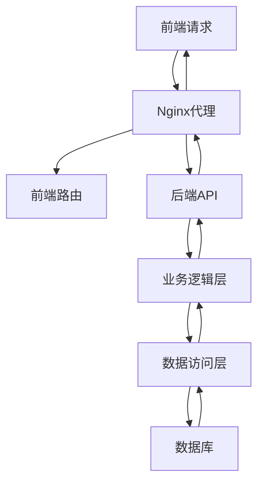
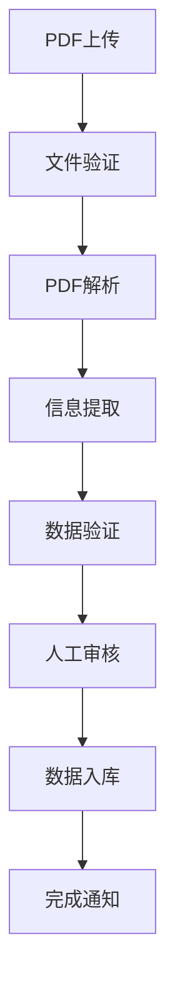

# 系统架构设计文档

## 🏗️ 总体架构

### 系统概述
经营性资产管理系统是一个基于前后端分离架构的现代化Web应用，采用微服务设计理念，支持高并发、高可用的企业级应用场景。

### 技术栈
- **前端**: React 18 + TypeScript + Vite + Ant Design
- **后端**: FastAPI + SQLAlchemy + Pydantic + Python 3.12
- **数据库**: SQLite (开发) / MySQL/PostgreSQL (生产)
- **包管理**: UV (Python) + npm (Node.js)
- **部署**: Docker + Nginx

## 📐 架构层次

### 1. 前端架构
```
frontend/
├── src/
│   ├── components/          # 组件库
│   │   ├── Asset/          # 资产管理组件
│   │   ├── Layout/         # 布局组件
│   │   ├── Analytics/      # 分析组件
│   │   └── ...            # 其他业务组件
│   ├── pages/              # 页面组件
│   │   ├── Assets/        # 资产页面
│   │   ├── Dashboard/     # 仪表板
│   │   └── Contract/      # 合同管理
│   ├── services/          # API服务层
│   ├── hooks/             # 自定义Hooks
│   ├── store/             # 状态管理
│   ├── utils/             # 工具函数
│   └── types/             # TypeScript类型定义
```

**核心特性**:
- 组件化设计，高度可复用
- TypeScript类型安全
- 懒加载路由，性能优化
- 响应式设计，移动端适配

### 2. 后端架构
```
backend/src/
├── api/v1/                # API路由层
│   ├── assets.py         # 资产管理API
│   ├── statistics.py     # 统计分析API
│   ├── pdf_import.py     # PDF导入API
│   └── ...              # 其他业务API
├── services/             # 业务逻辑层
│   ├── statistics.py     # 统计服务
│   ├── pdf_import_service.py  # PDF导入服务
│   └── ...              # 其他业务服务
├── crud/                 # 数据访问层
├── models/               # 数据模型
├── schemas/              # 数据验证
├── utils/                # 工具函数
└── core/                 # 核心配置
```

**设计原则**:
- 分层架构，职责清晰
- 依赖注入，松耦合设计
- 统一异常处理
- 完整的审计日志

### 3. 数据库设计
```sql
-- 核心业务表
assets                   # 资产主表
asset_history           # 资产变更历史
projects                # 项目管理
organizations           # 组织架构
rent_contracts          # 租赁合同
system_dictionaries     # 系统字典

-- 支持表
custom_fields           # 自定义字段
enum_fields            # 枚举字段管理
```

## 🔄 数据流架构

### 请求处理流程


### 核心业务流程

#### 资产管理流程
1. **资产录入**: 表单验证 → 数据保存 → 历史记录
2. **资产查询**: 条件筛选 → 分页查询 → 结果返回
3. **资产修改**: 权限检查 → 数据验证 → 更新保存 → 审计记录

#### PDF导入流程


## 🛡️ 安全架构

### 认证授权
- JWT Token认证
- RBAC权限控制
- API访问频率限制

### 数据安全
- 输入数据验证
- SQL注入防护
- XSS攻击防护
- 敏感数据加密

## 📊 性能优化

### 前端优化
- 路由懒加载
- 组件按需加载
- 图片压缩优化
- 缓存策略设计

### 后端优化
- 数据库索引优化
- 查询性能调优
- Redis缓存应用
- 异步任务处理

### 数据库优化
- 索引策略设计
- 查询语句优化
- 连接池管理
- 读写分离支持

## 🔧 开发工作流

### 环境管理
```bash
# 开发环境
./start_uv.sh          # 一键启动开发环境

# 生产环境
docker-compose up -d   # 容器化部署
```

### 代码规范
- Python: Black + isort + flake8
- TypeScript: ESLint + Prettier
- Git提交规范: Conventional Commits

### 测试策略
- 单元测试: pytest + Jest
- 集成测试: API测试覆盖
- 端到端测试: Playwright
- 性能测试: 压力测试脚本

## 📈 监控体系

### 应用监控
- 应用性能监控(APM)
- 错误日志收集
- 业务指标统计

### 基础设施监控
- 服务器资源监控
- 数据库性能监控
- 网络状态监控

## 🚀 扩展性设计

### 水平扩展
- 无状态服务设计
- 负载均衡支持
- 数据库分库分表

### 功能扩展
- 插件化架构设计
- 微服务拆分准备
- API版本管理

## 📋 部署架构

### 开发环境
```
本地开发机
├── 后端服务 (8002端口)
├── 前端服务 (5173端口)
└── SQLite数据库
```

### 生产环境
```
生产服务器
├── Nginx (反向代理)
├── 前端静态文件
├── 后端API服务
├── MySQL/PostgreSQL
└── Redis缓存
```

---

*文档版本: v1.0.0 | 最后更新: 2025-10-14*