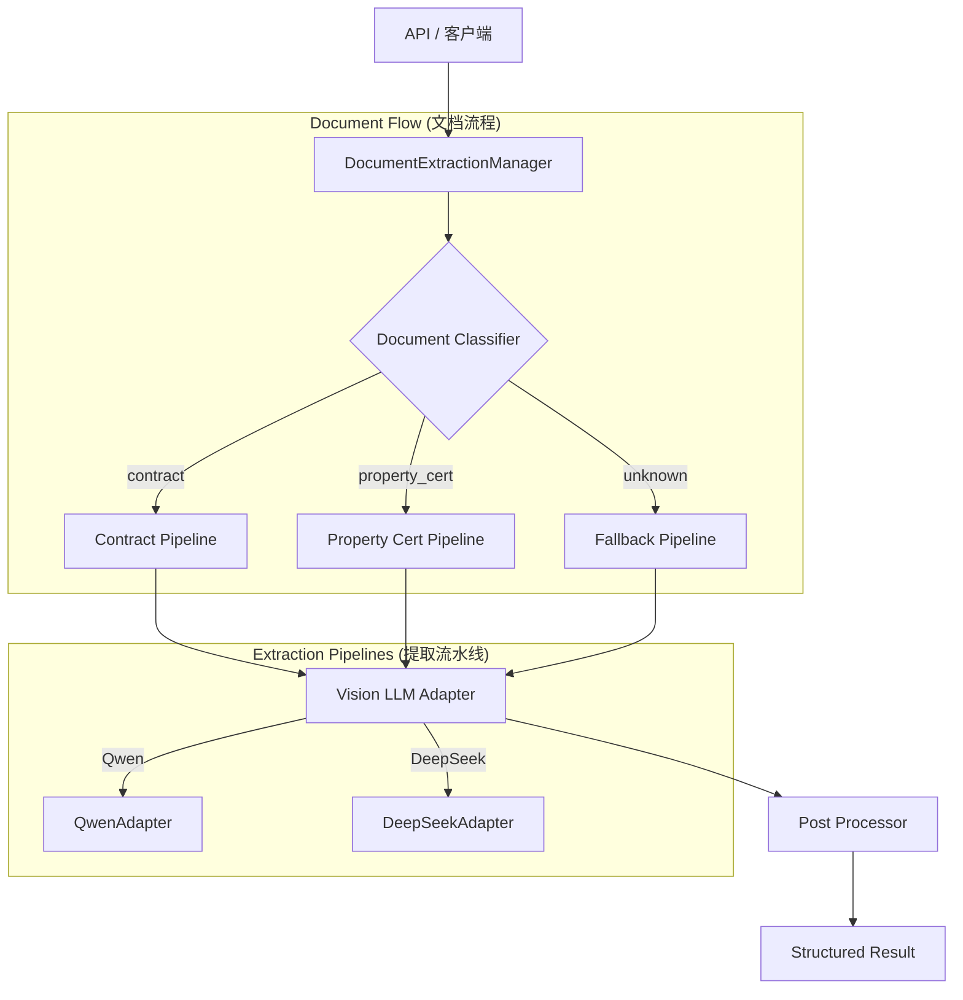

# 合同识别系统重构与优化方案 V2

> **版本**: 2.0
> **更新日期**: 2026-01-13
> **状态**: 待审核

---

## 1. 需求确认

| 问题 | 用户回答 |
|:---|:---|
| 新增文档类型 | **产权证 (Property Certificate)** |
| 是否需要不同字段结构 | **是** |
| OCR 引擎偏好 | **待定**，Nvidia 需要试用 |
| API 兼容性要求 | **不需要**保持现有签名 |
| 其他系统依赖 | **无** |

---

## 2. 目标架构

### 2.1 核心设计



### 2.2 关键组件

| 组件 | 职责 | 新建/复用 |
|:---|:---|:---|
| `DocumentExtractionManager` | 统一入口，编排分类和提取 | 新建 |
| `DocumentClassifier` | 判断文档类型 | 新建 |
| `ContractPipeline` | 合同提取逻辑 | 复用 `BaseVisionAdapter` |
| `PropertyCertPipeline` | 产权证提取逻辑 | 新建 |
| `BaseVisionAdapter` | 视觉模型统一接口 | 复用 |

---

## 3. 数据模型设计

### 3.1 产权证字段结构 (PropertyCertificate Schema)

```python
class PropertyCertificateFields(BaseModel):
    """产权证提取字段"""

    # 证书基本信息
    certificate_number: str | None  # 不动产权证号
    registration_date: date | None  # 登记日期

    # 权利人信息
    owner_name: str | None          # 权利人名称
    owner_id_type: str | None       # 证件类型
    owner_id_number: str | None     # 证件号码

    # 不动产信息
    property_address: str | None    # 坐落地址
    property_type: str | None       # 用途 (住宅/商业/工业)
    building_area: Decimal | None   # 建筑面积 (㎡)
    land_area: Decimal | None       # 土地使用面积 (㎡)
    floor_info: str | None          # 楼层信息

    # 土地信息
    land_use_type: str | None       # 土地使用权类型 (出让/划拨)
    land_use_term_start: date | None # 土地使用期限起
    land_use_term_end: date | None   # 土地使用期限止

    # 其他
    restrictions: str | None        # 权利限制情况
    remarks: str | None             # 备注
```

### 3.2 统一提取结果 (Unified Result)

```python
class ExtractionResult(BaseModel):
    """统一提取结果"""

    success: bool
    document_type: str              # "contract" | "property_cert" | "unknown"
    confidence_score: float
    extracted_fields: dict          # 类型特定的字段
    extraction_method: str          # "vision_qwen" | "vision_deepseek" | etc.
    processing_time_ms: float
    warnings: list[str] = []
```

---

## 4. 实施计划

### 阶段 1: 基础设施 (Infrastructure)

**目标**: 建立统一接口和管理器骨架

| 任务 | 文件 | 工作量 |
|:---|:---|:---|
| 1.1 创建统一接口 | `services/document/extractors/interfaces.py` | 1h |
| 1.2 创建管理器 | `services/document/extraction_manager.py` | 2h |
| 1.3 创建配置扩展 | `services/document/config.py` (修改) | 1h |

### 阶段 2: 文档分类器 (Classifier)

**目标**: 实现自动文档类型识别

| 任务 | 文件 | 工作量 |
|:---|:---|:---|
| 2.1 创建分类器接口 | `services/document/classifier/base.py` | 0.5h |
| 2.2 实现关键词分类器 | `services/document/classifier/keyword_classifier.py` | 1h |
| 2.3 (可选) LLM 分类器 | `services/document/classifier/llm_classifier.py` | 2h |

### 阶段 3: 产权证流水线 (Property Cert Pipeline)

**目标**: 实现产权证提取能力

| 任务 | 文件 | 工作量 |
|:---|:---|:---|
| 3.1 定义产权证 Schema | `schemas/property_certificate.py` | 1h |
| 3.2 创建产权证 Prompt | `services/document/extractors/prompts/property_cert.py` | 1h |
| 3.3 创建产权证 Adapter | `services/document/extractors/property_cert_adapter.py` | 2h |

### 阶段 4: 遗留代码封装 (Legacy Encapsulation)

**目标**: 隔离旧代码，保持向后功能

| 任务 | 文件 | 工作量 |
|:---|:---|:---|
| 4.1 封装 OCR+Regex | `services/document/extractors/legacy_adapter.py` | 2h |
| 4.2 标记废弃函数 | `services/document/contract_extractor.py` (修改) | 0.5h |
| 4.3 整合 Nvidia OCR | `services/providers/ocr_provider.py` (修改) | 1h |

### 阶段 5: API 更新 (API Update)

**目标**: 简化 API 层，指向新管理器

| 任务 | 文件 | 工作量 |
|:---|:---|:---|
| 5.1 重构上传接口 | `api/v1/pdf_import_unified.py` (修改) | 3h |
| 5.2 添加文档类型参数 | 同上 | 0.5h |
| 5.3 更新 Session 模型 | `models/pdf_import_session.py` (修改) | 0.5h |

### 阶段 6: 测试与验证 (Testing)

| 任务 | 文件 | 工作量 |
|:---|:---|:---|
| 6.1 单元测试 | `tests/unit/services/document/` | 3h |
| 6.2 集成测试 | `tests/integration/` | 2h |
| 6.3 手动验证 | - | 1h |

---

## 5. 总工作量估算

| 阶段 | 预估时间 |
|:---|:---|
| 阶段 1: 基础设施 | 4h |
| 阶段 2: 分类器 | 3.5h |
| 阶段 3: 产权证流水线 | 4h |
| 阶段 4: 遗留封装 | 3.5h |
| 阶段 5: API 更新 | 4h |
| 阶段 6: 测试 | 6h |
| **总计** | **~25h** |

---

## 6. 待确认事项

> [!IMPORTANT]
> 请确认以下事项后开始实施

1. **产权证样本**: 是否可以提供1-2份产权证扫描件用于测试？
2. **优先级**: 如同意上述计划，是否按阶段顺序执行？
3. **Nvidia 试用**: 是否需要先单独测试 Nvidia Cloud OCR 效果再决定整合方案？
