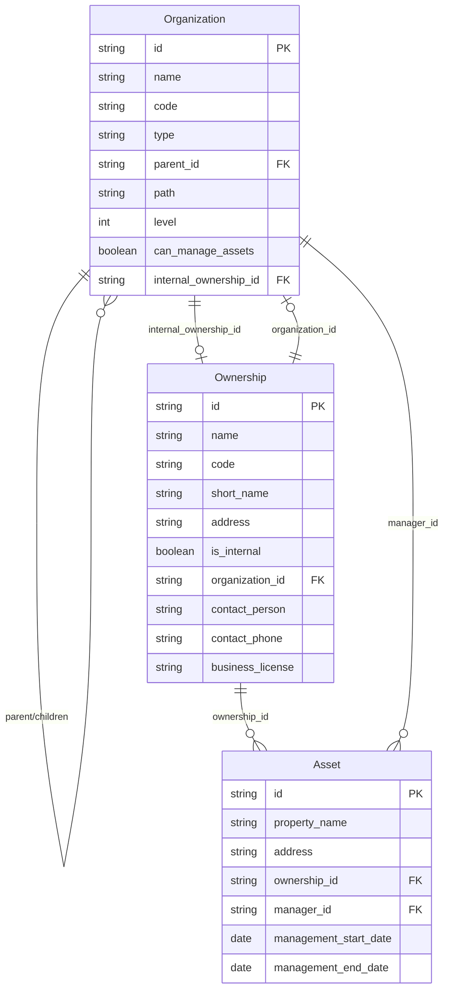

# 组织架构与资产权属关系设计

**文档类型**: 技术设计文档
**创建日期**: 2026-02-16
**状态**: 已批准
**作者**: Claude & yellowUp

---

## 1. 背景

### 1.1 业务场景

本系统为集团范围内的土地物业资产管理系统，具有以下特点：

1. **扁平型组织结构**：集团直接管理多个平级公司
2. **角色兼任**：一家公司可以同时是某资产的产权方和经营方
3. **数据权限**：集团用户可看所有数据，公司用户只能看与自己公司相关的数据

### 1.2 当前问题

| 问题 | 描述 |
|-----|------|
| 表结构分离 | `Organization` 和 `Ownership` 是两张独立的表，没有关联 |
| 弱关联 | `management_entity` 是字符串字段，无法建立强约束 |
| 角色不明确 | 无法区分哪些组织是产权方，哪些是经营方 |
| 权限模糊 | `organization_id` 字段含义不清晰 |

---

## 2. 设计目标

1. **明确角色**：清晰区分产权方和经营方
2. **强关联**：使用外键替代字符串字段
3. **支持外部**：保留对外部产权方的支持
4. **权限可控**：基于组织角色实现数据隔离

---

## 3. 数据模型设计

### 3.1 Organization（组织架构）

```sql
CREATE TABLE organizations (
    id VARCHAR(36) PRIMARY KEY,
    name VARCHAR(200) NOT NULL,
    code VARCHAR(50) NOT NULL,
    type VARCHAR(20) NOT NULL,  -- 集团/公司/部门
    parent_id VARCHAR(36) REFERENCES organizations(id),
    path VARCHAR(1000),
    level INTEGER DEFAULT 1,
    
    -- 新增字段
    can_manage_assets BOOLEAN DEFAULT TRUE,
    internal_ownership_id VARCHAR(36) REFERENCES ownerships(id),
    
    -- 系统字段
    is_active BOOLEAN DEFAULT TRUE,
    status VARCHAR(20) DEFAULT 'active',
    created_at TIMESTAMP,
    updated_at TIMESTAMP
);
```

**新增字段说明**：

| 字段 | 类型 | 说明 |
|-----|------|------|
| `can_manage_assets` | Boolean | 标记该公司是否可以担任资产经营方 |
| `internal_ownership_id` | FK | 关联到内部产权方记录 |

### 3.2 Ownership（权属方）

```sql
CREATE TABLE ownerships (
    id VARCHAR(36) PRIMARY KEY,
    name VARCHAR(200) NOT NULL,
    code VARCHAR(100) NOT NULL,
    short_name VARCHAR(100),
    address VARCHAR(500),
    
    -- 新增字段
    is_internal BOOLEAN DEFAULT TRUE,
    organization_id VARCHAR(36) REFERENCES organizations(id),
    
    -- 外部产权方专属字段
    contact_person VARCHAR(100),
    contact_phone VARCHAR(20),
    business_license VARCHAR(100),
    
    -- 系统字段
    is_active BOOLEAN DEFAULT TRUE,
    data_status VARCHAR(20) DEFAULT '正常',
    created_at TIMESTAMP,
    updated_at TIMESTAMP
);
```

**新增字段说明**：

| 字段 | 类型 | 说明 |
|-----|------|------|
| `is_internal` | Boolean | 区分集团内部产权方和外部产权方 |
| `organization_id` | FK | 当内部产权方时，指向对应的组织 |
| `contact_person` | String | 外部产权方联系人 |
| `contact_phone` | String | 外部产权方联系电话 |
| `business_license` | String | 外部产权方营业执照号 |

### 3.3 Asset（资产）

```sql
CREATE TABLE assets (
    id VARCHAR(36) PRIMARY KEY,
    property_name VARCHAR(200) NOT NULL UNIQUE,
    address VARCHAR(500) NOT NULL,
    -- ... 其他现有字段 ...
    
    -- 保留字段
    ownership_id VARCHAR(36) REFERENCES ownerships(id),
    
    -- 新增字段
    manager_id VARCHAR(36) REFERENCES organizations(id),
    management_start_date DATE,
    management_end_date DATE,
    management_agreement TEXT,
    
    -- 删除字段
    -- organization_id (删除)
    -- management_entity (删除)
    
    -- 系统字段
    data_status VARCHAR(20) DEFAULT '正常',
    created_at TIMESTAMP,
    updated_at TIMESTAMP
);
```

**字段变更说明**：

| 变更类型 | 字段 | 说明 |
|---------|------|------|
| 新增 | `manager_id` | 经营方 FK，替代字符串字段 |
| 新增 | `management_start_date` | 经营管理开始日期 |
| 新增 | `management_end_date` | 经营管理结束日期 |
| 新增 | `management_agreement` | 经营管理协议文件 |
| 删除 | `organization_id` | 含义不清晰，移除 |
| 删除 | `management_entity` | 改用 `manager_id` FK |

---

## 4. 模型关系图

```
┌─────────────────────────────────────────────────────────────────────────┐
│                         模型关系图                                        │
├─────────────────────────────────────────────────────────────────────────┤
│                                                                          │
│  ┌──────────────────┐                    ┌──────────────────┐           │
│  │   Organization   │◀──────────────────▶│    Ownership     │           │
│  │   (组织架构)      │   双向关联          │    (权属方)       │           │
│  │                  │                    │                  │           │
│  │ internal_        │                    │ organization_id  │           │
│  │ ownership_id ────┼────────────────────┼────────────────▶ │           │
│  │                  │                    │                  │           │
│  │ can_manage_assets│                    │ is_internal      │           │
│  └────────┬─────────┘                    └────────┬─────────┘           │
│           │                                       │                      │
│           │ manager_id                            │ ownership_id         │
│           │                                       │                      │
│           ▼                                       ▼                      │
│  ┌─────────────────────────────────────────────────────────────┐        │
│  │                          Asset                               │        │
│  │                        (资产)                                 │        │
│  │                                                              │        │
│  │  ownership_id ──────────▶ 产权方                             │        │
│  │  manager_id ────────────▶ 经营方                             │        │
│  │                                                              │        │
│  └─────────────────────────────────────────────────────────────┘        │
│                                                                          │
└─────────────────────────────────────────────────────────────────────────┘
```

---

## 5. 业务场景映射

### 5.1 资产权属场景

| 场景 | ownership_id | manager_id | 说明 |
|------|-------------|------------|------|
| 自持自管 | A公司 | A公司 | 产权方=经营方 |
| 委托经营 | A公司 | B公司 | A持有产权，B负责运营 |
| 外部产权 | 外部公司 | B公司 | 外部持有产权，B负责运营 |

### 5.2 数据权限规则

```
规则1：集团用户 → 看到所有数据
IF user.organization.type == '集团'
THEN 可以访问所有资产

规则2：公司用户 → 看到相关数据
IF user.organization.type == '公司'
THEN 可以访问满足以下任一条件的资产：
     • asset.ownership.organization_id == user.org_id (用户公司是产权方)
     • asset.manager_id == user.org_id (用户公司是经营方)
```

### 5.3 权限查询示例

```python
def get_visible_assets(user):
    """获取用户可见的资产列表"""
    if user.organization.type == "集团":
        return Asset.query.all()
    else:
        org_id = user.organization_id
        return Asset.query.filter(
            or_(
                Asset.ownership.has(organization_id=org_id),  # 作为产权方
                Asset.manager_id == org_id                     # 作为经营方
            )
        ).all()
```

---

## 6. 迁移策略

由于当前仅有测试数据，采用**清空重建**策略：

### 6.1 执行步骤

```sql
-- 步骤1：清空测试数据
TRUNCATE TABLE assets CASCADE;
TRUNCATE TABLE ownerships CASCADE;
TRUNCATE TABLE organizations CASCADE;

-- 步骤2：修改表结构
-- 详见上述 DDL

-- 步骤3：创建基础数据
-- 插入集团组织
-- 插入公司组织
-- 创建对应的 Ownership 记录
-- 建立双向关联
```

### 6.2 初始化数据示例

```sql
-- 创建集团
INSERT INTO organizations (id, name, code, type, level)
VALUES ('org_group', 'XX集团', 'GROUP', '集团', 0);

-- 创建公司
INSERT INTO organizations (id, name, code, type, parent_id, level, can_manage_assets)
VALUES 
    ('org_a', 'XX资产公司', 'COMP_A', '公司', 'org_group', 1, TRUE),
    ('org_b', 'XX运营公司', 'COMP_B', '公司', 'org_group', 1, TRUE);

-- 创建对应的 Ownership
INSERT INTO ownerships (id, name, code, is_internal, organization_id)
VALUES 
    ('own_a', 'XX资产公司', 'COMP_A', TRUE, 'org_a'),
    ('own_b', 'XX运营公司', 'COMP_B', TRUE, 'org_b');

-- 建立反向关联
UPDATE organizations SET internal_ownership_id = 'own_a' WHERE id = 'org_a';
UPDATE organizations SET internal_ownership_id = 'own_b' WHERE id = 'org_b';
```

---

## 7. 影响范围

### 7.1 需要修改的文件

| 文件 | 修改内容 |
|-----|---------|
| `backend/src/models/organization.py` | 新增 `can_manage_assets`, `internal_ownership_id` |
| `backend/src/models/ownership.py` | 新增 `is_internal`, `organization_id` 及外部产权方字段 |
| `backend/src/models/asset.py` | 新增 `manager_id`，删除 `organization_id`, `management_entity` |
| `backend/src/models/project.py` | 类似资产表的修改 |
| `backend/src/schemas/*.py` | 相应 Schema 更新 |
| `backend/src/crud/*.py` | CRUD 逻辑更新 |
| `backend/src/services/*.py` | 服务层逻辑更新 |
| `backend/src/api/v1/*.py` | API 端点更新 |
| `frontend/src/types/*.ts` | TypeScript 类型更新 |
| `frontend/src/services/*.ts` | API 服务更新 |
| `frontend/src/pages/*.tsx` | 页面组件更新 |

### 7.2 需要新增的测试

- 组织-权属方双向关联测试
- 资产权限隔离测试
- 经营方变更历史测试

---

## 8. 风险评估

| 风险 | 等级 | 缓解措施 |
|-----|------|---------|
| 现有测试数据丢失 | 低 | 已确认可清空 |
| API 兼容性破坏 | 中 | 更新 API 版本，提供迁移指南 |
| 前端页面异常 | 中 | 全面回归测试 |

---

## 9. 后续工作

1. **编写实现计划**：详细的代码修改清单
2. **创建数据库迁移脚本**：Alembic migration
3. **更新 API 文档**：OpenAPI schema
4. **前端适配**：组件和类型更新
5. **测试覆盖**：单元测试和集成测试

---

## 10. 附录

### 10.1 完整 ER 图



---

**文档历史**：

| 日期 | 版本 | 变更内容 | 作者 |
|-----|------|---------|------|
| 2026-02-16 | 1.0 | 初始版本 | Claude & yellowUp |
