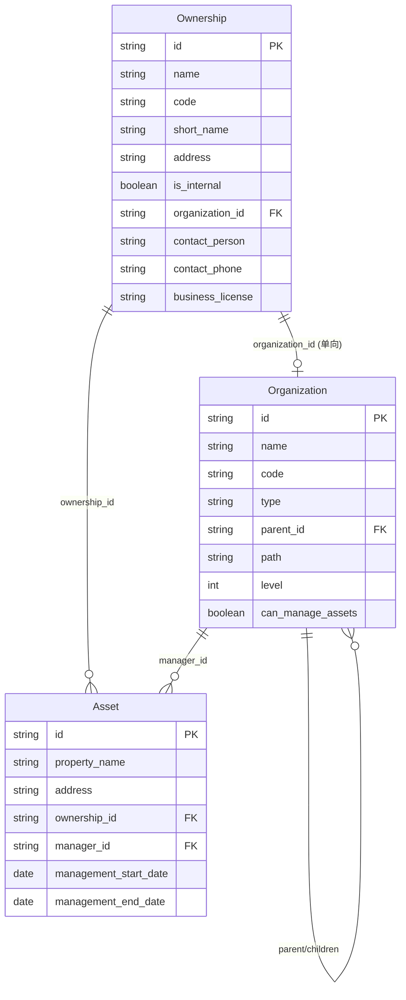

# 组织架构与资产权属关系设计

**文档类型**: 技术设计文档
**创建日期**: 2026-02-16
**状态**: 已批准
**作者**: Claude & yellowUp

---

## 1. 背景

### 1.1 业务场景

本系统为集团范围内的土地物业资产管理系统，具有以下特点：

1. **扁平型组织结构**：集团直接管理多个平级公司
2. **角色兼任**：一家公司可以同时是某资产的产权方和经营方
3. **数据权限**：集团用户可看所有数据，公司用户只能看与自己公司相关的数据

### 1.2 当前问题

| 问题 | 描述 |
|-----|------|
| 表结构分离 | `Organization` 和 `Ownership` 是两张独立的表，没有关联 |
| 弱关联 | `management_entity` 是字符串字段，无法建立强约束 |
| 角色不明确 | 无法区分哪些组织是产权方，哪些是经营方 |
| 权限模糊 | `organization_id` 字段含义不清晰 |

---

## 2. 设计目标

1. **明确角色**：清晰区分产权方和经营方
2. **强关联**：使用外键替代字符串字段
3. **支持外部**：保留对外部产权方的支持
4. **权限可控**：基于组织角色实现数据隔离

---

## 3. 数据模型设计

### 3.1 Organization（组织架构）

```sql
CREATE TABLE organizations (
    id VARCHAR(36) PRIMARY KEY,
    name VARCHAR(200) NOT NULL,
    code VARCHAR(50) NOT NULL,
    type VARCHAR(20) NOT NULL,  -- 集团/公司/部门
    parent_id VARCHAR(36) REFERENCES organizations(id),
    path VARCHAR(1000),
    level INTEGER DEFAULT 1,
    
    -- 新增字段
    can_manage_assets BOOLEAN DEFAULT TRUE,
    
    -- 系统字段
    is_active BOOLEAN DEFAULT TRUE,
    status VARCHAR(20) DEFAULT 'active',
    created_at TIMESTAMP,
    updated_at TIMESTAMP
);
```

**新增字段说明**：

| 字段 | 类型 | 说明 |
|-----|------|------|
| `can_manage_assets` | Boolean | 标记该公司是否可以担任资产经营方 |

### 3.2 Ownership（权属方）

```sql
CREATE TABLE ownerships (
    id VARCHAR(36) PRIMARY KEY,
    name VARCHAR(200) NOT NULL,
    code VARCHAR(100) NOT NULL,
    short_name VARCHAR(100),
    address VARCHAR(500),
    
    -- 新增字段
    is_internal BOOLEAN DEFAULT TRUE,
    organization_id VARCHAR(36) REFERENCES organizations(id),
    
    -- 外部产权方专属字段
    contact_person VARCHAR(100),
    contact_phone VARCHAR(20),
    business_license VARCHAR(100),
    
    -- 系统字段
    is_active BOOLEAN DEFAULT TRUE,
    data_status VARCHAR(20) DEFAULT '正常',
    created_at TIMESTAMP,
    updated_at TIMESTAMP
);
```

**新增字段说明**：

| 字段 | 类型 | 说明 |
|-----|------|------|
| `is_internal` | Boolean | 区分集团内部产权方和外部产权方 |
| `organization_id` | FK | 当内部产权方时，指向对应的组织 |
| `contact_person` | String | 外部产权方联系人 |
| `contact_phone` | String | 外部产权方联系电话 |
| `business_license` | String | 外部产权方营业执照号 |

### 3.3 Asset（资产）

```sql
CREATE TABLE assets (
    id VARCHAR(36) PRIMARY KEY,
    property_name VARCHAR(200) NOT NULL UNIQUE,
    address VARCHAR(500) NOT NULL,
    -- ... 其他现有字段 ...
    
    -- 保留字段
    ownership_id VARCHAR(36) REFERENCES ownerships(id),
    
    -- 新增字段
    manager_id VARCHAR(36) REFERENCES organizations(id),
    management_start_date DATE,
    management_end_date DATE,
    management_agreement TEXT,
    
    -- 删除字段
    -- organization_id (删除)
    -- management_entity (删除)
    
    -- 系统字段
    data_status VARCHAR(20) DEFAULT '正常',
    created_at TIMESTAMP,
    updated_at TIMESTAMP
);
```

**字段变更说明**：

| 变更类型 | 字段 | 说明 |
|---------|------|------|
| 新增 | `manager_id` | 经营方 FK，替代字符串字段 |
| 新增 | `management_start_date` | 经营管理开始日期 |
| 新增 | `management_end_date` | 经营管理结束日期 |
| 新增 | `management_agreement` | 经营管理协议文件 |
| 删除 | `organization_id` | 含义不清晰，移除 |
| 删除 | `management_entity` | 改用 `manager_id` FK |

---

## 4. 模型关系图

```
┌─────────────────────────────────────────────────────────────────────────┐
│                         模型关系图                                        │
├─────────────────────────────────────────────────────────────────────────┤
│                                                                          │
│  ┌──────────────────┐                    ┌──────────────────┐           │
│  │   Organization   │◀───────────────────│    Ownership     │           │
│  │   (组织架构)      │   organization_id  │    (权属方)       │           │
│  │                  │      (单向)        │                  │           │
│  │                  │                    │ is_internal      │           │
│  │ can_manage_assets│                    │                  │           │
│  └────────┬─────────┘                    └────────┬─────────┘           │
│           │                                       │                      │
│           │ manager_id                            │ ownership_id         │
│           │                                       │                      │
│           ▼                                       ▼                      │
│  ┌─────────────────────────────────────────────────────────────┐        │
│  │                          Asset                               │        │
│  │                        (资产)                                 │        │
│  │                                                              │        │
│  │  ownership_id ──────────▶ 产权方                             │        │
│  │  manager_id ────────────▶ 经营方                             │        │
│  │                                                              │        │
│  └─────────────────────────────────────────────────────────────┘        │
│                                                                          │
└─────────────────────────────────────────────────────────────────────────┘
```

**关联说明**：
- `Ownership.organization_id` → `Organization.id`（单向）
- 内部产权方通过此字段关联到组织
- 查询组织的产权方：`Ownership.query.filter_by(organization_id=org_id, is_internal=True)`
```

---

## 5. 业务场景映射

### 5.1 资产权属场景

| 场景 | ownership_id | manager_id | 说明 |
|------|-------------|------------|------|
| 自持自管 | A公司 | A公司 | 产权方=经营方 |
| 委托经营 | A公司 | B公司 | A持有产权，B负责运营 |
| 外部产权 | 外部公司 | B公司 | 外部持有产权，B负责运营 |

### 5.2 数据权限规则

```
规则1：集团用户 → 看到所有数据
IF user.organization.type == '集团'
THEN 可以访问所有资产

规则2：公司用户 → 看到相关数据
IF user.organization.type == '公司'
THEN 可以访问满足以下任一条件的资产：
     • asset.ownership.organization_id == user.org_id (用户公司是产权方)
     • asset.manager_id == user.org_id (用户公司是经营方)
```

### 5.3 权限查询示例

```python
def get_visible_assets(user):
    """获取用户可见的资产列表"""
    if user.organization.type == "集团":
        return Asset.query.all()
    else:
        org_id = user.organization_id
        return Asset.query.filter(
            or_(
                Asset.ownership.has(organization_id=org_id),  # 作为产权方
                Asset.manager_id == org_id                     # 作为经营方
            )
        ).all()
```

---

## 6. 迁移策略

由于当前仅有测试数据，采用**清空重建**策略：

### 6.1 执行步骤

```sql
-- 步骤1：清空测试数据
TRUNCATE TABLE assets CASCADE;
TRUNCATE TABLE ownerships CASCADE;
TRUNCATE TABLE organizations CASCADE;

-- 步骤2：修改表结构
-- 详见上述 DDL

-- 步骤3：创建基础数据
-- 插入集团组织
-- 插入公司组织
-- 创建对应的 Ownership 记录
-- 建立双向关联
```

### 6.2 初始化数据示例

```sql
-- 创建集团
INSERT INTO organizations (id, name, code, type, level)
VALUES ('org_group', 'XX集团', 'GROUP', '集团', 0);

-- 创建公司
INSERT INTO organizations (id, name, code, type, parent_id, level, can_manage_assets)
VALUES 
    ('org_a', 'XX资产公司', 'COMP_A', '公司', 'org_group', 1, TRUE),
    ('org_b', 'XX运营公司', 'COMP_B', '公司', 'org_group', 1, TRUE);

-- 创建对应的 Ownership（单向关联到 Organization）
INSERT INTO ownerships (id, name, code, is_internal, organization_id)
VALUES 
    ('own_a', 'XX资产公司', 'COMP_A', TRUE, 'org_a'),
    ('own_b', 'XX运营公司', 'COMP_B', TRUE, 'org_b');
```

---

## 7. 影响范围

### 7.1 需要修改的文件

| 文件 | 修改内容 |
|-----|---------|
| `backend/src/models/organization.py` | 新增 `can_manage_assets` |
| `backend/src/models/ownership.py` | 新增 `is_internal`, `organization_id` 及外部产权方字段 |
| `backend/src/models/asset.py` | 新增 `manager_id`，删除 `organization_id`, `management_entity` |
| `backend/src/models/project.py` | 类似资产表的修改 |
| `backend/src/schemas/*.py` | 相应 Schema 更新 |
| `backend/src/crud/*.py` | CRUD 逻辑更新 |
| `backend/src/services/*.py` | 服务层逻辑更新 |
| `backend/src/api/v1/*.py` | API 端点更新 |
| `frontend/src/types/*.ts` | TypeScript 类型更新 |
| `frontend/src/services/*.ts` | API 服务更新 |
| `frontend/src/pages/*.tsx` | 页面组件更新 |

### 7.2 需要新增的测试

- 组织-权属方双向关联测试
- 资产权限隔离测试
- 经营方变更历史测试

---

## 8. 风险评估

| 风险 | 等级 | 缓解措施 |
|-----|------|---------|
| 现有测试数据丢失 | 低 | 已确认可清空 |
| API 兼容性破坏 | 中 | 更新 API 版本，提供迁移指南 |
| 前端页面异常 | 中 | 全面回归测试 |

---

## 9. 后续工作

1. **编写实现计划**：详细的代码修改清单
2. **创建数据库迁移脚本**：Alembic migration
3. **更新 API 文档**：OpenAPI schema
4. **前端适配**：组件和类型更新
5. **测试覆盖**：单元测试和集成测试

---

## 10. 附录

### 10.1 完整 ER 图



---

---

## 11. 评审意见（结合项目现状）

**评审日期**: 2026-02-16  
**评审结论**: 设计目标与模型关系合理，与现有代码对照后有以下**必须补齐**与**建议**，供实现前采纳。

### 11.1 与当前实现对照

| 设计项 | 当前项目状态 | 说明 |
|--------|--------------|------|
| **Organization** | `backend/src/models/organization.py` 无 `can_manage_assets`、`internal_ownership_id`；使用 `is_deleted` 而非 `is_active` | 需新增字段；若保留软删可继续用 `is_deleted`，与文档中 `is_active` 二选一并统一命名 |
| **Ownership** | `backend/src/models/ownership.py` 无 `is_internal`、`organization_id`；有 `management_entity` 字符串；无 `contact_person/contact_phone/business_license` | 与设计一致需新增/调整，注意现有权属方无“内部/外部”区分 |
| **Asset** | 已有 `organization_id`、`ownership_id`、`management_entity`（字符串） | 删除 `organization_id`、`management_entity`，新增 `manager_id` 等后，**权限过滤逻辑必须同步改**（见下） |
| **Project** | `backend/src/models/project.py` 有 `organization_id`、`ownership_entity`、`management_entity` | 设计仅写“类似资产表”，建议在 7.1 中明确：Project 是否同样删除 `organization_id`、改为 `manager_id` + 权属关联，并统一语义 |
| **PropertyCertificate** | `backend/src/models/property_certificate.py` 存在 `organization_id` | 7.1 未列，需决定：保留为“所属组织”或纳入本次“组织-权属-经营方”统一模型并补充迁移与影响范围 |

### 11.2 权限过滤逻辑（必须同步修改）

当前 **数据权限** 仅按 `asset.organization_id in (用户可访问组织)` 过滤（`OrganizationPermissionService._apply_organization_filter` 与 asset CRUD 中的 tenant_filter）。  
设计删除 `asset.organization_id` 后，**必须**改为按文档 5.2 规则实现：

- **集团用户**：可访问所有资产（现有 admin/全局 read 已覆盖，需确认“集团”是否与 admin 或 `organization.type == '集团'` 对齐）。
- **公司用户**：可见资产 = **产权方** 或 **经营方** 与用户组织相关，即：
  - `asset.ownership.organization_id in org_ids` **或**
  - `asset.manager_id in org_ids`

因此需要修改：

- `OrganizationPermissionService._apply_organization_filter`：对 Asset 实体不再用 `entity.organization_id.in_(org_ids)`，改为基于 `ownership` 关联与 `manager_id` 的 OR 条件（或先查 org 可见的 ownership_id 列表 + manager_id 列表再过滤）。
- 若 Asset 列表查询使用 `selectinload(Asset.ownership)`，需保证过滤条件与 join 一致，避免 N+1 或重复过滤。

建议在实现计划中单独列“权限过滤迁移”任务，并补充单元/集成测试：集团看全部、公司仅看产权方/经营方。

### 11.3 迁移与兼容

- 文档 6.1 采用清空重建，若生产或预发已有真实数据，需单独评估备份与回滚。
- **API 兼容性**：删除 `organization_id`、`management_entity` 会破坏现有前端与调用方。建议在 7.2/9 中明确：API 版本或响应中是否在一段时间内保留只读的 `organization_id`/`management_entity`（从 ownership/manager 推导）以兼容旧前端，再在前端与文档中标注废弃时间。
- **前端**：`frontend/src/types/asset.ts`、`AssetExportForm`、`AssetBatchActions`、`assetFormSchema.ts`、`assetExportConfig.ts` 等使用 `management_entity`；需改为 `manager_id`（或展示用 `manager?.name`）并更新表单、导出、筛选与类型定义。

### 11.4 模型与命名一致性

- **Organization**：设计 DDL 用 `is_active`、`status`，现有模型用 `is_deleted`、`status`。若项目统一采用“软删”，建议设计处注明“与现有 is_deleted 对应，不新增 is_active”，或在迁移中统一为其中一种并更新文档。
- **Ownership**：设计新增 `contact_person`、`contact_phone`、`business_license`。若权属方沿用 PII 加密（如手机号），需在 CRUD 层接入 `SensitiveDataHandler`，与现有 Asset/Contact 等一致。

### 11.5 建议补充到文档的内容

1. **7.1 影响范围**：增加 `backend/src/models/property_certificate.py` 及 PropertyCertificate 相关 schema/crud/api 的决策与修改说明；明确 Project 的字段变更清单（是否删除 `organization_id`/`ownership_entity`/`management_entity`，是否新增 `manager_id` 等）。
2. **5.2 数据权限**：明确“集团”的判定来源（如 `user.organization.type == '集团'` 或仅 RBAC 管理员），与现有 `OrganizationPermissionService`、RBAC 的集成方式。
3. **6.2 初始化数据**：内部产权方与组织的双向关联（`internal_ownership_id` ↔ `organization_id`）在创建顺序上存在依赖，建议在实现计划中写清：先创建 Organization 再创建 Ownership 再 UPDATE Organization.internal_ownership_id，或提供可重复执行的初始化脚本。

按上述意见补充与修改后，再编写实现计划与 Alembic 迁移更稳妥。

---

**文档历史**：

| 日期 | 版本 | 变更内容 | 作者 |
|-----|------|---------|------|
| 2026-02-16 | 1.0 | 初始版本 | Claude & yellowUp |
| 2026-02-16 | 1.1 | 增加第 11 节评审意见（结合项目现状） | Claude |
