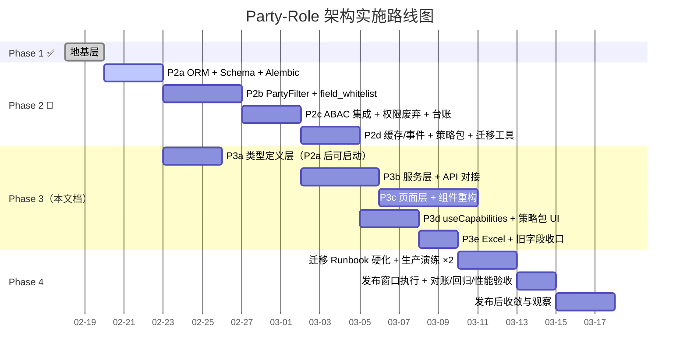
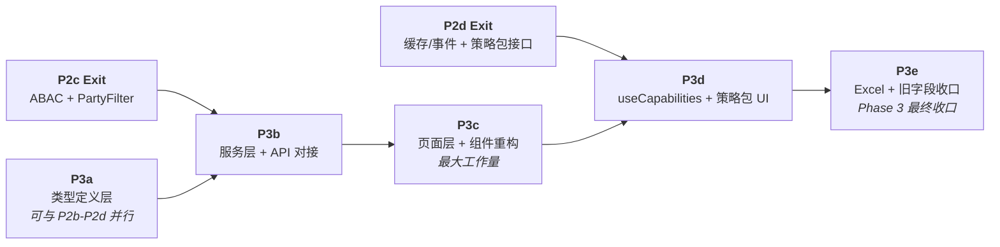

# Phase 3 实施计划：前端全量迁移 + 能力清单 + 策略包管理 UI + Excel 适配

**文档类型**: 实施计划  
**创建日期**: 2026-02-20  
**最后更新**: 2026-02-21（v1.21 — 修正 P3b 前置依赖与默认归属字段契约，补齐门禁命令与缓存比对语义）  
**上游依赖**: [Party-Role 架构设计 v3.9](./2026-02-16-party-role-architecture-design.md) / [Phase 2](./2026-02-19-phase2-implementation-plan.md)  
**阶段定位**: Phase 2 后端域全量改造之上的前端全量迁移。**破坏性变更阶段**——替换全部旧主体字段类型、切换服务层接口参数、重构权限 Hook 与路由守卫、新增策略包管理页面。

---

## 0. 全局路线图定位



### Phase 2-3 并行规则

> [!IMPORTANT]
> - **P3a（类型定义层）** 可在 **P2a 完成后**即刻启动，与 P2b-P2d 并行。
> - **P3b（服务层）** 必须等 **P2c Exit + P3a Exit** 后启动（前者保障后端接口契约，后者保障前端类型可编译）。
> - **P3c** 依赖 P3b Exit。
> - **P3d** 必须等 **P2d Exit + P3c Exit** 后启动（策略包接口在 P2d 交付，页面接入依赖 P3c 路由/组件重构完成）。
>
> > [!NOTE]
> > **甘特图说明（v1.17）**：Mermaid Gantt 对“AND 双前置”表达能力有限，图中仅保留主依赖（`P3b after p2c`、`P3d after p2d`）并以注释提示次依赖。执行时仍需按 Entry 门禁同时满足串行前置（P3b 需 P3a Exit，P3d 需 P3c Exit）。
> - **P3e** 依赖 P3d Exit，是 Phase 3 最终收口阶段（含旧字段物理移除）。
> - Phase 4 必须在 Phase 2 + Phase 3 **全部完成**后方可进入。

---

## 1. Phase 2 → Phase 3 衔接

Phase 2 交付物（Phase 3 依赖）：
- 后端 Schema 新旧字段并存（`Optional` 双模），Service 层自动映射兼容
- `PartyFilter` 全链路可用，`TenantFilter` 已清零
- ABAC 判定集成到业务 CRUD（`require_authz()` + `PartyFilter`）
- `GET /api/v1/auth/me/capabilities`（**Phase 1 已上线，Phase 2 持续可用**）能力清单端点可稳定消费
- `GET/PUT /api/v1/auth/roles/{role_id}/data-policies` 管理接口上线
- `GET /api/v1/auth/data-policies/templates` 策略模板接口上线
- 角色策略包 seed 数据就绪（7 包）
- 旧权限服务（`OrganizationPermissionService`/`OrganizationPermissionChecker`）已标记 deprecated

> [!CAUTION]
> 截至 `v1.21`，后端 `GET /api/v1/parties` 仍未交付 `search` 模糊检索参数；P3b 以此为硬门禁（见 §4.2 / §5.1），不得以“全量拉取+前端过滤”替代生产链路。

Phase 3 **目标**：前端全量完成 Party-Role 切换，使后端新字段成为前端唯一消费字段；旧字段在前端**运行时关键链路**零引用（组织架构并行模块例外，见 §4.3 与 §5.1 P3e 注记）。

---

## 2. 范围界定

| 包含 | 不包含（Phase 4） |
|---|---|
| `frontend/src/types/` 全量主体字段替换（`organization_id`→`owner_party_id`/`manager_party_id`，`ownership_id`→`owner_party_id` 等） | 后端旧列物理删除 |
| `frontend/src/services/` 请求参数与响应字段同步更新 | 后端 Schema 收紧必填 |
| 前端权限判定兼容现有后端资源名（`asset`）并新增 admin-only 守卫策略 | 后端 `require_authz` 资源名统一（`asset`→`user/role/system`） |
| `frontend/src/components/` + `pages/` 全量视图适配 | 数据迁移 Runbook 脚本硬化 |
| `usePermission` → `useCapabilities` Hook 重构 | 生产演练与发布窗口执行 |
| `PermissionGuard` → `CapabilityGuard` 路由守卫重构 | — |
| 角色管理页"数据策略包配置"区域新增 | — |
| Excel 导入导出模板字段适配 | — |
| 前端 `capabilities` 静默 refresh 防风暴 | — |
| Party 选择器通用组件 | — |
| 无资产项目"待补绑定"标签展示 | — |
| 前端单元测试 + 组件测试适配 | — |

---

## 3. 影响分析

### 3.1 前端旧字段引用统计

基于代码库 grep 扫描结果：

| 旧字段 | 影响文件数 | 主要分布 |
|---|---|---|
| `organization_id` | 16 | types/auth · types/organization · `types/propertyCertificate(PropertyOwner 子接口)` · hooks/usePermission · services/organizationService · services/systemService · pages/System/UserManagement/* |
| `ownership_id` | 34 | types/asset · types/rentContract · types/project · types/pdfImport · services/asset/* · services/projectService · services/pdfImportService · pages/Rental/* · pages/Ownership/* · components/Forms/* · components/Asset/* · components/Rental/* · components/Project/* · components/Analytics/* |
| `management_entity` | 8 | types/asset · `types/rentContract(RentContractAsset 子接口)` · services/asset/assetDictionaryService · assetFormSchema · components/Asset/AssetBatchActions · components/Asset/assetExportConfig · components/Asset/AssetExportForm · components/Asset/AssetSearchResult |
| `ownership_entity` | 25 | types/asset · `types/rentContract(RentContractAsset 子接口)` · services/asset/* · store/* · mocks/* · test-utils/* · pages/Assets/* · components/Asset/* · components/Charts/* · components/Rental/* · components/Project/* · components/Forms/* |
| `usePermission` | 12 | hooks/usePermission · hooks/__tests__/usePermission · components/System/PermissionGuard · components/Router/* · components/Asset/AssetList |
| `canAccessOrganization` | 3 | hooks/usePermission · hooks/__tests__/usePermission · components/System/__tests__/PermissionGuard |

> [!NOTE]
> 以上计数用于工作量估算，不等同于“主接口字段命中数”。`propertyCertificate` 与 `rentContract` 的旧字段命中以**子接口语义位置**为准（`PropertyOwner` / `RentContractAsset`），执行改造时需先按语义归属再批量替换。

### 3.2 新增前端文件预估

| 文件 | 说明 |
|---|---|
| `types/party.ts` | Party / PartyHierarchy / PartyContact 类型 |
| `types/capability.ts` | Capabilities 能力清单类型 |
| `types/dataPolicy.ts` | 数据策略包类型 |
| `services/partyService.ts` | Party CRUD 服务 |
| `services/capabilityService.ts` | 能力清单拉取与缓存服务 |
| `services/dataPolicyService.ts` | 策略包管理服务 |
| `utils/authz/capabilityEvaluator.ts` | 权限判定纯函数（`useCapabilities`/`AuthContext` 共享） |
| `hooks/useCapabilities.ts` | 新权限 Hook（替代 `usePermission`） |
| `components/System/CapabilityGuard.tsx` | 新路由守卫组件 |
| `components/Common/PartySelector.tsx` | Party 选择器通用组件 |
| `components/Common/AuthzErrorBoundary.tsx` | 权限拒绝 UI 提示组件 |
| `pages/System/DataPolicyManagementPage.tsx` | 策略包管理页面 |
| **合计** | **~12 新增** |

---

## 4. 变更清单

### 4.1 类型定义层（P3a）

> [!CAUTION]
> P3a 类型变更采用**标记 deprecated + 新增**策略：旧字段保留定义并标记 `@deprecated`，新字段同步新增。  
> 这样 P3b/P3c/P3d 可渐进逐文件切换，不会因旧字段类型定义移除导致全面编译崩溃。  
> 旧字段类型定义在 **P3e Exit** 统一移除，作为 Phase 3 最终收口动作。

> [!NOTE]
> P3a 可在 P2a（ORM + Schema 结构变更）完成后启动，是 Phase 3 中最早可以并行推进的部分。

---

#### [NEW] `types/party.ts`

```typescript
/** Party 主体类型 */
export type PartyType = 'organization' | 'legal_entity';

export interface Party {
  id: string;
  party_type: PartyType;
  name: string;
  code: string;
  external_ref?: string | null;
  status: string;
  metadata?: Record<string, unknown>;
  created_at: string;
  updated_at: string;
}

export interface PartyListParams {
  party_type?: PartyType;
  status?: string;
  skip?: number;
  limit?: number;
}

export interface FrontendPartyHierarchyEdge {
  /** 前端内部树组装辅助类型（非后端原始响应）。
   *  后端“层级”接口返回子 Party ID 列表（list[str]），此接口用于补充 parent/child 边关系。 */
  id: string;
  parent_party_id: string;
  child_party_id: string;
}

export interface PartyContact {
  id: string;
  party_id: string;
  contact_name: string;
  contact_phone?: string;
  contact_email?: string;
  notes?: string;
  is_primary: boolean;
}

/** 产权证-Party 关联关系（对应后端 certificate_party_relations 表） */
export interface CertificatePartyRelation {
  id: string;
  certificate_id: string;
  party_id: string;
  party?: Party;
  relation_role: 'owner' | 'co_owner' | 'issuer' | 'custodian';
  is_primary: boolean;
  share_ratio?: number | null;
  valid_from?: string | null;
  valid_to?: string | null;
}
```

#### [NEW] `types/capability.ts`

```typescript
/** ABAC 动作集合（标准动作与后端 authz.py:8 对齐；额外包含 Phase 3 临时豁免 backup） */
export type AuthzAction =
  | 'create'
  | 'read'
  | 'list'
  | 'update'
  | 'delete'
  | 'export'
  // Phase 3 临时豁免：system.backup（P4 后端落地正式 ABAC 规则后再收敛）
  | 'backup';

/**
 * 受控资源名（与后端 capabilities 响应 resource 字段对齐）。
 * 新资源上线时此类型须同步扩展。
 * Phase 3 临时保留 'system' 仅用于 system.backup 豁免分支。
 * 其余 system/user/role 路由仍走 adminOnly，不走 canPerform('read','system|user|role')。
 */
export type ResourceType =
  | 'asset'
  | 'project'
  | 'rent_contract'
  | 'party'
  | 'system'
  | 'property_certificate';

/** 能力清单（与设计文档 §5.1 / Phase 1 GET /api/v1/auth/me/capabilities 对齐） */
export interface Capability {
  resource: ResourceType;
  actions: AuthzAction[];
  perspectives: string[];
  // 注意：data_scope 为用户级全局范围（subject scope），非按 resource 差异化返回
  data_scope: {
    owner_party_ids: string[];
    manager_party_ids: string[];
  };
}

export interface CapabilitiesResponse {
  version: string;
  generated_at: string;
  capabilities: Capability[];
}
```

> [!NOTE]
> `AuthzAction` 与 `ResourceType` 需同步导出到 `types/index.ts`，供 `useCapabilities`、`CapabilityGuard`、路由元数据等处统一引用。新增后端资源名时，需在此联合类型扩展，利用编译期穷举检查防止漏映射。


#### [NEW] `types/dataPolicy.ts`

```typescript
/** 数据策略包模板（管理面，与 Phase 2 §4.9 + 当前后端 DataPolicyService 对齐）
 *  后端 `list_templates()` 返回 `dict[str, {name, description}]`，前端需适配。
 */
export interface DataPolicyTemplate {
  code: string;
  name: string;
  description: string;
}

/** 角色-策略包绑定（后端 GET /roles/{role_id}/data-policies 返回 {role_id, policy_packages: string[]} ） */
export interface RoleDataPolicies {
  role_id: string;
  policy_packages: string[];
}

/** 更新请求体（后端 PUT 接受 {policy_packages: string[]}） */
export interface RoleDataPolicyUpdatePayload {
  policy_packages: string[];
}
```

#### [MODIFY] `types/asset.ts`

- 标记 `@deprecated`：`ownership_id`, `management_entity`, `ownership_entity`（P3a 保留定义，P3e 移除）
- 新增：`owner_party_id?: string`（P3a 可选→ P3e 收紧为必填）
- 新增：`manager_party_id?: string`（同上）
- 保留：`project_id`（资产-项目关联键，与 Party-Role 主体迁移无直接冲突，本期不 deprecated）
- 保留：`project_name` 标记 `@deprecated`
- 新增关联：`owner_party?: Party`, `manager_party?: Party`

> [!NOTE]
> 新 Party 字段在 P3a 定义为可选（`?`），避免 P3a 单独提交时触发大面积类型报错。
> 随 P3b/P3c 逐文件过渡，P3e 收口时统一收紧为必填。

#### [MODIFY] `types/rentContract.ts`

- `RentContract` 主接口：
  - 标记 `@deprecated`：`ownership_id`（P3e 移除）
  - 新增：`owner_party_id?: string`, `manager_party_id?: string`, `tenant_party_id?: string | null`（P3a 可选，P3e 收紧）
- `RentContractAsset` 子接口：
  - 标记 `@deprecated`：`management_entity`, `ownership_entity`（P3e 移除）
  - 新增：`owner_party_id?: string`, `manager_party_id?: string`（P3a 可选，P3e 收紧）
- 保留：`owner_name`, `owner_contact`, `owner_phone`（只读快照）
- 排查结论：`types/rentContract.ts` 不存在 `project_name` 字段，无需迁移
- **全量迁移范围（v1.12 冻结）**：文件内所有含 `ownership_id` 的类型均纳入 P3a→P3e 迁移（共 13 处），不只限 `RentContract`/`RentContractAsset`：`RentContract`、`RentLedger`、`RentContractCreate`、`RentContractUpdate`、`RentLedgerCreate`、`OwnershipRentStatistics`、`RentStatisticsQuery`、`RentContractQueryParams`、`RentLedgerQueryParams`、`RentContractFormData.basicInfo`、`RentContractSearchFilters`、`RentLedgerSearchFilters` 等。
- **统计口径专项**：`OwnershipRentStatistics` 在迁移 `ownership_id -> owner_party_id` 的同时，`ownership_name` / `ownership_short_name` 同步迁移为 `owner_party_name`（避免统计层残留旧语义字段名）。

#### [MODIFY] `types/project.ts`

- 现状对齐：前端 `Project` 顶层无 `organization_id` / `management_entity` / `ownership_entity`；旧权属链路位于嵌套 `ownership_relations[].ownership_id`
- 新增：`manager_party_id?: string`（与后端 `ProjectBase.manager_party_id` 对齐）
- `ownership_relations` 迁移策略（专项）：
  1. P3a：保留 `ownership_relations` 定义并标记 `@deprecated`（含嵌套 `ownership_id`）
  2. P3b：在 `projectService` 增加兼容适配层，支持新结构 `party_relations[]`（前端消费）与旧结构 `ownership_relations[]`（后端兼容）双向转换
  3. P3e：前端运行时与类型层移除 `ownership_relations[].ownership_id` 直接消费，统一使用 `party_relations[]`
- `ProjectSearchParams.ownership_id` 标记 `@deprecated`，新增 `manager_party_id?: string`（项目列表检索口径统一）
- `party_relations[]` 字段契约显式化（避免实现歧义）：
  - `party_id: string`
  - `party_name?: string`
  - `relation_type: 'owner' | 'manager' | 'tenant' | 'other'`
  - `is_primary?: boolean`

#### [MODIFY] `types/propertyCertificate.ts`

- 标记 `@deprecated`：`PropertyOwner.organization_id`（P3e 移除；非 `PropertyCertificate` 顶层字段）
- 不新增 `party_id` 字段——产权证主体关系通过 `certificate_party_relations`（Phase 1 已建）获取
- 新增可选关联：`party_relations?: CertificatePartyRelation[]`（引用 `types/party.ts` 中新增的关联类型）

#### [MODIFY] `types/auth.ts`

- `AuthState` 接口（或同等顶层结构）新增 `capabilities?: Capability[]` 引用
- 角色相关类型新增 `data_policies?: RoleDataPolicies`（对应 `types/dataPolicy.ts` 中的同名类型）

#### [MODIFY] `hooks/usePermission.tsx`

- `UserPermissions` 接口移除 `organizationId?: string`
- 整个模块后续将重定向到 `useCapabilities`
- 生命周期约束：
  - P3d：仅允许 `usePermission` 作为兼容壳（内部代理 `useCapabilities`），禁止新增直接读取 `AuthStorage.permissions` 的逻辑
  - P3e：物理删除 `usePermission.tsx`，运行时唯一权限来源收敛到 `AuthContext.capabilities`

#### [MODIFY] `types/pdfImport.ts`

- `ownership_id` 标记 `@deprecated`，新增 `owner_party_id?: string`（P3a 可选，P3e 收紧）

#### [MODIFY] `types/organization.ts`

- 整个模块标记 `@deprecated`（Party 体系替代）
- 保留类型定义，但添加 TSDoc `@deprecated` 注释
- 下游引用逐步切换到 `Party`

#### [MODIFY] `types/ownership.ts`

- 整个模块标记 `@deprecated`
- 保留类型定义 + `@deprecated` 注释

---

### 4.2 服务层 + API 对接（P3b）

> [!IMPORTANT]
> P3b 必须等 P2c Exit（后端 ABAC 集成 + PartyFilter 完成）后启动。

---

#### [NEW] `services/partyService.ts`

- `getParties(params)` → `GET /api/v1/parties` （支持 `skip`/`limit`/`party_type`/`status` 查询参数）
- `searchParties(query, params)` → `GET /api/v1/parties?search=<keyword>&limit=<n>`（P3b+ 默认搜索路径）
- `getPartyById(id)` → `GET /api/v1/parties/{id}`
- `createParty(data)` → `POST /api/v1/parties`
- `updateParty(id, data)` → `PUT /api/v1/parties/{id}`
- `getPartyHierarchy(partyId)` → `GET /api/v1/parties/{id}/hierarchy`（返回 `list[str]`，前端自行组装树结构）

> [!WARNING]
> 当前后端 `/parties` 无 `search` / 模糊搜索参数，且 `limit` 上限为 1000（`party.py:30`）。  
> **v1.19 决策**：不将“全量拉取 + 前端过滤”固化为生产方案；`/parties?search=` 为 P3b **硬门禁**。
>
> **v1.21 执行补充（阻断项归属）**：
> - `search` 接口交付归属为后端前置补丁（Phase 2.x 或 P3b-Day0 联动任务），未交付前 P3b 不得启动。
> - 推荐同批交付分页信封 `{items,total,skip,limit}`；若后端暂未提供，前端需在 `partyService` 显式标注“`result.length === limit` 仅为截断近似判断”。
>
> **执行策略（两级）**：
>
> | 级别 | 决策 | 约束 |
> |---|---|---|
> | Level 1（硬门禁） | P3b Entry 前必须交付后端 `search` 接口（`GET /api/v1/parties?search=...`） | 见 §5.1 P3b Entry 门禁 |
> | Level 2（过渡降级） | `PartySelector` 采用 `fetcher(query)` 架构；仅在 P3a 本地联调阶段允许“全量拉取+前端过滤”fetcher | 后端 `search` 上线后仅替换 fetcher，不重写组件主体 |
>
> **三档阈值语义**（仅用于 Level 2 降级模式）：
>
> | 现网存量 / 返回数 | 现象 | 处理 |
> |---|---|---|
> | 返回数 < 500 | 正常范围 | 无提示 |
> | 500 ≤ 返回数 < 1000 | 可选项偏多 | 顶部 Banner："可选项较多，请输入关键词缩小范围"；禁用"显示全部" |
> | 返回数 = 1000 | 命中后端上限，结果已截断 | 额外提示"结果已截断，请缩小筛选条件" |

#### [NEW] `services/capabilityService.ts`

- `fetchCapabilities()` → `GET /api/v1/auth/me/capabilities`
- 会话级缓存：登录后拉取一次，token refresh 后重拉
- 导出 `getCapabilities()` 供 Hook 消费

#### ~~`services/dataPolicyService.ts`~~ → 移至 P3d（见 §4.4）

> [!NOTE]
> `dataPolicyService.ts` 消费的后端接口（策略包管理端点）在 **P2d** 才交付。因此创建放在 **P3d**（其 Entry 已要求 P2d Exit）。

#### [MODIFY] `services/assetService.ts` + `services/asset/*.ts`

| 变更点 | 说明 |
|---|---|
| 请求参数 | `organization_id`→`manager_party_id`；`ownership_id`→`owner_party_id` |
| 响应解析 | 新增 `owner_party_id`/`manager_party_id` 字段映射 |
| 过滤参数 | `ownership_entity`/`management_entity` → `owner_party_id`/`manager_party_id` |
| `asset/types.ts` | `ownership_id`/`ownership_entity` → `owner_party_id` |
| `asset/assetImportExportService.ts` | 模板字段映射适配 |

#### [MODIFY] `services/projectService.ts`

- 搜索参数：`ownership_id` 标记 deprecated，新增并优先使用 `manager_party_id`
- 嵌套关系：前端统一消费并提交 `party_relations[]`；后端兼容层负责必要的旧结构降级转换（`ownership_relations[]`）
- 映射约束（v1.14 冻结）：**禁止前端硬编码 `ownership_to_party_map`**。若发布窗口确需前端执行映射转换，必须在 P3b Entry 前先交付映射 API 契约（含 TTL/失效策略），并回写本节后方可执行
- **P3b 契约门禁（v1.19）**：后端项目相关 API 对前端返回体必须始终提供 `party_relations[]`（即使底层仍为 `ownership_relations[]` 存量数据也需服务端转换）。前端在 Phase 3 期间仅消费 `party_relations[]`，不承担旧结构回显转换责任。

#### [MODIFY] `services/rentContractService.ts`

- `ownership_id` → `owner_party_id`
- 新增 `manager_party_id`、`tenant_party_id` 参数

#### [MODIFY] `services/rentContractExcelService.ts`

- Excel 导入/导出字段映射适配

#### [MODIFY] `services/systemService.ts`

- `getUsers()` 查询参数中的 `organization_id` 纳入迁移清单：P3b 改为 Party 口径查询参数（优先 `party_id` / `owner_party_id`，具体命名以后端接口契约为准），旧参数仅作过渡兼容并标记 `@deprecated`。
- 用户默认归属字段（`v1.21` 修正）：后端当前仅存在 `default_organization_id`（无 `default_party_id` 字段）。Phase 3 保持提交 `default_organization_id` 不变；若后端后续新增 `default_party_id`，再以后端契约版本为门禁执行迁移（不得前端先行改名）。
- P3e 收口要求：移除 `systemService.ts` 运行时 `organization_id` 直传逻辑，避免触发 §5.1 / §6.2 旧字段门禁失败。

#### [MODIFY] `services/pdfImportService.ts`

- `ownership_id` 参数 → `owner_party_id`

#### [MODIFY] `services/organizationService.ts`

- 标记 `@deprecated`，保留原始实现供组织架构页面继续使用
- **不重定向到 `partyService`**（Party API 能力不足，见 §4.3 IMPORTANT）
- 保留全部导出

#### [MODIFY] `services/ownershipService.ts`

- 标记 `@deprecated`

#### [MODIFY] `services/authService.ts` 与 `contexts/AuthContext.tsx`

- **冷启动与会话恢复链路闭环**：在 `AuthContext` 初始化的 `restoreAuth()` 中，当会话恢复成功（用户信息拉取成功）后，**必须强制拉取 capabilities**，避免浏览器刷新后 capabilities 为空导致路由被误拦截。

  **插入位置（语义锚点）**：
  - `restoreAuth()` 的 stored-user 恢复分支中，`persistAuthDataSafely(currentUser, permissions, authPersistence)` 调用之后
  - `restoreAuth()` 的 cookie 恢复分支中，`persistAuthDataSafely(currentUser, permissions, 'session')` 调用之后
  - `login()` 中 `setUser(response.data.user)` 调用之后
  ```typescript
  // 会话恢复/登录成功后强制拉取 capabilities（冷启动链路闭环）
  // 失败降级为空数组；路由守卫需在 capabilitiesLoading === true 时保持 loading，不执行 deny
  if (isMounted) setCapabilitiesLoading(true);
  try {
    const caps = await capabilityService.fetchCapabilities();
    if (isMounted) setCapabilities(caps);
  } catch {
    if (isMounted) setCapabilities([]);
  } finally {
    if (isMounted) setCapabilitiesLoading(false);
  }
  ```
  同样的调用在 `refreshUser()` / token refresh 成功后也需加入。

- **capabilities 降级约定**：拉取失败时降级为空数组，`AuthContextType` 新增 `capabilitiesLoading: boolean` 字段，路由守卫在该字段为 `true` 时**只显示 loading，不执行 deny 判定**。
- **登录/refresh 成功后拉取 capabilities**（同上骨架，login + refreshUser 均需添加）
- `isAdmin` 来源冻结：`AuthContextType` 显式新增 `isAdmin: boolean`（`= user?.is_admin ?? false`），`adminOnly` 守卫只读该字段，不使用来源不明的裸变量。
- 运行时单一权限数据源：`canPerform`/路由守卫统一读取 `AuthContext.capabilities`；`AuthService.hasPermission()/getLocalPermissions()` 仅允许用于过渡期兼容（P3d 清理，P3e 禁用）。
- `capabilities` 存储策略（v1.11 定版）：
  - 主存：`AuthContext` React state（运行时唯一判定源）
  - 持久化：`AuthStorage.capabilities`（允许写入）
  - TTL：10 分钟（超时即视为冷缓存）
  - 变更校验（`v1.21` 修正）：不使用 `CapabilitiesResponse.version` 作为权限变更判据（该字段为协议版本）；改为比较 `generated_at` 或能力列表签名（hash）后决定是否覆盖本地缓存
  - 失效时机：token refresh 成功后强制重拉并覆盖缓存

  **接口补充（避免实现歧义）**：
  - `AuthContextType` 新增：`capabilities: Capability[]`、`capabilitiesLoading: boolean`、`refreshCapabilities: () => Promise<void>`、`isAdmin: boolean`
  - `AuthProvider` 状态默认值：`capabilities = []`；`capabilitiesLoading` 采用 token 感知初始化（建议 `hasToken ? true : false`），防止冷启动阶段在 `restoreAuth` 完成前误触发 deny
  - `types/auth.ts` 的 `AuthState`（或等价顶层状态）需与上述字段保持一致
  - `AuthStorage` 字段定义：`capabilities?: Capability[]`、`capabilities_cached_at?: string`、`capabilities_version?: string`
  - 共享判定器：新增 `utils/authz/capabilityEvaluator.ts`（或等价位置）的纯函数（如 `evaluateCapability()` / `hasPartyScopeAccess()`），供 Hook 与 Context 兼容导出共享

- **`AuthContext.hasPermission` 迁移路径冻结（v1.12 决策）**：
  - P3d：保留 `AuthContext.hasPermission` / `hasAnyPermission` 导出以维持调用方兼容，但内部实现改为调用共享纯函数（与 `useCapabilities` 同源），并标记 `@deprecated`。
  - P3d：**禁止在 `AuthContext.Provider` 内部调用 `useCapabilities` Hook**，避免 Hook 反向依赖 Context 造成循环依赖/非法调用。
  - P3d：禁止 `AuthContext` 内部继续直调 `AuthService.hasPermission/getLocalPermissions/hasAnyPermission`，以满足“运行时单一权限数据源（`AuthContext.capabilities`）”目标。
  - P3d：执行调用方迁移盘点，至少覆盖 `useAuth().hasPermission` / `useAuth().hasAnyPermission` 的全部生产引用；新增/修改代码禁止继续引入旧接口调用。
  - P3e：物理移除 `AuthContext.hasPermission` / `hasAnyPermission` 及其调用方残留，仅保留 `useCapabilities().canPerform()` 路径。

  **调用方盘点命令（P3d Entry 建议执行）**：
  ```bash
  grep -rEn "useAuth\(\)\.(hasPermission|hasAnyPermission)|\bhasPermission\(" frontend/src/ \
    --include="*.ts" --include="*.tsx" --exclude-dir="__tests__" --exclude-dir="test" --exclude-dir="test-utils"
  ```


#### [REVIEW] `services/statisticsService.ts`

- 经复核该文件当前未命中旧主体字段；P3b 仅做契约审计，若接口参数确认仍为 `ownership_id` 再执行迁移为 `owner_party_id`。

#### [REVIEW] `services/analyticsService.ts` / `services/analyticsExportService.ts`

- 经复核当前无旧主体字段命中；本阶段默认不改代码，仅保留契约抽检与回归验证。

---

### 4.3 页面层 + 组件重构（P3c）

---

#### [NEW] `components/Common/PartySelector.tsx`

可复用的 Party 选择器（带搜索、异步加载）：
- 支持 `filter_mode: 'owner' | 'manager' | 'any'` 筛选
- 采用 `fetcher(query)` 可替换数据源架构（**P3b+ 默认 fetcher 必须走 `partyService.searchParties(query)`**；“全量拉取 + 前端过滤”仅允许 P3a 本地联调临时降级并需显式开关）
- 选中后返回 `party_id` + `party_name`
- 用于资产表单、合同表单、项目表单中替换旧的组织/权属选择器

#### [NEW] `components/Common/AuthzErrorBoundary.tsx`

权限拒绝交互组件（设计文档 §5.2 要求）：
- 前端关键写操作收到 403 时，显示“权限已更新，请刷新会话”提示
- 配合静默 refresh 防风暴（§4.5）使用
- 提供 Toast / Banner 两种展示形态
- `capabilities` 静默 refresh 成功后触发 UI 自愈：自动刷新当前视图（如 React Query invalidate）并重算按钮/菜单可见性，避免“幽灵按钮”停留

> [!NOTE]
> 当前后端未实现 `X-Authz-Stale` 响应头。静默 refresh 触发需满足 `403` 且错误体命中权限拒绝标识（如 `code=PERMISSION_DENIED`）；未命中时不触发 refresh。
> 如后端后续增加该 header，前端可叠加作为更精确的触发信号。

#### [MODIFY] 资产模块（10+ 文件）

| 文件 | 变更 |
|---|---|
| `components/Forms/AssetForm.tsx` | 旧组织/权属选择器 → `PartySelector`（owner + manager） |
| `components/Forms/Asset/AssetBasicInfoSection.tsx` | `ownership_id` → `owner_party_id` 表单字段 |
| `components/Asset/AssetList.tsx` | 过滤条件替换 + 权限判定改 `useCapabilities` |
| `components/Asset/AssetSearch.tsx` | `ownership_id` 搜索条件 → `owner_party_id` |
| `components/Asset/AssetSearch/AdvancedSearchFields.tsx` | 同上 |
| `components/Asset/AssetSearchResult.tsx` | 显示字段替换 |
| `components/Asset/AssetDetailInfo.tsx` | `ownership_entity` 显示 → Party name |
| `components/Asset/AssetCard.tsx` | `ownership_entity` → Party name |
| `components/Asset/AssetBatchActions.tsx` | `management_entity` 批量操作 → `manager_party_id` |
| `components/Asset/AssetExportForm.tsx` | 导出字段映射 |
| `components/Asset/assetExportConfig.ts` | 导出配置字段 |
| `assetFormSchema.ts` | 表单验证 schema 字段替换 |
| `pages/Assets/AssetCreatePage.tsx` | 创建时使用新字段 |
| `pages/Assets/AssetDetailPage.tsx` | 详情展示适配 |
| `pages/Assets/AssetListPage.tsx` | 列表过滤适配 |
| `pages/Assets/components/AssetCard.tsx` | 卡片显示适配 |
| `pages/Assets/components/AssetFilters.tsx` | 过滤器字段替换 |

#### [MODIFY] 合同模块（8+ 文件）

| 文件 | 变更 |
|---|---|
| `components/Forms/RentContract/RelationInfoSection.tsx` | `ownership_id` → `owner_party_id` + `manager_party_id` + `tenant_party_id` |
| `components/Forms/RentContract/RentContractFormContext.tsx` | 上下文字段替换 |
| `components/Rental/ContractList/ContractFilterBar.tsx` | 筛选条件适配 |
| `components/Rental/ContractDetailInfo.tsx` | `ownership_entity` 显示 → Party name |
| `components/Rental/RentContractExcelImport.tsx` | 导入模板字段映射 |
| `pages/Rental/ContractListPage.tsx` | 列表页适配 |
| `pages/Rental/ContractRenewPage.tsx` | 续签页 `ownership_id` → `owner_party_id` |
| `pages/Rental/RentLedgerPage.tsx` | 台账页 `ownership_id` 过滤 → `owner_party_id` |
| `pages/Rental/RentStatisticsPage.tsx` | 统计页维度替换 |
| `pages/Contract/ContractImportReview.tsx` | 导入审核带入新字段 |

#### [MODIFY] 项目模块（8+ 文件）

| 文件 | 变更 |
|---|---|
| `types/project.ts` | `ownership_relations[].ownership_id` deprecated；新增/统一 `manager_party_id` + `party_relations[]` |
| `services/projectService.ts` | 嵌套关系转换：`ownership_relations[]` ↔ `party_relations[]`；搜索参数迁移 |
| `components/Forms/ProjectForm.tsx` | 组织选择器 → `PartySelector`（manager）；关系编辑从 ownership 迁移为 Party |
| `components/Project/ProjectList.tsx` | 列表过滤 `ownership_id` deprecated；新增 `manager_party_id` 过滤 |
| `hooks/useProject.ts` | `ownership_id` 查询口径迁移为 `manager_party_id` |
| `pages/Project/ProjectManagementPage.tsx` | 项目列表/筛选参数适配新字段 |
| `pages/Project/ProjectDetailPage.tsx` | 详情关系展示改为 Party 口径（含兼容 fallback） |
| `test-utils/factories/projectFactory.ts` | 测试工厂字段迁移（含关系结构） |
| 项目详情页 | 无资产项目显示"待补绑定"标签；面积统计显示 `N/A` |

#### [MODIFY] 产权证模块

- `pages/PropertyCertificate/*`：移除 `organization_id` 引用，改为消费 API 响应中的 `party_relations`（关联表 `certificate_party_relations`）展示 Party 信息，不引入顶层 `party_id` 字段

#### [MODIFY] 权属模块

- `pages/Ownership/OwnershipDetailPage.tsx`：`ownership_id` → `owner_party_id`
- `pages/Ownership/OwnershipManagementPage.tsx`：标记 deprecated 或引导到 Party 管理

#### [MODIFY] 图表与分析组件（5+ 文件）

| 文件 | 变更 |
|---|---|
| `components/Charts/AssetDistributionChart.tsx` | `ownership_entity` 维度 → Party 维度 |
| `components/Charts/OccupancyRateChart.tsx` | 同上 |
| `components/Charts/AreaStatisticsChart.tsx` | 同上 |
| `components/Analytics/Filters/FiltersSection.tsx` | 过滤器主体字段替换 |
| `pages/Assets/AssetAnalyticsPage.tsx` | 分析页适配 |

#### [MODIFY] 系统管理模块

> [!IMPORTANT]
> **组织架构页面处理策略：保留并行运行，Phase 3 不下线。**
>
> 当前 `organizationService.ts`（约 688 行，随提交波动）提供树/搜索/历史/批量/移动/导入导出等能力，远超 Party API 的基础 CRUD + hierarchy。
> 组织架构页面（`/system/organizations`）继续使用 `organizationService`，不在 Phase 3 调整。
> 后续待 Party API 能力对齐后，可在 Phase 4+ 计划组织页面向 Party 迁移或下线。
>
> `organizationService.ts` 在 Phase 3 标记 `@deprecated`，但**不删除**，不重定向到 `partyService`。
>
> **v1.19 一致性门禁（P0）**：
> - P3c Entry 前必须满足其一：A) 后端已交付 `organizations ↔ parties` 双向同步机制并完成联调；B) `/system/organizations` 切换为只读（禁用新增/编辑/移动/导入）。
> - 若两项均不满足，P3c 不得开工，避免“组织树可改、PartySelector 不可见”的脑裂状态。
>
> **v1.21 执行冻结**：
> - 默认执行 **方案 B（组织页只读）** 作为 P3c Day-1 第一个任务，明确归属前端实现与验收。
> - 仅当后端在 P3c Entry 前已提供可用的运行时双向同步能力并完成联调，才可切换为方案 A；否则不得跳过只读改造。

| 文件 | 变更 |
|---|---|
| `pages/System/UserManagement/index.tsx` | `organization_id` → Party 关联 |
| `pages/System/UserManagement/hooks/useUserManagementData.ts` | 同上 |
| `pages/System/UserManagement/components/UserFormModal.tsx` | 组织选择 → Party 选择 |
| `pages/System/TemplateManagementPage.tsx` | Excel 模板字段适配 |

#### [REVIEW] Store 层

| 文件 | 变更 |
|---|---|
| `store/useAssetStore.ts`（或同名） | 经复核无 `organization_id`/`ownership_id`/`management_entity`/`ownership_entity` 命中，本阶段**无需改造**；P3c Exit 仅保留审计验证 |

#### [MODIFY] Utils 层

| 文件 | 变更 |
|---|---|
| `utils/assetCalculations.ts` | `ownership_id` 引用 → `owner_party_id`（当前无 `ownership_entity` 命中） |

#### [MODIFY] 常量与路由配置

| 文件 | 变更 |
|---|---|
| `constants/api.ts` | 新增 Party API 路径常量（`/api/v1/parties` 等） |
| 路由配置（`routes/` 目录） | 新增 `DataPolicyManagementPage` 路由条目 |

#### [MODIFY] 测试工厂与 Mock

| 文件 | 变更 |
|---|---|
| `test-utils/factories/projectFactory.ts` | `ownership_id` → `manager_party_id` |
| `test-utils/factories/assetFactory.ts`（若存在） | 字段适配 |
| `mocks/fixtures.ts` | 旧主体字段 → 新字段 |
| `test/utils/handlers.ts` | MSW handler 适配新接口字段 |
| `test/utils/test-utils.tsx` | `organization_id` → Party 关联 |
| `utils/__tests__/assetCalculations.test.ts` | 测试数据字段适配 |

---

### 4.4 useCapabilities + 策略包管理 UI（P3d）

---

#### 4.4.1 权限词汇映射矩阵（动作 + 资源名）

> [!IMPORTANT]
> 后端 ABAC 标准动作为 `create | read | list | update | delete | export`（见 `backend/src/schemas/authz.py:8`）。
> 旧前端 `PERMISSIONS` 常量和 `ROUTE_CONFIG` 大量使用**非标准动作**（`view`/`edit`/`import`/`backup` 等）和**非标准资源名**（如 `rental`，后端 resource_type 为 `rent_contract`）。
> `useCapabilities` 的 `canPerform(action, resource)` 中**动作和资源名**均须与后端 capabilities 响应完全对齐，任一不匹配将导致"永远 false"。

**（A）动作词映射矩阵**

| 旧动作（`PERMISSIONS` / `ROUTE_CONFIG`） | ABAC 标准动作 | 影响文件 |
|---|---|---|
| `view` | `read` | `usePermission.tsx`、`routes.ts` ROUTE_CONFIG 全局 |
| `edit` | `update` | `usePermission.tsx`、`routes.ts` ROUTE_CONFIG 全局 |
| `import` | `create`（导入即批量创建） | `PERMISSIONS.ASSET_IMPORT`、路由 `/assets/import` |
| `settings` | `update`（系统配置类） | `PERMISSIONS.SYSTEM_SETTINGS` |
| `logs` | `read`（日志查看类） | `PERMISSIONS.SYSTEM_LOGS`、路由 `/system/logs` |
| `dictionary` | `read`（字典查看） / `update`（字典编辑） | `PERMISSIONS.SYSTEM_DICTIONARY`、路由 `/system/dictionaries` |
| `lock` | `update`（用户锁定属更新操作） | `PERMISSIONS.USER_LOCK` |
| `assign_permissions` | `update`（角色权限分配属更新） | `PERMISSIONS.ROLE_ASSIGN_PERMISSIONS` |
| `backup` | **临时豁免路径**（Phase 3 落地方案）：在 `useCapabilities` 中对 `resource='system'` 且 `action='backup'` 分支走 admin-only 豁免（`isAdmin` flag），并加 `// TODO(P4): migrate to system.backup ABAC rule`。门禁 A 已从 pattern 中移除 `backup`（见下方注记），不会误杀此豁免代码。后端 P4 前需补充 `system.backup` ABAC 规则后再转正。 | `PERMISSIONS.SYSTEM_BACKUP`（`usePermission.tsx:236`） |

> [!WARNING]
> `PERMISSIONS.SYSTEM_BACKUP`（`action: 'backup'`）在 Phase 2 seed 数据中**无对应策略规则**。P3d 执行时须先与后端确认是否定义 `system.backup` ABAC 规则；若暂无规则，在 `useCapabilities` 中标记 admin-only 豁免并加 TODO。

**（B）资源名词汇映射矩阵**

> [!IMPORTANT]
> 前端 `ROUTE_CONFIG` / `PERMISSIONS` 的 `resource` 字段名须与后端 `GET /api/v1/auth/me/capabilities` 响应的 `resource` 字段完全一致，否则 `canPerform` 永远 false。以下已知不一致项 **P3d 必须全部纠正**。

| 前端当前 resource 名 | 后端 resource_type | 出现位置 | 改造动作 |
|---|---|---|---|
| `rental` | `rent_contract` | `routes.ts:168,173,178,184,188,193,198,204,208`；`PERMISSIONS.RENTAL_*`（`usePermission.tsx:228-231`） | 全量替换为 `rent_contract` |
| `organization` | `party`（Phase 3 后；组织架构页并行期保留） | `routes.ts:275`；`PERMISSIONS.ORGANIZATION_*` | 组织架构路由暂保持；其余 organization → party |
| `system` | `asset`（Phase 3 现实） | `routes.ts:280,288`；`PERMISSIONS.SYSTEM_*` | **Phase 3 不按 `canPerform('read','system')` 判定路由**；系统页走 `adminOnly` 守卫（`isAdmin`），并保留 `backup` admin-only 豁免 |
| `user` | `asset`（Phase 3 现实） | `routes.ts:265`；`PERMISSIONS.USER_*` | **Phase 3 不按 `canPerform('read','user')` 判定路由**；用户管理页走 `adminOnly` 守卫（`isAdmin`） |
| `role` | `asset`（Phase 3 现实） | `routes.ts:270`；`PERMISSIONS.ROLE_*` | **Phase 3 不按 `canPerform('read','role')` 判定路由**；角色管理页走 `adminOnly` 守卫（`isAdmin`） |
| `ownership`（路由组缺权限元数据） | `party` | `AppRoutes.tsx` `/ownership/*` 路由组 | **P3d 补齐路由元数据**：统一按 `canPerform('read','party')` 判定 |
| `property_certificate`（路由组缺权限元数据） | `property_certificate` | `AppRoutes.tsx` `/property-certificates/*` 路由组 | **P3d 补齐路由元数据**：统一按 `canPerform('read','property_certificate')` 判定 |
| `asset` | `asset` | 全局 | 已对齐，无需改动 |
| `project`（路由组缺权限元数据） | `project` | `AppRoutes.tsx` `/project/*` 路由组 | **P3d 补齐路由元数据**：统一按 `canPerform('read','project')` 判定 |

> [!WARNING]
> Phase 3 为纯前端改造，后端 `users/roles/system` 多数端点当前仍以 `require_authz(..., resource_type="asset")` 鉴权（例如 `backend/src/api/v1/auth/auth_modules/users.py`、`backend/src/api/v1/auth/roles.py`、`backend/src/api/v1/system/operation_logs.py`）。若前端直接按 `user/role/system` 走 `canPerform`，将出现前端误拦截。

**批量替换清单（P3d 执行）：**

| 源文件 | 改造内容 |
|---|---|
| `hooks/usePermission.tsx` | `PERMISSIONS` 全量标准化：动作词修正；`user/role/system` 相关路由权限迁移为 `adminOnly` 路由元数据，不直接走 `canPerform('read','user|role|system')` |
| `constants/routes.ts` | `ROUTE_CONFIG[].permissions` **动作词 + 资源名**映射为 ABAC 标准值（重点：`rental` → `rent_contract`） |
| 各页面/组件中直接调用 `hasPermission('resource', 'view')` 处 | 替换为 `canPerform('read', 'resource')`，resource 使用映射后名称 |
| 各页面/组件中直接调用 `AuthService.hasPermission()/getLocalPermissions()` 处 | 纳入 P3d 清理，禁止绕过 `AuthContext.capabilities` 直接读本地权限缓存 |
| `routes/AppRoutes.tsx` + `App.tsx` | 增加 `adminOnly` 路由元数据与 `loading` 短路逻辑，防止冷启动误跳转 `/403` |

> [!NOTE]
> P3d Exit Criteria 新增**双门禁**：
>
> **门禁 A：运行时无非标准动作词**
>
> `backup` 已采用 admin-only 豁免路径（见映射矩阵注记），**不纳入本门禁扫描**，避免误杀豁免代码。
>
> ```bash
> test -f frontend/src/constants/routes.ts \
>   && test -f frontend/src/routes/AppRoutes.tsx \
>   && test -f frontend/src/contexts/AuthContext.tsx \
>   && test -f frontend/src/components/System/CapabilityGuard.tsx \
>   && ! find \
>     frontend/src/constants/routes.ts \
>     frontend/src/routes/AppRoutes.tsx \
>     frontend/src/contexts/AuthContext.tsx \
>     frontend/src/components/System/CapabilityGuard.tsx \
>     frontend/src/hooks/usePermission.tsx \
>     -type f 2>/dev/null \
>     | xargs -r grep -El "action\s*:\s*['\"](view|edit|import|settings|logs|dictionary|lock|assign_permissions)['\"]"
> ```
>
> **门禁 B：运行时无未映射资源名（rental 已替换为 rent_contract）**
> ```bash
> ! grep -rEl "resource\s*:\s*['\"]rental['\"]" \
>   frontend/src/ --include="*.ts" --include="*.tsx" \
>   --exclude-dir="__tests__" --exclude-dir="test" --exclude-dir="test-utils"
> ```
> 
> *注：为防止常量展开或特殊写法漏报，建议开发过程中重点 Review `frontend/src/constants/routes.ts` 与 `hooks/usePermission.tsx` 中的常量定义区。*

#### 4.4.2 Phase 3 路由守卫兼容策略（冻结决策）

> [!IMPORTANT]
> - **D1（范围冻结）**：Phase 3 不改后端鉴权资源名，后端 `require_authz` 现状保持（见 §2 不包含）。
> - **D2（admin-only 路由）**：`/system/users`、`/system/roles`、`/system/logs`、`/system/dictionaries`、`/system/settings`、`/system/organizations`、`/system/templates` 使用 `adminOnly` 守卫，判定来源固定为 `AuthContext.isAdmin`（`user?.is_admin ?? false`），不直接读取 `AuthStorage`。
> - **D3（capability 路由）**：业务页使用 `canPerform(action, resource)`，仅使用与后端 capabilities 对齐的资源名；并显式补齐：`/ownership/*` → `canPerform('read','party')`，`/project/*` → `canPerform('read','project')`，`/property-certificates/*` → `canPerform('read','property_certificate')`。
> - **D4（Phase 4 TODO）**：后端完成 `require_authz` 资源名统一后，再将上述 admin-only 路由切回 capabilities 细粒度判定。
> - **D5（v1.21）**：`components/Auth/AuthGuard.tsx` 纳入迁移清单。P3d 需改为代理 `useCapabilities`（或显式 deprecated 并移除主路由引用），避免残留 `useAuth().hasPermission/hasAnyPermission` 旧链路。

#### [NEW] `hooks/useCapabilities.ts`

替代 `usePermission`，基于 `capabilities` 能力清单判定：

```typescript
import type { AuthzAction, ResourceType } from '@/types/capability';
import { useAuth } from '@/contexts/AuthContext';
import { evaluateCapability, hasPartyScopeAccess } from '@/utils/authz/capabilityEvaluator';

export function useCapabilities() {
  // 运行时唯一来源：从 AuthContext 读取 capabilities / isAdmin

  /** 判定用户是否可执行指定动作 */
  function canPerform(
    action: AuthzAction,
    resourceType: ResourceType,
    perspective?: 'owner' | 'manager',
  ): boolean { /* ... */ }

  /** 判定用户是否有指定 Party 访问权限 */
  function hasPartyAccess(
    partyId: string,
    relationType: 'owner' | 'manager',
    resourceType?: ResourceType,
  ): boolean {
    // project 资源当前仅支持 manager 视角；owner 视角直接 false，避免前后端语义错配
    if (resourceType === 'project' && relationType === 'owner') return false;
    /* ... */
  }

  /** 获取指定资源的可用动作列表 */
  function getAvailableActions(resourceType: ResourceType): AuthzAction[] { /* ... */ }

  /** 获取指定资源的可用视角列表 */
  function getAvailablePerspectives(resourceType: ResourceType): string[] { /* ... */ }

  return { canPerform, hasPartyAccess, getAvailableActions, getAvailablePerspectives, capabilities, loading };
}
```
#### [NEW] `services/dataPolicyService.ts`（从 P3b 移至此）

- `getRoleDataPolicies(roleId)` → `GET /api/v1/auth/roles/{role_id}/data-policies`（返回 `{role_id, policy_packages: string[]}`）
- `updateRoleDataPolicies(roleId, payload)` → `PUT /api/v1/auth/roles/{role_id}/data-policies`（请求体 `{policy_packages: string[]}`）
- `getDataPolicyTemplates()` → `GET /api/v1/auth/data-policies/templates`（返回 `dict[code, {name, description}]`，前端转为 `DataPolicyTemplate[]`）

> [!NOTE]
> 后端策略包管理接口在 P2d 交付，因此 `dataPolicyService` 创建于 P3d（Entry 已要求 P2d Exit）。

#### [MODIFY] `hooks/usePermission.tsx`

- 整个模块标记 `@deprecated`
- 内部实现重定向到 `useCapabilities`
- 废弃 `canAccessOrganization(organizationId)` 逻辑
- 保留导出以避免编译错误，P3e 统一移除
- `PERMISSIONS` 常量体系迁移到 `useCapabilities` 的 `canPerform()` 调用
- `PAGE_PERMISSIONS` 路由映射迁移到 `CapabilityGuard` 的 `action + resource` 配置

#### [NEW] `components/System/CapabilityGuard.tsx`

基于 `useCapabilities` 的路由守卫组件：
```typescript
import type { AuthzAction, ResourceType } from '@/types/capability';

interface CapabilityGuardProps {
  action: AuthzAction;
  resource: ResourceType;
  perspective?: 'owner' | 'manager';
  fallback?: React.ReactNode;
  children: React.ReactNode;
}
```

#### [MODIFY] `components/System/PermissionGuard.tsx`

- 标记 `@deprecated`，内部代理到 `CapabilityGuard`

#### [REVIEW/DEFER] `components/Router/*`（Phase 3 不做功能改造）

- **v1.11 冻结决策**：Phase 3 仅改造主生效路由链（`App.tsx` + `routes/AppRoutes.tsx`），不在本阶段改造 `RouteBuilder`/`DynamicRoute*`/`ProtectedRoute` 体系。
- Router 目录仅执行目录级审计与遗留标记（可选 `@deprecated` 注释），避免执行者在死代码路径投入改造工时。
- 若未来要统一到 `RouteBuilder` 体系，作为 **Phase 4 独立重构项**，不与当前 Party-Role 迁移并行。

> [!WARNING]
> **当前主路由生效路径分析**：`App.tsx` 中 `ProtectedRoutes` 组件直接 `.map()` 渲染 `AppRoutes.tsx` 的 `protectedRoutes` 数组；该数组每项仅有 `{ path, element }` 结构，**无任何 permissions 字段**，且不经过 `RouteBuilder`/`DynamicRoute*`。
>
> 因此，**仅改造 RouteBuilder 无法使线上路由受到权限控制**。必须同步改造 `AppRoutes.tsx` 路由条目结构，并在 `ProtectedRoutes`（`App.tsx:31-66`）渲染链中嵌入 `CapabilityGuard`，才能使路由守卫实际生效。

#### [MODIFY] `routes/AppRoutes.tsx` + `App.tsx`（主路由 CapabilityGuard 接入）

P3d 必须同步完成以下步骤，否则路由守卫无法在生产路径下生效：

1. **扩展 `protectedRoutes` 元素结构**：在 `AppRoutes.tsx` 的路由条目中增加严格类型字段 `permissions?: Array<{action: AuthzAction; resource: ResourceType}>`、`permissionMode?: 'any' | 'all'`、`adminOnly?: boolean`，引用 `ROUTE_CONFIG` 映射后的 ABAC 标准值（需 `import type { AuthzAction, ResourceType } from '@/types/capability'`）。**多权限语义约定为 `any`（任一满足即可进入路由）**；若某路由需要 `all` 语义，需显式标注 `permissionMode: 'all'` 并在守卫中特殊处理。`permissions: []` 视为“无权限限制”（建议直接省略字段，避免歧义）。`/ownership/*` 必须补 `read.party`，`/project/*` 必须补 `read.project`，`/property-certificates/*` 必须补 `read.property_certificate`，避免权限真空。
2. **在渲染链中嵌入 `CapabilityGuard` + loading 短路**：在 `App.tsx` 的 `ProtectedRoutes` → `Route` 渲染处，先处理 loading，再判定 `adminOnly` 与 `permissions`（`isAdmin` 来源固定为 `useAuth().isAdmin`）：
   ```tsx
   // 必须位于 AuthProvider 内部调用
   const { loading, isAdmin } = useAuth();
   const { canPerform, loading: capabilitiesLoading } = useCapabilities();

   const renderProtectedElement = (route: ProtectedRouteItem) => {
     if (loading || capabilitiesLoading) {
       return <Spin size="large" />;
     }

     if (route.adminOnly) {
       return isAdmin
         ? <PageTransition><Suspense fallback={<PageLoading />}>{route.element}</Suspense></PageTransition>
         : (route.fallback ?? <Navigate to="/403" replace />);
     }

     const hasRoutePermissions = (route.permissions?.length ?? 0) > 0;
     const canAccess = hasRoutePermissions
       ? (route.permissionMode === 'all'
           ? route.permissions!.every(p => canPerform(p.action, p.resource))
           : route.permissions!.some(p => canPerform(p.action, p.resource)))
       : true;

     return canAccess
       ? <PageTransition><Suspense fallback={<PageLoading />}>{route.element}</Suspense></PageTransition>
       : (route.fallback ?? <Navigate to="/403" replace />);
   };

   {protectedRoutes.map((route) => (
     <Route
       key={route.path}
       path={route.path}
       element={renderProtectedElement(route)}
     />
   ))}
   ```
   > **注**：`CapabilityGuard` 组件接口（`action + resource` 单对）仍适用于单权限路由。多权限路由直接在 `ProtectedRoutes` 渲染链中调用 `canPerform` 逻辑，不透传数组给 `CapabilityGuard`，避免组件接口膨胀。
3. **验收点**（P3d Exit 人工验证）：
   - 浏览器访问 `/system/users` 与 `/system/templates`（`adminOnly`）→ 管理员可访问，非管理员被拦截或重定向
   - 浏览器访问 `/rental/contracts`（需 `rent_contract.read`）→ 无权限用户应被拦截
   - 浏览器访问 `/property-certificates`（需 `property_certificate.read`）→ 无权限用户应被拦截
   - 冷启动（capabilities 未返回）期间访问受保护路由 → 不出现瞬时 `/403` 闪断

#### [NEW] `pages/System/DataPolicyManagementPage.tsx`

角色数据策略包管理页面（嵌入角色管理或独立页面）：
- 策略包模板列表展示（`code` + `name` + `description`）
- 角色-策略包绑定配置（`policy_packages: string[]` 编辑）
- 已绑定策略包标签展示

> [!NOTE]
> 后端当前不支持单个策略包的启用/禁用和优先级调整，仅支持整体替换策略包列表。
> 如未来需策略包粒度控制，需后端先扩展接口。

#### [MODIFY] 角色管理页（已有）

- 新增"数据策略包配置"Tab 或区域
- 调用 `dataPolicyService` 展示与编辑角色策略绑定

---

### 4.5 前端 capabilities 静默 refresh 防风暴（P3d）

> [!IMPORTANT]
> 设计文档 §5.2 强制要求。

#### [MODIFY] `services/authService.ts` / `services/capabilityService.ts`

实现防风暴策略：
1. **Cooldown**：同一会话触发间隔 ≥ 30s
2. **Single-flight**：同一时刻仅一个 refresh 在途
3. **失败降级**：单次失败波次最多触发 1 次静默 refresh，仍失败提示用户手动刷新/重新登录
4. **触发信号**：仅在收到 `403` 状态码时触发（后端暂未实现 `X-Authz-Stale` 响应头，后续如增加可叠加作为更精确信号）
   - `v1.21` 约束：必须同时满足“`403` + 权限拒绝标识”（`error.code` / `detail`）才触发，避免把网络/CORS/环境类 403 误判为权限陈旧。
5. **诊断日志**：记录 `request_id`、触发原因、是否命中 cooldown

> [!CAUTION]
> **设计偏离声明（deviation）**：架构设计 §5.2 期望优先消费 `X-Authz-Stale: true`。当前 Phase 3 由于后端未实现该响应头，采用 `403 + 权限拒绝标识` 降级触发；此偏离已记录为 Phase 4 待补事项（见 §9 第 5 条）。

---

### 4.6 Excel 导入导出模板适配 + 旧字段收口（P3e）

> [!IMPORTANT]
> P3e 是 Phase 3 最终收口阶段。除 Excel 适配外，还需：
> 1. 移除所有 `types/*.ts` 中标记 `@deprecated` 的旧字段类型定义
> 2. 删除 `hooks/usePermission.tsx`（已由 `useCapabilities` 完全替代）
> 3. 确认旧字段在前端全量零引用（§6.2 验证命令）
> 4. **显式处理** `types/propertyCertificate.ts`：移除 `PropertyOwner.organization_id`（该文件不在 grep `--exclude` 白名单中，遗漏会直接导致 P3e 门禁失败）
> 5. 通知后端团队：Phase 3 完成，后端 Schema 可收紧新字段为必填、移除旧字段 `Optional`（Phase 4 前置交接）

---

#### [REVIEW] `services/excelService.ts`

- 通用 Excel 工具层经复核无旧主体字段直接命中；P3e 不做字段改造，仅保留回归验证（避免虚增变更面）。

#### [MODIFY] `services/rentContractExcelService.ts`

- 合同 Excel 模板：`ownership_id` 列 → `owner_party_id`
- 新增 `manager_party_id`、`tenant_party_id` 列
- 导入验证逻辑适配
- 旧模板兼容提示：检测旧表头（如 `ownership_id` / 中文“权属主体”）时，不进入底层字段校验错误分支，统一返回友好提示：`系统已升级，请下载最新模板后重试`

#### [MODIFY] `services/asset/assetImportExportService.ts`

- 资产 Excel 模板：`organization_id`/`ownership_id`/`management_entity` → `owner_party_id`/`manager_party_id`
- 导入字段映射与验证更新
- 旧模板兼容提示：检测旧表头（如 `organization_id`/`ownership_id`/`management_entity` 或中文“所属组织/权属主体/管理主体”）时，统一返回友好提示：`系统已升级，请下载最新模板后重试`

#### [MODIFY] 导入页面组件

| 文件 | 变更 |
|---|---|
| `components/Asset/AssetImport.tsx` | 导入表单字段适配 |
| `components/Rental/RentContractExcelImport.tsx` | 同上 |
| `pages/Assets/AssetImportPage.tsx` | 导入流程适配 |

---

## 5. 子阶段执行顺序与门禁



### 5.1 子阶段 Entry / Exit Criteria

#### P3a — 类型定义层

| 条件类型 | 条件 | 证据命令 |
|---|---|---|
| **Entry** | P2a Exit 全部通过（后端 Schema 新旧字段并存） | — |
| **Entry** | 现网 Party 数量评估（容量观测，不作为 P3a 阻断） | `psql -c "SELECT COUNT(*) FROM parties WHERE status = 'active';"`（或 `docker compose exec db psql ...`；若状态口径不稳定可退化为 `SELECT COUNT(*) FROM parties;`）记录当前存量并写入执行记录。若 `≥ 800`，必须在 P3a 记录风险并确认 P3b 前 `search` 接口交付计划；**真正阻断条件以 P3b 的 `/parties?search=` 硬门禁为准**。 |
| **Exit** | 新类型文件编译通过 | `cd frontend && pnpm type-check` |
| **Exit** | 旧类型文件已标记 `@deprecated` | `grep -r "@deprecated" frontend/src/types/organization.ts frontend/src/types/ownership.ts` |
| **Exit** | `types/propertyCertificate.ts` 已对 `PropertyOwner.organization_id` 标记 deprecated 且迁移路径明确 | `grep -n "organization_id" frontend/src/types/propertyCertificate.ts`（仅允许 `PropertyOwner` 子接口命中） |
| **Exit** | `types/index.ts` 导出包含新类型 | 手动验证 import 路径 |
| **Exit** | lint + guard:ui + type-check 通过 | `cd frontend && pnpm lint && pnpm guard:ui && pnpm type-check && pnpm type-check:e2e` |

#### P3b — 服务层 + API 对接

| 条件类型 | 条件 | 证据命令 |
|---|---|---|
| **Entry** | P3a Exit + P2c Exit 全部通过 | — |
| **Entry** | ABAC 角色策略表存在（避免门禁 SQL 在前置迁移未完成时误失败） | `psql -c "\\dt abac_role_policies"` 与 `psql -c "\\dt abac_policy_rules"` 均返回存在；若本机无 `psql`，使用 `docker compose exec db psql ...` 执行同等检查 |
| **Entry** | `party.read` 不仅存在规则，且已绑定到至少一个非管理员角色（PartySelector 依赖此权限，否则非管理员 403） | `psql -c "SELECT COUNT(*) FROM abac_role_policies arp JOIN abac_policy_rules apr ON apr.policy_id = arp.policy_id JOIN roles r ON r.id = arp.role_id WHERE arp.enabled = true AND apr.resource_type='party' AND apr.action='read' AND r.name <> 'admin';"` 结果 ≥ 1。若本机无 `psql`，可改用 `docker compose exec db psql -U <user> -d <db> -c "SELECT COUNT(*) FROM abac_role_policies arp JOIN abac_policy_rules apr ON apr.policy_id = arp.policy_id JOIN roles r ON r.id = arp.role_id WHERE arp.enabled = true AND apr.resource_type='party' AND apr.action='read' AND r.name <> 'admin';"`；建议再用非管理员账号调用 `/api/v1/auth/me/capabilities` spot-check 含 `party.read` |
| **Entry** | `/api/v1/parties` `search` 模糊检索接口已上线（P3b 硬门禁） | API 契约验证：`GET /api/v1/parties?search=<keyword>&limit=20` 可按关键词过滤返回；不再依赖“全量拉取 + 前端过滤”作为生产路径 |
| **Entry** | `search` 响应可判定“是否截断”（推荐分页信封） | 优先验证返回 `{items,total,skip,limit}`；若暂未交付分页信封，必须在 `partyService` 记录近似判定策略与风险说明 |
| **Exit** | 新服务文件编译通过 | `cd frontend && pnpm type-check` |
| **Exit** | 服务与工具层无非 deprecated 旧维度引用 | `! grep -rEl "\borganization_id\b|\bownership_ids?\b|\bmanagement_entity\b|\bownership_entity\b" frontend/src/services/ frontend/src/utils/ --include="*.ts" --exclude="*organizationService*" --exclude="*ownershipService*" --exclude-dir="__tests__"` |
| **Exit** | Project API 对前端始终返回 `party_relations[]`（存量 `ownership_relations[]` 由服务端转换） | 集成测试或联调记录：旧数据项目详情/编辑回显仅依赖 `party_relations[]` 即可完成 |
| **Exit** | `capabilityService` 可正确调用后端接口 | 手动验证或集成测试 |
| **Exit** | lint + type-check + guard:ui 通过 | `cd frontend && pnpm lint && pnpm guard:ui && pnpm type-check && pnpm type-check:e2e` |

#### P3c — 页面层 + 组件重构

| 条件类型 | 条件 | 证据命令 |
|---|---|---|
| **Entry** | P3b Exit 全部通过 | — |
| **Entry** | 组织架构与 Party 一致性策略已落实（`v1.21` 默认组织页只读） | 联调/浏览器验证：默认路径下 `/system/organizations` 写操作入口已禁用；仅当后端已交付并联调双向同步时，才允许替代只读方案 |
| **Exit** | 页面组件编译通过 | `cd frontend && pnpm type-check` |
| **Exit** | 关键页面冒烟通过 | 浏览器验证：资产列表/详情/创建 + 合同列表/详情/创建 + 项目列表/详情 |
| **Exit** | 无资产项目展示"待补绑定"标签 | 浏览器验证 |
| **Exit** | `PartySelector` 组件可正常搜索与选择 | 浏览器验证 |
| **Exit** | 组件测试无新增 failure | `cd frontend && pnpm test` |
| **Exit** | lint + type-check + guard:ui 通过 | `cd frontend && pnpm lint && pnpm guard:ui && pnpm type-check && pnpm type-check:e2e` |

#### P3d — useCapabilities + 策略包管理 UI

| 条件类型 | 条件 | 证据命令 |
|---|---|---|
| **Entry** | P3c Exit + P2d Exit 全部通过 | — |
| **Exit** | `usePermission` 无非 deprecated 运行时引用 | `! grep -rEl "usePermission" frontend/src/ --include="*.ts" --include="*.tsx" --exclude="usePermission.tsx" --exclude-dir="__tests__"` |
| **Exit** | `AuthGuard` 已迁移或退出主路由链（无旧权限直调残留） | `! grep -rEn "useAuth\\(\\)\\.(hasPermission|hasAnyPermission)" frontend/src/components/Auth/AuthGuard.tsx frontend/src/routes frontend/src/App.tsx --include="*.tsx"` |
| **Exit** | 无绕过 Context 的本地权限直读调用（`AuthService.hasPermission/getLocalPermissions`） | `! grep -rEl "AuthService\.(hasPermission|getLocalPermissions|hasAnyPermission)" frontend/src/ --include="*.ts" --include="*.tsx" --exclude-dir="__tests__"` |
| **Exit** | 运行时无非标准动作词（grep 可达路径） | 见 §4.4.1 末尾 grep 命令（含 ERE `|` 交替，无法内嵌 markdown 表格） |
| **Exit** | 常量定义区人工审计通过（覆盖常量展开 / 双引号等 grep 漏报场景） | Code Review：重点检查 `frontend/src/constants/routes.ts` 与 `frontend/src/hooks/usePermission.tsx`（及其接替者）中所有 `action`/`resource` 常量定义，确认无非标准动作词或未映射资源名 |
| **Exit** | `CapabilityGuard` 路由守卫正常工作（含 `adminOnly`） | 浏览器验证：管理员与非管理员对系统路由访问符合预期 |
| **Exit** | Ownership/Project/PropertyCertificate 路由不再权限真空 | 浏览器验证：`/ownership/*` 受 `read.party` 控制，`/project/*` 受 `read.project` 控制，`/property-certificates/*` 受 `read.property_certificate` 控制 |
| **Exit** | 冷启动不出现误跳转 `/403` | 浏览器验证：capabilities loading 期间显示 loading，不触发 deny 判定 |
| **Exit** | 最小权限 E2E 回归通过（匿名重定向 / `adminOnly` 拦截 / capability 放行） | `cd frontend && pnpm e2e -- --grep "@authz-minimal"`（若尚未打标签则执行 `cd frontend && pnpm e2e`） |
| **Exit** | 策略包管理页面可正常展示与操作 | 浏览器验证 |
| **Exit** | 静默 refresh 防风暴行为符合规范 | 测试：模拟 403 → 验证 cooldown/single-flight |
| **Exit** | lint + type-check + guard:ui 通过 | `cd frontend && pnpm lint && pnpm guard:ui && pnpm type-check && pnpm type-check:e2e` |

#### P3e — Excel 导入导出 + 旧字段收口

| 条件类型 | 条件 | 证据命令 |
|---|---|---|
| **Entry** | P3d Exit 全部通过 | — |
| **Exit** | 资产 Excel 导入/导出使用新字段 | 手动验证：下载模板 → 检查列名 → 导入样例 |
| **Exit** | 合同 Excel 导入/导出使用新字段 | 同上 |
| **Exit** | 导入模板无旧字段引用 | `! grep -rEl "\borganization_id\b|\bownership_ids?\b|\bmanagement_entity\b" frontend/src/services/excelService.ts frontend/src/services/rentContractExcelService.ts frontend/src/services/asset/assetImportExportService.ts` |
| **Exit** | 旧模板导入触发友好提示（不暴露底层字段报错） | `grep -n "系统已升级，请下载最新模板后重试" frontend/src/services/rentContractExcelService.ts frontend/src/services/asset/assetImportExportService.ts` |
| **Exit** | 旧字段类型定义已移除（`organization.ts`/`ownership.ts` 除外，见注记） | `! grep -rEl "\borganization_id\b|\bownership_ids?\b|\bmanagement_entity\b|\bownership_entity\b" frontend/src/types/ --include="*.ts" --exclude="*organization.ts" --exclude="*ownership.ts"` |
| **Exit** | `types/propertyCertificate.ts` 已移除 `PropertyOwner.organization_id` | `! grep -n "\borganization_id\b" frontend/src/types/propertyCertificate.ts` |
| **Exit** | `usePermission` 已**物理删除**（含测试残留） | `! ls frontend/src/hooks/usePermission.ts* >/dev/null 2>&1 && ! ls frontend/src/hooks/__tests__/usePermission* >/dev/null 2>&1`（Git Bash / WSL）或 PowerShell：`!(Test-Path frontend/src/hooks/usePermission.ts*) -and !(Test-Path frontend/src/hooks/__tests__/usePermission*)` |
| **Exit** | 全量测试通过 | `cd frontend && pnpm test` |
| **Exit** | 生产构建通过 | `cd frontend && pnpm build` |
| **Exit** | lint + format:check + type-check + guard:ui 通过 | `cd frontend && pnpm lint && pnpm guard:ui && pnpm type-check && pnpm type-check:e2e && pnpm format:check` |

> [!NOTE]
> **P3e deprecated 类型例外**：`types/organization.ts` 和 `types/ownership.ts` 在 Phase 3 期间**保留**（仅标记 `@deprecated`），因组织架构页面在 Phase 3 并行运行（§4.3 IMPORTANT）。两文件将在 **Phase 4** 统一删除，不计入本阶段旧字段移除校验。上方 grep 门禁已通过 `--exclude` 排除此两文件。

---

## 6. 验证计划

> [!NOTE]
> 旧字段零引用验证（§6.2）中的 grep 命令使用 bash 语法。Windows 环境请在 WSL / Git Bash 中执行。

### 6.1 标准质量门禁（每个子阶段必须通过）

```bash
# lint（零 error）
cd frontend && pnpm lint

# UI 守卫（px/token 扫描 + lint-disable 检查）
cd frontend && pnpm guard:ui

# type-check（零 error，含 e2e）
cd frontend && pnpm type-check && pnpm type-check:e2e

# 格式检查（与 CI check 脚本对齐）
cd frontend && pnpm format:check

# 全量测试（零新增 failure，vitest run）
cd frontend && pnpm test
```

> [!NOTE]
> 以上命令与 `package.json:check`（`lint && guard:ui && type-check && type-check:e2e && format:check`）完全对齐，确保子阶段 Exit 不会被主线 CI 拦截。

### 6.2 定向测试用例清单

#### useCapabilities 测试

| 用例 | 预期 |
|---|---|
| `canPerform('read', 'asset')` + capabilities 含 `{resource:'asset', actions:['read']}` | `true` |
| `canPerform('delete', 'asset')` + capabilities 不含 delete | `false` |
| `canPerform('read', 'asset', 'owner')` + perspectives 含 'owner' | `true` |
| `canPerform('update', 'project', 'owner')` + 项目无 owner 视角 | `false` |
| `hasPartyAccess(partyId, 'manager')` + data_scope.manager_party_ids 含 partyId | `true` |
| capabilities 为空 | 全部 `false`（deny by default） |
| `canPerform('backup', 'system')` + `isAdmin === true` | `true`（Phase 3 临时 admin-only 豁免） |
| `canPerform('backup', 'system')` + `isAdmin === false` | `false`（非管理员不可用） |
| `isAdmin === true` + `adminOnly` 路由判定 | 允许访问，不依赖 capabilities |

#### CapabilityGuard 测试

| 用例 | 预期 |
|---|---|
| 有权限 | 渲染 children |
| 无权限 + 有 fallback | 渲染 fallback |
| 无权限 + 无 fallback | 不渲染（或重定向） |
| `loading === true`（capabilities 未返回） | 渲染 loading，不跳转 `/403` |
| `adminOnly === true` + 非管理员 | 拦截（fallback 或重定向） |

#### PartySelector 测试

| 用例 | 预期 |
|---|---|
| 输入搜索关键词 | 异步加载 Party 列表 |
| 选择 Party | 回调返回 `party_id` + `party_name` |
| 空搜索 | 显示默认列表或提示文字 |

#### 静默 refresh 防风暴测试

| 用例 | 预期 |
|---|---|
| 连续 2 次 403 间隔 <30s | 仅第 1 次触发 refresh |
| 并发 3 个 403 请求 | 仅 1 个 refresh 在途 |
| refresh 成功 | 重放请求使用新 capabilities |
| refresh 失败 | 提示用户手动刷新/重新登录 |

#### 最小权限 E2E（P3d 强制）

| 用例 | 预期 |
|---|---|
| 匿名用户访问受保护路由 | 跳转登录页（或按当前策略重定向） |
| 普通用户访问 `adminOnly` 路由 | 被拦截（fallback 或重定向） |
| 拥有目标 `capability` 的用户访问业务路由 | 正常放行并渲染页面 |
| 无 `property_certificate.read` 的用户访问产权证路由 | 被拦截（fallback 或重定向） |

```bash
# 推荐：仅运行最小权限链路（为相关用例加 @authz-minimal tag）
cd frontend && pnpm e2e -- --grep "@authz-minimal"
```

> [!NOTE]
> 若当前尚未完成 e2e tag 化，P3d Exit 暂以 `cd frontend && pnpm e2e` 兜底，但必须在 Phase 4 前收敛为可筛选的最小权限用例集。

#### 旧字段零引用验证

```bash
# 前端运行时代码 organization_id 零引用（排除 deprecated 文件、组织架构并行模块、测试目录）
# 注意：使用 \b 词边界避免误命中 default_organization_id 等复合词
# 注意：`systemService.ts` 不在排除名单中，P3e 前必须清理 `organization_id` 直传逻辑，否则门禁失败
# 注意：grep 会命中注释/字符串常量；收口前需同步清理迁移注释中的旧字段名
! grep -rEl "\borganization_id\b" frontend/src/ \
  --include="*.ts" --include="*.tsx" \
  --exclude="*organization.ts" \
  --exclude="*organizationService*" \
  --exclude="*OrganizationPage.tsx" \
  --exclude-dir="Organization" \
  --exclude-dir="__tests__" \
  --exclude-dir="test" \
  --exclude-dir="test-utils"

# ownership_id / ownership_ids 零引用（含复数字段）
! grep -rEl "\bownership_ids?\b" frontend/src/ \
  --include="*.ts" --include="*.tsx" \
  --exclude="*ownership.ts" \
  --exclude="*ownershipService*" \
  --exclude-dir="__tests__" \
  --exclude-dir="test" \
  --exclude-dir="test-utils"

# management_entity 零引用
! grep -rEl "\bmanagement_entity\b" frontend/src/ \
  --include="*.ts" --include="*.tsx" \
  --exclude-dir="__tests__" \
  --exclude-dir="test" \
  --exclude-dir="test-utils"

# ownership_entity 零引用
! grep -rEl "\bownership_entity\b" frontend/src/ \
  --include="*.ts" --include="*.tsx" \
  --exclude-dir="__tests__" \
  --exclude-dir="test" \
  --exclude-dir="test-utils"
```

#### 运行时请求载荷旧字段拦截（P3e 建议）

> [!NOTE]
> 用于弥补 grep 静态扫描盲区；仅在开发/测试环境开启，生产环境关闭。

```typescript
// axios request interceptor (dev/test only)
if (import.meta.env.DEV || import.meta.env.MODE === 'test') {
  const payload = JSON.stringify(config.data ?? {});
  if (/(^|["'{,\s])(organization_id|ownership_id|ownership_ids|management_entity|ownership_entity)(["'}:,\s]|$)/.test(payload)) {
    // 可升级为 throw 以阻断提交流程
    console.error('[Phase3 Guard] legacy field detected in request payload', config.url, config.data);
  }
}
```

### 6.3 浏览器冒烟测试矩阵

> [!NOTE]
> 以下为 P3c/P3d Exit 的人工浏览器验证清单，需在开发环境前后端同时运行时执行。

| # | 页面 | 操作 | 预期 |
|---|---|---|---|
| 1 | 资产列表 | 打开 + 过滤 | 列表正常展示，过滤器使用新字段名 |
| 2 | 资产详情 | 查看详情 | 显示 Party 名称替代旧组织名 |
| 3 | 资产创建 | 创建资产 | PartySelector 可用，提交成功 |
| 4 | 合同列表 | 打开 + 过滤 | 列表正常展示，过滤器使用新字段名 |
| 5 | 合同创建 | 创建合同 | `owner_party_id` + `manager_party_id` 必选，提交成功 |
| 6 | 项目列表 | 打开 | 正常展示；无资产项目显示"待补绑定" |
| 7 | 项目创建 | 创建项目 | `manager_party_id` 必选，提交成功 |
| 8 | 台账页 | 打开 + 过滤 | `owner_party_id` 维度正常 |
| 9 | 统计页 | 查看统计 | 主体维度正常渲染 |
| 10 | 策略包管理 | 查看 + 编辑角色策略包 | CRUD 操作正常 |
| 11 | 无权限访问 | 访问 `/system/users`（adminOnly）与 `/rental/contracts`（capability） | 非管理员被拦截；无能力用户被拦截 |
| 12 | Excel 导出 | 导出资产列表 | 模板列名为新字段 |
| 13 | Excel 导入 | 导入资产样例 | 使用新字段，验证通过 |

---

## 7. 回滚与应急预案

### 7.1 触发条件

1. 子阶段 Exit Criteria 连续 2 轮修复后仍未通过
2. 关键页面冒烟失败且影响核心业务
3. `pnpm build` 编译失败

### 7.2 子阶段 Git Tag 映射

| 子阶段 | 入口 Git Tag | 出口 Git Tag |
|---|---|---|
| P3a | `p3a-start` | `p3a-done` |
| P3b | `p3b-start` | `p3b-done` |
| P3c | `p3c-start` | `p3c-done` |
| P3d | `p3d-start` | `p3d-done` |
| P3e | `p3e-start` | `p3e-done` |

### 7.3 回滚步骤

| 步骤 | 操作 | 验证 |
|---|---|---|
| 1 | `git checkout <上一子阶段出口 tag>` | `git describe --tags` 确认 |
| 2 | `cd frontend && pnpm install` | 依赖安装成功 |
| 3 | `cd frontend && pnpm type-check && pnpm type-check:e2e && pnpm lint && pnpm guard:ui` | 零 error |
| 4 | `cd frontend && pnpm test` | 全量通过 |

> [!NOTE]
> Phase 3 为纯前端变更，回滚不涉及数据库操作。后端在 Phase 2 已实现新旧字段兼容（旧字段 `Optional`），因此前端回滚后仍可正常与后端通信。
> **v1.19 回滚前置保障（P0）**：回滚前必须确认后端仍保持“新写入 + 旧读取”双向兼容（例如 `owner_party_id` 新写入记录可被旧前端通过旧字段链路读取）。若抽检不通过，禁止直接回滚前端版本。

---

## 8. 文件影响总览

| 类型 | 新增 | 修改 |
|---|---|---|
| Types | 3 | 8 |
| Services | 3 | 10+ |
| Hooks | 1 | 1 |
| Components | 3 | 30+ |
| Pages | 1 | 15+ |
| Store / Utils / Constants | 0 | 3+ |
| Routes | 0 | 1 |
| Test Utils + Mock | 0 | 6+ |
| Tests | 6 | 10+ |
| **合计** | **~17** | **~84+** |

### 新增测试文件清单

| 文件 | 归属阶段 |
|---|---|
| `hooks/__tests__/useCapabilities.test.ts` | P3d |
| `components/System/__tests__/CapabilityGuard.test.tsx` | P3d |
| `components/Common/__tests__/PartySelector.test.tsx` | P3c |
| `services/__tests__/partyService.test.ts` | P3b |
| `services/__tests__/capabilityService.test.ts` | P3b |
| `services/__tests__/dataPolicyService.test.ts` | P3d |

---

## 9. Phase 3 → Phase 4 交接

> [!IMPORTANT]
> Phase 3 全部完成后需执行以下交接动作，作为 Phase 4 Entry 前置条件：

1. **通知后端团队收紧 Schema**：Phase 2 §4.5 约定“Phase 3 前端适配完成后旧字段移除、新字段收紧为必填”。Phase 3 出口需产出确认通知。
2. **旧字段零引用证据**：提供 §6.2 全部 grep 命令执行截图/日志。
3. **生产构建产物**：`pnpm build` 输出无 warning（旧字段已彻底清理）。
4. **前端冒烟测试报告**：§6.3 全部 13 项通过记录。
5. **补齐 `X-Authz-Stale` 契约**：将 Phase 3 的 `403 + 权限拒绝标识` 降级方案回收为架构设计 §5.2 的 header 优先策略，并更新前后端联调记录。

---

## 10. 文档历史

| 日期 | 版本 | 变更 |
|---|---|---|
| 2026-02-21 | 1.21 | 文档修订：1) 修正 `services/systemService.ts` 中默认归属字段迁移口径（保留 `default_organization_id`，禁止前端先行改为 `default_party_id`）；2) 将 P3a Party 容量评估 SQL 从 `is_active` 修正为 `status='active'` 口径；3) 为 P3b 增补后端 `search` 交付归属与 ABAC 表存在性前置门禁；4) 冻结 P3c 默认执行“组织页只读”方案并补充 `AuthGuard.tsx` 迁移门禁；5) 修正 capabilities 缓存变更判据（改用 `generated_at/hash`，不再使用协议 `version`）；6) 补齐 `ownership_ids` 复数字段门禁与 `usePermission` 测试残留删除检查。 |
| 2026-02-21 | 1.20 | 文档修订：1) 将 `PartySelector` 默认 fetcher 明确收敛为 `search` 路径（P3b+），全量拉取仅允许 P3a 本地联调临时降级；2) 将 P3a `party<800` 从硬门禁改为容量评估记录，阻断条件统一收敛到 P3b `/parties?search=` 硬门禁，消除执行语义冲突。 |
| 2026-02-21 | 1.19 | 文档修订：1) 将 `/api/v1/parties?search=` 提升为 P3b 硬门禁，`<800` 仅保留为 P3a 过渡联调约束；2) 新增组织架构与 Party 一致性 P0 门禁（双向同步或 `/system/organizations` 只读）；3) 在 `AuthzErrorBoundary` 增加 403 静默 refresh 后 UI 自愈要求；4) 为 `projectService`/P3b Exit 增加“后端始终返回 `party_relations[]`”契约；5) 在 §6.2 补充运行时请求载荷旧字段拦截建议；6) 在 §7.3 增加回滚前“双向兼容抽检”硬约束。 |
| 2026-02-21 | 1.18 | 文档修订：1) 修复 `§4.4.1` 门禁 A 命令在目标文件缺失时的假通过风险（改为“关键文件存在性校验 + `find | xargs grep`”）；2) 将 P3b `party.read` Entry 的 Docker 备用命令从 `"<same sql>"` 占位符替换为可直接执行的完整 SQL；3) 校正 `§6.2` 旧字段零引用注释口径，显式声明组织架构并行模块排除。 |
| 2026-02-21 | 1.17 | 文档修订：1) 修复 `§6.2` 旧字段门禁与组织架构并行策略冲突（`organization_id` grep 增加组织页面排除）；2) 修复 `§4.4.2` 路由守卫空权限数组语义（`permissions: []` 视为无权限限制，伪代码改为 `length > 0` 才执行 `some/every`）；3) 冻结 `AuthProvider.capabilitiesLoading` 为 token 感知初始化，降低冷启动 `/403` 闪断风险；4) 缩小 `§4.4.1` 非标准动作词 grep 范围到路由/权限配置文件，减少误报；5) P3a/P3b `psql` Entry 命令补充 `docker compose exec db psql` 备用执行方式；6) `usePermission` 物理删除门禁改为 `usePermission.ts*` 通配检查。 |
| 2026-02-21 | 1.16 | 文档修订：1) `types/capability.ts` 的 `ResourceType` 补齐 `property_certificate`；2) 在 §4.4.1/§4.4.2 补齐 `/property-certificates/*` 的 capability 映射与 `/system/templates` 的 `adminOnly` 归属；3) 在 `AppRoutes` 路由元数据类型中显式补充 `permissionMode?: 'any' | 'all'`；4) 同步扩展 P3d Exit 验收与最小权限 E2E 用例。 |
| 2026-02-21 | 1.15 | 文档修订：1) 在 P3d Exit 增加“最小权限 E2E 回归”硬门禁（匿名重定向、adminOnly 拦截、capability 放行）；2) 在 §6.2 新增“最小权限 E2E”测试小节与执行命令；3) 在 P3e（§4.6 + §5.1）补齐“旧模板导入友好失败”要求与验证命令（统一提示“系统已升级，请下载最新模板后重试”）。 |
| 2026-02-21 | 1.14 | 文档修订：1) 冻结 `AuthContext.hasPermission` 兼容实现为共享纯函数，显式禁止在 Provider 内部调用 `useCapabilities`，消除循环依赖风险；2) 澄清 `projectService` 迁移策略为“前端提交 `party_relations[]` + 后端兼容降级”，并禁止前端硬编码 `ownership_to_party_map`；3) 补齐 `useCapabilities` 与路由守卫伪代码的上下文来源；4) 在 §6.2 增加 `system.backup` 临时豁免测试与 `systemService.ts` 门禁提示；5) 明确 `PartyHierarchy` 类型为前端内部组装类型。 |
| 2026-02-20 | 1.13 | 文档纠偏：1) 修复 `App.tsx` 路由守卫伪代码为合法 TSX 渲染链（移除悬空 `element={...}`）；2) 将 `AppRoutes` 路由元数据 `permissions` 类型从 `string` 收紧为 `AuthzAction/ResourceType`；3) 在 `types/capability.ts` 临时补齐 `system/backup`，承载 `system.backup` 豁免路径并保留 P4 回收说明。 |
| 2026-02-20 | 1.12 | 修订收口：1) `types/rentContract.ts` 明确“全文件 13 处 `ownership_id` 类型位点”均纳入迁移，并补充 `OwnershipRentStatistics` 名称字段迁移；2) 补齐 `services/systemService.ts`（`organization_id` / `default_organization_id`）迁移清单；3) 冻结 `AuthContext.hasPermission/hasAnyPermission` 迁移路径（P3d 兼容导出 + 内部改为 `canPerform`，P3e 物理移除）并补充调用方盘点命令。 |
| 2026-02-20 | 1.11 | 修订收口：1) 修正 `types/propertyCertificate.ts` 与 `types/rentContract.ts` 字段归属误判（主接口/子接口拆分）；2) Gantt 依赖显式化（`P3b <- P2c`、`P3d <- P2d`）并与 Entry 门禁对齐；3) 冻结主生效路由链改造策略（仅 `App.tsx + AppRoutes.tsx`），Router 目录改为审计/延期；4) 明确 `AuthContext.isAdmin` 导出与 capabilities 单一运行时数据源，补齐 `AuthService.*Permission` 直调清理要求；5) 补齐 `/ownership/*` 与 `/project/*` 路由权限映射；6) PartySelector 调整为可替换 `fetcher(query)` 架构，前置 `party>=800` 阻断门禁。 |

> [!NOTE]
> `v1.0`–`v1.10` 的逐轮修订明细已保留在 Git 历史与 `CHANGELOG.md`，本节仅保留当前执行版本摘要，避免实施文档被历史噪音淹没。
