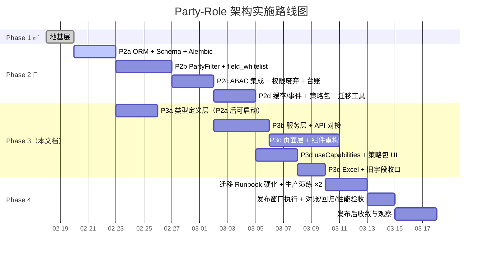
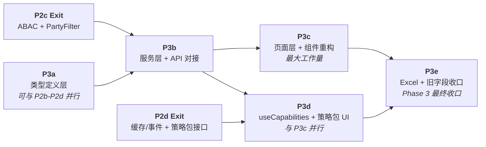

# Phase 3 实施计划：前端全量迁移 + 能力清单 + 策略包管理 UI + Excel 适配

**文档类型**: 实施计划  
**创建日期**: 2026-02-20  
**最后更新**: 2026-02-23（v1.49 — Day-0 产物预置：冻结模板/发布证据模板/@authz-minimal 骨架已入库）
**上游依赖**: [Party-Role 架构设计 v3.9](./2026-02-16-party-role-architecture-design.md) / [Phase 2](./2026-02-19-phase2-implementation-plan.md)  
**阶段定位**: Phase 2 后端域全量改造之上的前端全量迁移。**破坏性变更阶段**——替换全部旧主体字段类型、切换服务层接口参数、重构权限 Hook 与路由守卫、新增策略包管理页面。

---

## 0. 全局路线图定位



### Phase 2-3 并行规则

> [!IMPORTANT]
> - **P3a（类型定义层）** 可在 **P2a 完成后**即刻启动，与 P2b-P2d 并行。
> - **P3b（服务层）** 必须等 **P2c Exit + P3a Exit** 后启动（前者保障后端接口契约，后者保障前端类型可编译）。
> - **P3c** 依赖 P3b Exit。
> - **P3d** 必须等 **P2d Exit + P3b Exit** 后启动（策略包接口在 P2d 交付；权限主链改造可与 P3c 并行推进）。
>
> > [!NOTE]
> > **甘特图说明（v1.36）**：Mermaid Gantt 对“AND 双前置”表达能力有限，图中仅保留主依赖并以注释提示次依赖。执行时仍需按 Entry 门禁同时满足串行前置（P3b 需 P3a Exit；P3d 需 P2d Exit + P3b Exit；P3e 需 P3c Exit + P3d Exit）。
> - **P3e** 依赖 **P3c Exit + P3d Exit**，是 Phase 3 最终收口阶段（含旧字段物理移除）。
> - Phase 4 必须在 Phase 2 + Phase 3 **全部完成**后方可进入。

---

## 1. Phase 2 → Phase 3 衔接

> [!IMPORTANT]
> **v1.23 阻断最小路径（先后顺序冻结）**：
> 1. 后端契约先行：`/api/v1/parties?search=` + `project.party_relations[]` + capabilities `perspectives` 语义冻结（resource 维度或前端 override 二选一）。
> 2. 前端主链先行：`AppRoutes` 权限元数据 + `App.tsx` 守卫渲染链 + `/403` 落点策略（新增路由或内联 fallback 二选一）。
> 3. 权限单源收敛：`AuthContext/AuthStorage/usePermission/AuthGuard` 同批收敛到 `capabilities` 主链。
> 4. 最后收口：`rentContractExcelService` 真实请求路径修正后，再执行 Excel 字段迁移与旧字段清零。
>
> **v1.24 补充（来自深审）**：P3 正式启动前必须完成以下 Phase 2 前置补丁：
> - ABAC seed 覆盖扩展：至少覆盖 `party.read`、`project.read|list`、`rent_contract.*`、`property_certificate.*`、`asset.create|delete|export`。
> - 后端项目接口交付 `party_relations[]` 且修复 `ownership_relations=[]` 固定返回空数组问题。
> - ABAC 403 响应补充结构化拒绝标识（优先 `error.code=PERMISSION_DENIED`，可兼容 `error_code=AUTHZ_DENIED`）；若后端暂未交付，前端仅可使用 `detail` 模式降级匹配并记录误判率。
>
> **v1.26 承接归属补充（阻断项实名）**：上述前置补丁统一纳入 **Phase 2-patch**（后端承接批次），P3 仅消费交付结果；未满足时 P3b/P3d 不得以“前端临时绕过”替代。

**Phase 2-patch 工单追踪（P3 阻断项）**

| Patch 项 | 对应阻断 | 责任方 | 目标完成 | 状态 | 验收证据 |
|---|---|---|---|---|---|
| `/api/v1/parties?search=` 上线 | P3b Entry 硬门禁 | Backend API | P3b 前 | Open | OpenAPI/联调返回可按关键词过滤 |
| `ProjectResponse.coerce_project_model()` 去除 `ownership_relations=[]` 强制空数组写入 | P3b Entry 硬门禁 | Backend Project | P3b 前 | Open | 代码 diff + 旧项目返回非空关系 |
| `project` 响应交付 `party_relations[]`（存量 `ownership_relations[]` 由服务端转换） | P3b Entry 硬门禁 | Backend Schema | P3b 前 | Open | 集成测试或联调样本（含旧数据项目） |
| CORS 暴露请求链路追踪头（`expose_headers` 至少包含 `X-Request-ID` / `Request-ID`） | P3d `request_id` 观测可靠性前置 | Backend Platform | P3d 前 | Open | `backend/src/main.py` 配置 diff + 跨域联调可读取响应头 |
| 产权证接口契约冻结：`party_relations[]` 或 `owners[]` 兼容保留（二选一，必须书面冻结） | P3c 产权证页面改造门禁 | Backend PropertyCertificate + Frontend | P3c 前 | Open | 决策记录 + 联调样本 |
| ABAC 403 结构化拒绝标识（优先 `error.code=PERMISSION_DENIED`，可兼容 `error_code=AUTHZ_DENIED`） | P3d refresh 触发精确性 | Backend Authz | P3d 前 | Open | 403 响应样例 |
| capabilities 语义冻结（后端 per-resource 或前端 override） | P3d Entry 冻结门禁 | Backend Authz + Frontend | P3d 前 | Open | 设计决策记录 + 测试 |

> 状态枚举：`Open` / `In Progress` / `Done` / `Re-verify`（代码变化后需复核）。
> 执行要求：每日例会更新该列，禁止仅口头确认“已完成”。

> [!NOTE]
> 若某项未按时交付，必须在 P3 子阶段评审中显式登记“降级策略 + 风险 + 回收时点”，不得口头跳过门禁。
>
> **v1.25 勘误补充（就绪口径）**：
> - 策略包 seed **并非“无 DB 迁移”**，以 Alembic 迁移 `20260219_phase2_seed_data_policy_packages` 与 `20260221_backfill_expanded_policy_package_rules` 为准。
> - P3d Entry 必须新增“已执行到上述 revision”的门禁校验（仅“代码存在”不等于“环境已就绪”）。

Phase 2 交付物（Phase 3 依赖）：
- 后端 Schema 新旧字段并存（`Optional` 双模），Service 层自动映射兼容
- `PartyFilter` 全链路可用，`TenantFilter` 已清零
- ABAC 判定集成到业务 CRUD（`require_authz()` + `PartyFilter`）
- `GET /api/v1/auth/me/capabilities`（**Phase 1 已上线，Phase 2 持续可用**）能力清单端点可稳定消费
- `GET/PUT /api/v1/auth/roles/{role_id}/data-policies` 管理接口上线
- `GET /api/v1/auth/data-policies/templates` 策略模板接口上线
- 角色策略包 seed 数据就绪（7 包；以 Alembic `20260219_phase2_seed_data_policy_packages` + `20260221_backfill_expanded_policy_package_rules` **已执行**为准）
- 旧权限服务（`OrganizationPermissionService`/`OrganizationPermissionChecker`）已标记 deprecated

> [!CAUTION]
> 截至 `v1.21`，后端 `GET /api/v1/parties` 仍未交付 `search` 模糊检索参数；P3b 以此为硬门禁（见 §4.2 / §5.1），不得以“全量拉取+前端过滤”替代生产链路。

Phase 3 **目标**：前端全量完成 Party-Role 切换，使后端新字段成为前端唯一消费字段；旧字段在前端**运行时关键链路**零引用（组织架构并行模块例外，见 §4.3 与 §5.1 P3e 注记）。

---

## 2. 范围界定

| 包含 | 不包含（Phase 4） |
|---|---|
| `frontend/src/types/` 全量主体字段替换（`organization_id`→`owner_party_id`/`manager_party_id`，`ownership_id`→`owner_party_id` 等） | 后端旧列物理删除 |
| `frontend/src/services/` 请求参数与响应字段同步更新 | 后端 Schema 收紧必填 |
| 前端权限判定兼容现有后端资源名（`asset`）并新增 admin-only 守卫策略 | 后端 `require_authz` 资源名统一（`asset`→`user/role/system`） |
| `frontend/src/components/` + `pages/` 全量视图适配 | 数据迁移 Runbook 脚本硬化 |
| `usePermission` → `useCapabilities` Hook 重构 | 生产演练与发布窗口执行 |
| `PermissionGuard` → `CapabilityGuard` 路由守卫重构 | — |
| 角色管理页"数据策略包配置"区域新增 | — |
| Excel 导入导出模板字段适配 | — |
| 前端 `capabilities` 静默 refresh 防风暴 | — |
| Party 选择器通用组件 | — |
| 无资产项目"待补绑定"标签展示 | — |
| 前端单元测试 + 组件测试适配 | — |
| — | `Project` 顶层 `owner_party_id` 检索参数标准化（本期不纳入，Phase 4 评审后落地） |

**后端 resource_type 覆盖策略（Phase 3 执行口径）**

| 分类 | 范围 | Phase 3 前端策略 |
|---|---|---|
| 业务路由主覆盖 | `asset` / `project` / `rent_contract` / `ledger` / `party` / `property_certificate` | 路由守卫使用 `canPerform('read', resource)`；页面动作再细化 `create/update/delete/export` |
| 系统管理混用区 | `user` / `role` / `system` 及部分 fallback 到 `asset` 的端点 | 保持 `adminOnly`，不在 Phase 3 直接依赖 `canPerform('read','user|role|system')` |
| 未纳入本期资源 | 其余后端 `resource_type`（如 `attachment`/`notification`/`backup` 等） | 不作为 Phase 3 新增路由守卫对象；由后端鉴权主导，Phase 4 再做统一映射 |

> [!CAUTION]
> 后端 `resource_type` 实际枚举显著大于前端路由守卫覆盖面；本期必须按“覆盖子集”策略执行，避免误判为“前端已全量覆盖”。

---

## 3. 影响分析

### 3.1 前端旧字段引用统计

基于代码库 grep 扫描结果：

| 旧字段 | 影响文件数 | 主要分布 |
|---|---|---|
| `organization_id` | 9 | `pages/System/UserManagement/*` · `types/auth` · `types/organization` · `types/propertyCertificate(PropertyOwner 子接口)` · `services/systemService` · `services/organizationService` · `hooks/usePermission` |
| `ownership_id` | 25（主链）+1（`test-utils`） | types/asset · types/rentContract · types/project · types/pdfImport · services/asset/* · services/projectService · services/pdfImportService · pages/Rental/* · pages/Ownership/* · components/Forms/* · components/Asset/* · components/Rental/* · components/Project/* · components/Analytics/* |
| `management_entity` | 8 | types/asset · `types/rentContract(RentContractAsset 子接口)` · services/asset/assetDictionaryService · assetFormSchema · components/Asset/AssetBatchActions · components/Asset/assetExportConfig · components/Asset/AssetExportForm · components/Asset/AssetSearchResult |
| `ownership_entity` | 17（主运行链）+1（`mocks`）+1（`test-utils`） | types/asset · `types/rentContract(RentContractAsset 子接口)` · services/asset/* · `mocks/fixtures.ts`（MSW 开发/测试链）· pages/Assets/* · components/Asset/* · components/Charts/* · components/Rental/* · components/Project/* |
| `usePermission` | 7 | hooks/usePermission · components/System/PermissionGuard · components/Asset/AssetList · components/Router/RouteBuilder · components/Router/DynamicRouteContext · components/Router/DynamicRouteLoader · components/Router/index |
| `canAccessOrganization` | 1（生产消费 0） | hooks/usePermission（仅 Hook 内定义；生产代码无消费，测试残留） |

> [!NOTE]
> 以上计数用于工作量估算，不等同于“主接口字段命中数”。`propertyCertificate` 与 `rentContract` 的旧字段命中以**子接口语义位置**为准（`PropertyOwner` / `RentContractAsset`），执行改造时需先按语义归属再批量替换。
> `v1.26` 统计口径固定：`frontend/src/**/*.ts(x)`，排除 `__tests__/`、`tests/`、`test/`、`*.test.*`、`*.spec.*`。
> `v1.27` 补充：统计必须拆分为“主链命中（运行时）”与“残留命中（非主链/遗留模块）”，避免把 `components/Router/*` 等死代码残留误计入主链风险或被遗漏处置。
> `v1.28` 勘误：`test-utils/*` 不计入主链统计。`ownership_id` 与 `ownership_entity` 统一采用“主链 + test-utils 残留”双列示（25+1、18+1）。
> `v1.40` 口径修订：`mocks/fixtures.ts` 单独列示为“MSW 开发/测试链”，不计入主运行链门禁；但保留一次性迁移审计（见 §4.6 与 §5.2）。

### 3.2 新增前端文件预估

| 文件 | 说明 |
|---|---|
| `types/party.ts` | Party / PartyHierarchy / PartyContact 类型 |
| `types/capability.ts` | Capabilities 能力清单类型 |
| `types/dataPolicy.ts` | 数据策略包类型 |
| `services/partyService.ts` | Party CRUD 服务 |
| `services/capabilityService.ts` | 能力清单拉取与缓存服务 |
| `services/dataPolicyService.ts` | 策略包管理服务 |
| `utils/authz/capabilityEvaluator.ts` | 权限判定纯函数（`useCapabilities`/`AuthContext` 共享） |
| `hooks/useCapabilities.ts` | 新权限 Hook（替代 `usePermission`） |
| `components/System/CapabilityGuard.tsx` | 新路由守卫组件 |
| `components/Common/PartySelector.tsx` | Party 选择器通用组件 |
| `components/Common/AuthzErrorBoundary.tsx` | 权限拒绝 UI 提示组件 |
| `pages/System/DataPolicyManagementPage.tsx` | 策略包管理页面 |
| **合计** | **~12 新增** |

---

## 4. 变更清单

### 4.1 类型定义层（P3a）

> [!CAUTION]
> P3a 类型变更采用**标记 deprecated + 新增**策略：旧字段保留定义并标记 `@deprecated`，新字段同步新增。  
> 这样 P3b/P3c/P3d 可渐进逐文件切换，不会因旧字段类型定义移除导致全面编译崩溃。  
> 旧字段类型定义在 **P3e Exit** 统一移除，作为 Phase 3 最终收口动作。

> [!NOTE]
> P3a 可在 P2a（ORM + Schema 结构变更）完成后启动，是 Phase 3 中最早可以并行推进的部分。

---

#### [NEW] `types/party.ts`

```typescript
/** Party 主体类型 */
export type PartyType = 'organization' | 'legal_entity' | 'individual';

export interface Party {
  id: string;
  party_type: PartyType;
  name: string;
  code: string;
  external_ref?: string | null;
  status: string;
  metadata?: Record<string, unknown>;
  created_at: string;
  updated_at: string;
}

export interface PartyListParams {
  party_type?: PartyType;
  status?: string;
  skip?: number;
  limit?: number;
}

export interface FrontendPartyHierarchyEdge {
  /** 前端内部树组装辅助类型（非后端原始响应）。
   *  后端“层级”接口返回子 Party ID 列表（list[str]），此接口用于补充 parent/child 边关系。 */
  id: string;
  parent_party_id: string;
  child_party_id: string;
}

export interface PartyContact {
  id: string;
  party_id: string;
  contact_name: string;
  contact_phone?: string;
  contact_email?: string;
  notes?: string;
  is_primary: boolean;
}

/** 产权证-Party 关联关系（对应后端 certificate_party_relations 表） */
export interface CertificatePartyRelation {
  id: string;
  certificate_id: string;
  party_id: string;
  party?: Party;
  relation_role: 'owner' | 'co_owner' | 'issuer' | 'custodian';
  is_primary: boolean;
  share_ratio?: number | null;
  valid_from?: string | null;
  valid_to?: string | null;
}
```

#### [NEW] `types/capability.ts`

```typescript
/** 后端标准 ABAC 动作（与 authz.py:8 对齐） */
export type StandardAuthzAction =
  | 'create'
  | 'read'
  | 'list'
  | 'update'
  | 'delete'
  | 'export';

/** canPerform 标准动作；不包含临时豁免动作 */
export type AuthzAction = StandardAuthzAction;

/** Phase 3 临时豁免动作（不来自 capabilities.actions） */
export type TemporaryAdminAction = 'backup'; // TODO(P4): migrate to system.backup ABAC rule

/**
 * 路由元数据推荐使用 KnownResourceType，覆盖本期主资源。
 * Capability.resource 保持前向兼容：允许后端新增 resource_type 字符串透传。
 */
export type KnownResourceType =
  | 'asset'
  | 'project'
  | 'rent_contract'
  | 'ledger'
  | 'party'
  | 'system'
  | 'property_certificate';
export type ResourceType = KnownResourceType | (string & {});

/** 能力清单（与设计文档 §5.1 / Phase 1 GET /api/v1/auth/me/capabilities 对齐） */
export interface Capability {
  resource: ResourceType;
  actions: AuthzAction[];
  perspectives: string[];
  // 注意：按每个 CapabilityItem 读取 data_scope，不假设跨 resource 恒等
  data_scope: {
    owner_party_ids: string[];
    manager_party_ids: string[];
  };
}

export interface CapabilitiesResponse {
  version: string;
  generated_at: string;
  capabilities: Capability[];
}
```

> [!NOTE]
> `StandardAuthzAction` / `AuthzAction` 与 `KnownResourceType` / `ResourceType` 需同步导出到 `types/index.ts`。路由元数据优先用 `KnownResourceType` 做穷举约束；能力清单解析使用 `ResourceType` 保持与后端新增资源的前向兼容。

> [!IMPORTANT]
> Capability 合并规则冻结（P3d 开工后首个实现任务，**P3d Exit 前必须落地到 `capabilityEvaluator`**）：当 `capabilities[]` 中存在同一 `resource` 的多条记录时，按 `resource` 分组执行并集归并（`actions` 去重并集；`data_scope.owner_party_ids/manager_party_ids` 去重并集；`perspectives` 采用 `frontend override > backend union`）。禁止“仅取第一条”或“后值覆盖前值”。

> [!NOTE]
> `read` / `list` 使用规则冻结：路由首层守卫统一使用 `read`；`list` 仅用于列表 API 与按钮级精细权限，不作为页面可达性前置条件。


#### [NEW] `types/dataPolicy.ts`

```typescript
/** 数据策略包模板（管理面，与 Phase 2 §4.9 + 当前后端 DataPolicyService 对齐）
 *  后端 `list_templates()` 返回 `dict[str, {name, description}]`，前端需适配。
 */
export interface DataPolicyTemplate {
  code: string;
  name: string;
  description: string;
}

/** 角色-策略包绑定（后端 GET /roles/{role_id}/data-policies 返回 {role_id, policy_packages: string[]} ） */
export interface RoleDataPolicies {
  role_id: string;
  policy_packages: string[];
}

/** 更新请求体（后端 PUT 接受 {policy_packages: string[]}） */
export interface RoleDataPolicyUpdatePayload {
  policy_packages: string[];
}
```

#### [MODIFY] `types/asset.ts`

- 标记 `@deprecated`：`ownership_id`, `management_entity`, `ownership_entity`（P3a 保留定义，P3e 移除）
- 新增：`owner_party_id?: string`（P3a 可选→ P3e 收紧为必填）
- 新增：`manager_party_id?: string`（同上）
- 保留：`project_id`（资产-项目关联键，与 Party-Role 主体迁移无直接冲突，本期不 deprecated）
- 保留：`project_name` 标记 `@deprecated`
- 新增关联：`owner_party?: Party`, `manager_party?: Party`

> [!NOTE]
> 新 Party 字段在 P3a 定义为可选（`?`），避免 P3a 单独提交时触发大面积类型报错。
> 随 P3b/P3c 逐文件过渡，P3e 收口时统一收紧为必填。

#### [MODIFY] `types/rentContract.ts`

- `RentContract` 主接口：
  - 标记 `@deprecated`：`ownership_id`（P3e 移除）
  - 新增：`owner_party_id?: string`, `manager_party_id?: string`, `tenant_party_id?: string | null`（P3a 可选）
  - **P3e 收紧语义冻结**：`tenant_party_id: string`（必填且非 `null`）
- `RentContractAsset` 子接口：
  - 标记 `@deprecated`：`management_entity`, `ownership_entity`（P3e 移除）
  - 新增：`owner_party_id?: string`, `manager_party_id?: string`（P3a 可选，P3e 收紧）
- 保留：`owner_name`, `owner_contact`, `owner_phone`（只读快照）
- 排查结论：`types/rentContract.ts` 不存在 `project_name` 字段，无需迁移
- **全量迁移范围（v1.26 勘误）**：文件内所有含 `ownership_id/ownership_ids` 的类型均纳入 P3a→P3e 迁移（共 12 处），不只限 `RentContract`/`RentContractAsset`：`RentContract`、`RentLedger`、`RentContractCreate`、`RentContractUpdate`、`RentLedgerCreate`、`OwnershipRentStatistics`、`RentStatisticsQuery`、`RentContractQueryParams`、`RentLedgerQueryParams`、`RentContractFormData.basicInfo`、`RentContractSearchFilters`、`RentLedgerSearchFilters` 等。
- **统计口径专项**：`OwnershipRentStatistics` 在迁移 `ownership_id -> owner_party_id` 的同时，`ownership_name` / `ownership_short_name` 同步迁移为 `owner_party_name`（避免统计层残留旧语义字段名）。

#### [MODIFY] `types/project.ts`

- 现状对齐：前端 `Project` 顶层无 `organization_id` / `management_entity` / `ownership_entity`；旧权属链路位于嵌套 `ownership_relations[].ownership_id`
- 新增：`manager_party_id?: string`（与后端 `ProjectBase.manager_party_id` 对齐）
- `ownership_relations` 迁移策略（专项）：
  1. P3a：保留 `ownership_relations` 定义并标记 `@deprecated`（含嵌套 `ownership_id`）
  2. P3b：后端兼容层负责 `ownership_relations[] -> party_relations[]` 转换；前端 `projectService` 仅消费/提交 `party_relations[]`，不承担旧结构回显转换
  3. P3e：前端运行时与类型层移除 `ownership_relations[].ownership_id` 直接消费，统一使用 `party_relations[]`
- `ProjectSearchParams.ownership_id` 标记 `@deprecated`，新增 `manager_party_id?: string`（项目列表检索口径统一）
- `party_relations[]` 字段契约显式化（避免实现歧义）：
  - `party_id: string`
  - `party_name?: string`
  - `relation_type: 'owner' | 'manager' | 'tenant' | 'other'`
  - `is_primary?: boolean`

#### [MODIFY] `types/propertyCertificate.ts`

- 标记 `@deprecated`：`PropertyOwner.organization_id`（P3e 移除；非 `PropertyCertificate` 顶层字段）
- 不新增 `party_id` 字段——产权证主体关系通过 `certificate_party_relations`（Phase 1 已建）获取
- 新增可选关联：`party_relations?: CertificatePartyRelation[]`（引用 `types/party.ts` 中新增的关联类型）

#### [MODIFY] `types/auth.ts`

- `AuthState` 接口（或同等顶层结构）新增 `capabilities?: Capability[]` 引用
- 角色相关类型新增 `data_policies?: RoleDataPolicies`（对应 `types/dataPolicy.ts` 中的同名类型）
- `default_organization_id` 在 Phase 3 保持兼容（不改名）；待后端交付 `default_party_id` 后在 Phase 4 迁移。

#### [MODIFY] `hooks/usePermission.tsx`

- `UserPermissions` 接口移除 `organizationId?: string`
- 整个模块后续将重定向到 `useCapabilities`
- 生命周期约束：
  - P3d：仅允许 `usePermission` 作为兼容壳（内部代理 `useCapabilities`），禁止新增直接读取 `AuthStorage.permissions` 的逻辑
  - P3e：物理删除 `usePermission.tsx`，运行时唯一权限来源收敛到 `AuthContext.capabilities`

#### [MODIFY] `types/pdfImport.ts`

- `ownership_id` 标记 `@deprecated`，新增 `owner_party_id?: string`（P3a 可选，P3e 收紧）

#### [MODIFY] `types/organization.ts`

- 整个模块标记 `@deprecated`（Party 体系替代）
- 保留类型定义，但添加 TSDoc `@deprecated` 注释
- 下游引用逐步切换到 `Party`

#### [MODIFY] `types/ownership.ts`

- 整个模块标记 `@deprecated`
- 保留类型定义 + `@deprecated` 注释

---

### 4.2 服务层 + API 对接（P3b）

> [!IMPORTANT]
> P3b 必须等 P2c Exit（后端 ABAC 集成 + PartyFilter 完成）后启动。

---

#### [NEW] `services/partyService.ts`

- `getParties(params)` → `GET /api/v1/parties` （支持 `skip`/`limit`/`party_type`/`status` 查询参数）
- `searchParties(query, params)` → `GET /api/v1/parties?search=<keyword>&limit=<n>`（P3b+ 默认搜索路径）
- `getPartyById(id)` → `GET /api/v1/parties/{id}`
- `createParty(data)` → `POST /api/v1/parties`
- `updateParty(id, data)` → `PUT /api/v1/parties/{id}`
- `getPartyHierarchy(partyId)` → `GET /api/v1/parties/{id}/hierarchy`（返回 `list[str]`，前端自行组装树结构）

> [!WARNING]
> 当前后端 `/parties` 无 `search` / 模糊搜索参数，且 `limit` 上限为 1000（`party.py:30`）。  
> **v1.19 决策**：不将“全量拉取 + 前端过滤”固化为生产方案；`/parties?search=` 为 P3b **硬门禁**。
>
> **v1.21 执行补充（阻断项归属）**：
> - `search` 接口交付归属为后端前置补丁（Phase 2.x 或 P3b-Day0 联动任务），未交付前 P3b 不得启动。
> - 推荐同批交付分页信封 `{items,total,skip,limit}`；若后端暂未提供，前端需在 `partyService` 显式标注“`result.length === limit` 仅为截断近似判断”。
>
> **执行策略（两级）**：
>
> | 级别 | 决策 | 约束 |
> |---|---|---|
> | Level 1（硬门禁） | P3b Entry 前必须交付后端 `search` 接口（`GET /api/v1/parties?search=...`） | 见 §5.1 P3b Entry 门禁 |
> | Level 2（过渡降级） | `PartySelector` 采用 `fetcher(query)` 架构；仅在 P3a 本地联调阶段允许“全量拉取+前端过滤”fetcher | 后端 `search` 上线后仅替换 fetcher，不重写组件主体 |
>
> **三档阈值语义**（仅用于 Level 2 降级模式）：
>
> | 现网存量 / 返回数 | 现象 | 处理 |
> |---|---|---|
> | 返回数 < 500 | 正常范围 | 无提示 |
> | 500 ≤ 返回数 < 1000 | 可选项偏多 | 顶部 Banner："可选项较多，请输入关键词缩小范围"；禁用"显示全部" |
> | 返回数 = 1000 | 命中后端上限，结果已截断 | 额外提示"结果已截断，请缩小筛选条件" |
>
> **v1.32 可观测性补充（Level 2 降级必打点）**：
> - 每次查询统一上报：`result_count`、`is_truncated`、`search_query_length`（可选补充 `fetch_mode=search|full_fetch_fallback`）。
> - 目的：为后端分页信封与前端阈值策略调整提供客观依据，避免仅凭主观体感调参。

#### [NEW] `services/capabilityService.ts`

- `fetchCapabilities()` → `GET /api/v1/auth/me/capabilities`
- 会话级缓存：登录后拉取一次，token refresh 后重拉
- 导出 `getCapabilities()` 供 Hook 消费

#### ~~`services/dataPolicyService.ts`~~ → 移至 P3d（见 §4.4）

> [!NOTE]
> `dataPolicyService.ts` 消费的后端接口（策略包管理端点）在 **P2d** 才交付。因此创建放在 **P3d**（其 Entry 已要求 P2d Exit）。

#### [MODIFY] `services/assetService.ts` + `services/asset/*.ts`

| 变更点 | 说明 |
|---|---|
| 请求参数 | `organization_id`→`manager_party_id`；`ownership_id`→`owner_party_id` |
| 响应解析 | 新增 `owner_party_id`/`manager_party_id` 字段映射 |
| 过滤参数 | `ownership_entity`/`management_entity` → `owner_party_id`/`manager_party_id` |
| `asset/types.ts` | `ownership_id`/`ownership_entity` → `owner_party_id` |
| `asset/assetDictionaryService.ts` | `ownership_entity`/`management_entity` 过滤参数迁移 |
| `asset/assetImportExportService.ts` | 经复核无旧字段直接命中；调整为“模板契约审计 + 回归验证”（非字段迁移） |

#### [MODIFY] `services/projectService.ts`

- 搜索参数：`ownership_id` 标记 deprecated，新增并优先使用 `manager_party_id`
- 嵌套关系：前端统一消费并提交 `party_relations[]`；旧结构（`ownership_relations[]`）转换责任固定在后端兼容层
- 映射约束（v1.36 冻结）：**禁止前端硬编码 `ownership_to_party_map`，且不引入前端旧新结构转换逻辑**。如需临时例外，必须先在变更评审中升级为后端契约补丁，不得在前端服务层落地“过渡映射”。
- **P3b 契约门禁（v1.19）**：后端项目相关 API 对前端返回体必须始终提供 `party_relations[]`（即使底层仍为 `ownership_relations[]` 存量数据也需服务端转换）。前端在 Phase 3 期间仅消费 `party_relations[]`，不承担旧结构回显转换责任。
- **v1.24 阻断补充**：P3b Entry 前必须修复后端 `ProjectResponse.coerce_project_model()` 中 `ownership_relations` 固定空数组问题；否则 `party_relations[]` 转换链路无有效源数据，P3b/P3c 联调将失真。

#### [MODIFY] `services/rentContractService.ts`

- `ownership_id` → `owner_party_id`
- 新增 `manager_party_id`、`tenant_party_id` 参数
- 后端契约对齐说明：`tenant_party_id` 已存在于后端 `RentContract` 模型，按正式字段执行迁移，不作为“预留字段”。

#### [MODIFY] `services/rentContractExcelService.ts`

- **先修真实请求路径（P3e Entry 前置）**：`baseUrl='/api/rental'` → 相对 `apiClient.baseURL` 的 `/rental-contracts/*`（禁止写 `/api/v1/*` 以避免双前缀）
- **v1.24 路径探针门禁**：在改造前先验证旧路径现状（`/api/rental/excel/template`）。若返回 404/405，按“线上已坏”优先级立即修复，不得延后到 P3e 末尾。
- **v1.26 客户端来源门禁**：改造前必须确认该服务复用统一 `apiClient`（非独立 axios 实例），并记录 `API_BASE_URL/VITE_API_BASE_URL` 实际值，避免“相对路径正确但 baseURL 错误”造成隐性断路。
- **v1.28 baseURL 断言**：P3e Entry 前必须确认 `apiClient.baseURL` 最终包含 `/api/v1`（或等价前缀），避免 `/rental-contracts/*` 在无版本前缀环境下落到 `/rental-contracts/*` 404。
- Excel 导入/导出字段映射适配

#### [MODIFY] `services/systemService.ts`

- `getUsers()` 查询参数中的 `organization_id` 纳入迁移清单：P3b 改为 Party 口径查询参数（优先 `party_id` / `owner_party_id`，具体命名以后端接口契约为准），旧参数仅作过渡兼容并标记 `@deprecated`。
- 用户默认归属字段（`v1.21` 修正）：后端当前仅存在 `default_organization_id`（无 `default_party_id` 字段）。Phase 3 保持提交 `default_organization_id` 不变；若后端后续新增 `default_party_id`，再以后端契约版本为门禁执行迁移（不得前端先行改名）。
- **v1.24 例外口径修正**：`systemService.ts` 中 `default_organization_id -> organization_id` 参数映射属于后端现网契约兼容，Phase 3 不强制移除；P3e 门禁 grep 对该文件显式排除，待后端交付 `default_party_id` 后在 Phase 4 再迁移。

#### [MODIFY] `services/pdfImportService.ts`

- `ownership_id` 参数 → `owner_party_id`

#### [MODIFY] `services/organizationService.ts`

- 标记 `@deprecated`，保留原始实现供组织架构页面继续使用
- **不重定向到 `partyService`**（Party API 能力不足，见 §4.3 IMPORTANT）
- 保留全部导出

#### [MODIFY] `services/ownershipService.ts`

- 标记 `@deprecated`

#### [MODIFY] `services/authService.ts` 与 `contexts/AuthContext.tsx`

- **冷启动与会话恢复链路闭环**：在 `AuthContext` 初始化的 `restoreAuth()` 中，当会话恢复成功（用户信息拉取成功）后，**必须强制拉取 capabilities**，避免浏览器刷新后 capabilities 为空导致路由被误拦截。

  **插入位置（语义锚点）**：
  - `restoreAuth()` 的 stored-user 恢复分支中，`persistAuthDataSafely(currentUser, permissions, authPersistence)` 调用之后
  - `restoreAuth()` 的 cookie 恢复分支中，`persistAuthDataSafely(currentUser, permissions, 'session')` 调用之后
  - `login()` 中 `setUser(response.data.user)` 调用之后
  ```typescript
  // 会话恢复/登录成功后强制拉取 capabilities（冷启动链路闭环）
  // 失败降级为空数组；路由守卫需在 capabilitiesLoading === true 时保持 loading，不执行 deny
  if (isMounted) setCapabilitiesLoading(true);
  try {
    const caps = await capabilityService.fetchCapabilities();
    if (isMounted) setCapabilities(caps);
  } catch {
    if (isMounted) setCapabilities([]);
  } finally {
    if (isMounted) setCapabilitiesLoading(false);
  }
  ```
  同样的调用在 `refreshUser()` / token refresh 成功后也需加入。
- **v1.24 竞态补充**：`restoreAuth()` 的所有失败/提前退出分支（token 无效、网络异常、会话过期）必须保证 `capabilitiesLoading=false`（建议统一放在 `finally`）；并建议在开发模式使用 `AbortController` 取消 Strict Mode 双调用的过期请求，避免重复请求竞态噪声。

- **capabilities 降级约定**：拉取失败时降级为空数组，`AuthContextType` 新增 `capabilitiesLoading: boolean` 字段，路由守卫在该字段为 `true` 时**只显示 loading，不执行 deny 判定**。
- **登录/refresh 成功后拉取 capabilities**（同上骨架，login + refreshUser 均需添加）
- `isAdmin` 来源冻结：`AuthContextType` 显式新增 `isAdmin: boolean`（`= user?.is_admin ?? false`），`adminOnly` 守卫只读该字段，不使用来源不明的裸变量。
- 运行时单一权限数据源：`canPerform`/路由守卫统一读取 `AuthContext.capabilities`；`AuthService.hasPermission()/getLocalPermissions()` 仅允许用于过渡期兼容（P3d 清理，P3e 禁用）。
- `capabilities` 存储策略（v1.11 定版）：
  - 主存：`AuthContext` React state（运行时唯一判定源）
  - 持久化：`AuthStorage.capabilities`（允许写入）
  - TTL：10 分钟（超时即视为冷缓存）
  - 变更校验（`v1.21` 修正）：不使用 `CapabilitiesResponse.version` 作为权限变更判据（该字段为协议版本）；改为比较 `generated_at` 或能力列表签名（hash）后决定是否覆盖本地缓存
  - 失效时机：token refresh 成功后强制重拉并覆盖缓存

  **接口补充（避免实现歧义）**：
  - `AuthContextType` 新增：`capabilities: Capability[]`、`capabilitiesLoading: boolean`、`refreshCapabilities: () => Promise<void>`、`isAdmin: boolean`
  - `AuthProvider` 状态默认值：`capabilities = []`；`capabilitiesLoading` 采用 token 感知初始化（建议 `hasToken ? true : false`），防止冷启动阶段在 `restoreAuth` 完成前误触发 deny
  - `types/auth.ts` 的 `AuthState`（或等价顶层状态）需与上述字段保持一致
  - `AuthStorage` 字段定义（**P3d [NEW]，当前实现默认仅有 `user/permissions`**）：`capabilities?: Capability[]`、`capabilities_cached_at?: string`、`capabilities_version?: string`
  - `capabilities_version` 用途冻结：仅用于记录 capabilities 协议版本/兼容观测，**不得**作为权限变更判据（变更判据仍以 `generated_at` / hash 为准）
  - 共享判定器：新增 `utils/authz/capabilityEvaluator.ts`（或等价位置）的纯函数（如 `evaluateCapability()` / `hasPartyScopeAccess()`），供 Hook 与 Context 兼容导出共享

- **`AuthContext.hasPermission` 迁移路径冻结（v1.12 决策）**：
  - P3d：保留 `AuthContext.hasPermission` / `hasAnyPermission` 导出以维持调用方兼容，但内部实现改为调用共享纯函数（与 `useCapabilities` 同源），并标记 `@deprecated`。
  - P3d：**禁止在 `AuthContext.Provider` 内部调用 `useCapabilities` Hook**，避免 Hook 反向依赖 Context 造成循环依赖/非法调用。
  - P3d：禁止 `AuthContext` 内部继续直调 `AuthService.hasPermission/getLocalPermissions/hasAnyPermission`，以满足“运行时单一权限数据源（`AuthContext.capabilities`）”目标。
  - P3d：执行调用方迁移盘点，至少覆盖 `useAuth().hasPermission` / `useAuth().hasAnyPermission` 的全部生产引用；新增/修改代码禁止继续引入旧接口调用。
  - P3e：物理移除 `AuthContext.hasPermission` / `hasAnyPermission` 及其调用方残留，仅保留 `useCapabilities().canPerform()` 路径。

- **v1.23 权限单源执行约束（P3d Exit 硬门禁）**：
  - `AuthContext` 的路由守卫判定来源必须收敛为 `capabilities`；`/roles/users/{id}/permissions/summary` 仅允许用于过渡展示，不得作为路由放行主链。
  - `AuthStorage` 必须具备 `capabilities` 缓存字段并接入 `AuthContext` 恢复链路；禁止仅持久化旧 `permissions` 后参与守卫判定。

  **调用方盘点命令（P3d Entry 建议执行）**：
  ```bash
  grep -rEn "useAuth\(\)\.(hasPermission|hasAnyPermission)|\bhasPermission\(" frontend/src/ \
    --include="*.ts" --include="*.tsx" --exclude-dir="__tests__" --exclude-dir="test" --exclude-dir="test-utils"
  ```


#### [REVIEW] `services/statisticsService.ts`

- 经复核该文件当前未命中旧主体字段；P3b 仅做契约审计，若接口参数确认仍为 `ownership_id` 再执行迁移为 `owner_party_id`。

#### [REVIEW] `services/analyticsService.ts` / `services/analyticsExportService.ts`

- 经复核当前无旧主体字段命中；本阶段默认不改代码，仅保留契约抽检与回归验证。

---

### 4.3 页面层 + 组件重构（P3c）

---

#### [NEW] `components/Common/PartySelector.tsx`

可复用的 Party 选择器（带搜索、异步加载）：
- 支持 `filter_mode: 'owner' | 'manager' | 'tenant' | 'any'` 筛选
- 采用 `fetcher(query)` 可替换数据源架构（**P3b+ 默认 fetcher 必须走 `partyService.searchParties(query)`**；“全量拉取 + 前端过滤”仅允许 P3a 本地联调临时降级并需显式开关）
- 选中后返回 `party_id` + `party_name`
- 用于资产表单、合同表单、项目表单中替换旧的组织/权属选择器
- 必须定义空数据态与 403 态：无数据时提示“请先创建主体数据”；403 时提示“当前账号无 `party.read` 权限，请联系管理员”。

> [!NOTE]
> 自然人主体口径：若后端 `party_type` 枚举尚未交付 `individual`，前端在 P3 阶段按“可读可透传、不在 UI 主流程强依赖创建”执行；待后端枚举确认后再将创建/筛选默认项转正。

#### [NEW] `components/Common/AuthzErrorBoundary.tsx`

权限拒绝交互组件（设计文档 §5.2 要求）：
- 前端关键写操作收到 403 时，显示“权限已更新，请刷新会话”提示
- 配合静默 refresh 防风暴（§4.5）使用
- 提供 Toast / Banner 两种展示形态
- `capabilities` 静默 refresh 成功后触发 UI 自愈：自动刷新当前视图（如 React Query invalidate）并重算按钮/菜单可见性，避免“幽灵按钮”停留

> [!NOTE]
> 当前后端未实现 `X-Authz-Stale` 响应头。静默 refresh 触发需满足 `403` 且错误体命中权限拒绝标识（如 `code=PERMISSION_DENIED`）；未命中时不触发 refresh。
> 如后端后续增加该 header，前端可叠加作为更精确的触发信号。

#### [MODIFY] 资产模块（10+ 文件）

| 文件 | 变更 |
|---|---|
| `components/Forms/AssetForm.tsx` | 旧组织/权属选择器 → `PartySelector`（owner + manager） |
| `components/Forms/Asset/AssetBasicInfoSection.tsx` | `ownership_id` → `owner_party_id` 表单字段 |
| `components/Asset/AssetList.tsx` | 过滤条件替换 + 权限判定改 `useCapabilities` |
| `components/Asset/AssetSearch.tsx` | `ownership_id` 搜索条件 → `owner_party_id` |
| `components/Asset/AssetSearch/AdvancedSearchFields.tsx` | 同上 |
| `components/Asset/AssetSearchResult.tsx` | 显示字段替换 |
| `components/Asset/AssetDetailInfo.tsx` | `ownership_entity` 显示 → Party name |
| `components/Asset/AssetCard.tsx` | `ownership_entity` → Party name |
| `components/Asset/AssetBatchActions.tsx` | `management_entity` 批量操作 → `manager_party_id` |
| `components/Asset/AssetExportForm.tsx` | 导出字段映射 |
| `components/Asset/assetExportConfig.ts` | 导出配置字段 |
| `src/assetFormSchema.ts` | 表单验证 schema 字段替换（根级文件，非 `components/` 子目录） |
| `pages/Assets/AssetCreatePage.tsx` | 创建时使用新字段 |
| `pages/Assets/AssetDetailPage.tsx` | 详情展示适配 |
| `pages/Assets/AssetListPage.tsx` | 列表过滤适配 |
| `pages/Assets/components/AssetCard.tsx` | 卡片显示适配 |
| `pages/Assets/components/AssetFilters.tsx` | 过滤器字段替换 |

#### [MODIFY] 合同模块（8+ 文件）

| 文件 | 变更 |
|---|---|
| `components/Forms/RentContract/RelationInfoSection.tsx` | `ownership_id` → `owner_party_id` + `manager_party_id` + `tenant_party_id` |
| `components/Forms/RentContract/RentContractFormContext.tsx` | 上下文字段替换 |
| `components/Rental/ContractList/ContractFilterBar.tsx` | 筛选条件适配 |
| `components/Rental/ContractDetailInfo.tsx` | `ownership_entity` 显示 → Party name |
| `components/Rental/RentContractExcelImport.tsx` | 经复核无旧字段直接命中；保留导入流程联动验证（非字段迁移） |
| `pages/Rental/ContractListPage.tsx` | 列表页适配 |
| `pages/Rental/ContractRenewPage.tsx` | 续签页 `ownership_id` → `owner_party_id` |
| `pages/Rental/RentLedgerPage.tsx` | 台账页 `ownership_id` 过滤 → `owner_party_id` |
| `pages/Rental/RentStatisticsPage.tsx` | 统计页维度替换 |
| `pages/Contract/ContractImportReview.tsx` | 导入审核带入新字段 |

#### [MODIFY] 项目模块（8+ 文件）

| 文件 | 变更 |
|---|---|
| `types/project.ts` | `ownership_relations[].ownership_id` deprecated；新增/统一 `manager_party_id` + `party_relations[]` |
| `services/projectService.ts` | 仅消费/提交 `party_relations[]`；搜索参数迁移；禁止前端旧结构转换 |
| `components/Forms/ProjectForm.tsx` | 组织选择器 → `PartySelector`（manager）；关系编辑从 ownership 迁移为 Party |
| `components/Project/ProjectList.tsx` | 列表过滤 `ownership_id` deprecated；新增 `manager_party_id` 过滤 |
| `hooks/useProject.ts` | `ownership_id` 查询口径迁移为 `manager_party_id` |
| `pages/Project/ProjectManagementPage.tsx` | 项目列表/筛选参数适配新字段 |
| `pages/Project/ProjectDetailPage.tsx` | 详情关系展示改为 Party 口径（含兼容 fallback） |
| `test-utils/factories/projectFactory.ts` | 测试工厂字段迁移（含关系结构） |
| 项目详情页 | 无资产项目显示"待补绑定"标签；面积统计显示 `N/A` |

#### [MODIFY] 产权证模块

- 契约冻结规则（P3c Entry 前必须二选一并留痕）：
  1. 后端交付 `party_relations[]`：前端按 Party 口径展示权利人关系
  2. 后端暂不交付：前端保持 `owners[]` 兼容读取，页面层仅清理 `organization_id` 直传写入；产权证 Party 全量切换顺延 Phase 4
- `pages/PropertyCertificate/*` 改造口径：禁止新增顶层 `party_id` 字段；采用 `party_relations ?? owners` 的显式兼容读取，避免契约摇摆导致页面断裂

#### [MODIFY] 权属模块

- `pages/Ownership/OwnershipDetailPage.tsx`：`ownership_id` → `owner_party_id`
- `pages/Ownership/OwnershipManagementPage.tsx`：模块级 deprecated 标记或引导到 Party 管理（经复核无旧字段迁移动作）

#### [MODIFY] 图表与分析组件（5+ 文件）

| 文件 | 变更 |
|---|---|
| `components/Charts/AssetDistributionChart.tsx` | `ownership_entity` 维度 → Party 维度 |
| `components/Charts/OccupancyRateChart.tsx` | 同上 |
| `components/Charts/AreaStatisticsChart.tsx` | 同上 |
| `components/Analytics/Filters/FiltersSection.tsx` | 过滤器主体字段替换 |
| `pages/Assets/AssetAnalyticsPage.tsx` | 分析页适配 |

#### [MODIFY] 系统管理模块

> [!IMPORTANT]
> **组织架构页面处理策略：保留并行运行，Phase 3 不下线。**
>
> 当前 `organizationService.ts`（约 688 行，随提交波动）提供树/搜索/历史/批量/移动/导入导出等能力，远超 Party API 的基础 CRUD + hierarchy。
> 组织架构页面（`/system/organizations`）继续使用 `organizationService`，不在 Phase 3 调整。
> 后续待 Party API 能力对齐后，可在 Phase 4+ 计划组织页面向 Party 迁移或下线。
>
> `organizationService.ts` 在 Phase 3 标记 `@deprecated`，但**不删除**，不重定向到 `partyService`。
>
> **v1.19 一致性门禁（P0）**：
> - P3c 执行策略必须先冻结其一：A) 后端已交付 `organizations ↔ parties` 双向同步机制并完成联调；B) `/system/organizations` 切换为只读（禁用新增/编辑/移动/导入）。
> - 若两项均不满足，P3c 不得进入页面改造主任务，避免“组织树可改、PartySelector 不可见”的脑裂状态。
>
> **v1.21 执行冻结**：
> - 默认执行 **方案 B（组织页只读）** 作为 P3c Day-1 第一个任务，明确归属前端实现与验收。
> - 仅当后端在 P3c Entry 前已提供可用的运行时双向同步能力并完成联调，才可切换为方案 A；否则不得跳过只读改造。
>
> **v1.24 只读范围具体化**：方案 B 至少禁用“新增/编辑/删除/移动/导入”五类写入口，并在 `organizationService` 写方法增加保护性拦截（返回友好错误），避免仅 UI `disabled` 被绕过。

| 文件 | 变更 |
|---|---|
| `pages/System/UserManagement/index.tsx` | `organization_id` → Party 关联 |
| `pages/System/UserManagement/hooks/useUserManagementData.ts` | 同上 |
| `pages/System/UserManagement/components/UserFormModal.tsx` | 组织选择 → Party 选择 |
| `pages/System/TemplateManagementPage.tsx` | Excel 模板字段适配 |

#### [REVIEW] Store 层

| 文件 | 变更 |
|---|---|
| `store/useAssetStore.ts`（或同名） | 经复核无 `organization_id`/`ownership_id`/`management_entity`/`ownership_entity` 命中，本阶段**无需改造**；P3c Exit 仅保留审计验证 |

#### [MODIFY] Utils 层

| 文件 | 变更 |
|---|---|
| `utils/assetCalculations.ts` | `ownership_id` 引用 → `owner_party_id`（当前无 `ownership_entity` 命中） |

> [!NOTE]
> `assetFormSchema.ts` 与 `utils/assetCalculations.ts` 需落到具体代码位点：
> - `assetFormSchema.ts`：`ownership_id` 的 Zod 必填校验改为 `owner_party_id`
> - `utils/assetCalculations.ts`：`checkAssetDataCompleteness().requiredFields` 必填数组同步迁移为 `owner_party_id`

#### [MODIFY] 常量与路由配置

| 文件 | 变更 |
|---|---|
| `constants/api.ts` | 新增 Party API 路径常量（`/parties` 等相对路径；禁止写死 `/api/v1/*`） |
| 路由配置（`routes/` 目录） | 新增 `DataPolicyManagementPage` 路由条目（路径固定 `/system/data-policies`，并纳入 `adminOnly`） |

#### [MODIFY] 测试工厂与 Mock

| 文件 | 变更 |
|---|---|
| `test-utils/factories/projectFactory.ts` | `ownership_id` → `manager_party_id` |
| `test-utils/factories/assetFactory.ts`（若存在） | 字段适配 |
| `mocks/fixtures.ts` | 仅 `ownership_entity` 展示字段适配（不做不存在字段迁移） |
| `test/utils/handlers.ts` | MSW handler 适配新接口字段 |
| `test/utils/test-utils.tsx` | `organization_id` → Party 关联 |
| `utils/__tests__/assetCalculations.test.ts` | 测试数据字段适配 |

---

### 4.4 useCapabilities + 策略包管理 UI（P3d）

---

#### 4.4.1 权限词汇映射矩阵（动作 + 资源名）

> [!IMPORTANT]
> 后端 ABAC 标准动作为 `create | read | list | update | delete | export`（见 `backend/src/schemas/authz.py:8`）。
> 旧前端 `PERMISSIONS` 常量和 `ROUTE_CONFIG` 大量使用**非标准动作**（`view`/`edit`/`import`/`backup` 等）和**非标准资源名**（如 `rental`，后端 resource_type 为 `rent_contract`）。
> `useCapabilities` 的 `canPerform(action, resource)` 中**动作和资源名**均须与后端 capabilities 响应完全对齐，任一不匹配将导致"永远 false"。

**（A）动作词映射矩阵**

| 旧动作（`PERMISSIONS` / 历史路由配置） | ABAC 标准动作 | 影响文件 |
|---|---|---|
| `view` | `read` | `usePermission.tsx`、历史 `ROUTE_CONFIG`（已冻结为 deprecated） |
| `edit` | `update` | `usePermission.tsx`、历史 `ROUTE_CONFIG`（已冻结为 deprecated） |
| `import` | `create`（导入即批量创建） | `PERMISSIONS.ASSET_IMPORT`、路由 `/assets/import` |
| `settings` | `update`（系统配置类） | `PERMISSIONS.SYSTEM_SETTINGS` |
| `logs` | `read`（日志查看类） | `PERMISSIONS.SYSTEM_LOGS`、路由 `/system/logs` |
| `dictionary` | `read`（字典查看） / `update`（字典编辑） | `PERMISSIONS.SYSTEM_DICTIONARY`、路由 `/system/dictionaries` |
| `lock` | `update`（用户锁定属更新操作） | `PERMISSIONS.USER_LOCK` |
| `assign_permissions` | `update`（角色权限分配属更新） | `PERMISSIONS.ROLE_ASSIGN_PERMISSIONS` |
| `backup` | **临时豁免路径**（Phase 3 落地方案）：在 `useCapabilities` 中对 `resource='system'` 且 `action='backup'` 分支走 admin-only 豁免（`isAdmin` flag），并加 `// TODO(P4): migrate to system.backup ABAC rule`。门禁 A 已从 pattern 中移除 `backup`（见下方注记），不会误杀此豁免代码。后端 P4 前需补充 `system.backup` ABAC 规则后再转正。 | `PERMISSIONS.SYSTEM_BACKUP`（`usePermission.tsx:236`） |

> [!WARNING]
> `PERMISSIONS.SYSTEM_BACKUP`（`action: 'backup'`）在 Phase 2 seed 数据中**无对应策略规则**。P3d 执行时须先与后端确认是否定义 `system.backup` ABAC 规则；若暂无规则，在 `useCapabilities` 中标记 admin-only 豁免并加 TODO。

**（B）资源名词汇映射矩阵**

> [!IMPORTANT]
> 前端运行时权限元数据（`AppRoutes` + `PERMISSIONS` 兼容壳）中的 `resource` 字段名须与后端 `GET /api/v1/auth/me/capabilities` 响应的 `resource` 字段完全一致，否则 `canPerform` 永远 false。以下已知不一致项 **P3d 必须全部纠正**。

| 前端当前 resource 名 | 后端 resource_type | 出现位置 | 改造动作 |
|---|---|---|---|
| `rental` | `rent_contract` | `routes.ts:168,173,178,184,188,193,198,204,208`；`PERMISSIONS.RENTAL_*`（`usePermission.tsx:228-231`） | 全量替换为 `rent_contract` |
| `ledger`（路由组缺权限元数据） | `ledger` | `AppRoutes.tsx` `/rental/ledger` | **P3d 补齐路由元数据**：统一按 `canPerform('read','ledger')` 判定 |
| `organization` | `party`（Phase 3 后；组织架构页并行期保留） | `routes.ts:275`；`PERMISSIONS.ORGANIZATION_*` | 组织架构路由暂保持；其余 organization → party |
| `system` | `system`（部分端点）+ `asset`（部分端点 fallback） | `routes.ts:280,288`；`PERMISSIONS.SYSTEM_*`；后端 `system_settings.py` + 其他 system 端点 | **Phase 3 仍按 adminOnly 守卫落地**（保守策略），并保留 `backup` admin-only 豁免 |
| `user` | `user`（`users.py` 端点）+ `asset`（历史 fallback） | `routes.ts:265`；`PERMISSIONS.USER_*`；后端 `users.py` | **Phase 3 仍按 adminOnly 守卫落地**（保守策略），避免 ABAC 种子不全导致误放行 |
| `role` | `asset`（当前主要现实） | `routes.ts:270`；`PERMISSIONS.ROLE_*` | **Phase 3 不按 `canPerform('read','role')` 判定路由**；角色管理页走 `adminOnly` 守卫（`isAdmin`） |
| `ownership`（路由组缺权限元数据） | `party` | `AppRoutes.tsx` `/ownership/*` 路由组 | **P3d 补齐路由元数据**：统一按 `canPerform('read','party')` 判定 |
| `property_certificate`（路由组缺权限元数据） | `property_certificate` | `AppRoutes.tsx` `/property-certificates/*` 路由组 | **P3d 补齐路由元数据**：统一按 `canPerform('read','property_certificate')` 判定 |
| `asset` | `asset` | 全局 | 已对齐，无需改动 |
| `project`（路由组缺权限元数据） | `project` | `AppRoutes.tsx` `/project/*` 路由组 | **P3d 补齐路由元数据**：统一按 `canPerform('read','project')` 判定 |

> [!WARNING]
> Phase 3 为纯前端改造，后端 `users/roles/system` 资源类型处于**混用期**：`roles` 基本仍是 `asset`，`users` 与 `system` 已存在 `resource_type="user"`、`resource_type="system"` 实际调用。Phase 3 保守策略仍是 adminOnly，避免在 ABAC 种子覆盖不完整前引入前端误判。

> [!NOTE]
> 路由守卫动作选择统一为 `read`，不使用 `list` 作为页面放行条件，避免“可读但无 list”场景被误拒。

> [!CAUTION]
> **v1.23 capabilities 语义冻结（P0）**：当前后端 `capabilities.perspectives` 可能为“按用户全局生成”，并非严格按 resource 收敛。P3d 必须在 Entry 前二选一冻结：
> - 方案 A：后端改为按 resource 生成 `perspectives`；
> - 方案 B：前端维护 resource-specific perspective override（并写入 `useCapabilities` 门禁与测试）。
> - **v1.24 推荐**：优先方案 B（前端 override），降低对后端核心 capabilities 逻辑改造风险。
> 未冻结前，禁止在路由层引入依赖 `perspective` 的强拦截规则。

**批量替换清单（P3d 执行）：**

| 源文件 | 改造内容 |
|---|---|
| `hooks/usePermission.tsx` | `PERMISSIONS` 全量标准化：动作词修正；`user/role/system` 相关路由权限迁移为 `adminOnly` 路由元数据，不直接走 `canPerform('read','user|role|system')` |
| `constants/routes.ts` | `ROUTE_CONFIG` 显式 `@deprecated` 并停止权限改造（死代码冻结，不再作为门禁改造对象） |
| 各页面/组件中直接调用 `hasPermission('resource', 'view')` 处 | 替换为 `canPerform('read', 'resource')`，resource 使用映射后名称 |
| 各页面/组件中直接调用 `AuthService.hasPermission()/getLocalPermissions()` 处 | 纳入 P3d 清理，禁止绕过 `AuthContext.capabilities` 直接读本地权限缓存 |
| `routes/AppRoutes.tsx` + `App.tsx` | 增加 `adminOnly` 路由元数据与 `loading` 短路逻辑，防止冷启动误跳转 `/403` |

> [!NOTE]
> P3d Exit Criteria 新增**双门禁**：
>
> **门禁 A：运行时无非标准动作词**
>
> `backup` 已采用 admin-only 豁免路径（见映射矩阵注记），**不纳入本门禁扫描**，避免误杀豁免代码。
>
> `v1.38` 执行口径冻结：`usePermission.tsx` 虽为兼容壳，仍必须完成 `PERMISSIONS` 常量标准化。兼容壳仅指“导出 API 兼容”，不保留旧动作词字面量。因此门禁 A 继续纳入 `usePermission.tsx` 扫描。
>
> `v1.44` 执行边界澄清：D6（`ROUTE_CONFIG` 显式废弃）保持不变。门禁 A 扫描 `frontend/src/constants/routes.ts` 的目的仅为“字面量卫生审计”，允许最小字面量清理；**禁止**新增运行时引用、守卫逻辑或将权限真源回流到 `ROUTE_CONFIG`。
>
> ```bash
> cd frontend && pnpm check:authz-vocabulary
> ```
>
> **门禁 B：运行时无未映射资源名（rental 已替换为 rent_contract）**
> ```bash
> cd frontend && pnpm check:authz-vocabulary
> ```
> 
> *注：`check:authz-vocabulary` 使用 AST 解析对象字面量中的 `action/resource`，用于降低 grep 在注释/拼接/格式变化下的误判风险。*

#### 4.4.2 Phase 3 路由守卫兼容策略（冻结决策）

> [!IMPORTANT]
> - **D1（范围冻结）**：Phase 3 不改后端鉴权资源名，后端 `require_authz` 现状保持（见 §2 不包含）。
> - **D2（admin-only 路由）**：`/system/users`、`/system/roles`、`/system/logs`、`/system/dictionaries`、`/system/settings`、`/system/organizations`、`/system/templates`、`/system/data-policies` 使用 `adminOnly` 守卫，判定来源固定为 `AuthContext.isAdmin`（`user?.is_admin ?? false`），不直接读取 `AuthStorage`。
> - **D3（capability 路由）**：业务页使用 `canPerform(action, resource)`，仅使用与后端 capabilities 对齐的资源名；并显式补齐：`/ownership/*` → `canPerform('read','party')`，`/project/*` → `canPerform('read','project')`，`/property-certificates/*` → `canPerform('read','property_certificate')`，`/rental/ledger` → `canPerform('read','ledger')`。
> - **D3.1（开放路由显式化，v1.25）**：`/dashboard`、`/profile` 视为“仅认证可访问、无额外 capability 限制”路由，需在 `AppRoutes` 元数据中显式标注，避免权限真空歧义。
> - **D4（Phase 4 TODO）**：后端完成 `require_authz` 资源名统一后，再将上述 admin-only 路由切回 capabilities 细粒度判定。
> - **D5（v1.41 收敛）**：`components/Auth/AuthGuard.tsx` 虽脱离主生效链，但因仍存在回流风险，**P3d 必须完成最小功能处置**：A) 迁移为 `useCapabilities` 兼容壳；或 B) 明确纳入 P3e 物理删除清单并在 P3d Exit 给出证据。仅 `@deprecated` 标注不足以通过 P3d Exit。
> - **D6（v1.25 冻结）**：`ROUTE_CONFIG` 决策固定为 **B（显式废弃）**；P3d/P3e 禁止在其上继续做权限逻辑改造，运行时唯一路由权限真源为 `routes/AppRoutes.tsx`。
> - **D7（v1.23）**：`/403` 落点策略必须在 P3d Entry 前冻结（二选一）：A) 新增可导航 `/403` 路由页面；B) 统一采用内联 fallback（不跳转 `/403`）。**v1.29 默认方案：B（内联 fallback）**；若改选 A，需先补 `/403` 路由再启用跳转。
> - **D8（v1.24）**：`CapabilityGuard` 主链接入必须受 feature flag 控制（`VITE_ENABLE_CAPABILITY_GUARD`），默认关闭；联调稳定后再开启，确保可快速熔断回退。
>   - flag `off`：仅保留“认证守卫”（不执行 capability deny），避免误拦截。
>   - flag `off` 时仍允许后台拉取并缓存 capabilities（热缓存），减少切换 `on` 后冷启动抖动。
>   - flag 切换策略需记录在联调报告，避免环境差异导致行为不一致。
> - **D9（v1.27，v1.47 分层执行）**：生产环境必须显式声明 `VITE_ENABLE_CAPABILITY_GUARD` 值并通过发布验签；禁止依赖默认值。
>   - **分层门禁（v1.47）**：P3d Exit（开发态）仅阻断“代码接线已完成”；发布阶段（Release Gate）阻断“声明来源 + 证据完整 + 反占位”。两层均必须完成，但不在同一阶段阻断。
>   - **层 1（声明来源，三选一）**：以下 A/B/C 至少命中一项。
>     - A) `frontend/.env.production` 显式配置 `VITE_ENABLE_CAPABILITY_GUARD=true|false`
>     - B) `.github/workflows/*`（或等价 CI 配置）显式声明/传递同名变量
>     - C) 部署平台注入但仓库不可见时，在 `docs/release/evidence/capability-guard-env.md` 记录平台变量证据编号（发布单号/截图编号）
>   - **层 2（发布证据，必填）**：无论层 1 选择 A/B/C，`docs/release/evidence/capability-guard-env.md` 均必须填写 `startup-log`、`release-id`、`ci-assert`、`runtime-flag-value`、`protected-route-check`。
>   - `startup-log` 必须记录时间戳与启动输出中的原始值（`VITE_ENABLE_CAPABILITY_GUARD=true|false`）。
>   - `protected-route-check` 必须记录一次受保护路由 on/off 双态验证证据（可引用 `@authz-minimal` 运行记录编号）。
>   - `v1.33` 执行口径：禁止“未声明时自动回退默认 `false`”。
> - **D10（v1.31）**：`adminOnly` 与 `permissions` 在同一路由条目中**互斥**。若同时配置，按“配置错误”处理：开发态输出错误日志并在代码审查中阻断；运行时保守策略固定为 `adminOnly` 优先，禁止再叠加 capability 计算。

#### [NEW] `hooks/useCapabilities.ts`

替代 `usePermission`，基于 `capabilities` 能力清单判定：

```typescript
import type { AuthzAction, ResourceType, TemporaryAdminAction } from '@/types/capability';
import { useAuth } from '@/contexts/AuthContext';
import { evaluateCapability, hasPartyScopeAccess } from '@/utils/authz/capabilityEvaluator';

export function useCapabilities() {
  // 运行时唯一来源：从 AuthContext 读取 capabilities / isAdmin

  /** 判定用户是否可执行指定动作 */
  function canPerform(
    action: AuthzAction | TemporaryAdminAction,
    resourceType: ResourceType,
    perspective?: 'owner' | 'manager',
  ): boolean { /* ... */ }

  /** 判定用户是否有指定 Party 访问权限 */
  function hasPartyAccess(
    partyId: string,
    relationType: 'owner' | 'manager' | 'tenant',
    resourceType?: ResourceType,
  ): boolean {
    // project 资源当前仅支持 manager 视角；owner 视角直接 false，避免前后端语义错配
    if (resourceType === 'project' && relationType === 'owner') return false;
    /* ... */
  }

  /** 获取指定资源的可用动作列表 */
  function getAvailableActions(resourceType: ResourceType): AuthzAction[] { /* ... */ }

  /** 获取指定资源的可用视角列表 */
  function getAvailablePerspectives(resourceType: ResourceType): string[] { /* ... */ }

  return { canPerform, hasPartyAccess, getAvailableActions, getAvailablePerspectives, capabilities, loading };
}
```

> [!NOTE]
> **v1.26 perspectives override 最小映射（方案 B）**：
> - `project`: `['manager']`（前端强制覆盖）
> - `asset` / `rent_contract` / `party` / `property_certificate`: 使用后端返回值
> - 覆盖优先级：`frontend override > backend perspectives`；并在 `getAvailablePerspectives(resourceType)` 内显式实现。
#### [NEW] `services/dataPolicyService.ts`（从 P3b 移至此）

- `getRoleDataPolicies(roleId)` → `GET /api/v1/auth/roles/{role_id}/data-policies`（返回 `{role_id, policy_packages: string[]}`）
- `updateRoleDataPolicies(roleId, payload)` → `PUT /api/v1/auth/roles/{role_id}/data-policies`（请求体 `{policy_packages: string[]}`）
- `getDataPolicyTemplates()` → `GET /api/v1/auth/data-policies/templates`（返回 `dict[code, {name, description}]`，前端转为 `DataPolicyTemplate[]`）

> [!NOTE]
> 后端策略包管理接口在 P2d 交付，因此 `dataPolicyService` 创建于 P3d（Entry 已要求 P2d Exit）。

#### [MODIFY] `hooks/usePermission.tsx`

- 整个模块标记 `@deprecated`
- 内部实现重定向到 `useCapabilities`
- 废弃 `canAccessOrganization(organizationId)` 逻辑
- 保留导出以避免编译错误，P3e 统一移除
- `PERMISSIONS` 常量体系迁移到 `useCapabilities` 的 `canPerform()` 调用
- `PAGE_PERMISSIONS` 路由映射迁移到 `CapabilityGuard` 的 `action + resource` 配置

#### [NEW] `components/System/CapabilityGuard.tsx`

基于 `useCapabilities` 的路由守卫组件：
```typescript
import type { AuthzAction, ResourceType } from '@/types/capability';

interface CapabilityGuardProps {
  action: AuthzAction;
  resource: ResourceType;
  perspective?: 'owner' | 'manager';
  fallback?: React.ReactNode;
  children: React.ReactNode;
}
```

#### [MODIFY] `components/System/PermissionGuard.tsx`

- 标记 `@deprecated`，内部代理到 `CapabilityGuard`

#### [REVIEW/DEFER] `components/Router/*`（Phase 3 不做功能改造）

- **v1.11 冻结决策**：Phase 3 仅改造主生效路由链（`App.tsx` + `routes/AppRoutes.tsx`），不在本阶段改造 `RouteBuilder`/`DynamicRoute*`/`ProtectedRoute` 体系。
- Router 目录仅执行目录级审计与遗留标记（可选 `@deprecated` 注释），避免执行者在死代码路径投入改造工时。
- `components/Router/ProtectedRoute.tsx` 明确列入遗留清单：标记 `@deprecated`，并在文档门禁中禁止新增主路由引用。
- 若未来要统一到 `RouteBuilder` 体系，作为 **Phase 4 独立重构项**，不与当前 Party-Role 迁移并行。

> [!WARNING]
> **当前主路由生效路径分析**：`App.tsx` 中 `ProtectedRoutes` 组件直接 `.map()` 渲染 `AppRoutes.tsx` 的 `protectedRoutes` 数组；该数组每项仅有 `{ path, element }` 结构，**无任何 permissions 字段**，且不经过 `RouteBuilder`/`DynamicRoute*`。
>
> 因此，**仅改造 RouteBuilder 无法使线上路由受到权限控制**。必须同步改造 `AppRoutes.tsx` 路由条目结构，并在 `ProtectedRoutes`（`App.tsx:31-66`）渲染链中嵌入 `CapabilityGuard`，才能使路由守卫实际生效。

#### [MODIFY] `routes/AppRoutes.tsx` + `App.tsx`（主路由 CapabilityGuard 接入）

P3d 必须同步完成以下步骤，否则路由守卫无法在生产路径下生效：

1. **扩展 `protectedRoutes` 元素结构**：在 `AppRoutes.tsx` 的路由条目中增加严格类型字段 `permissions?: Array<{action: AuthzAction; resource: ResourceType}>`、`permissionMode?: 'any' | 'all'`、`adminOnly?: boolean`（需 `import type { AuthzAction, ResourceType } from '@/types/capability'`）。权限元数据真源**固定为 `AppRoutes`**（`ROUTE_CONFIG` 已冻结废弃，不参与运行时判定）。**多权限语义约定为 `any`（任一满足即可进入路由）**；若某路由需要 `all` 语义，需显式标注 `permissionMode: 'all'` 并在守卫中特殊处理。`permissions: []` 视为“无权限限制”（建议直接省略字段，避免歧义）。`/ownership/*` 必须补 `read.party`，`/project/*` 必须补 `read.project`，`/property-certificates/*` 必须补 `read.property_certificate`，避免权限真空。
2. **在渲染链中嵌入 `CapabilityGuard` + loading 短路**：在 `App.tsx` 的 `ProtectedRoutes` → `Route` 渲染处，先处理 loading，再判定 `adminOnly` 与 `permissions`（`isAdmin` 来源固定为 `useAuth().isAdmin`）；并执行 `D10` 互斥规则：
   ```tsx
   // 必须位于 AuthProvider 内部调用
   const { loading, isAdmin } = useAuth();
   const { canPerform, loading: capabilitiesLoading } = useCapabilities();
   const capabilityGuardEnabled = import.meta.env.VITE_ENABLE_CAPABILITY_GUARD === 'true';

   const renderProtectedElement = (route: ProtectedRouteItem) => {
     if (loading || capabilitiesLoading) {
       return <Spin size="large" />;
     }

     const hasRoutePermissions = (route.permissions?.length ?? 0) > 0;
     if (route.adminOnly && hasRoutePermissions) {
       // 配置错误：D10 互斥规则。运行时按 adminOnly 保守执行，并记录错误日志
       console.error('[authz] route config invalid: adminOnly and permissions are mutually exclusive', route.path);
     }

     if (route.adminOnly) {
       const RouteComponent = route.element;
       return isAdmin
         ? <PageTransition><Suspense fallback={<PageLoading />}><RouteComponent /></Suspense></PageTransition>
        : (route.fallback ?? <InlineForbidden />); // v1.29 默认 D7-B 内联 fallback
     }

     // D8: flag off 时仅保留认证守卫，不执行 capability deny
     if (!capabilityGuardEnabled) {
       const RouteComponent = route.element;
       return <PageTransition><Suspense fallback={<PageLoading />}><RouteComponent /></Suspense></PageTransition>;
     }

     const canAccess = hasRoutePermissions
       ? (route.permissionMode === 'all'
           ? route.permissions!.every(p => canPerform(p.action, p.resource))
           : route.permissions!.some(p => canPerform(p.action, p.resource)))
       : true;

     const RouteComponent = route.element;
     return canAccess
       ? <PageTransition><Suspense fallback={<PageLoading />}><RouteComponent /></Suspense></PageTransition>
      : (route.fallback ?? <InlineForbidden />); // v1.29 默认 D7-B 内联 fallback
   };

   {protectedRoutes.map((route) => (
     <Route
       key={route.path}
       path={route.path}
       element={renderProtectedElement(route)}
     />
   ))}
   ```
   > **注**：`CapabilityGuard` 组件接口（`action + resource` 单对）仍适用于单权限路由。多权限路由直接在 `ProtectedRoutes` 渲染链中调用 `canPerform` 逻辑，不透传数组给 `CapabilityGuard`，避免组件接口膨胀。
3. **验收点**（P3d Exit 人工验证）：
   - 浏览器访问 `/system/users` 与 `/system/templates`（`adminOnly`）→ 管理员可访问，非管理员被拦截或重定向
   - 浏览器访问 `/rental/contracts`（需 `rent_contract.read`）→ 无权限用户应被拦截
   - 浏览器访问 `/property-certificates`（需 `property_certificate.read`）→ 无权限用户应被拦截
   - 冷启动（capabilities 未返回）期间访问受保护路由 → 不出现瞬时 `/403` 闪断

#### [NEW] `pages/System/DataPolicyManagementPage.tsx`

角色数据策略包管理页面（嵌入角色管理或独立页面）：
- 策略包模板列表展示（`code` + `name` + `description`）
- 角色-策略包绑定配置（`policy_packages: string[]` 编辑）
- 已绑定策略包标签展示
- 路由路径固定：`/system/data-policies`（纳入 `adminOnly` 守卫）

> [!NOTE]
> 后端当前不支持单个策略包的启用/禁用和优先级调整，仅支持整体替换策略包列表。
> 如未来需策略包粒度控制，需后端先扩展接口。

#### [MODIFY] 角色管理页（已有）

- 新增"数据策略包配置"Tab 或区域
- 调用 `dataPolicyService` 展示与编辑角色策略绑定

---

### 4.5 前端 capabilities 静默 refresh 防风暴（P3d）

> [!IMPORTANT]
> 设计文档 §5.2 强制要求。

#### [MODIFY] `services/authService.ts` / `services/capabilityService.ts`

实现防风暴策略：
1. **Cooldown**：同一会话触发间隔 ≥ 30s
2. **Single-flight**：同一时刻仅一个 refresh 在途
3. **失败降级**：单次失败波次最多触发 1 次静默 refresh，仍失败提示用户手动刷新/重新登录
4. **触发信号**：仅在收到 `403` 状态码时触发（后端暂未实现 `X-Authz-Stale` 响应头，后续如增加可叠加作为更精确信号）
  - `v1.24` 约束：优先匹配结构化错误码（`error.code=PERMISSION_DENIED`，兼容 `error_code=AUTHZ_DENIED`）；若后端暂未交付结构化码，允许按 `detail` 关键词（如“权限/permission/denied”）降级匹配，并记录误判率。
  - `v1.26` 补充：显式排除 `GET /api/v1/auth/me/capabilities` 自身的 403（或打 `skipAuthzRefresh` 请求标记），避免 refresh 递归触发。
5. **诊断日志**：记录 `request_id`、触发原因、是否命中 cooldown
  - `v1.32` 来源契约：`request_id` 解析优先级固定为 **响应头（`x-request-id` / `request-id`） > 响应体（`request_id`） > 前端本地生成**；若使用本地生成值，需额外标记 `request_id_source=local`。
  - `v1.33` 可观测前提：跨域环境需后端 `CORS expose_headers` 暴露 `X-Request-ID` / `Request-ID`；未满足前提时，前端应优先落 `request_id_source=body`，避免误判“header 缺失”。
6. **重放幂等约束（v1.27）**：自动重放默认仅允许 `GET/HEAD`；`POST/PUT/PATCH/DELETE` 仅在请求显式标记 `replaySafe=true` 时才可重放（否则只刷新能力并返回可恢复提示，禁止盲目重放）。
7. **跨标签页同步（v1.29）**：使用 `BroadcastChannel('authz-refresh')`（降级 `storage` 事件）广播 refresh 结果；标签页收到“他页已刷新成功”信号后复用最新能力并跳过本地 refresh。
8. **写操作未重放交互（v1.29）**：当写请求未标记 `replaySafe` 且触发 403 刷新后不自动重放，统一提示："权限已刷新，请确认结果后手动重试"（Toast 或错误边界统一文案）。
9. **超时兜底（v1.31）**：`fetchCapabilities` 必须设置请求超时（建议 8000ms～10000ms，团队统一常量），超时后走“空能力 + 明确提示”降级并保证 `capabilitiesLoading=false`；禁止无限 pending 导致路由长期 loading。

> [!CAUTION]
> **设计偏离声明（deviation）**：架构设计 §5.2 期望优先消费 `X-Authz-Stale: true`。当前 Phase 3 由于后端未实现该响应头，采用 `403 + 权限拒绝标识` 降级触发；此偏离已记录为 Phase 4 待补事项（见 §9 第 5 条）。

---

### 4.6 Excel 导入导出模板适配 + 旧字段收口（P3e）

> [!IMPORTANT]
> P3e 是 Phase 3 最终收口阶段。除 Excel 适配外，还需：
> 1. 移除所有 `types/*.ts` 中标记 `@deprecated` 的旧字段类型定义（**明确例外**：`types/organization.ts` 与 `types/ownership.ts`，见 §5.1 P3e 注记）
> 2. 删除 `hooks/usePermission.tsx`（已由 `useCapabilities` 完全替代）
> 3. 确认旧字段在前端**运行时主链零引用（阻断）**，并完成**仓库全量零引用审计（非阻断）**（§6.2 双口径验证命令）
> 4. **显式处理** `types/propertyCertificate.ts`：移除 `PropertyOwner.organization_id`（该文件不在 grep `--exclude` 白名单中，遗漏会直接导致 P3e 门禁失败）
> 5. 通知后端团队：Phase 3 完成，后端 Schema 可收紧新字段为必填、移除旧字段 `Optional`（Phase 4 前置交接）
> 6. 删除 `usePermission.tsx` 前完成 `PERMISSIONS/PAGE_PERMISSIONS` 常量消费者迁移盘点（避免仅删 Hook 造成编译断裂）：`grep -rEn "from.*usePermission|PERMISSIONS|PAGE_PERMISSIONS" frontend/src/ --include="*.ts" --include="*.tsx" --exclude="usePermission.tsx" --exclude-dir="__tests__" --exclude-dir="test-utils"`（测试侧命中单独记录，不作为阻断）。
> 7. 删除 `usePermission.tsx` 前完成 Router + `PermissionGuard` 残留调用链处置：`components/Router/RouteBuilder.tsx`、`DynamicRouteContext.tsx`、`DynamicRouteLoader.tsx`、`ProtectedRoute.tsx`、`LazyRoute.tsx`、`DynamicRouteRenderer.tsx`、`index.ts`。**默认方案：物理删除**（主路由不走 Router 体系）；执行前必须先跑引用评估：`grep -rEl "from.*components/Router|components/Router/" frontend/src/ --include="*.ts" --include="*.tsx"` 与 `grep -rEl "from.*PermissionGuard|PermissionGuard" frontend/src/ --include="*.ts" --include="*.tsx"`。若影响面超预期，再降级到“迁移为 `useCapabilities` 兼容壳 + `@deprecated`”。
> 8. **P3e Router 硬门禁（v1.31, v1.40 补充）**：Router 与 `PermissionGuard` 残留必须给出可执行结论并通过门禁（A 物理删除；B 保留但 `@deprecated` + 主链零引用）。不得仅停留在“审计记录”。

---

#### [REVIEW] `services/excelService.ts`

- 通用 Excel 工具层经复核无旧主体字段直接命中；P3e 不做字段改造，仅保留回归验证（避免虚增变更面）。

#### [MODIFY] `services/rentContractExcelService.ts`

- 合同 Excel 模板：`ownership_id` 列 → `owner_party_id`
- 新增 `manager_party_id`、`tenant_party_id` 列
- 导入验证逻辑适配
- 旧模板兼容提示：检测旧表头（如 `ownership_id` / 中文“权属主体”）时，不进入底层字段校验错误分支，统一返回友好提示：`系统已升级，请下载最新模板后重试`

#### [REVIEW] `services/asset/assetImportExportService.ts`

- 经复核无旧主体字段直接命中，P3e 不做字段迁移。
- 保留契约审计与回归验证：确认模板导入导出链路在新字段场景下可用；如发现间接映射依赖，再在 P3e 子任务中补充最小改造。

#### [MODIFY] 导入页面组件

| 文件 | 变更 |
|---|---|
| `components/Asset/AssetImport.tsx` | 导入表单字段适配 |
| `components/Rental/RentContractExcelImport.tsx` | 同上 |
| `pages/Assets/AssetImportPage.tsx` | 导入流程适配 |

---

## 5. 子阶段执行顺序与门禁



### 5.1 子阶段 Entry / Exit Criteria

#### P3a — 类型定义层

| 条件类型 | 条件 | 证据命令 |
|---|---|---|
| **Entry** | P2a Exit 全部通过（后端 Schema 新旧字段并存） | — |
| **Entry** | 现网 Party 数量评估（容量观测，不作为 P3a 阻断） | `${DB_PSQL_CMD} -c "SELECT COUNT(*) FROM parties WHERE status = 'active';"`（若状态口径不稳定可退化为 `${DB_PSQL_CMD} -c "SELECT COUNT(*) FROM parties;"`）记录当前存量并写入执行记录。若 `≥ 800`，必须在 P3a 记录风险并确认 P3b 前 `search` 接口交付计划；**真正阻断条件以 P3b 的 `/parties?search=` 硬门禁为准**。 |
| **Exit** | 新类型文件编译通过 | `cd frontend && pnpm type-check` |
| **Exit** | 旧类型文件已标记 `@deprecated` | `grep -r "@deprecated" frontend/src/types/organization.ts frontend/src/types/ownership.ts` |
| **Exit** | `types/propertyCertificate.ts` 已对 `PropertyOwner.organization_id` 标记 deprecated 且迁移路径明确 | `grep -n "organization_id" frontend/src/types/propertyCertificate.ts`（仅允许 `PropertyOwner` 子接口命中） |
| **Exit** | `types/index.ts` 导出包含新类型 | `grep -nE "from './party'|from './capability'|from './dataPolicy'" frontend/src/types/index.ts` |
| **Exit** | lint + guard:ui + type-check 通过 | `cd frontend && pnpm lint && pnpm guard:ui && pnpm type-check && pnpm type-check:e2e` |

#### P3b — 服务层 + API 对接

| 条件类型 | 条件 | 证据命令 |
|---|---|---|
| **Entry** | P3a Exit + P2c Exit 全部通过 | — |
| **Entry** | ABAC 角色策略表存在（避免门禁 SQL 在前置迁移未完成时误失败） | `${DB_PSQL_CMD} -c "\\dt abac_role_policies"` 与 `${DB_PSQL_CMD} -c "\\dt abac_policy_rules"` 均返回存在 |
| **Entry** | `party.read` 不仅存在规则，且已绑定到至少一个非管理员角色（PartySelector 依赖此权限，否则非管理员 403） | `${DB_PSQL_CMD} -c "SELECT COUNT(*) FROM abac_role_policies arp JOIN abac_policy_rules apr ON apr.policy_id = arp.policy_id JOIN roles r ON r.id = arp.role_id WHERE arp.enabled = true AND apr.resource_type='party' AND apr.action='read' AND lower(coalesce(r.name,'')) NOT IN ('admin','super_admin','superadmin','platform_admin');"` 结果 ≥ 1；并以非管理员账号调用 `/api/v1/auth/me/capabilities` 确认返回含 `party.read` |
| **Entry** | `/api/v1/parties` `search` 模糊检索接口已上线（P3b 硬门禁） | API 契约验证：`GET /api/v1/parties?search=<keyword>&limit=20` 可按关键词过滤返回；不再依赖“全量拉取 + 前端过滤”作为生产路径 |
| **Entry** | `search` 响应可判定“是否截断”（推荐分页信封） | 优先验证返回 `{items,total,skip,limit}`；若暂未交付分页信封，必须在 `partyService` 记录近似判定策略与风险说明 |
| **Entry** | ABAC seed 覆盖矩阵满足 Phase 3 最小面 | SQL/联调证据：至少可验证 `party.read`、`project.read|list`、`rent_contract.read`、`property_certificate.read`、`ledger.read`、`asset.create|delete|export` 在非管理员角色存在可达策略 |
| **Entry** | 后端项目响应已满足 `party_relations[]` 契约（含旧数据转换） | 代码 + 联调双证据：`backend/src/schemas/project.py` 的 `coerce_project_model()` 不再对已加载关系强制写入 `ownership_relations=[]`，且旧数据项目详情/列表返回体稳定包含 `party_relations` 键（允许空数组，不允许缺键） |
| **Entry** | ABAC 403 已提供结构化拒绝标识（或登记降级模式） | 联调证据：403 响应含 `error.code=PERMISSION_DENIED`（兼容 `error_code=AUTHZ_DENIED`）；若暂未交付，需登记 `detail` 降级匹配开关与误判观测方案 |
| **Entry** | 产权证响应契约已冻结（`party_relations[]` 或 `owners[]` 兼容） | 决策记录 + 联调样本：明确 P3c 页面读取口径，禁止无冻结直接改页面结构 |
| **Exit** | 新服务文件编译通过 | `cd frontend && pnpm type-check` |
| **Exit** | 服务与工具层无非 deprecated 旧维度引用（默认复用 §5.2 排除单源） | `! grep -rElw "organization_id|ownership_ids?|management_entity|ownership_entity" frontend/src/services/ frontend/src/utils/ --include="*.ts" "${PHASE3_GREP_EXCLUDES[@]}"` |
| **Exit** | Project API 对前端始终返回 `party_relations[]`（存量 `ownership_relations[]` 由服务端转换） | 集成测试或联调记录：旧数据项目详情/编辑回显仅依赖 `party_relations[]` 即可完成 |
| **Exit** | `capabilityService` 可正确调用后端接口 | 手动验证或集成测试 |
| **Exit** | lint + type-check + guard:ui 通过 | `cd frontend && pnpm lint && pnpm guard:ui && pnpm type-check && pnpm type-check:e2e` |

#### P3c — 页面层 + 组件重构

| 条件类型 | 条件 | 证据命令 |
|---|---|---|
| **Entry** | P3b Exit 全部通过 | — |
| **Entry** | 组织架构与 Party 一致性策略已冻结（A 双向同步 / B 组织页只读） | 决策记录：若选 B，须在 P3c Day-1 完成只读改造并在 P3c Exit 验收“新增/编辑/删除/移动/导入”五类写入口均禁用 |
| **Exit** | 页面组件编译通过 | `cd frontend && pnpm type-check` |
| **Exit** | 关键页面冒烟通过 | 浏览器验证：资产列表/详情/创建 + 合同列表/详情/创建 + 项目列表/详情 |
| **Exit** | 无资产项目展示"待补绑定"标签 | 浏览器验证 |
| **Exit** | 无资产项目判定标准一致 | 判定条件固定：`(project.asset_count ?? project.assets?.length ?? 0) === 0`；标签位于项目列表状态列，面积统计显示 `N/A` |
| **Exit** | `PartySelector` 组件可正常搜索与选择 | 浏览器验证 |
| **Exit** | 组件测试无新增 failure | `cd frontend && pnpm test` |
| **Exit** | lint + type-check + guard:ui 通过 | `cd frontend && pnpm lint && pnpm guard:ui && pnpm type-check && pnpm type-check:e2e` |

#### P3d — useCapabilities + 策略包管理 UI

> [!NOTE]
> P3d Entry 冻结门禁统一记录在 `docs/plans/execution/phase3d-authz-freeze.md`（执行当日创建）。禁止把“设计冻结”门禁直接绑定到尚未创建的业务代码文件，以免产生 Entry 循环依赖。
> **执行顺序硬约束（v1.47）**：进入下方 P3d Entry 表格前，必须先执行 `§5.2.1 Day-0 脚手架 + 执行快照`。若未先执行，P3d Entry 直接判定不通过。
> `v1.38` 补充：执行当日创建前，先按最小模板初始化该文件；禁止仅写关键词凑 grep。最小必填节：
> 1) `D7 /403 落点决策`；2) `D8 feature flag 熔断策略`；3) `perspectives 决策（A/B）`；4) `同资源多条合并规则`；5) `权限单源迁移清单`；6) `责任人 + 日期 + release-id`；7) `constants/routes 派生导出审计表（文件/结论/责任人/截止日期/验证命令）`。
> 同时预置 `docs/release/evidence/capability-guard-env.md`，最小必填节：`环境声明来源(A/B/C)`、`startup-log`、`release-id`、`ci-assert`、`runtime-flag-value`、`protected-route-check`。
> 模板初始化命令见 `§5.2.1 Day-0 脚手架 + 执行快照`（幂等创建，避免首次执行因目录/模板缺失阻断）。
> `v1.49` 补充：仓库已预置三项 Day-0 产物基线文件（`docs/plans/execution/phase3d-authz-freeze.md`、`docs/release/evidence/capability-guard-env.md`、`frontend/tests/e2e/auth/authz-minimal.spec.ts`）；仍需按 `§5.2.1` 在执行当日完成快照与责任信息回填。

| 条件类型 | 条件 | 证据命令 |
|---|---|---|
| **Entry** | P3b Exit + P2d Exit 全部通过 | — |
| **Entry** | 已先执行 Day-0 脚手架与执行快照（先决步骤） | `test -f docs/plans/execution/phase3-execution-context.md && test -f docs/plans/execution/phase3d-authz-freeze.md && test -f docs/release/evidence/capability-guard-env.md` |
| **Entry** | 策略包 seed 迁移已执行到目标 revision（非仅代码存在） | `cd backend && ./.venv/bin/alembic current && (./.venv/bin/alembic history --indicate-current | rg -n "20260219_phase2_seed_data_policy_packages|20260221_backfill_expanded_policy_package_rules" || ./.venv/bin/alembic history --indicate-current | grep -nE "20260219_phase2_seed_data_policy_packages|20260221_backfill_expanded_policy_package_rules") && ${DB_PSQL_CMD} -c "SELECT COUNT(*) FROM abac_policy_rules WHERE code LIKE 'seed_rule_%';"` 且结果 `> 0` |
| **Entry** | `@authz-minimal` E2E 用例骨架已创建（防止 Exit 末端阻断） | `test -f frontend/tests/e2e/auth/authz-minimal.spec.ts && grep -n "@authz-minimal" frontend/tests/e2e/auth/authz-minimal.spec.ts` |
| **Entry** | capabilities `perspectives` 语义已冻结（后端按 resource 生成 / 前端 resource-specific override 二选一） | `test -f docs/plans/execution/phase3d-authz-freeze.md && grep -nE "perspective|resource-specific|override|project: \\['manager'\\]" docs/plans/execution/phase3d-authz-freeze.md` |
| **Entry** | capabilities 同资源多条记录合并语义已冻结（并集归并）并形成实现清单 | `test -f docs/plans/execution/phase3d-authz-freeze.md && grep -nE "同资源多条|并集|actions|owner_party_ids|manager_party_ids|perspectives" docs/plans/execution/phase3d-authz-freeze.md` |
| **Entry** | `/403` 落点策略已冻结（D7：A `/403` 路由 / B 内联 fallback） | `test -f docs/plans/execution/phase3d-authz-freeze.md && grep -nE "D7|/403|InlineForbidden|fallback" docs/plans/execution/phase3d-authz-freeze.md` |
| **Entry** | 权限单源迁移清单已冻结（守卫主链来源固定为 `AuthContext.capabilities`） | `test -f docs/plans/execution/phase3d-authz-freeze.md && grep -nE "权限单源|AuthContext\\.capabilities|禁止.*AuthService\\.(hasPermission|getLocalPermissions|hasAnyPermission)|permissions/summary" docs/plans/execution/phase3d-authz-freeze.md` |
| **Entry** | `phase3d-authz-freeze.md` 模板必填节完整（防关键词凑文） | `test -f docs/plans/execution/phase3d-authz-freeze.md && grep -n "D7 /403 落点决策" docs/plans/execution/phase3d-authz-freeze.md && grep -n "D8 feature flag 熔断策略" docs/plans/execution/phase3d-authz-freeze.md && grep -n "perspectives 决策" docs/plans/execution/phase3d-authz-freeze.md && grep -n "同资源多条合并规则" docs/plans/execution/phase3d-authz-freeze.md && grep -n "权限单源迁移清单" docs/plans/execution/phase3d-authz-freeze.md && grep -nE "责任人.*日期.*release-id" docs/plans/execution/phase3d-authz-freeze.md` |
| **Entry** | `ROUTE_CONFIG` 去留决策已冻结（**v1.25 固定为显式废弃**） | Code Review 记录 + `! (grep -rEn "ROUTE_CONFIG" frontend/src/ --include="*.ts" --include="*.tsx" --exclude-dir="__tests__" --exclude-dir="test" --exclude-dir="test-utils" | grep -vE "^frontend/src/constants/routes\\.ts:")` |
| **Entry** | `constants/routes` 派生导出依赖已审计（防 `ROUTE_CONFIG` 间接回流），并按统一字段登记（文件/结论/责任人/截止日期/验证命令） | `grep -rEn "from.*constants/routes" frontend/src/ --include="*.ts" --include="*.tsx" --exclude-dir="__tests__" --exclude-dir="test" --exclude-dir="test-utils"` 输出结果需在 `docs/plans/execution/phase3d-authz-freeze.md` 登记“保留/迁移/删除”结论，并补齐责任字段 |
| **Entry** | 权限守卫熔断策略已冻结（D8） | `test -f docs/plans/execution/phase3d-authz-freeze.md && grep -nE "D8|VITE_ENABLE_CAPABILITY_GUARD|flag off|熔断" docs/plans/execution/phase3d-authz-freeze.md` |
| **Entry** | `request_id` 响应头可观测前置已就绪（CORS 暴露头） | `grep -nE "expose_headers|X-Request-ID|Request-ID" backend/src/main.py && curl -s -D - -o /dev/null -H "Origin: http://127.0.0.1:5173" http://127.0.0.1:8002/ | grep -i "access-control-expose-headers" | grep -Ei "x-request-id|request-id"`（若未命中，P3d 必须按 body/local 降级并登记风险） |
| **Entry** | 生产环境 feature flag 验签模板已建立且必填节完整（用于 Exit 填充证据） | `test -f docs/release/evidence/capability-guard-env.md && grep -n "环境声明来源" docs/release/evidence/capability-guard-env.md && grep -n "startup-log" docs/release/evidence/capability-guard-env.md && grep -n "release-id" docs/release/evidence/capability-guard-env.md && grep -n "ci-assert" docs/release/evidence/capability-guard-env.md && grep -n "runtime-flag-value" docs/release/evidence/capability-guard-env.md && grep -n "protected-route-check" docs/release/evidence/capability-guard-env.md` |
| **Exit** | 主生效链已脱离 `usePermission`（Router 残留按下一条 A/B 处置；默认复用 §5.2 排除单源） | `! grep -rEl "usePermission" frontend/src/ --include="*.ts" --include="*.tsx" --exclude="usePermission.tsx" --exclude="PermissionGuard.tsx" --exclude-dir="Router" "${PHASE3_GREP_EXCLUDES[@]}"` |
| **Exit** | 兼容壳/遗留路径均显式 `@deprecated`（`usePermission` / `PermissionGuard` / `components/Router/*`） | `grep -n "@deprecated" frontend/src/hooks/usePermission.tsx frontend/src/components/System/PermissionGuard.tsx && ( ! test -d frontend/src/components/Router || grep -rEn "@deprecated" frontend/src/components/Router --include="*.ts" --include="*.tsx" )` |
| **Exit** | 主路由生效链已挂载权限元数据（避免“仅改常量链”假通过） | `grep -rEn "protectedRoutes\\s*=|adminOnly|permissionMode|permissions" frontend/src/App.tsx frontend/src/routes/AppRoutes.tsx --include="*.tsx"` |
| **Exit** | `/403` 落点策略已在主生效链落地（D7 A/B 任一） | `(grep -rEn "path:\\s*['\"]/403['\"]|Navigate\\s+to=['\"]/403['\"]" frontend/src/App.tsx frontend/src/routes/AppRoutes.tsx --include="*.tsx" || grep -rEn "InlineForbidden|route\\.fallback" frontend/src/App.tsx frontend/src/routes/AppRoutes.tsx --include="*.tsx")` |
| **Exit** | `AuthGuard` 未回流主路由链（或已迁移为 capabilities 壳） | `! grep -rEn "AuthGuard" frontend/src/App.tsx frontend/src/routes --include="*.tsx"` |
| **Exit** | `AuthGuard` 已迁移或退出旧权限直调链（无旧权限词残留） | `! test -f frontend/src/components/Auth/AuthGuard.tsx || ! grep -nE "hasPermission|hasAnyPermission|AuthService\\.(hasPermission|getLocalPermissions|hasAnyPermission)" frontend/src/components/Auth/AuthGuard.tsx` |
| **Exit** | 路由元数据满足 D10 互斥规则（`adminOnly` 与 `permissions` 不并存） | `node frontend/scripts/check-route-authz-mutual-exclusive.mjs`（脚本需基于 TS AST 校验，禁止纯文本正则） |
| **Exit** | 权限单源已落地：主守卫链无 `permissions-summary` 与 `AuthService.*Permission` 直读 | `test -f frontend/src/App.tsx && test -f frontend/src/routes/AppRoutes.tsx && test -f frontend/src/contexts/AuthContext.tsx && ! grep -rEn "permissions/summary|AuthService\\.(hasPermission|getLocalPermissions|hasAnyPermission)" frontend/src/App.tsx frontend/src/routes/AppRoutes.tsx frontend/src/contexts/AuthContext.tsx --include="*.ts" --include="*.tsx" && ( ! test -f frontend/src/components/Auth/AuthGuard.tsx || ! grep -nE "permissions/summary|AuthService\\.(hasPermission|getLocalPermissions|hasAnyPermission)" frontend/src/components/Auth/AuthGuard.tsx ) && ( ! test -f frontend/src/hooks/useCapabilities.ts || ! grep -nE "permissions/summary|AuthService\\.(hasPermission|getLocalPermissions|hasAnyPermission)" frontend/src/hooks/useCapabilities.ts )` |
| **Exit** | 非主链权限残留已形成处置结论（`components/Router/*`） | 审计记录必须二选一：A) 物理删除；B) `@deprecated` + 禁止新引用（lint/审查规则），并附引用清单与责任人 |
| **Exit** | `@authz-minimal` 用例已落地并纳入仓库 | `test -f frontend/tests/e2e/auth/authz-minimal.spec.ts && grep -n "@authz-minimal" frontend/tests/e2e/auth/authz-minimal.spec.ts` |
| **Exit** | 核心守卫链行为证据以 E2E 为第一证据，grep 仅作辅证 | `cd frontend && pnpm e2e -- --grep "@authz-minimal"` 通过，grep 结果仅用于定位残留而非替代行为验证 |
| **Exit** | 运行时无非标准动作词与未映射资源名（脚本门禁） | `cd frontend && pnpm check:authz-vocabulary` |
| **Exit** | 常量定义区人工审计通过（覆盖常量展开 / 双引号等 grep 漏报场景） | Code Review：重点检查 `frontend/src/constants/routes.ts` 与 `frontend/src/hooks/usePermission.tsx`（及其接替者）中所有 `action`/`resource` 常量定义，确认无非标准动作词或未映射资源名 |
| **Exit** | `CapabilityGuard` 路由守卫正常工作（含 `adminOnly`） | 浏览器验证：管理员与非管理员对系统路由访问符合预期 |
| **Exit** | `CapabilityGuard` 双态验收完成（D8） | 行为验证必须覆盖 `VITE_ENABLE_CAPABILITY_GUARD=true`（能力守卫生效）与 `false`（仅认证守卫/熔断）两种场景，并留存联调记录 |
| **Exit** | Ownership/Project/PropertyCertificate 路由不再权限真空 | 浏览器验证：`/ownership/*` 受 `read.party` 控制，`/project/*` 受 `read.project` 控制，`/property-certificates/*` 受 `read.property_certificate` 控制 |
| **Exit** | 冷启动不出现误跳转 `/403` | 浏览器验证：capabilities loading 期间显示 loading，不触发 deny 判定 |
| **Exit** | 开发态 feature flag 接线门禁通过（不含发布证据阻断） | 见 §6.3.1「D9 分步验签门禁」中的“开发 Exit 门禁（P3d 阶段）” |
| **Exit** | 最小权限 E2E 回归通过（匿名重定向 / `adminOnly` 拦截 / capability 放行） | `cd frontend && pnpm e2e -- --grep "@authz-minimal"` |
| **Exit** | 策略包管理页面可正常展示与操作 | 浏览器验证 |
| **Exit** | 静默 refresh 防风暴行为符合规范 | 测试：模拟 403 → 验证 cooldown/single-flight |
| **Exit** | lint + type-check + guard:ui 通过 | `cd frontend && pnpm lint && pnpm guard:ui && pnpm type-check && pnpm type-check:e2e` |

#### P3e — Excel 导入导出 + 旧字段收口

| 条件类型 | 条件 | 证据命令 |
|---|---|---|
| **Entry** | P3c Exit + P3d Exit 全部通过 | — |
| **Entry** | `rentContractExcelService` 请求路径已与后端版本化路由对齐（禁止 `/api/rental`，且不得写死 `/api/v1/*`） | `! grep -n "['\"]/api/rental['\"]" frontend/src/services/rentContractExcelService.ts && ! grep -n "['\"]/api/v1/rental-contracts['\"]" frontend/src/services/rentContractExcelService.ts && grep -n "['\"]/rental-contracts['\"]" frontend/src/services/rentContractExcelService.ts` |
| **Entry** | `rentContractExcelService` 确认复用统一 `apiClient` 且 baseURL 有效 | `grep -n "from '@/api/client'" frontend/src/services/rentContractExcelService.ts && grep -n "API_BASE_URL\|VITE_API_BASE_URL" frontend/src/api/config.ts` |
| **Entry** | 旧路径探针结论已记录（避免“未知现状”迁移） | 联调记录：`GET /api/rental/excel/template` 的实际状态码与处理决策（兼容保留 / 立即修复） |
| **Entry** | `mocks` 口径已确认（仅 MSW 开发/测试链，不计主运行链） | `test -f frontend/src/mocks/fixtures.ts && grep -n "ownership_entity" frontend/src/mocks/fixtures.ts`，并在执行记录注明“保留/迁移/删除”结论 |
| **Entry** | `tenant_party_id` 收紧前数据风险已按量化规则处置 | SQL/联调证据：先执行 `${DB_PSQL_CMD} -c "SELECT COUNT(*) AS null_count FROM rent_contracts WHERE tenant_party_id IS NULL;"` 与 `${DB_PSQL_CMD} -c "SELECT COUNT(*) AS total_count FROM rent_contracts;"`；占比公式固定为 `null_ratio = round((null_count * 100.0 / nullif(total_count,0))::numeric, 2)`（单位 `%`，保留两位小数）；统计时点固定为“执行门禁当日 T0 首次 SQL 快照”。`null_count=0` 可直接放行；`0<null_count<=20` 且 `null_ratio<=1.00` 可白名单豁免（需附 ID 清单 + owner 批准）；其余场景必须先回填再进入 P3e |
| **Entry** | 删除 `usePermission` 前已完成 `PERMISSIONS/PAGE_PERMISSIONS` 消费者盘点（含 Router） | `grep -rEn "from.*usePermission|PERMISSIONS|PAGE_PERMISSIONS" frontend/src/ --include="*.ts" --include="*.tsx" --exclude="usePermission.tsx" --exclude-dir="__tests__" --exclude-dir="test-utils"`（测试侧命中单独记录，不作为阻断） |
| **Entry** | `PermissionGuard` 依赖链处置方案已冻结（避免 P3e 删除后编译断裂） | `grep -rEl "from.*PermissionGuard|PermissionGuard" frontend/src/ --include="*.ts" --include="*.tsx" --exclude-dir="__tests__" --exclude-dir="test-utils"` 结果需纳入 A/B 处置清单并指定责任人（测试侧引用单列） |
| **Exit** | 资产 Excel 导入/导出使用新字段 | 手动验证：下载模板 → 检查列名 → 导入样例 |
| **Exit** | 合同 Excel 导入/导出使用新字段 | 同上 |
| **Exit** | `tenant_party_id` 在前端提交与回显链路均为非空字符串 | 组件测试 + 联调样本：创建/编辑/导入合同均写入并回显 `tenant_party_id`，不出现 `null/undefined` |
| **Exit** | 导入模板无旧字段引用 | `! grep -rElw "organization_id|ownership_ids?|management_entity|ownership_entity" frontend/src/services/excelService.ts frontend/src/services/rentContractExcelService.ts frontend/src/services/asset/assetImportExportService.ts` |
| **Exit** | 旧模板导入触发友好提示（不暴露底层字段报错） | `grep -n "系统已升级，请下载最新模板后重试" frontend/src/services/rentContractExcelService.ts` |
| **Exit** | 旧字段类型定义已移除（`organization.ts`/`ownership.ts` 除外，见注记；默认复用 §5.2 排除单源） | `! grep -rElw "organization_id|ownership_ids?|management_entity|ownership_entity" frontend/src/types/ --include="*.ts" "${PHASE3_GREP_EXCLUDES[@]}"` |
| **Exit** | 仓库全量零引用审计已完成（非阻断，命中需登记） | `grep -rEnw "organization_id|ownership_ids?|management_entity|ownership_entity" frontend/src/ --include="*.ts" --include="*.tsx" || true`，并在执行记录中补齐“命中文件/保留原因/回收阶段/责任人” |
| **Exit** | `types/propertyCertificate.ts` 已移除 `PropertyOwner.organization_id` | `! grep -nw "organization_id" frontend/src/types/propertyCertificate.ts` |
| **Exit** | `usePermission` 已**物理删除**（含测试残留） | `! ls frontend/src/hooks/usePermission.ts* >/dev/null 2>&1 && ! ls frontend/src/hooks/__tests__/usePermission* >/dev/null 2>&1`（Git Bash / WSL）或 PowerShell：`!(Test-Path frontend/src/hooks/usePermission.ts*) -and !(Test-Path frontend/src/hooks/__tests__/usePermission*)` |
| **Exit** | Router 残留处置达成硬门禁（A 删除或 B 保留但主链零引用） | A：`! ls frontend/src/components/Router/*.ts* >/dev/null 2>&1`；B：`grep -rEn "@deprecated" frontend/src/components/Router --include="*.ts" --include="*.tsx" && ! grep -rEn "from .*components/Router|components/Router/" frontend/src/App.tsx frontend/src/routes --include="*.ts" --include="*.tsx"` |
| **Exit** | `PermissionGuard` 残留处置达成硬门禁（A 删除或 B 保留但主链零引用） | A：`! test -f frontend/src/components/System/PermissionGuard.tsx`；B：`grep -n "@deprecated" frontend/src/components/System/PermissionGuard.tsx && ! grep -rEn "from .*PermissionGuard|components/System/PermissionGuard" frontend/src/App.tsx frontend/src/routes --include="*.ts" --include="*.tsx"` |
| **Exit** | 全量测试通过 | `cd frontend && pnpm test` |
| **Exit** | 生产构建通过 | `cd frontend && pnpm build` |
| **Exit** | lint + format:check + type-check + guard:ui 通过 | `cd frontend && pnpm lint && pnpm guard:ui && pnpm type-check && pnpm type-check:e2e && pnpm format:check` |

> [!NOTE]
> **P3e deprecated 类型例外**：`types/organization.ts` 和 `types/ownership.ts` 在 Phase 3 期间**保留**（仅标记 `@deprecated`），因组织架构页面在 Phase 3 并行运行（§4.3 IMPORTANT）。两文件将在 **Phase 4** 统一删除，不计入本阶段旧字段移除校验。上方 grep 门禁已通过 `--exclude` 排除此两文件。

### 5.2 门禁预检与排除单源清单（统一引用）

> [!IMPORTANT]
> 所有**跨目录全量扫描**类“旧字段零引用”与“权限残留扫描”命令必须复用本节排除清单，避免口径漂移。针对定向文件列表扫描可按需显式收窄，不强制套用全量排除项。
> 本节排除清单仅用于“运行时主链零引用（阻断）”；“仓库全量零引用审计（非阻断）”不得复用该排除清单。
> 每轮门禁执行前必须先产出执行快照（时间/分支/commit/工具链），避免跨快照争议。

#### 5.2.1 Day-0 脚手架 + 执行快照（先执行）

```bash
# Bash / WSL / Git Bash
# 1) 目录脚手架（幂等）
mkdir -p docs/plans/execution docs/release/evidence

# 2) 冻结与证据模板（仅首次创建；已存在则保留）
test -f docs/plans/execution/phase3d-authz-freeze.md || cat > docs/plans/execution/phase3d-authz-freeze.md <<'EOF'
# P3d Authz Freeze
## D7 /403 落点决策
## D8 feature flag 熔断策略
## perspectives 决策（A/B）
## 同资源多条合并规则
## 权限单源迁移清单
## 责任人 + 日期 + release-id
## constants/routes 派生导出审计表（文件/结论/责任人/截止日期/验证命令）
EOF

test -f docs/release/evidence/capability-guard-env.md || cat > docs/release/evidence/capability-guard-env.md <<'EOF'
# Capability Guard Env Evidence
## 环境声明来源(A/B/C)
## startup-log
## release-id
## ci-assert
## runtime-flag-value
## protected-route-check
EOF

# 3) 执行快照（防“结论跨快照漂移”）
{
  echo "# Phase 3 Execution Snapshot"
  echo "- generated_at_utc: $(date -u '+%Y-%m-%dT%H:%M:%SZ')"
  echo "- git_branch: $(git rev-parse --abbrev-ref HEAD 2>/dev/null || echo unknown)"
  echo "- git_commit: $(git rev-parse --short HEAD 2>/dev/null || echo unknown)"
  echo "- rg: $(command -v rg >/dev/null 2>&1 && rg --version | head -n1 || echo missing)"
  echo "- grep: $(grep --version | head -n1)"
} > docs/plans/execution/phase3-execution-context.md
```

```powershell
# PowerShell
# 1) 目录脚手架（幂等）
New-Item -ItemType Directory -Force -Path "docs/plans/execution","docs/release/evidence" | Out-Null

# 2) 冻结与证据模板（仅首次创建；已存在则保留）
if (-not (Test-Path "docs/plans/execution/phase3d-authz-freeze.md")) {
@'
# P3d Authz Freeze
## D7 /403 落点决策
## D8 feature flag 熔断策略
## perspectives 决策（A/B）
## 同资源多条合并规则
## 权限单源迁移清单
## 责任人 + 日期 + release-id
## constants/routes 派生导出审计表（文件/结论/责任人/截止日期/验证命令）
'@ | Set-Content -Path "docs/plans/execution/phase3d-authz-freeze.md" -Encoding UTF8
}

if (-not (Test-Path "docs/release/evidence/capability-guard-env.md")) {
@'
# Capability Guard Env Evidence
## 环境声明来源(A/B/C)
## startup-log
## release-id
## ci-assert
## runtime-flag-value
## protected-route-check
'@ | Set-Content -Path "docs/release/evidence/capability-guard-env.md" -Encoding UTF8
}

# 3) 执行快照（防“结论跨快照漂移”）
@"
# Phase 3 Execution Snapshot
- generated_at_utc: $(Get-Date -Format o)
- git_branch: $(git rev-parse --abbrev-ref HEAD 2>$null)
- git_commit: $(git rev-parse --short HEAD 2>$null)
- rg: $(if (Get-Command rg -ErrorAction SilentlyContinue) { (& rg --version | Select-Object -First 1) } else { 'missing' })
- select-string: $((Get-Command Select-String).Version)
"@ | Set-Content -Path "docs/plans/execution/phase3-execution-context.md" -Encoding UTF8
```

#### 5.2.2 排除单源清单

```bash
# Bash / WSL / Git Bash
# 统一 DB 门禁命令（可通过环境变量覆盖，避免本机用户名/默认库导致误失败）
export DB_PSQL_CMD="${DB_PSQL_CMD:-docker compose exec postgres psql -U zcgl_user -d zcgl}"

export PHASE3_GREP_EXCLUDES=(
  "--exclude=*organization.ts"
  "--exclude=*ownership.ts"
  "--exclude=systemService.ts"
  "--exclude=organizationService.ts"
  "--exclude=ownershipService.ts"
  "--exclude=*OwnershipManagementPage*"
  "--exclude=*OrganizationPage.tsx"
  "--exclude-dir=Organization"
  "--exclude-dir=__tests__"
  "--exclude-dir=test"
  "--exclude-dir=test-utils"
  "--exclude-dir=mocks"
  "--exclude=*.test.*"
  "--exclude=*.spec.*"
)
```

> [!NOTE]
> `systemService` 仅允许按文件级排除（`systemService.ts`），禁止使用 `*systemService*` 宽匹配，避免误屏蔽其他服务文件的真实残留。
> `mocks` 目录排除仅适用于“主运行链零引用”门禁（MSW 开发/测试链）；P3e Entry 仍需执行一次 `mocks/fixtures.ts` 的旧字段审计并留存结论。

```powershell
# PowerShell
$DbPsqlCmd = if ($env:DB_PSQL_CMD) { $env:DB_PSQL_CMD } else { "docker compose exec postgres psql -U zcgl_user -d zcgl" }

$Phase3GrepExcludes = @(
  '--exclude=*organization.ts',
  '--exclude=*ownership.ts',
  '--exclude=systemService.ts',
  '--exclude=organizationService.ts',
  '--exclude=ownershipService.ts',
  '--exclude=*OwnershipManagementPage*',
  '--exclude=*OrganizationPage.tsx',
  '--exclude-dir=Organization',
  '--exclude-dir=__tests__',
  '--exclude-dir=test',
  '--exclude-dir=test-utils',
  '--exclude-dir=mocks',
  '--exclude=*.test.*',
  '--exclude=*.spec.*'
)
```

---

## 6. 验证计划

> [!NOTE]
> 旧字段零引用验证（§6.2）中的 grep 命令使用 bash 语法。Windows 环境请在 WSL / Git Bash 中执行。

### 6.1 标准质量门禁（每个子阶段必须通过）

```bash
# lint（零 error）
cd frontend && pnpm lint

# UI 守卫（px/token 扫描 + lint-disable 检查）
cd frontend && pnpm guard:ui

# type-check（零 error，含 e2e）
cd frontend && pnpm type-check && pnpm type-check:e2e

# 路由鉴权互斥门禁（D10）
cd frontend && pnpm check:route-authz

# Authz 词汇门禁（动作词 + 资源名）
cd frontend && pnpm check:authz-vocabulary

# CapabilityGuard 主链接线门禁（D9 Step 2）
cd frontend && pnpm check:capability-guard-wiring

# 格式检查（与 CI check 脚本对齐）
cd frontend && pnpm format:check

# 全量测试（零新增 failure，vitest run）
cd frontend && pnpm test
```

> [!NOTE]
> 以上命令与 `package.json:check`（`lint && guard:ui && type-check && type-check:e2e && check:route-authz && check:authz-vocabulary && check:capability-guard-wiring && format:check`）完全对齐，确保子阶段 Exit 不会被主线 CI 拦截。

### 6.2 定向测试用例清单

#### useCapabilities 测试

| 用例 | 预期 |
|---|---|
| `canPerform('read', 'asset')` + capabilities 含 `{resource:'asset', actions:['read']}` | `true` |
| `canPerform('delete', 'asset')` + capabilities 不含 delete | `false` |
| `canPerform('read', 'asset', 'owner')` + perspectives 含 'owner' | `true` |
| `getAvailablePerspectives('project')` 在后端返回全局视角时 | 若启用方案 B，返回前端 override 结果；且 `canPerform('update','project','owner') === false` |
| `canPerform('update', 'project', 'owner')` + 项目无 owner 视角 | `false` |
| `hasPartyAccess(partyId, 'manager')` + data_scope.manager_party_ids 含 partyId | `true` |
| capabilities 为空 | 全部 `false`（deny by default） |
| `canPerform('backup', 'system')` + `isAdmin === true` | `true`（Phase 3 临时 admin-only 豁免） |
| `canPerform('backup', 'system')` + `isAdmin === false` | `false`（非管理员不可用） |
| `isAdmin === true` + `adminOnly` 路由判定 | 允许访问，不依赖 capabilities |

#### CapabilityGuard 测试

| 用例 | 预期 |
|---|---|
| 有权限 | 渲染 children |
| 无权限 + 有 fallback | 渲染 fallback |
| 无权限 + 无 fallback | 不渲染（或重定向） |
| `loading === true`（capabilities 未返回） | 渲染 loading，不跳转 `/403` |
| `adminOnly === true` + 非管理员 | 拦截（fallback 或重定向） |

#### PartySelector 测试

| 用例 | 预期 |
|---|---|
| 输入搜索关键词 | 异步加载 Party 列表 |
| 选择 Party | 回调返回 `party_id` + `party_name` |
| 空搜索 | 显示默认列表或提示文字 |

#### 静默 refresh 防风暴测试

| 用例 | 预期 |
|---|---|
| 连续 2 次 403 间隔 <30s | 仅第 1 次触发 refresh |
| 并发 3 个 403 请求 | 仅 1 个 refresh 在途 |
| refresh 成功 | 重放请求使用新 capabilities |
| refresh 失败 | 提示用户手动刷新/重新登录 |
| `GET /api/v1/auth/me/capabilities` 自身 403 | 不递归触发 refresh（命中 skip 保护） |
| 写请求未标记 `replaySafe=true` | 不自动重放，仅提示“已刷新权限请手动重试” |
| `fetchCapabilities` 超时（8s~10s） | 进入“空能力 + 明确提示”降级，且 `capabilitiesLoading=false` |
| 多标签页并发 403 | 仅 1 个标签页 refresh，其它标签页通过 BroadcastChannel/storage 复用结果 |
| `request_id` 来源解析 | 优先 header，其次 body，最后 local，日志含 `request_id_source` |

#### 最小权限 E2E（P3d 强制）

| 用例 | 预期 |
|---|---|
| 匿名用户访问受保护路由 | 跳转登录页（或按当前策略重定向） |
| 普通用户访问 `adminOnly` 路由 | 被拦截（fallback 或重定向） |
| 拥有目标 `capability` 的用户访问业务路由 | 正常放行并渲染页面 |
| 无 `property_certificate.read` 的用户访问产权证路由 | 被拦截（fallback 或重定向） |

```bash
# 推荐：仅运行最小权限链路（为相关用例加 @authz-minimal tag）
cd frontend && pnpm e2e -- --grep "@authz-minimal"
```

> [!NOTE]
> `@authz-minimal` 属于 P3d Exit 强门禁，禁止以“全量 e2e 兜底”替代。若 tag 用例缺失，P3d Exit 直接判定不通过。

#### 旧字段零引用验证（双口径）

```bash
# 口径 A（阻断）：前端运行时主链零引用（复用 §5.2 排除清单）
# 前端运行时代码 organization_id 零引用（排除 deprecated 文件、组织架构并行模块、测试目录）
# 注意：使用 grep -w 单词匹配；`default_organization_id` 不属于 `organization_id` 命中
# 注意：`systemService.ts` 按 v1.24 契约例外排除，避免误伤后端仍要求的 `organization_id` 参数映射
# 注意：grep 会命中注释/字符串常量；收口前需同步清理迁移注释中的旧字段名
# 注意：以下命令默认复用 §5.2 的 `PHASE3_GREP_EXCLUDES`
# 说明：`grep -rEl[w]` 已显式启用 ERE（`-E`），`|`/`?` 按扩展正则语义生效
! grep -rElw "organization_id" frontend/src/ \
  --include="*.ts" --include="*.tsx" \
  "${PHASE3_GREP_EXCLUDES[@]}"

# ownership_id / ownership_ids 零引用（含复数字段）
! grep -rElw "ownership_ids?" frontend/src/ \
  --include="*.ts" --include="*.tsx" \
  "${PHASE3_GREP_EXCLUDES[@]}"

# management_entity 零引用
! grep -rElw "management_entity" frontend/src/ \
  --include="*.ts" --include="*.tsx" \
  "${PHASE3_GREP_EXCLUDES[@]}"

# ownership_entity 零引用
! grep -rElw "ownership_entity" frontend/src/ \
  --include="*.ts" --include="*.tsx" \
  "${PHASE3_GREP_EXCLUDES[@]}"

# 导入导出模板中文旧列名零引用（补充 grep 英文字段盲区）
! grep -rEl "权属主体|权属方|管理主体|所有方编号" frontend/src/ \
  --include="*.ts" --include="*.tsx" \
  "${PHASE3_GREP_EXCLUDES[@]}"
```

```bash
# 口径 B（非阻断审计）：仓库全量零引用扫描（不使用 §5.2 排除清单）
# 允许命中 tests/mocks/并行模块；必须登记“保留原因 + 回收阶段 + 责任人”。
grep -rEnw "organization_id|ownership_ids?|management_entity|ownership_entity" frontend/src/ \
  --include="*.ts" --include="*.tsx" || true
```

### 6.3 Windows PowerShell 等价命令（核心门禁）

```powershell
# P3b Entry：parties search 接口可用（示例，需先设定 token）
$headers = @{ Authorization = "Bearer $env:ACCESS_TOKEN" }
Invoke-RestMethod -Method Get -Uri "http://127.0.0.1:8002/api/v1/parties?search=test&limit=20" -Headers $headers

# 通用断言工具：命中为空/命中非空都必须显式失败，避免“仅打印不阻断”
function Assert-PatternExists {
  param(
    [string]$Path,
    [string]$Pattern,
    [string]$Message
  )
  $hit = Select-String -Path $Path -Pattern $Pattern -ErrorAction SilentlyContinue
  if (-not $hit) { throw $Message }
  $hit | Select-Object -First 20
}

function Assert-PatternAbsent {
  param(
    [string]$Path,
    [string]$Pattern,
    [string]$Message
  )
  $hit = Select-String -Path $Path -Pattern $Pattern -ErrorAction SilentlyContinue
  if ($hit) {
    $hit | Select-Object -First 20
    throw $Message
  }
}

# P3d Entry：冻结门禁检查（D7/D8/权限单源迁移清单）
if (-not (Test-Path "docs/plans/execution/phase3d-authz-freeze.md")) { throw "Missing docs/plans/execution/phase3d-authz-freeze.md" }
Assert-PatternExists "docs/plans/execution/phase3d-authz-freeze.md" "D7|/403|InlineForbidden|fallback" "Missing D7 freeze evidence"
Assert-PatternExists "docs/plans/execution/phase3d-authz-freeze.md" "D8|VITE_ENABLE_CAPABILITY_GUARD|flag off|熔断" "Missing D8 freeze evidence"
Assert-PatternExists "docs/plans/execution/phase3d-authz-freeze.md" "权限单源|AuthContext\.capabilities|AuthService\.hasPermission|getLocalPermissions|permissions/summary" "Missing single-source freeze evidence"

# P3d Entry：生产验签证据模板存在
if (-not (Test-Path "docs/release/evidence/capability-guard-env.md")) { throw "Missing docs/release/evidence/capability-guard-env.md" }

# P3d Exit：D10 互斥门禁（adminOnly 与 permissions 不并存）
node frontend/scripts/check-route-authz-mutual-exclusive.mjs

# P3d Exit：权限单源落地扫描（主守卫链禁止 permissions-summary 与 AuthService.*Permission 直读）
$guardFiles = @(
  "frontend/src/App.tsx",
  "frontend/src/routes/AppRoutes.tsx",
  "frontend/src/contexts/AuthContext.tsx",
  "frontend/src/components/Auth/AuthGuard.tsx",
  "frontend/src/hooks/useCapabilities.ts"
) | Where-Object { Test-Path $_ }
$singleSourceHit = Select-String -Path $guardFiles -Pattern "permissions/summary|AuthService\.(hasPermission|getLocalPermissions|hasAnyPermission)" -ErrorAction SilentlyContinue
if ($singleSourceHit) {
  $singleSourceHit | Select-Object -First 20
  throw "Single-source guard violated: found permissions-summary/AuthService direct usage in guard chain"
}

# P3e Entry：Excel 路径门禁（禁止 /api/rental 与写死 /api/v1）
Assert-PatternAbsent "frontend/src/services/rentContractExcelService.ts" "['\"]/api/rental['\"]|['\"]/api/v1/rental-contracts['\"]" "Legacy rental path still exists in rentContractExcelService.ts"
Assert-PatternExists "frontend/src/services/rentContractExcelService.ts" "['\"]/rental-contracts['\"]" "Expected /rental-contracts path not found in rentContractExcelService.ts"

# P3e Exit：usePermission 物理删除
(!(Test-Path "frontend/src/hooks/usePermission.ts*")) -and (!(Test-Path "frontend/src/hooks/__tests__/usePermission*"))
```

#### 6.3.1 D9 分步验签门禁（可定位失败点）

> [!IMPORTANT]
> D9 不再使用单条复合长命令。必须按分层门禁执行并记录失败步号：
> - **开发 Exit 门禁（P3d 阶段）**：要求代码接线真实生效（至少完成 Step 2）。
> - **发布验签门禁（Release Gate）**：要求 Step 1~4 全量通过（声明来源 + 代码接线 + 证据完整 + 反占位）。

**发布验签门禁（Release Gate）**

```bash
# Bash / WSL / Git Bash

# Step 1/4：声明来源三选一（A/B/C）
(test -f frontend/.env.production && grep -nE "^VITE_ENABLE_CAPABILITY_GUARD=(true|false)$" frontend/.env.production) \
  || grep -rEn "VITE_ENABLE_CAPABILITY_GUARD" .github/workflows/ --include="*.yml" \
  || (test -f docs/release/evidence/capability-guard-env.md && grep -nE "环境声明来源|VITE_ENABLE_CAPABILITY_GUARD" docs/release/evidence/capability-guard-env.md)

# Step 2/4：代码侧必须存在 flag 引用（防“声明了但代码未接线”）
cd frontend && pnpm check:capability-guard-wiring

# Step 3/4：证据文档必填节完整
test -f docs/release/evidence/capability-guard-env.md \
  && grep -nE "startup-log|release-id|ci-assert|runtime-flag-value|protected-route-check" docs/release/evidence/capability-guard-env.md

# Step 4/4：反占位校验（禁止占位词）
! grep -nE "TBD|TODO|待补|待补充|待填写|N/A|N\\/A|截图编号待补" docs/release/evidence/capability-guard-env.md
```

```powershell
# PowerShell 等价（D9 分步）

# Step 1/4：声明来源三选一（A/B/C）
$step1a = (Test-Path "frontend/.env.production") -and (Select-String -Path "frontend/.env.production" -Pattern "^VITE_ENABLE_CAPABILITY_GUARD=(true|false)$" -Quiet)
$step1b = (Get-ChildItem -Path ".github/workflows" -Filter "*.yml" -ErrorAction SilentlyContinue | Select-String -Pattern "VITE_ENABLE_CAPABILITY_GUARD" -Quiet)
$step1c = (Test-Path "docs/release/evidence/capability-guard-env.md") -and (Select-String -Path "docs/release/evidence/capability-guard-env.md" -Pattern "环境声明来源|VITE_ENABLE_CAPABILITY_GUARD" -Quiet)
if (-not ($step1a -or $step1b -or $step1c)) { throw "D9 Step 1/4 failed: missing env declaration source (A/B/C)." }

# Step 2/4：代码侧必须存在主生效链接线证据
Push-Location frontend
try {
  pnpm check:capability-guard-wiring
} finally {
  Pop-Location
}

# Step 3/4：证据文档必填节完整
if (-not (Test-Path "docs/release/evidence/capability-guard-env.md")) { throw "D9 Step 3/4 failed: missing capability-guard-env.md" }
if (-not (Select-String -Path "docs/release/evidence/capability-guard-env.md" -Pattern "startup-log|release-id|ci-assert|runtime-flag-value|protected-route-check" -Quiet)) {
  throw "D9 Step 3/4 failed: required evidence fields are incomplete."
}

# Step 4/4：反占位校验
if (Select-String -Path "docs/release/evidence/capability-guard-env.md" -Pattern "TBD|TODO|待补|待补充|待填写|N/A|截图编号待补" -Quiet) {
  throw "D9 Step 4/4 failed: placeholder text still exists in evidence file."
}
```

**开发 Exit 门禁（P3d 阶段）**

```bash
# Bash / WSL / Git Bash（P3d Exit 最小阻断）
cd frontend && pnpm check:capability-guard-wiring
```

```powershell
# PowerShell（P3d Exit 最小阻断）
Push-Location frontend
try {
  pnpm check:capability-guard-wiring
} finally {
  Pop-Location
}
```

#### 运行时请求载荷旧字段拦截（P3e 建议）

> [!NOTE]
> 用于弥补 grep 静态扫描盲区；仅在开发/测试环境开启，生产环境关闭。

```typescript
// axios request interceptor (dev/test only)
if (import.meta.env.DEV || import.meta.env.MODE === 'test') {
  const payload = JSON.stringify({ data: config.data ?? null, params: config.params ?? null });
  if (/(^|["'{,\s])(organization_id|ownership_id|ownership_ids|management_entity|ownership_entity)(["'}:,\s]|$)/.test(payload)) {
    // 可升级为 throw 以阻断提交流程
    console.error('[Phase3 Guard] legacy field detected in request payload/params', config.url, {
      data: config.data,
      params: config.params,
    });
  }
}
```

### 6.4 浏览器冒烟测试矩阵

> [!NOTE]
> 以下为 P3c/P3d Exit 的人工浏览器验证清单，需在开发环境前后端同时运行时执行。

| # | 页面 | 操作 | 预期 |
|---|---|---|---|
| 1 | 资产列表 | 打开 + 过滤 | 列表正常展示，过滤器使用新字段名 |
| 2 | 资产详情 | 查看详情 | 显示 Party 名称替代旧组织名 |
| 3 | 资产创建 | 创建资产 | PartySelector 可用，提交成功 |
| 4 | 合同列表 | 打开 + 过滤 | 列表正常展示，过滤器使用新字段名 |
| 5 | 合同创建 | 创建合同 | `owner_party_id` + `manager_party_id` 必选，提交成功 |
| 6 | 项目列表 | 打开 | 正常展示；无资产项目显示"待补绑定" |
| 7 | 项目创建 | 创建项目 | `manager_party_id` 必选，提交成功 |
| 8 | 台账页 | 打开 + 过滤 | `owner_party_id` 维度正常 |
| 9 | 统计页 | 查看统计 | 主体维度正常渲染 |
| 10 | 策略包管理 | 查看 + 编辑角色策略包 | CRUD 操作正常 |
| 11 | 无权限访问 | 访问 `/system/users`（adminOnly）与 `/rental/contracts`（capability） | 非管理员被拦截；无能力用户被拦截 |
| 12 | Excel 导出 | 导出资产列表 | 模板列名为新字段 |
| 13 | Excel 导入 | 导入资产样例 | 使用新字段，验证通过 |
| 14 | Excel 中文列名核验 | 下载模板 + 导入旧模板 | 不出现“权属主体/管理主体”等旧中文列名；旧模板返回“系统已升级，请下载最新模板后重试” |

---

## 7. 回滚与应急预案

### 7.1 触发条件

1. 子阶段 Exit Criteria 连续 2 轮修复后仍未通过
2. 关键页面冒烟失败且影响核心业务
3. `pnpm build` 编译失败

### 7.2 子阶段 Git Tag 映射

| 子阶段 | 入口 Git Tag | 出口 Git Tag |
|---|---|---|
| P3a | `p3a-start` | `p3a-done` |
| P3b | `p3b-start` | `p3b-done` |
| P3c | `p3c-start` | `p3c-done` |
| P3d | `p3d-start` | `p3d-done` |
| P3e | `p3e-start` | `p3e-done` |

### 7.3 回滚步骤

| 步骤 | 操作 | 验证 |
|---|---|---|
| 0 | 回滚前工作区保护：`git status --porcelain`；若非空，先 `git stash push -u -m "pre-phase3-rollback"`（或提交到临时分支） | 工作区清洁，避免 `git checkout <tag>` 被本地改动阻塞 |
| 1 | 优先执行前端定向回滚：`git checkout <上一子阶段出口 tag> -- frontend`（仅在“需整仓回退且已评估影响”时使用 `git checkout <tag>`） | `git status --porcelain` 仅出现前端目录变更，且目标文件版本回退符合预期 |
| 2 | `cd frontend && pnpm install` | 依赖安装成功 |
| 3 | `cd frontend && pnpm type-check && pnpm type-check:e2e && pnpm lint && pnpm guard:ui && pnpm check:route-authz` | 零 error |
| 4 | `cd frontend && pnpm test` | 全量通过 |
| 5 | 回滚后观测窗口（30~60 分钟）：持续观测 `403` 比例、`5xx` 比例、关键页面成功率（资产列表/合同列表/项目列表） | 指标恢复至回滚前基线；若连续 10 分钟恶化则升级为“回滚失败”，触发应急升级 |

> [!NOTE]
> Phase 3 为纯前端变更，回滚不涉及数据库操作。后端在 Phase 2 已实现新旧字段兼容（旧字段 `Optional`），因此前端回滚后仍可正常与后端通信。
> **v1.19 回滚前置保障（P0）**：回滚前必须确认后端仍保持“新写入 + 旧读取”双向兼容（例如 `owner_party_id` 新写入记录可被旧前端通过旧字段链路读取）。若抽检不通过，禁止直接回滚前端版本。

---

## 8. 文件影响总览

| 类型 | 新增 | 修改 |
|---|---|---|
| Types（含 barrel 与 service 层类型） | 3 | 10+ |
| Services | 3 | 10+ |
| Hooks | 1 | 1 |
| Components | 3 | 30+ |
| Pages | 1 | 15+ |
| Store / Utils / Constants | 0 | 3+ |
| Routes | 0 | 1 |
| Test Utils + Mock | 0 | 6+ |
| Tests | 6 | 10+ |
| **合计** | **~17** | **~86+** |

### 新增测试文件清单

| 文件 | 归属阶段 |
|---|---|
| `hooks/__tests__/useCapabilities.test.ts` | P3d |
| `components/System/__tests__/CapabilityGuard.test.tsx` | P3d |
| `components/Common/__tests__/PartySelector.test.tsx` | P3c |
| `services/__tests__/partyService.test.ts` | P3b |
| `services/__tests__/capabilityService.test.ts` | P3b |
| `services/__tests__/dataPolicyService.test.ts` | P3d |

---

## 9. Phase 3 → Phase 4 交接

> [!IMPORTANT]
> Phase 3 全部完成后需执行以下交接动作，作为 Phase 4 Entry 前置条件：

1. **通知后端团队收紧 Schema**：Phase 2 §4.5 约定“Phase 3 前端适配完成后旧字段移除、新字段收紧为必填”。Phase 3 出口需产出确认通知。
2. **旧字段零引用证据**：提供 §6.2 双口径命令执行截图/日志（主链阻断 + 仓库审计）。
3. **生产构建产物**：`pnpm build` 输出无 warning（旧字段已彻底清理）。
4. **前端冒烟测试报告**：§6.4 全部 14 项通过记录。
5. **补齐 `X-Authz-Stale` 契约**：将 Phase 3 的 `403 + 权限拒绝标识` 降级方案回收为架构设计 §5.2 的 header 优先策略，并更新前后端联调记录。
6. **完成 D9 发布验签门禁**：按 §6.3.1「发布验签门禁（Release Gate）」完成 Step 1~4 全量通过并留痕（声明来源/代码接线/证据完整/反占位）。

---

## 10. 文档历史

| 日期 | 版本 | 变更 |
|---|---|---|
| 2026-02-23 | 1.49 | 文档修订（执行就绪对齐）：1) 页首“最后更新”提升至 v1.49；2) 在 P3d 冻结说明中补充“仓库已预置 Day-0 三项产物基线文件”（`phase3d-authz-freeze.md`、`capability-guard-env.md`、`@authz-minimal` 骨架）并明确仍需执行当日回填；3) 保持 `§5.2.1` 幂等脚手架命令作为统一执行入口，避免跨人交接时口径漂移。 |
| 2026-02-22 | 1.48 | 文档修订（门禁脚本化收口）：1) 将 §4.4.1 门禁 A/B 从 grep 文本匹配切换为 `cd frontend && pnpm check:authz-vocabulary`（AST 词汇门禁）；2) 将 §5.1 P3d Exit 的“运行时无非标准动作词”更新为“动作词+资源名脚本门禁”；3) 将 §6.3.1 D9 Step 2（Bash/PowerShell）与开发 Exit 最小阻断统一切换为 `pnpm check:capability-guard-wiring`，避免主链接线验证依赖脆弱文本匹配。 |
| 2026-02-22 | 1.47 | 文档修订（按 v4 严格审阅执行）：1) 修复两处 Bash 门禁命令的 `(( ))` 误用（seed revision 门禁与 D9 Step 1），改为可执行命令分组；2) 将 `§5.2.1 Day-0 脚手架 + 执行快照` 升级为 P3d Entry 前置硬约束，并在 P3d Entry 增补“Day-0 已执行”与 `@authz-minimal` 骨架文件检查门禁；3) 将 D9 从“单阶段阻断”调整为“P3d 开发 Exit 接线门禁 + Phase 3→4 发布验签门禁”双层执行，降低开发阶段与发布证据耦合；4) 强化 D9 Step 2 证据命令为主生效链（`App.tsx`/`AppRoutes.tsx`）接线断言。 |
| 2026-02-22 | 1.46 | 文档修订（D9 可观测性与可排障性强化）：1) 将 P3d Exit 的 D9 验签从单条复合长命令改为“4 步分步断言”（声明来源/代码引用/证据完整/反占位）；2) 新增 §6.3.1「D9 分步验签门禁」并补齐 Bash + PowerShell 等价命令；3) 在 P3d Exit 表格中将 D9 证据命令切换为 §6.3.1 引用，避免执行者在失败时无法快速定位原因。 |
| 2026-02-22 | 1.45 | 文档修订（按严格审阅落地执行稳健性）：1) 将 P3d Entry 的 seed revision 门禁改为 `rg` 优先 + `grep -E` 回退双通路，避免工具依赖导致非业务阻断；2) 在 §5.2 新增“Day-0 脚手架 + 执行快照”标准步骤（幂等创建 `docs/plans/execution/` 与 `docs/release/evidence/` 模板，并记录时间/分支/commit/工具链）；3) 在 P3d 冻结说明中显式引用 §5.2.1，统一模板初始化入口，降低首次执行摩擦与跨快照争议。 |
| 2026-02-22 | 1.44 | 文档修订（按严格审阅回写可执行性）：1) 将 §5.2 的 `DB_PSQL_CMD` 默认值从 `docker compose exec db ...` 统一更正为 `docker compose exec postgres ...`（Bash/PowerShell 同步）；2) 收敛 §4.6/§5.1/§6.2 旧字段校验口径为“双口径”（运行时主链零引用=阻断，仓库全量零引用=审计）；3) 在 §4.4.1 明确 D6 与门禁 A 边界：`ROUTE_CONFIG` 保持显式废弃，`constants/routes.ts` 扫描仅用于字面量卫生审计，禁止运行时回流；4) 强化 D9 证据闭环，新增 `runtime-flag-value/protected-route-check` 必填节，并在 P3d Exit 增加“反占位”校验（禁止 `TBD/TODO/待补/N/A`）。 |
| 2026-02-22 | 1.43 | 文档修订（按阶段 3 计划语义澄清）：1) 明确 D9 与 P3d Exit 的双层验签规则（层 1：A/B/C 三选一声明；层 2：`capability-guard-env.md` 必填 `startup-log/release-id/ci-assert`），消除“三选一”与证据文档并存的歧义；2) 收敛 §4.6 P3e 收口表述，显式将 `types/organization.ts`、`types/ownership.ts` 作为 Phase 3 例外并与 §5.1 注记对齐；3) 在 P3d Entry 冻结模板中新增 `constants/routes` 审计表必填字段（文件/结论/责任人/截止日期/验证命令），降低跨人审计口径漂移；4) 在 §6.2 增加 grep ERE 语义注释，避免误读 `-E` 缺失；5) 在 §7.3 回滚步骤新增 30~60 分钟观测窗口及“连续 10 分钟恶化触发升级”规则。 |
| 2026-02-22 | 1.42 | 文档修订（按全量复核结果收口）：1) 将“`project_to_response()` 空数组问题”统一更正为 `ProjectResponse.coerce_project_model()`，避免后端改错定位；2) 移除 §6.2 最小权限 E2E 的“无 tag 可全量兜底”说明，冻结 `@authz-minimal` 为 P3d Exit 强门禁；3) 收敛 §4.6 与 §5.1 P3e 的 `PERMISSIONS/PAGE_PERMISSIONS` 盘点口径为“默认排除测试目录，测试侧单列”；4) 扩大 P3d Entry 的 `constants/routes` 派生依赖审计范围为 `frontend/src`（排除测试目录），避免仅扫 `App.tsx + routes` 漏检；5) 将 §5.2 `PHASE3_GREP_EXCLUDES` 中 `organizationService/ownershipService` 从宽匹配改为精确文件名，降低误排除风险。 |
| 2026-02-22 | 1.41 | 文档修订（按第三轮审阅执行）：1) 为 §1 Phase 2-patch 工单表新增“状态”列与状态枚举（`Open/In Progress/Done/Re-verify`），要求每日更新；2) 修正 D5 决策，明确 `AuthGuard` 在 P3d 需“迁移为 `useCapabilities` 兼容壳或纳入 P3e 物理删除”，仅 `@deprecated` 不可通过 Exit；3) 将 P3a `types/index.ts` 导出校验由手动检查改为自动化 grep；4) 在 P3b ABAC 覆盖矩阵补齐 `ledger.read`，并将 `party.read` 非管理员 API spot-check 从建议升级为必做；5) 修正文案中 `project_to_response()` 定位偏差，统一为 `ProjectResponse.coerce_project_model()` 关系空数组问题；6) 为 P3d Entry 增补 `constants/routes` 派生导出依赖审计门禁，并将 `request_id` 门禁升级为“代码 grep + 跨域 header 动态验证”双证据；7) 为 P3d Exit 新增 `@authz-minimal` 用例文件落地门禁，取消“无标签时跑全量 e2e”降级；8) 收窄 P3e `PERMISSIONS/PermissionGuard` 盘点命令（默认排除测试目录，测试侧单列）。 |
| 2026-02-22 | 1.40 | 文档修订（按审阅结论执行口径收口）：1) 新增 `DB_PSQL_CMD` 门禁命令单源并将 P3a/P3b/P3d/P3e 的 SQL 门禁统一切换到该变量，消除裸 `psql` 在多环境的不可执行风险；2) Phase 2-patch 补齐 `CORS expose_headers(X-Request-ID/Request-ID)` 前置项，并在 P3d Entry 增加可观测性门禁；3) 在 P3e Entry/§4.6 补齐 `PERMISSIONS/PAGE_PERMISSIONS` 消费者盘点命令与 `PermissionGuard` 依赖链处置命令，避免删除 `usePermission` 后编译断裂；4) 重写 §4.4.1 门禁 A 命令为“直接 `grep -El` 文件列表”，移除 `find | xargs` 不稳定链路；5) 在 `renderProtectedElement` 伪代码显式加入 `VITE_ENABLE_CAPABILITY_GUARD` 的 D8 分支（flag off 仅认证守卫）；6) 纠正 `ownership_entity` 统计口径为“主运行链 + mocks + test-utils”并补充 `mocks` 排除边界与一次性审计门禁。 |
| 2026-02-22 | 1.39 | 文档修订（按复核残项补强）：1) 将 `phase3d-authz-freeze.md` 的“最小模板”从说明文字升级为 Entry 强校验门禁（6 个必填节逐条 grep）；2) 将 `capability-guard-env.md` 从“文件存在”升级为“必填节完整”门禁（`环境声明来源/startup-log/release-id/ci-assert`）；3) 补齐 `tenant_party_id` 收口阈值的占比口径（`null_count/total_count`）、公式、取整规则与统计时点（T0 快照）。 |
| 2026-02-22 | 1.38 | 文档修订（按审阅复核回写阻断项）：1) 将 Phase 2-patch 中 `project.party_relations[]` 从“P3b 期内”上收为 `P3b Entry` 硬门禁；2) 明确 `AuthStorage.capabilities*` 为 P3d 新增字段并冻结 `capabilities_version` 仅作协议兼容观测；3) 明确 `usePermission` 兼容壳执行口径为“API 兼容不保留旧动作词”，门禁 A 继续扫描该文件；4) 在 P3d Entry 补齐 `phase3d-authz-freeze.md` 与 `capability-guard-env.md` 最小模板要求；5) 将 `tenant_party_id` 收紧前处置改为量化阈值门禁（0 / 白名单阈值 / 强制回填）。 |
| 2026-02-22 | 1.37 | 文档修订（按“门禁可执行性”第三轮收口）：1) 修复 P3d Entry 策略包 seed 门禁命令中的重复 `cd backend` 执行错误；2) 将 seed 门禁从“仅 Alembic 历史命中”收紧为“迁移历史命中 + SQL 数据落库 spot-check（`seed_rule_%`）”双证据，降低误通过；3) 收紧 `ROUTE_CONFIG` 门禁为“仅允许 `frontend/src/constants/routes.ts` 定义位点命中”，避免 basename 级 `--exclude=routes.ts` 误放行；4) 在 P3d Exit 新增 `CapabilityGuard` 的 D8 双态验收要求（flag on 生效 + flag off 熔断）；5) 重写 §6.3 PowerShell 核心门禁为显式断言函数（`Assert-PatternExists/Absent`），把“仅打印结果”改为“失败即阻断”。 |
| 2026-02-22 | 1.36 | 文档修订（按阻断级审阅整改）：1) 调整阶段依赖为 `P3d <- P2d + P3b`，并将 `P3e` 收口门禁改为 `P3c + P3d`，消除 P3c/P3d 串行冲突；2) 将 P3d Entry 中 `/403`、权限单源、feature flag 从“代码落地前置”改为“冻结决策前置”，并把落地验证下沉到 P3d Exit，消除 Entry 循环依赖；3) 统一 `project` 关系迁移责任到后端兼容层，前端 `projectService` 固定为仅消费/提交 `party_relations[]`；4) 补齐产权证契约前置（二选一冻结：`party_relations[]` 或 `owners[]` 兼容）并增加页面双读口径；5) 补充 P3d 策略包 seed “revision 已执行”门禁；6) 收紧 `party.read` 非管理员 SQL 过滤（排除 `admin/super_admin/platform_admin`）；7) 强化 `ROUTE_CONFIG` 废弃门禁与 D9 验签证据字段；8) 修复 P3e Excel 门禁漏扫 `ownership_entity`，并统一说明“跨目录全量扫描”才强制复用排除单源；9) 修正路由伪代码渲染形态为 `<route.element />` 等价写法，避免与现状实现不一致。 |
| 2026-02-22 | 1.35 | 文档修订（按二次复核收口）：1) 修正 P3d Entry“权限单源”门禁，移除对 `frontend/src/hooks/useCapabilities.ts` 的硬前置存在依赖，改为“文件存在时附加扫描”；2) 统一 D9 feature flag 验签口径为“env 文件 / CI 配置 / 部署证据”三选一，并将部署平台注入证据收敛到 `docs/release/evidence/capability-guard-env.md`。 |
| 2026-02-22 | 1.34 | 文档修订（按执行门禁可靠性复核）：1) 修复 P3d Entry 两条 grep 命令（改为 `-E` 语义并迁移到 `phase3d-authz-freeze.md` 冻结记录，消除“尚未创建文件”的 Entry 循环依赖）；2) 收紧 `/403` 门禁为“`/403` 明确跳转或 `InlineForbidden/route.fallback`”双分支，移除宽泛 `fallback` 关键字误报；3) 权限单源门禁增加 `test -f` 文件存在性断言，避免 `! grep` 在缺文件场景反向通过；4) feature flag 验签门禁补充部署平台注入证据文件口径（`docs/release/evidence/capability-guard-env.md`）并同步 PowerShell 等价命令；5) 6.1 标准门禁补齐 `pnpm check:route-authz` 并与 `package.json:check` 描述对齐；6) P3e 增补 `tenant_party_id` 收紧前后门禁（空值处置 + 非空回显验证）；7) `PHASE3_GREP_EXCLUDES` 将 `*systemService*` 收窄为 `systemService.ts`，降低误屏蔽风险；8) 回滚步骤改为“前端目录优先定向回滚”，并补充回滚后 `check:route-authz` 校验。 |
| 2026-02-22 | 1.33 | 文档修订（按执行阻断项纠偏）：1) 修复 P3d Entry/Exit 门禁互斥：Entry 的 feature-flag 检查不再依赖尚未创建的 `CapabilityGuard.tsx`，`usePermission` Exit 门禁改为“主链零引用 + Router 残留走 A/B 处置”；2) 统一 ABAC 403 契约口径为 `error.code=PERMISSION_DENIED`（兼容 `error_code=AUTHZ_DENIED`）；3) 补齐 `request_id` 可观测前提（跨域需暴露 `X-Request-ID/Request-ID`，否则降级 body）；4) 调整生产 flag 验签为“`.env.production` 或 CI/CD 注入”二选一，禁止隐式默认值；5) 补齐 Bash 排除单源与 PowerShell 等价命令一致性；6) 将中文旧列名扫描改为零命中硬门禁；7) 回滚流程新增工作区保护步骤；8) 将 D10 互斥门禁升级为 AST 脚本校验入口（`frontend/scripts/check-route-authz-mutual-exclusive.mjs`）。 |
| 2026-02-22 | 1.32 | 文档修订（按门禁可靠性审计整改）：1) 将 P3d D10 互斥门禁从跨行 `grep` 正则改为 Node 结构化校验命令，避免 `grep -E` 对 `[\s\S]` 的失真；2) 将 P3b/P3e/§6.2 旧字段扫描由 `\b` 口径统一为 `grep -w`，降低实现差异风险；3) 收紧 D9 与 PowerShell 示例为“缺失 `.env.production` 即阻断”，禁止自动写入 `VITE_ENABLE_CAPABILITY_GUARD=false`；4) 在静默 refresh 规范补齐 `request_id` 来源优先级契约；5) 为 `PartySelector` Level 2 降级补齐埋点字段（`result_count/is_truncated/search_query_length`）；6) 修正 6.3/6.4 章节编号顺序。 |
| 2026-02-22 | 1.31 | 文档修订（按 P1 跟踪项收口）：1) 在 §5.1 P3e 增加 Router 残留“硬门禁 + A/B 证据命令”（不得仅审计）；2) 在 §4.4.2 冻结 `adminOnly` 与 `permissions` 互斥规则（D10）并增加 Exit 检查；3) 在 §4.5 增加 `fetchCapabilities` 超时兜底要求（统一 timeout 常量 + `capabilitiesLoading` 归零）；4) 在 §2 范围界定显式声明 `Project` 顶层 `owner_party_id` 检索参数标准化不纳入 Phase 3，移至 Phase 4。 |
| 2026-02-22 | 1.30 | 文档修订（按审阅复核结论）：1) 修复 P3d `usePermission` 注释误报门禁命令在“零命中”场景的反向失败风险（改为两段断言）；2) 冻结 Capability 同资源多条记录的并集合并策略（`actions/data_scope/perspectives`）；3) 在 `types/party.ts` 补齐 `PartyType='individual'` 并新增后端枚举未交付时的前端降级口径；4) `PartySelector` 的 `filter_mode` 补齐 `tenant` 视角；5) 明确 `types/rentContract.ts` 中 `tenant_party_id` 在 P3e 的收紧语义为“必填且非 null”。 |
| 2026-02-22 | 1.29 | 文档修订（按全量审计回写）：1) 在 `types/capability.ts` 的 `ResourceType` 纳入 `ledger`，并冻结 `read/list` 前端使用规则（路由守卫统一 `read`）；2) 在 §1 新增 Phase 2-patch 工单追踪表（责任方/deadline/验收证据），补齐阻断项闭环；3) 在 §2 增补“后端 `resource_type` 覆盖子集策略”，显式声明 Phase 3 非全覆盖；4) 在 §4.4.1/§4.4.2 补齐 `/rental/ledger` 映射、澄清 `user/system/role` 混用语义并冻结 D7 默认内联 fallback；5) 在 §4.5 增加跨标签 refresh 同步与写操作未重放交互要求；6) 在 §4.6/§5.2/§6.2 补齐 Router 残留默认物理删除策略、`ownershipService/OwnershipManagementPage` 排除项与中文旧列名门禁扫描。 |
| 2026-02-21 | 1.28 | 文档修订（按实证核验回写）：1) 校正 §3.1 `ownership_id/ownership_entity` 为“主链 + test-utils 残留”口径（25+1 / 18+1），并补充 `canAccessOrganization` 生产消费为 0；2) 修正 §4.4.1(B) 资源映射事实：`user/system` 为与 `asset` 混用期，`role` 仍主要为 `asset`，Phase 3 继续采用 adminOnly 保守策略；3) 补充 `DataPolicyManagementPage` 固定路由 `/system/data-policies` 并纳入 D2 adminOnly 清单；4) 将 `assetImportExportService` 与 `RentContractExcelImport` 从“字段迁移”改为“契约审计 + 回归验证”；5) 收敛 P3d feature flag 门禁为“先确保 `.env.production` 存在再验签”，并在 §6.4 增加 PowerShell 创建示例；6) 在 P3e 收口中新增 Router 级联处置清单，避免删除 `usePermission` 后编译断裂。 |
| 2026-02-21 | 1.27 | 文档修订（按深度审阅整改）：1) 校正 §3.1 `organization_id` 与 `usePermission` 的影响统计与分布，并新增“主链命中/残留命中”双口径要求；2) 新增 §5.2 门禁排除单源清单，要求旧字段/权限残留 grep 统一复用；3) 在 P3d Entry/Exit 增补“生产 feature flag 显式声明+验签”与“非主链权限残留二选一处置结论”门禁；4) 在 §4.5 增加静默 refresh 自动重放幂等约束（默认仅 GET/HEAD，写操作需显式 `replaySafe`）；5) 新增 §6.4 核心门禁 PowerShell 等价命令，提升 Windows 团队执行一致性。 |
| 2026-02-21 | 1.26 | 文档纠偏（按复核勘误）：1) 在 §1 / §5.1 补齐 Phase 2 前置补丁承接归属门禁（P2-patch）；2) 修正 §3.1 旧字段影响统计口径（排除测试目录）并更新 `organization_id/ownership_id/ownership_entity/usePermission/canAccessOrganization` 计数；3) 勘误 `types/rentContract.ts` 迁移位点为 12 处；4) 明确 `default_organization_id` Phase 3 保留策略与 `tenant_party_id` 后端已存在口径；5) 补强 `rentContractExcelService` 的 `apiClient.baseURL` 校验门禁；6) 在 Router 审计中显式纳入 `ProtectedRoute.tsx` 遗留处置并细化 feature flag 行为；7) 为静默 refresh 增加 capabilities 接口 403 递归排除约束。 |
| 2026-02-21 | 1.25 | 文档纠偏（按复核结论）：1) 冻结 `ROUTE_CONFIG` 决策为“显式废弃”，运行时唯一路由权限真源收敛到 `AppRoutes`；2) 将 `rentContractExcelService` 目标路径从 `/api/v1/rental-contracts/*` 修正为相对 `/rental-contracts/*`，避免与 `apiClient.baseURL` 叠加形成双前缀；3) 补充策略包 seed 就绪口径为“迁移存在 + revision 已执行”双门禁；4) 显式标注 `/dashboard`、`/profile` 为仅认证访问路由。 |
| 2026-02-21 | 1.24 | 文档修订（按深审补强执行门禁）：1) 在 §1 / §5.1 增补 Phase 2 前置补丁清单与 ABAC 覆盖矩阵门禁（含 `project.read|list`、`rent_contract.read`、`property_certificate.read`、`asset.create|delete|export`）；2) 在 §4.2 修正 `systemService` 口径为 Phase 3 例外并新增 `rentContractExcelService` 旧路径探针门禁；3) 在 §4.2 / §4.3 / §6.2 补齐 `ownership_relations=[]` 阻断说明、`PartySelector` 空数据/403 UX、`assetFormSchema`+`assetCalculations` 具体修改位点与 grep 边界说明；4) 在 §4.4 / §5.1 增补 `CapabilityGuard` feature flag 门禁并将 perspectives 推荐方案调整为前端 override（方案 B）；5) 在 §4.5 强化 `403` 触发策略为“结构化错误码优先 + detail 降级匹配 + 误判率记录”。 |
| 2026-02-21 | 1.23 | 文档修订（按深审 v3）：1) 增加“阻断最小路径”并冻结执行顺序（后端契约 → 主路由链 → 权限单源 → Excel 收口）；2) 在 `P3d Entry` 增补三项 P0 门禁（capabilities `perspectives` 语义冻结、`/403` 落点决策、权限单源前置）；3) 在 `§4.2/§5.1 P3e` 补齐 `rentContractExcelService` 路径纠偏前置（先修 `/api/v1/rental-contracts/*` 再改字段）；4) 在 `§4.4.2` 明确 `/403` 仅在路由存在时可跳转，否则必须走内联 fallback。 |
| 2026-02-21 | 1.22 | 文档修订：1) 将 `AuthGuard` 口径从“并行生效链”修订为“回流风险点”（明确当前不在 `App.tsx + AppRoutes.tsx` 主链）；2) 在 `§4.4.2` 新增 `ROUTE_CONFIG` 去留冻结决策（接入同源/显式废弃二选一）；3) 在 `§5.1 P3d` 增补“主路由生效链权限元数据”与“AuthGuard 防回流”门禁，防止仅改常量链造成假收口。 |
| 2026-02-21 | 1.21 | 文档修订：1) 修正 `services/systemService.ts` 中默认归属字段迁移口径（保留 `default_organization_id`，禁止前端先行改为 `default_party_id`）；2) 将 P3a Party 容量评估 SQL 从 `is_active` 修正为 `status='active'` 口径；3) 为 P3b 增补后端 `search` 交付归属与 ABAC 表存在性前置门禁；4) 冻结 P3c 默认执行“组织页只读”方案并补充 `AuthGuard.tsx` 迁移门禁；5) 修正 capabilities 缓存变更判据（改用 `generated_at/hash`，不再使用协议 `version`）；6) 补齐 `ownership_ids` 复数字段门禁与 `usePermission` 测试残留删除检查。 |
| 2026-02-21 | 1.20 | 文档修订：1) 将 `PartySelector` 默认 fetcher 明确收敛为 `search` 路径（P3b+），全量拉取仅允许 P3a 本地联调临时降级；2) 将 P3a `party<800` 从硬门禁改为容量评估记录，阻断条件统一收敛到 P3b `/parties?search=` 硬门禁，消除执行语义冲突。 |
| 2026-02-21 | 1.19 | 文档修订：1) 将 `/api/v1/parties?search=` 提升为 P3b 硬门禁，`<800` 仅保留为 P3a 过渡联调约束；2) 新增组织架构与 Party 一致性 P0 门禁（双向同步或 `/system/organizations` 只读）；3) 在 `AuthzErrorBoundary` 增加 403 静默 refresh 后 UI 自愈要求；4) 为 `projectService`/P3b Exit 增加“后端始终返回 `party_relations[]`”契约；5) 在 §6.2 补充运行时请求载荷旧字段拦截建议；6) 在 §7.3 增加回滚前“双向兼容抽检”硬约束。 |
| 2026-02-21 | 1.18 | 文档修订：1) 修复 `§4.4.1` 门禁 A 命令在目标文件缺失时的假通过风险（改为“关键文件存在性校验 + `find | xargs grep`”）；2) 将 P3b `party.read` Entry 的 Docker 备用命令从 `"<same sql>"` 占位符替换为可直接执行的完整 SQL；3) 校正 `§6.2` 旧字段零引用注释口径，显式声明组织架构并行模块排除。 |
| 2026-02-21 | 1.17 | 文档修订：1) 修复 `§6.2` 旧字段门禁与组织架构并行策略冲突（`organization_id` grep 增加组织页面排除）；2) 修复 `§4.4.2` 路由守卫空权限数组语义（`permissions: []` 视为无权限限制，伪代码改为 `length > 0` 才执行 `some/every`）；3) 冻结 `AuthProvider.capabilitiesLoading` 为 token 感知初始化，降低冷启动 `/403` 闪断风险；4) 缩小 `§4.4.1` 非标准动作词 grep 范围到路由/权限配置文件，减少误报；5) P3a/P3b `psql` Entry 命令补充 `docker compose exec db psql` 备用执行方式；6) `usePermission` 物理删除门禁改为 `usePermission.ts*` 通配检查。 |
| 2026-02-21 | 1.16 | 文档修订：1) `types/capability.ts` 的 `ResourceType` 补齐 `property_certificate`；2) 在 §4.4.1/§4.4.2 补齐 `/property-certificates/*` 的 capability 映射与 `/system/templates` 的 `adminOnly` 归属；3) 在 `AppRoutes` 路由元数据类型中显式补充 `permissionMode?: 'any' | 'all'`；4) 同步扩展 P3d Exit 验收与最小权限 E2E 用例。 |
| 2026-02-21 | 1.15 | 文档修订：1) 在 P3d Exit 增加“最小权限 E2E 回归”硬门禁（匿名重定向、adminOnly 拦截、capability 放行）；2) 在 §6.2 新增“最小权限 E2E”测试小节与执行命令；3) 在 P3e（§4.6 + §5.1）补齐“旧模板导入友好失败”要求与验证命令（统一提示“系统已升级，请下载最新模板后重试”）。 |
| 2026-02-21 | 1.14 | 文档修订：1) 冻结 `AuthContext.hasPermission` 兼容实现为共享纯函数，显式禁止在 Provider 内部调用 `useCapabilities`，消除循环依赖风险；2) 澄清 `projectService` 迁移策略为“前端提交 `party_relations[]` + 后端兼容降级”，并禁止前端硬编码 `ownership_to_party_map`；3) 补齐 `useCapabilities` 与路由守卫伪代码的上下文来源；4) 在 §6.2 增加 `system.backup` 临时豁免测试与 `systemService.ts` 门禁提示；5) 明确 `PartyHierarchy` 类型为前端内部组装类型。 |
| 2026-02-20 | 1.13 | 文档纠偏：1) 修复 `App.tsx` 路由守卫伪代码为合法 TSX 渲染链（移除悬空 `element={...}`）；2) 将 `AppRoutes` 路由元数据 `permissions` 类型从 `string` 收紧为 `AuthzAction/ResourceType`；3) 在 `types/capability.ts` 临时补齐 `system/backup`，承载 `system.backup` 豁免路径并保留 P4 回收说明。 |
| 2026-02-20 | 1.12 | 修订收口：1) `types/rentContract.ts` 迁移位点历史记录为 13（已在 v1.26 勘误为 12 并执行）；2) 补齐 `services/systemService.ts`（`organization_id` / `default_organization_id`）迁移清单；3) 冻结 `AuthContext.hasPermission/hasAnyPermission` 迁移路径（P3d 兼容导出 + 内部改为 `canPerform`，P3e 物理移除）并补充调用方盘点命令。 |
| 2026-02-20 | 1.11 | 修订收口：1) 修正 `types/propertyCertificate.ts` 与 `types/rentContract.ts` 字段归属误判（主接口/子接口拆分）；2) Gantt 依赖显式化（`P3b <- P2c`、`P3d <- P2d`）并与 Entry 门禁对齐；3) 冻结主生效路由链改造策略（仅 `App.tsx + AppRoutes.tsx`），Router 目录改为审计/延期；4) 明确 `AuthContext.isAdmin` 导出与 capabilities 单一运行时数据源，补齐 `AuthService.*Permission` 直调清理要求；5) 补齐 `/ownership/*` 与 `/project/*` 路由权限映射；6) PartySelector 调整为可替换 `fetcher(query)` 架构，前置 `party>=800` 阻断门禁。 |

> [!NOTE]
> `v1.0`–`v1.10` 的逐轮修订明细已保留在 Git 历史与 `CHANGELOG.md`，本节仅保留当前执行版本摘要，避免实施文档被历史噪音淹没。
