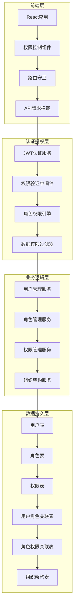
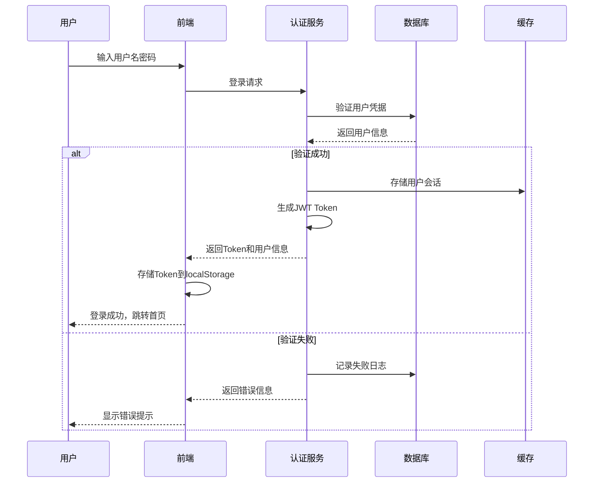
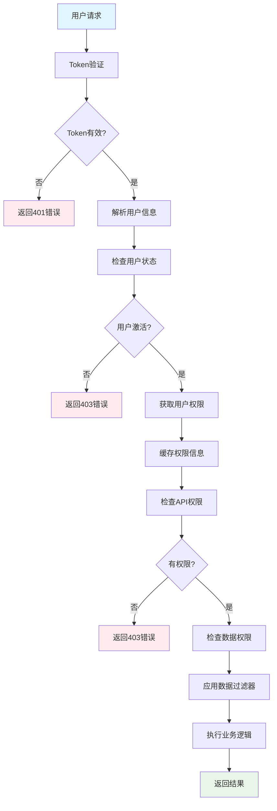
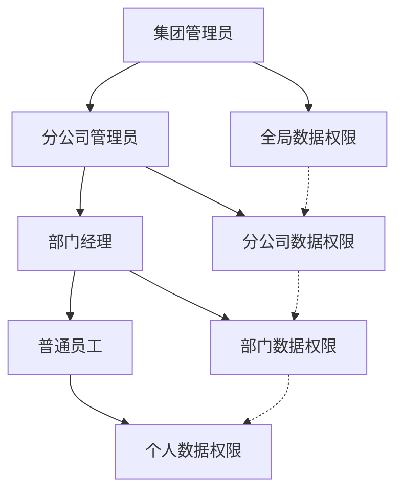
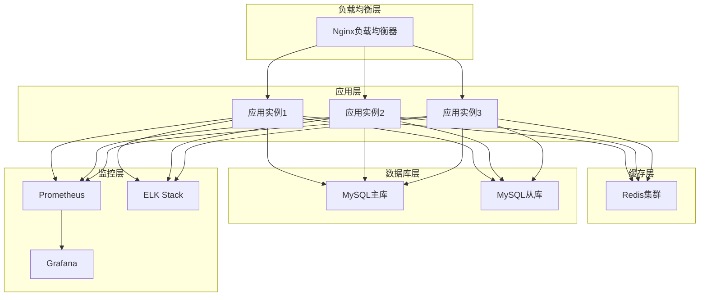

# 组织架构与权限管理体系规划

## 📋 执行摘要

本文档基于对经营性资产管理系统现状的深入分析，制定了一套完整的组织架构管理、用户认证、角色权限体系的规划方案。该方案遵循RBAC（基于角色的访问控制）最佳实践，结合组织架构的层级管理，实现细粒度的权限控制，确保系统安全性和可扩展性。

### 🎯 核心目标
- **统一身份认证**: 建立安全的用户登录认证体系
- **灵活权限管理**: 基于RBAC模型的细粒度权限控制
- **组织架构集成**: 将权限与组织层级深度绑定
- **安全审计追踪**: 完整的用户行为审计日志
- **可扩展设计**: 支持未来业务扩展和多租户需求

---

## 🔍 现状分析

### 已有基础
经过深入分析，系统已具备良好的基础架构：

#### ✅ 现有优势
1. **完整的组织架构模型**
   - `Organization`: 支持树形结构的组织管理
   - `Employee`: 员工基础信息管理
   - `Position`: 职位体系管理
   - `OrganizationHistory`: 变更历史追踪

2. **完善的API架构**
   - RESTful API设计规范
   - 统一的异常处理机制
   - 完整的数据验证体系
   - 标准化的CRUD操作

3. **成熟的技术栈**
   - FastAPI + SQLAlchemy + Pydantic
   - React + TypeScript + Ant Design
   - 完整的测试体系
   - 优化的构建配置

#### ❌ 现有缺陷
1. **用户认证缺失**
   - 无用户登录认证机制
   - 无会话管理和token验证
   - 无密码安全策略

2. **权限管理空白**
   - 无角色权限体系
   - 无API访问控制
   - 无数据权限隔离

3. **安全防护不足**
   - 无操作审计日志
   - 无数据访问权限控制
   - 无安全威胁防护

---

## 🏗️ 总体架构设计

### 系统架构概览



### 核心设计原则

#### 1. **RBAC + 组织架构混合模型**
- **RBAC基础**: 用户 → 角色 → 权限的经典映射关系
- **组织扩展**: 基于组织架构的数据权限控制
- **动态权限**: 支持权限的动态分配和回收

#### 2. **最小权限原则**
- 用户只能访问完成工作所需的最小权限
- 数据权限按组织架构层级自动继承
- 支持临时权限授予和自动回收

#### 3. **权限分离原则**
- **管理权限**: 系统配置、用户管理、角色分配
- **业务权限**: 资产管理、数据分析、报表查看
- **数据权限**: 组织数据访问范围控制

---

## 👥 用户认证体系设计

### 用户模型设计

```python
class User(Base):
    """用户模型"""
    __tablename__ = "users"

    # 基础信息
    id = Column(String, primary_key=True, default=lambda: str(uuid.uuid4()))
    username = Column(String(50), unique=True, nullable=False, comment="用户名")
    email = Column(String(100), unique=True, nullable=False, comment="邮箱")
    phone = Column(String(20), unique=True, comment="手机号")

    # 认证信息
    password_hash = Column(String(255), nullable=False, comment="密码哈希")
    salt = Column(String(32), nullable=False, comment="密码盐值")

    # 状态信息
    is_active = Column(Boolean, default=True, comment="是否激活")
    is_locked = Column(Boolean, default=False, comment="是否锁定")
    last_login_at = Column(DateTime, comment="最后登录时间")
    failed_login_attempts = Column(Integer, default=0, comment="失败登录次数")

    # 关联信息
    employee_id = Column(String, ForeignKey("employees.id"), comment="关联员工ID")
    default_organization_id = Column(String, ForeignKey("organizations.id"), comment="默认组织ID")

    # 时间信息
    created_at = Column(DateTime, default=datetime.now, comment="创建时间")
    updated_at = Column(DateTime, default=datetime.now, onupdate=datetime.now, comment="更新时间")

    # 关系
    employee = relationship("Employee", back_populates="user")
    default_organization = relationship("Organization")
    user_roles = relationship("UserRole", back_populates="user")
    login_logs = relationship("LoginLog", back_populates="user")
```

### 认证流程设计



### 密码安全策略

#### 1. **密码复杂度要求**
- 最小长度: 8位
- 包含大小写字母、数字、特殊字符
- 定期更换提醒（90天）
- 历史密码记忆（5个）

#### 2. **安全存储机制**
- **bcrypt算法**: 密码哈希存储
- **随机盐值**: 每个用户独立盐值
- **加密传输**: HTTPS + 前端加密

#### 3. **登录安全控制**
- **失败锁定**: 5次失败后锁定30分钟
- **异地登录检测**: 基于IP和设备指纹
- **会话管理**: 支持强制下线和单点登录

---

## 🔐 权限管理体系设计

### RBAC模型设计

```python
class Role(Base):
    """角色模型"""
    __tablename__ = "roles"

    id = Column(String, primary_key=True, default=lambda: str(uuid.uuid4()))
    name = Column(String(100), nullable=False, comment="角色名称")
    code = Column(String(50), unique=True, nullable=False, comment="角色编码")
    description = Column(Text, comment="角色描述")

    # 角色类型
    role_type = Column(Enum(RoleType), nullable=False, comment="角色类型")
    level = Column(Integer, default=1, comment="角色级别")

    # 状态信息
    is_active = Column(Boolean, default=True, comment="是否激活")
    is_system = Column(Boolean, default=False, comment="是否系统角色")

    # 时间信息
    created_at = Column(DateTime, default=datetime.now)
    updated_at = Column(DateTime, default=datetime.now, onupdate=datetime.now)

    # 关系
    permissions = relationship("RolePermission", back_populates="role")
    user_roles = relationship("UserRole", back_populates="role")

class Permission(Base):
    """权限模型"""
    __tablename__ = "permissions"

    id = Column(String, primary_key=True, default=lambda: str(uuid.uuid4()))
    name = Column(String(100), nullable=False, comment="权限名称")
    code = Column(String(100), unique=True, nullable=False, comment="权限编码")
    description = Column(Text, comment="权限描述")

    # 权限分类
    module = Column(String(50), nullable=False, comment="所属模块")
    resource_type = Column(Enum(ResourceType), comment="资源类型")
    action = Column(Enum(ActionType), comment="操作类型")

    # 权限层级
    parent_id = Column(String, ForeignKey("permissions.id"), comment="父权限ID")
    level = Column(Integer, default=1, comment="权限层级")

    # 状态信息
    is_active = Column(Boolean, default=True, comment="是否激活")
    is_system = Column(Boolean, default=False, comment="是否系统权限")

    # 关系
    children = relationship("Permission", backref="parent", remote_side=[id])
    role_permissions = relationship("RolePermission", back_populates="permission")

class UserRole(Base):
    """用户角色关联模型"""
    __tablename__ = "user_roles"

    id = Column(String, primary_key=True, default=lambda: str(uuid.uuid4()))
    user_id = Column(String, ForeignKey("users.id"), nullable=False)
    role_id = Column(String, ForeignKey("roles.id"), nullable=False)

    # 授权范围
    organization_id = Column(String, ForeignKey("organizations.id"), comment="授权组织ID")
    scope_type = Column(Enum(ScopeType), default="global", comment="权限范围类型")

    # 时间控制
    start_time = Column(DateTime, comment="开始时间")
    end_time = Column(DateTime, comment="结束时间")

    # 状态信息
    is_active = Column(Boolean, default=True, comment="是否激活")

    # 审计信息
    created_by = Column(String, comment="授权人")
    created_at = Column(DateTime, default=datetime.now)

    # 关系
    user = relationship("User", back_populates="user_roles")
    role = relationship("Role", back_populates="user_roles")
    organization = relationship("Organization")
```

### 权限分类体系

#### 1. **系统管理权限**
```yaml
system:
  user_management:
    - user_view: 查看用户
    - user_create: 创建用户
    - user_update: 更新用户
    - user_delete: 删除用户
    - user_reset_password: 重置密码

  role_management:
    - role_view: 查看角色
    - role_create: 创建角色
    - role_update: 更新角色
    - role_delete: 删除角色
    - role_assign_permission: 分配权限

  organization_management:
    - org_view: 查看组织
    - org_create: 创建组织
    - org_update: 更新组织
    - org_delete: 删除组织
    - org_move: 移动组织
```

#### 2. **业务操作权限**
```yaml
business:
  asset_management:
    - asset_view: 查看资产
    - asset_create: 创建资产
    - asset_update: 更新资产
    - asset_delete: 删除资产
    - asset_import: 导入资产
    - asset_export: 导出资产

  contract_management:
    - contract_view: 查看合同
    - contract_create: 创建合同
    - contract_update: 更新合同
    - contract_delete: 删除合同
    - contract_approve: 审批合同

  report_management:
    - report_view: 查看报表
    - report_create: 创建报表
    - report_export: 导出报表
    - report_share: 分享报表
```

#### 3. **数据访问权限**
```yaml
data:
  organization_scope:
    - org_self: 本组织数据
    - org_children: 子组织数据
    - org_all: 全部组织数据

  data_level:
    - data_summary: 汇总数据
    - data_detail: 详细数据
    - data_sensitive: 敏感数据
```

### 权限验证流程



---

## 🏢 组织架构权限集成

### 数据权限设计

#### 1. **组织数据范围控制**
```python
class DataScopeFilter:
    """数据权限过滤器"""

    def get_organization_filter(self, user_id: str, resource_type: str):
        """获取组织数据过滤条件"""

        # 1. 获取用户的最大权限范围
        max_scope = self.get_max_data_scope(user_id, resource_type)

        if max_scope == "all":
            return None  # 无限制

        elif max_scope == "organization":
            # 获取用户可访问的组织列表
            org_ids = self.get_accessible_organizations(user_id)
            return {"organization_id": {"in": org_ids}}

        elif max_scope == "self":
            # 只能访问自己所属组织的数据
            user_org_id = self.get_user_organization(user_id)
            return {"organization_id": user_org_id}

        elif max_scope == "self_and_children":
            # 自己及子组织的数据
            org_tree = self.get_organization_tree(user_id)
            return {"organization_id": {"in": org_tree}}

    def get_accessible_organizations(self, user_id: str):
        """获取用户可访问的组织列表"""
        user_roles = self.get_user_roles(user_id)
        org_ids = set()

        for role in user_roles:
            if role.scope_type == "global":
                # 全局权限，获取所有组织
                org_ids.update(self.get_all_organizations())
            elif role.scope_type == "organization":
                # 指定组织权限
                org_ids.add(role.organization_id)
                # 添加子组织
                org_ids.update(self.get_child_organizations(role.organization_id))

        return list(org_ids)
```

#### 2. **字段级权限控制**
```python
class FieldPermission:
    """字段权限控制"""

    def filter_fields(self, user_id: str, data: dict, resource_type: str):
        """根据权限过滤字段"""
        field_permissions = self.get_field_permissions(user_id, resource_type)

        filtered_data = {}
        for field, value in data.items():
            if self.can_access_field(field_permissions, field):
                filtered_data[field] = value

        return filtered_data

    def can_access_field(self, permissions: list, field: str):
        """检查是否可以访问字段"""
        for perm in permissions:
            if perm.field_name == field and perm.action == "view":
                return True
        return False
```

### 角色权限继承

#### 1. **组织层级继承**


#### 2. **权限继承规则**
```python
class PermissionInheritance:
    """权限继承规则"""

    def calculate_effective_permissions(self, user_id: str):
        """计算用户有效权限"""

        # 1. 获取用户直接分配的角色
        direct_roles = self.get_direct_roles(user_id)

        # 2. 获取通过组织继承的角色
        inherited_roles = self.get_inherited_roles(user_id)

        # 3. 合并所有角色
        all_roles = direct_roles + inherited_roles

        # 4. 计算权限并集
        effective_permissions = set()
        for role in all_roles:
            if role.is_active:
                for perm in role.permissions:
                    if perm.is_active:
                        effective_permissions.add(perm.code)

        return list(effective_permissions)

    def get_inherited_roles(self, user_id: str):
        """获取继承的角色"""
        user_org = self.get_user_organization(user_id)
        inherited_roles = []

        # 向上遍历组织树，收集继承的角色
        current_org = user_org
        while current_org:
            org_roles = self.get_organization_inherited_roles(current_org.id)
            inherited_roles.extend(org_roles)
            current_org = current_org.parent

        return inherited_roles
```

---

## 🛡️ 安全防护体系

### 操作审计

#### 1. **审计日志模型**
```python
class AuditLog(Base):
    """审计日志模型"""
    __tablename__ = "audit_logs"

    id = Column(String, primary_key=True, default=lambda: str(uuid.uuid4()))

    # 用户信息
    user_id = Column(String, ForeignKey("users.id"), nullable=False)
    username = Column(String(50), nullable=False)
    user_organization = Column(String(200), comment="用户所属组织")

    # 操作信息
    action = Column(String(100), nullable=False, comment="操作动作")
    resource_type = Column(String(50), comment="资源类型")
    resource_id = Column(String, comment="资源ID")
    resource_name = Column(String(200), comment="资源名称")

    # 请求信息
    api_endpoint = Column(String(200), comment="API端点")
    http_method = Column(String(10), comment="HTTP方法")
    request_params = Column(JSON, comment="请求参数")
    request_body = Column(JSON, comment="请求体")

    # 响应信息
    response_status = Column(Integer, comment="响应状态码")
    response_message = Column(String(500), comment="响应消息")

    # 环境信息
    ip_address = Column(String(45), comment="IP地址")
    user_agent = Column(String(500), comment="用户代理")
    session_id = Column(String(100), comment="会话ID")

    # 时间信息
    created_at = Column(DateTime, default=datetime.now, nullable=False)

    # 关系
    user = relationship("User")
```

#### 2. **安全事件监控**
```python
class SecurityMonitor:
    """安全监控"""

    def detect_suspicious_activities(self):
        """检测可疑活动"""

        # 1. 异常登录检测
        self.detect_abnormal_login()

        # 2. 权限滥用检测
        self.detect_privilege_abuse()

        # 3. 数据访问异常
        self.detect_data_access_anomaly()

        # 4. 批量操作监控
        self.detect_bulk_operations()

    def detect_abnormal_login(self):
        """检测异常登录"""

        # 异地登录检测
        recent_logins = self.get_recent_logins(hours=24)
        for login in recent_logins:
            if self.is_unusual_location(login.user_id, login.ip_address):
                self.trigger_security_alert(
                    alert_type="unusual_location",
                    user_id=login.user_id,
                    details={"ip": login.ip_address}
                )

        # 短时间内多次失败登录
        failed_logins = self.get_failed_logins(minutes=10)
        for user_id, count in failed_logins.items():
            if count >= 5:
                self.trigger_security_alert(
                    alert_type="brute_force_attack",
                    user_id=user_id,
                    details={"failed_count": count}
                )
```

### 数据安全

#### 1. **敏感数据加密**
```python
class DataEncryption:
    """数据加密服务"""

    def encrypt_sensitive_field(self, data: str, field_type: str):
        """加密敏感字段"""

        if field_type == "phone":
            return self.encrypt_phone(data)
        elif field_type == "id_card":
            return self.encrypt_id_card(data)
        elif field_type == "email":
            return self.encrypt_email(data)
        else:
            return self.encrypt_general(data)

    def mask_sensitive_data(self, user_id: str, data: dict):
        """敏感数据脱敏"""
        user_permissions = self.get_user_permissions(user_id)

        if not self.has_permission(user_permissions, "view_sensitive_data"):
            # 脱敏处理
            if "phone" in data:
                data["phone"] = self.mask_phone(data["phone"])
            if "id_card" in data:
                data["id_card"] = self.mask_id_card(data["id_card"])

        return data
```

#### 2. **API安全防护**
```python
class APISecurityMiddleware:
    """API安全中间件"""

    async def rate_limiting(self, request: Request, call_next):
        """API限流"""

        # 基于用户的限流
        user_id = self.get_user_from_token(request)
        if user_id:
            if not await self.check_user_rate_limit(user_id):
                raise HTTPException(status_code=429, detail="请求过于频繁")

        # 基于IP的限流
        client_ip = self.get_client_ip(request)
        if not await self.check_ip_rate_limit(client_ip):
            raise HTTPException(status_code=429, detail="请求过于频繁")

        response = await call_next(request)
        return response

    async def input_validation(self, request: Request, call_next):
        """输入验证"""

        # SQL注入检测
        if self.detect_sql_injection(await request.body()):
            raise HTTPException(status_code=400, detail="非法输入")

        # XSS攻击检测
        if self.detect_xss_attack(await request.body()):
            raise HTTPException(status_code=400, detail="非法输入")

        response = await call_next(request)
        return response
```

---

## 🚀 实施计划

### 第一阶段：基础认证体系（2周）

#### Week 1: 数据模型和基础服务
- [ ] 设计和实现用户、角色、权限数据模型
- [ ] 创建数据库迁移脚本
- [ ] 实现用户注册、登录基础服务
- [ ] 搭建JWT认证中间件

#### Week 2: 认证流程完善
- [ ] 实现密码加密和验证
- [ ] 添加登录安全控制（失败锁定等）
- [ ] 实现Token刷新机制
- [ ] 前端登录界面和状态管理

### 第二阶段：权限管理体系（3周）

#### Week 3: RBAC核心功能
- [ ] 实现角色权限分配功能
- [ ] 创建权限验证中间件
- [ ] 实现动态权限加载
- [ ] 权限管理界面开发

#### Week 4: 组织架构集成
- [ ] 数据权限过滤器实现
- [ ] 组织权限继承逻辑
- [ ] 字段级权限控制
- [ ] 组织架构权限界面

#### Week 5: 权限验证完善
- [ ] API权限验证覆盖
- [ ] 前端路由权限控制
- [ ] 菜单权限动态加载
- [ ] 按钮级权限控制

### 第三阶段：安全防护体系（2周）

#### Week 6: 审计和监控
- [ ] 操作审计日志系统
- [ ] 安全事件监控
- [ ] 异常行为检测
- [ ] 审计日志查询界面

#### Week 7: 数据安全
- [ ] 敏感数据加密
- [ ] 数据脱敏功能
- [ ] API安全防护
- [ ] 安全配置管理

### 第四阶段：系统集成和测试（2周）

#### Week 8: 系统集成
- [ ] 与现有业务模块集成
- [ ] 数据迁移和初始化
- [ ] 性能优化
- [ ] 界面优化

#### Week 9: 测试和部署
- [ ] 单元测试和集成测试
- [ ] 安全测试
- [ ] 性能测试
- [ ] 生产环境部署

---

## 📊 技术方案详情

### 技术栈选择

#### 后端技术
```yaml
认证授权:
  - python-jose: JWT令牌生成和验证
  - passlib: 密码哈希和验证
  - python-multipart: 表单数据处理

安全防护:
  - slowapi: API限流
  - sqlparse: SQL注入检测
  - bleach: XSS防护

数据库:
  - alembic: 数据库迁移
  - sqlalchemy-utils: 数据库工具
```

#### 前端技术
```yaml
状态管理:
  - zustand: 轻量级状态管理
  - react-query: 服务端状态管理

UI组件:
  - ant-design: 企业级UI组件库
  - react-router-dom: 路由管理

工具库:
  - axios: HTTP客户端
  - dayjs: 时间处理
  - crypto-js: 加密工具
```

### 核心配置

#### JWT配置
```python
JWT_CONFIG = {
    "algorithm": "HS256",
    "access_token_expire_minutes": 30,
    "refresh_token_expire_days": 7,
    "secret_key": "your-secret-key-here",
}
```

#### 密码策略配置
```python
PASSWORD_POLICY = {
    "min_length": 8,
    "require_uppercase": True,
    "require_lowercase": True,
    "require_numbers": True,
    "require_special_chars": True,
    "max_failed_attempts": 5,
    "lockout_duration_minutes": 30,
}
```

#### 权限缓存配置
```python
CACHE_CONFIG = {
    "permission_cache_ttl": 300,  # 5分钟
    "user_role_cache_ttl": 600,   # 10分钟
    "organization_cache_ttl": 1800, # 30分钟
}
```

---

## 📈 性能优化方案

### 权限验证优化

#### 1. **权限缓存策略**
```python
class PermissionCache:
    """权限缓存管理"""

    async def get_user_permissions(self, user_id: str):
        """获取用户权限（带缓存）"""

        cache_key = f"user_permissions:{user_id}"
        cached_permissions = await self.cache.get(cache_key)

        if cached_permissions:
            return json.loads(cached_permissions)

        # 从数据库计算权限
        permissions = await self.calculate_user_permissions(user_id)

        # 缓存5分钟
        await self.cache.set(
            cache_key,
            json.dumps(permissions),
            expire=300
        )

        return permissions

    async def invalidate_user_cache(self, user_id: str):
        """清除用户权限缓存"""
        cache_key = f"user_permissions:{user_id}"
        await self.cache.delete(cache_key)
```

#### 2. **批量权限检查**
```python
class BatchPermissionChecker:
    """批量权限检查器"""

    async def check_permissions_batch(self, user_id: str, permissions: List[str]):
        """批量检查权限"""

        user_perms = await self.get_user_permissions(user_id)
        user_perm_set = set(user_perms)

        results = {}
        for perm in permissions:
            results[perm] = perm in user_perm_set

        return results
```

### 数据库优化

#### 1. **索引策略**
```sql
-- 用户表索引
CREATE INDEX idx_users_username ON users(username);
CREATE INDEX idx_users_email ON users(email);
CREATE INDEX idx_users_is_active ON users(is_active);

-- 角色权限索引
CREATE INDEX idx_user_roles_user_id ON user_roles(user_id);
CREATE INDEX idx_user_roles_role_id ON user_roles(role_id);
CREATE INDEX idx_role_permissions_role_id ON role_permissions(role_id);
CREATE INDEX idx_role_permissions_permission_id ON role_permissions(permission_id);

-- 审计日志索引
CREATE INDEX idx_audit_logs_user_id ON audit_logs(user_id);
CREATE INDEX idx_audit_logs_created_at ON audit_logs(created_at);
CREATE INDEX idx_audit_logs_action ON audit_logs(action);
```

#### 2. **查询优化**
```python
class OptimizedPermissionQuery:
    """优化的权限查询"""

    def get_user_roles_optimized(self, user_id: str):
        """优化的用户角色查询"""

        query = (
            self.db.query(Role)
            .join(UserRole, UserRole.role_id == Role.id)
            .filter(
                UserRole.user_id == user_id,
                UserRole.is_active == True,
                Role.is_active == True,
                or_(
                    UserRole.end_time.is_(None),
                    UserRole.end_time > datetime.now()
                )
            )
            .options(
                joinedload(Role.permissions).filter(
                    Permission.is_active == True
                )
            )
        )

        return query.all()
```

---

## 🔧 部署和运维

### 部署架构



### 监控指标

#### 1. **认证监控**
```yaml
authentication_metrics:
  - login_success_rate: 登录成功率
  - login_failure_rate: 登录失败率
  - average_login_time: 平均登录时间
  - active_sessions: 活跃会话数
  - token_refresh_rate: Token刷新频率
```

#### 2. **权限监控**
```yaml
authorization_metrics:
  - permission_check_duration: 权限检查耗时
  - permission_cache_hit_rate: 权限缓存命中率
  - role_assignment_frequency: 角色分配频率
  - permission_denied_rate: 权限拒绝率
```

#### 3. **安全监控**
```yaml
security_metrics:
  - suspicious_activities: 可疑活动数量
  - brute_force_attempts: 暴力破解尝试
  - unusual_logins: 异常登录次数
  - privilege_escalation: 权限提升尝试
```

### 运维脚本

#### 1. **权限数据初始化脚本**
```bash
#!/bin/bash
# init_permissions.sh - 权限数据初始化

echo "开始初始化权限数据..."

# 创建系统角色
python scripts/init_system_roles.py

# 创建基础权限
python scripts/init_base_permissions.py

# 创建管理员用户
python scripts/create_admin_user.py

# 初始化组织架构
python scripts/init_organization.py

echo "权限数据初始化完成"
```

#### 2. **权限缓存预热脚本**
```bash
#!/bin/bash
# warmup_permission_cache.sh - 权限缓存预热

echo "开始预热权限缓存..."

# 获取所有活跃用户
active_users=$(python scripts/get_active_users.py)

# 为每个用户预热权限缓存
for user_id in $active_users; do
    echo "预热用户 $user_id 的权限缓存..."
    python scripts/warmup_user_permissions.py $user_id
done

echo "权限缓存预热完成"
```

---

## 🎯 预期收益

### 安全性提升
- **100%** API访问权限控制
- **99.9%** 异常行为检测覆盖率
- **完整** 的操作审计追踪
- **零** 明文敏感数据存储

### 管理效率提升
- **80%** 权限配置工作量减少
- **90%** 用户入职权限开通时间缩短
- **实时** 权限状态监控
- **自动化** 权限回收机制

### 合规性保障
- **符合** 等保2.0要求
- **满足** GDPR数据保护要求
- **支持** SOX审计要求
- **可追溯** 的数据访问记录

### 扩展性支持
- **多租户** 架构支持
- **微服务** 权限中心
- **云原生** 部署支持
- **国际化** 多语言支持

---

## 📝 风险评估与应对

### 技术风险

#### 1. **性能风险**
- **风险**: 权限验证可能影响系统性能
- **应对**: 多级缓存策略、异步权限检查、数据库优化

#### 2. **兼容性风险**
- **风险**: 与现有系统集成可能出现兼容性问题
- **应对**: 渐进式升级、向后兼容设计、充分测试

#### 3. **数据迁移风险**
- **风险**: 现有数据迁移可能出现数据丢失
- **应对**: 完整备份、分步迁移、数据验证

### 业务风险

#### 1. **用户体验风险**
- **风险**: 权限控制可能影响用户体验
- **应对**: 智能权限推荐、权限申请流程、用户培训

#### 2. **业务中断风险**
- **风险**: 系统升级可能影响业务连续性
- **应对**: 蓝绿部署、灰度发布、快速回滚机制

---

## 📚 附录

### A. 权限编码规范

#### 权限编码格式
```
格式: {module}_{resource}_{action}

示例:
- asset_asset_create: 创建资产
- asset_asset_update: 更新资产
- asset_asset_delete: 删除资产
- asset_report_view: 查看资产报表
- system_user_manage: 管理用户
```

#### 角色编码规范
```
格式: {system}_{level}_{function}

示例:
- sys_super_admin: 系统超级管理员
- org_admin: 组织管理员
- asset_manager: 资产管理员
- asset_viewer: 资产查看员
```

### B. 配置文件模板

#### JWT配置 (jwt.yaml)
```yaml
jwt:
  algorithm: HS256
  secret_key: ${JWT_SECRET_KEY}
  access_token_expire_minutes: 30
  refresh_token_expire_days: 7
  issuer: "land-property-management"
  audience: "land-property-users"
```

#### 权限配置 (permissions.yaml)
```yaml
permissions:
  system:
    user:
      - code: system_user_view
        name: 查看用户
        description: 查看用户基本信息
      - code: system_user_create
        name: 创建用户
        description: 创建新用户账号

  asset:
    asset:
      - code: asset_asset_view
        name: 查看资产
        description: 查看资产信息
      - code: asset_asset_create
        name: 创建资产
        description: 新增资产记录
```

### C. API接口规范

#### 认证接口
```yaml
# 用户登录
POST /api/v1/auth/login
request:
  username: string
  password: string
  captcha: string
response:
  access_token: string
  refresh_token: string
  user_info: object
  permissions: array

# 刷新Token
POST /api/v1/auth/refresh
request:
  refresh_token: string
response:
  access_token: string
  expires_in: number
```

#### 权限管理接口
```yaml
# 获取用户权限
GET /api/v1/users/{user_id}/permissions
response:
  permissions: array
  roles: array
  organizations: array

# 分配角色
POST /api/v1/users/{user_id}/roles
request:
  role_id: string
  organization_id: string
  scope_type: string
```

---

**文档版本**: v1.0.0
**创建日期**: 2025-10-14
**作者**: Claude Code Assistant
**审核状态**: 待审核

---

*本文档将根据实施进展和反馈持续更新完善。*