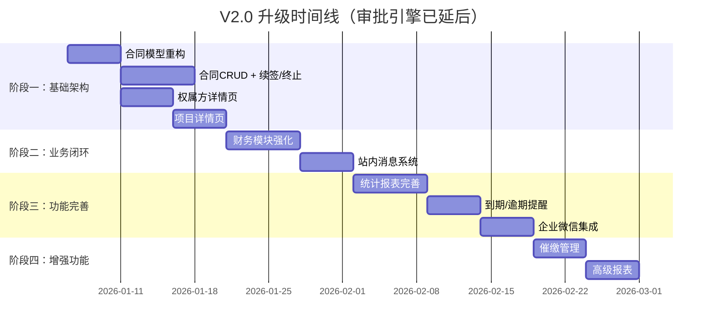

# V2.0 升级需求文档评审报告

> **评审日期**：2026-01-04  
> **评审人**：AI 助手 (Antigravity)  
> **评审对象**：[v2-upgrade-requirements.md](file:///mnt/d/code/zcgl/docs/requirements/v2-upgrade-requirements.md)

---

## 一、项目现状深度分析 (V1.0)

### 1.1 后端数据模型

| 模型 | 状态 | 关键字段 | V2 差距 |
|------|------|----------|---------|
| `RentContract` | ✅ 已实现 | contract_number, asset_id, ownership_id, tenant_name, sign_date, start_date, end_date, total_deposit, monthly_rent_base, contract_status | ❌ 缺少 `contract_type` (上游/下游), `business_mode` (承租/委托) |
| `RentTerm` | ✅ 已实现 | start_date, end_date, monthly_rent, management_fee | ✅ 满足阶梯租金需求 |
| `RentLedger` | ✅ 已实现 | year_month, due_date, due_amount, paid_amount, payment_status, late_fee | ⚠️ 缺少催缴记录关联 |
| `Asset` | ✅ 完善 | 40+ 字段，含面积、合同、租户信息 | ✅ 满足需求 |
| `Project` | ✅ 已实现 | name, code, address, 投资信息等 | ⚠️ 缺少项目收入汇总关联 |
| `Ownership` | ✅ 已实现 | name, code, short_name, address | ⚠️ 缺少联系人管理、收支统计 |
| 审批相关 | ❌ 未实现 | - | ❌ 需新建 `ApprovalConfig`, `ApprovalInstance`, `ApprovalTask` |
| 通知相关 | ❌ 未实现 | - | ❌ 需新建 `Notification`, `NotificationConfig` |

### 1.2 后端 API 端点

| 模块 | API 文件 | 主要功能 | V2 差距 |
|------|----------|----------|---------|
| 合同管理 | `rent_contract.py` (714行) | CRUD、租金条款、台账生成、统计 | ⚠️ 缺少续签、终止、审批流程 |
| 权属方管理 | `ownership.py` (255行) | CRUD、搜索、统计、状态切换 | ⚠️ 缺少详情页聚合 API |
| 项目管理 | `project.py` (156行) | CRUD、搜索、状态切换 | ⚠️ 缺少资产归集统计 API |
| 统计分析 | `statistics.py` (1287行) | 基础统计、出租率、面积汇总、财务、趋势 | ✅ 基础良好，可扩展 |

### 1.3 前端页面与组件

| 模块 | 页面 | 组件 | 完成度 | V2 差距 |
|------|------|------|--------|---------|
| 合同管理 | `ContractListPage` (482行) | 列表+统计+搜索+Excel导入 | **80%** | ⚠️ 缺少详情页、续签/终止操作、上下游区分 |
| 权属方 | `OwnershipManagementPage` (42行) | `OwnershipList` + `OwnershipDetail` | **60%** | ❌ 详情页简陋，缺少关联资产/合同/收支统计 |
| 项目管理 | `ProjectManagementPage` (42行) | `ProjectList` + `ProjectDetail` | **50%** | ❌ 详情页极简，缺少资产归集视图 |
| 财务管理 | `RentLedgerPage`, `RentStatisticsPage` | 台账列表+统计图表 | **70%** | ⚠️ 缺少催缴管理、实收录入交互优化 |
| 审批中心 | ❌ 未实现 | - | **0%** | ❌ 需完整开发 |
| 通知中心 | ❌ 未实现 | - | **0%** | ❌ 需完整开发 |

---

## 二、需求文档评审

### 2.1 核心业务模型：三方关系 ⭐

**需求描述**：
```
权属方 ←──[上游合同]── 运营方 ←──[下游合同]── 终端租户
```

**评审意见**：

> [!IMPORTANT]
> 这是 V2 最核心的架构变更，需要重新设计合同模型。

| 评审项 | 结论 | 说明 |
|--------|------|------|
| 可行性 | ✅ 可行 | 需改造 `RentContract` 表结构 |
| 兼容性 | ⚠️ 需迁移 | 现有合同需标记为"下游合同" |
| 复杂度 | 中 | 主要涉及模型重构，不影响核心架构 |

**建议实现方案**：

```python
# 在 RentContract 模型中新增
class ContractCategory(str, Enum):
    UPSTREAM = "upstream"    # 上游合同（我方为承租方）
    DOWNSTREAM = "downstream"  # 下游合同（我方为出租方）

class BusinessMode(str, Enum):
    LEASE = "lease"           # 承租方式
    ENTRUST = "entrust"       # 委托运营

# 新增字段
contract_category = Column(String(20), default="downstream")
business_mode = Column(String(20), nullable=True)
upstream_party_id = Column(String, ForeignKey("ownerships.id"))  # 上游合同甲方
```

### 2.2 合同管理模块 (P0)

| 功能需求 | V1 状态 | 差距分析 | 工作量预估 |
|----------|---------|----------|-----------|
| 创建合同 | ✅ 已实现 | 需支持上/下游类型选择 | 1天 |
| 查看合同详情 | ⚠️ 部分 | 需开发独立详情页 | 2天 |
| 编辑合同 | ✅ 已实现 | - | 1天 |
| 删除合同 | ✅ 已实现 | - | 0.5天 |

| 合同附件 | ⚠️ 部分 | PDF导入已有，需完善上传逻辑 | 1天 |
| 合同续签 | ❌ 未实现 | 需开发续签流程 | 2天 |
| 合同终止 | ❌ 未实现 | 需开发终止流程 | 1天 |
| 变更记录 | ✅ 已实现 | `RentContractHistory` 表已存在 | 0.5天 |
| 到期提醒 | ❌ 未实现 | 需开发通知机制 | 2天 |


### 2.3 权属方管理模块 (P0)

**现状**：
- `OwnershipDetail.tsx` 仅显示基本信息 + 关联项目列表
- 缺少：关联资产列表、关联合同列表、收支统计

**评审意见**：

> [!WARNING]
> 需求要求"收入/支出统计（区分承租方式和委托运营方式）"，这依赖于合同的 `business_mode` 字段，需确保合同模型先完成改造。

**建议**：在Phase 1 完成合同模型改造后，再开发此部分。

### 2.4 项目管理模块 (P0)

**现状**：
- `ProjectDetail.tsx` 极其简陋（仅113行），只显示项目编码、状态、描述
- 缺少：关联资产列表、资产统计汇总、出租率

**评审意见**：需开发"资产归集视图"，这是新页面开发，无现有基础。

### 2.5 审批流程模块 (P3 - 仅规划，后续实现)

**评审意见**：

> [!NOTE]
> 根据用户反馈，审批引擎已调整为"仅规划"状态，不纳入 V2.0 实施范围。

- **当前状态**：❓ 更改为仅规划
- **后续版本**：可在 V3.0 或后续迭代中实现
- **影响**：合同操作（编辑/删除）将不需要审批控制，直接生效

### 2.6 消息通知模块 (P0/P1)

**评审意见**：
- 站内消息 (P0)：需新建 `Notification` 表 + 前端通知中心
- 企业微信 (P1)：需集成企微 API，建议作为独立服务

---

## 三、实施优先级评审

需求文档提出的四阶段规划基本合理，但有以下调整建议：

### 原方案 vs 建议调整

| 原阶段 | 原内容 | 调整后 | 理由 |
|--------|--------|--------|------|
| 阶段一 (4周) | 数据模型 + 合同CRUD + 权属方CRUD + 项目CRUD | ✅ 保持 | - |
| 阶段二 (4周) | 财务模块 + 站内消息 | ✅ 保持 | - |
| 阶段三 (4周) | 统计报表 + 提醒功能 + 企业微信 | ✅ 保持 | 审批引擎已移出 |
| 阶段四 | 移动端 + 高级报表 + 催缴管理 + 审批流程(规划) | ✅ 保持 | - |


### 建议时间线




---

## 四、风险评估

| 风险项 | 等级 | 影响 | 缓解措施 |
|--------|------|------|----------|
| 合同模型改造导致数据迁移问题 | 中 | 现有合同数据需标记类型 | 编写迁移脚本，设置默认值 |
| 审批引擎复杂度超出预期 | ~~中~~ | ~~阶段三延期~~ | ✅ 已调整为仅规划，风险解除 |

| 企业微信 API 对接延迟 | 低 | 通知功能受限 | 先完成站内消息，企微作为可选 |
| 前端页面重构工作量大 | 中 | 影响交付时间 | 复用现有组件，渐进式重构 |

---

## 五、评审结论

### 5.1 总体评价

| 维度 | 评分 | 说明 |
|------|------|------|
| 需求清晰度 | ★★★★☆ | 功能描述清晰，优先级明确 |
| 技术可行性 | ★★★★★ | 现有架构可支撑，无需重写 |
| 工作量合理性 | ★★★☆☆ | 阶段三(6周)偏紧，建议拆分 |
| 风险控制 | ★★★★☆ | 主要风险已识别，可控 |

### 5.2 关键建议

1. **优先完成合同模型重构**：这是所有后续功能的基础
2. **阶段三保持精简**：报表 + 提醒 + 企微
3. **增加数据迁移计划**：需求文档中未提及现有数据处理
4. **审批引擎后续版本实现**：已调整为 P3 仅规划


### 5.3 需补充内容

> [!NOTE]
> 建议在需求文档中补充以下内容：

1. **数据迁移策略**：现有合同如何标记为"下游合同"
2. **企业微信对接规格**：应用类型、权限范围、消息模板
3. **性能指标**：并发用户数、数据量级预估


---

**评审状态**：✅ 通过（附建议）

**下一步建议**：创建技术实施方案 (Implementation Plan)
