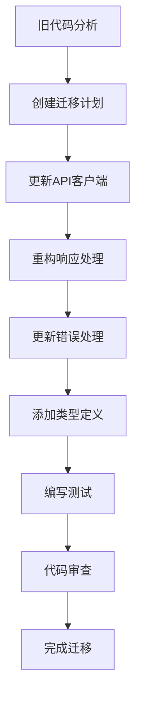

# API响应处理培训材料

## 🎯 培训目标

通过本次培训，开发人员将能够：
- 理解API响应处理的最佳实践
- 掌握统一响应处理工具的使用
- 避免常见的响应处理错误
- 提高代码质量和可维护性

## 📚 培训大纲

### 第一部分：背景和问题（30分钟）

#### 1.1 当前问题分析
- 回顾之前发现的响应处理问题
- 分析问题产生的原因
- 讨论对项目的影响

#### 1.2 技术债务成本
- 维护成本统计
- Bug率影响分析
- 开发效率损失

### 第二部分：解决方案介绍（45分钟）

#### 2.1 统一响应处理架构
- ResponseExtractor智能提取器
- EnhancedApiClient增强客户端
- ApiErrorHandler错误处理器

#### 2.2 核心特性
- 智能响应格式检测
- 统一错误分类和处理
- 自动重试和缓存机制
- 完整的类型安全支持

### 第三部分：工具使用实践（60分钟）

#### 3.1 ResponseExtractor使用
```typescript
import { ResponseExtractor } from '../utils/responseExtractor';

// 基础用法
const result = ResponseExtractor.smartExtract<User>(response);

// 检查结果
if (result.success) {
  const user = result.data;
  console.log('用户数据:', user);
} else {
  console.error('提取失败:', result.error);
}

// 快速提取
const user = ResponseExtractor.extractData<User>(response, null);

// 批量处理
const results = ResponseExtractor.batchExtract<User>(responses);

// 数据转换
const transformed = ResponseExtractor.extractAndTransform(response, (data) => ({
  ...data,
  formattedName: data.fullName?.toUpperCase()
}));
```

#### 3.2 EnhancedApiClient使用
```typescript
import { enhancedApiClient } from '../services/enhancedApiClient';

// 基础GET请求
const result = await enhancedApiClient.get<User>('/api/users/1');

// 高级配置
const result = await enhancedApiClient.post('/api/users', userData, {
  retry: {
    maxAttempts: 3,
    delay: 1000,
    backoffMultiplier: 2,
    retryCondition: (error) => {
      // 只对网络错误和5xx错误重试
      return !error.response || (error.response.status >= 500 && error.status < 600);
    }
  },
  cache: {
    enabled: true,
    ttl: 5 * 60 * 1000, // 5分钟
    keyGenerator: (config) => `users:${config.params?.page || 1}`
  },
  smartExtract: true
});

// 批量请求
const requests = [
  { method: 'GET', url: '/api/users' },
  { method: 'GET', url: '/api/posts' },
  { method: 'POST', url: '/api/comments', data: commentData }
];
const results = await enhancedApiClient.batch(requests);
```

#### 3.3 错误处理最佳实践
```typescript
import { ApiErrorHandler } from '../utils/responseExtractor';

try {
  const result = await apiCall();
  return result.data;
} catch (error) {
  const enhancedError = ApiErrorHandler.handleError(error);

  // 根据错误类型进行不同处理
  switch (enhancedError.type) {
    case 'NETWORK_ERROR':
      // 网络错误处理
      showNetworkErrorNotification();
      break;
    case 'AUTH_ERROR':
      // 认证错误处理
      redirectToLogin();
      break;
    case 'VALIDATION_ERROR':
      // 验证错误处理
      showValidationErrors(enhancedError.details);
      break;
    default:
      // 其他错误
      showGenericError(enhancedError.message);
  }

  throw new Error(enhancedError.message);
}
```

### 第四部分：代码迁移指导（45分钟）

#### 4.1 迁移步骤


#### 4.2 迁移示例

**迁移前：**
```typescript
// 旧代码 - 存在多个问题
class UserService {
  static async getUser(id: string) {
    try {
      const response = await axios.get(`/api/users/${id}`);

      // 问题1: 直接访问response属性
      if (response.user) {
        return response.user;
      }

      // 问题2: 不一致的响应处理
      if (response.data && response.data.success) {
        return response.data.data;
      }

      // 问题3: 简单的错误处理
      throw new Error('获取用户失败');

    } catch (error) {
      // 问题4: 不统一的错误处理
      if (error.response?.data?.message) {
        throw error.response.data.message;
      }
      throw error.message || '未知错误';
    }
  }
}
```

**迁移后：**
```typescript
// 新代码 - 使用统一工具
import { enhancedApiClient } from '../services/enhancedApiClient';
import type { StandardApiResponse } from '../types/api-response';

interface User {
  id: string;
  username: string;
  email?: string;
}

class UserService {
  static async getUser(id: string): Promise<User> {
    try {
      // 使用增强型API客户端
      const result = await enhancedApiClient.get<User>(`/api/users/${id}`, {
        cache: {
          enabled: true,
          ttl: 5 * 60 * 1000 // 缓存5分钟
        },
        retry: {
          maxAttempts: 2,
          delay: 500
        }
      });

      // 检查响应结果
      if (!result.success) {
        throw new Error(`获取用户失败: ${result.error}`);
      }

      return result.data;

    } catch (error) {
      // 使用统一的错误处理
      const enhancedError = ApiErrorHandler.handleError(error);
      throw new Error(enhancedError.message);
    }
  }

  static async createUser(userData: Partial<User>): Promise<User> {
    try {
      const result = await enhancedApiClient.post<User>('/api/users', userData, {
        retry: false // 创建操作不重试
      });

      if (!result.success) {
        throw new Error(`创建用户失败: ${result.error}`);
      }

      return result.data;

    } catch (error) {
      const enhancedError = ApiErrorHandler.handleError(error);
      throw new Error(enhancedError.message);
    }
  }
}
```

### 第五部分：实践练习（60分钟）

#### 5.1 练习1：响应数据提取
```typescript
// 练习：为给定的响应数据编写提取逻辑
const responses = [
  {
    data: { success: true, data: { id: '1', name: 'Alice' } }
  },
  {
    data: { success: true, items: [{ id: '1', name: 'Alice' }], pagination: { page: 1, total: 1 } }
  },
  {
    data: { success: false, error: { message: '用户不存在' } }
  }
];

// 学员练习：为每个响应编写提取逻辑
```

#### 5.2 练习2：API客户端配置
```typescript
// 练习：为不同的API场景配置客户端
const scenarios = [
  '用户数据查询',
  '统计数据获取',
  '文件上传',
  '表单提交'
];

// 学员练习：为每个场景配置合适的重试和缓存策略
```

#### 5.3 练习3：错误处理
```typescript
// 练习：编写不同类型的错误处理
const errorScenarios = [
  '网络连接失败',
  '用户未认证',
  '数据验证失败',
  '服务器内部错误'
];

// 学员练习：为每种错误场景编写处理逻辑
```

### 第六部分：最佳实践和经验分享（30分钟）

#### 6.1 常见陷阱和避免方法

#### 陷阱1：过度使用缓存
```typescript
// ❌ 过度缓存
await enhancedApiClient.get('/api/realtime-data', {
  cache: { enabled: true, ttl: 60 * 60 * 1000 } // 1小时缓存实时数据
});

// ✅ 合理缓存
await enhancedApiClient.get('/api/realtime-data', {
  cache: { enabled: false } // 实时数据不缓存
});
```

#### 陷阱2：不当的重试策略
```typescript
// ❌ 敏感操作重试
await enhancedApiClient.post('/api/transfer', transferData, {
  retry: { maxAttempts: 3 } // 转账操作不应该重试
});

// ✅ 智能重试条件
await enhancedApiClient.post('/api/safe-operation', data, {
  retry: {
    maxAttempts: 3,
    retryCondition: (error) => {
      // 只对网络错误和服务器错误重试
      return !error.response || (error.response.status >= 500);
    }
  }
});
```

#### 陷阱3：忽略类型安全
```typescript
// ❌ 忽略类型
const result = await apiCall();
return result.data; // result.data可能是undefined

// ✅ 类型安全
const result: StandardApiResponse<User> = await apiCall();
if (result.success) {
  return result.data;
}
throw new Error('API调用失败');
```

#### 6.2 性能优化建议

1. **缓存策略优化**
   - 静态数据：长时间缓存（30分钟以上）
   - 动态数据：短时间缓存（1-5分钟）
   - 用户数据：不缓存或极短时间缓存

2. **重试策略优化**
   - 网络错误：重试
   - 5xx服务器错误：重试
   - 4xx客户端错误：不重试
   - 敏感操作：不重试

3. **批量操作优化**
   - 使用批量API减少请求数量
   - 合并相似的API调用
   - 避免不必要的串行请求

## 📋 培训评估

### 知识测试
1. ResponseExtractor的主要功能是什么？
2. 什么时候应该使用缓存？
3. 哪些错误类型适合重试？
4. 如何实现类型安全的响应处理？

### 实践考核
1. 重构一个现有的API服务
2. 编写单元测试覆盖新工具
3. 进行代码审查检查
4. 性能测试对比分析

### 持续学习
1. 阅读完整文档
2. 参与代码审查实践
3. 分享最佳实践经验
4. 提出改进建议

## 📖 参考资源

### 文档
- [API响应处理编码规范](./api-response-handling-guide.md)
- [代码审查Checklist](./code-review-checklist.md)
- [类型定义文档](./type-definitions.md)

### 工具
- API响应分析工具：`node scripts/api-response-analyzer.js`
- 代码质量扫描：`npm run lint`
- 类型检查：`npm run type-check`

### 支持
- 技术支持：前端团队
- 问题反馈：创建GitHub Issue
- 知识分享：团队内部Wiki

---

**培训团队**: 前端开发团队
**培训日期**: 2025-11-10
**版本**: v1.0