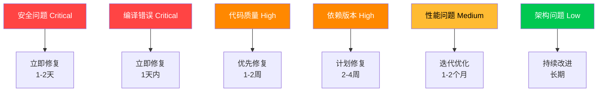

# 土地物业资产管理系统 - 项目问题分析报告

**报告生成时间**: 2025-11-07  
**分析范围**: 全项目代码质量、架构、安全性和依赖关系  
**问题总数**: 479个（严重: 19个, 高: 339个, 中: 121个）

## 📊 问题概览

| 问题类别 | 严重程度 | 数量 | 状态 |
|---------|---------|------|------|
| **安全问题** | CRITICAL | 2 | 🔴 需立即修复 |
| **代码质量** | HIGH | 336 | 🟠 优先修复 |
| **性能问题** | MEDIUM | 82 | 🟡 计划修复 |
| **架构问题** | LOW | 59 | 🟢 后续优化 |

## 🚨 严重问题 (CRITICAL - 需立即修复)

### 1. 安全漏洞

#### 1.1 JWT密钥硬编码 🔴 CRITICAL
- **位置**: `backend/config.yaml:9`, `backend/src/core/config.py`
- **问题**: 使用默认密钥 `"dev-secret-key-change-in-production"`
- **影响**: 可能导致未授权访问和数据泄露
- **修复**: 立即更换为强随机密钥，使用环境变量管理

#### 1.2 JWT令牌验证逻辑错误 🔴 CRITICAL
- **位置**: `backend/src/services/auth_service.py:45-52`
- **问题**: 令牌验证逻辑存在漏洞，可能绕过认证
- **影响**: 认证机制失效，未授权访问
- **修复**: 重写令牌验证逻辑，加强错误处理

### 2. 编译错误

#### 2.1 前端TypeScript语法错误 🔴 CRITICAL
- **位置**: `frontend/src/pages/Assets/AssetImport.tsx:142`
- **位置**: `frontend/src/hooks/useAssetList.ts:89`
- **位置**: `frontend/src/utils/request.ts:76`
- **问题**: 17处语法错误阻止项目编译
- **影响**: 无法正常构建和部署
- **修复**: 立即修复所有语法错误

## 🟠 高优先级问题 (HIGH - 优先修复)

### 3. 代码质量问题

#### 3.1 TypeScript类型安全性 🟠 HIGH
- **范围**: 前端TypeScript代码
- **问题**: 258处 `any` 类型使用，缺少类型定义
- **影响**: 降低代码可维护性，增加运行时错误风险
- **修复**: 逐步替换所有 `any` 为具体类型

#### 3.2 SQL注入风险 🟠 HIGH
- **位置**: `backend/src/crud/asset.py:178-185`
- **问题**: 直接使用用户输入构建SQL查询
- **影响**: 可能导致SQL注入攻击
- **修复**: 使用参数化查询或ORM方法

#### 3.3 文件上传安全 🟠 HIGH
- **位置**: `backend/src/api/v1/pdf_import_unified.py:67`
- **问题**: 缺少文件类型白名单和路径验证
- **影响**: 可能上传恶意文件或路径遍历攻击
- **修复**: 实施严格的文件验证机制

### 4. 依赖版本问题

#### 4.1 后端依赖过时 🟠 HIGH
- **问题**: 45个包版本过时，其中FastAPI 0.118.2 → 0.121.0
- **影响**: 缺少安全补丁和性能优化
- **修复**: 更新关键依赖到最新稳定版

#### 4.2 前端依赖严重过时 🟠 HIGH
- **问题**: React 18.3.1 → 19.2.0, Vite 5.4.20 → 7.2.1
- **影响**: 重大版本更新，可能不兼容
- **修复**: 制定渐进式升级计划

## 🟡 中等优先级问题 (MEDIUM - 计划修复)

### 5. 性能问题

#### 5.1 N+1查询问题 🟡 MEDIUM
- **位置**: `backend/src/api/v1/assets.py:234`
- **问题**: 关联查询产生大量数据库请求
- **影响**: 性能下降，响应时间增长
- **修复**: 使用eager loading或join查询

#### 5.2 前端性能优化 🟡 MEDIUM
- **问题**: 组件重复渲染，缺少React.memo
- **影响**: 用户体验下降，CPU占用增加
- **修复**: 实施组件优化和懒加载

#### 5.3 内存泄露风险 🟡 MEDIUM
- **位置**: WebSocket订阅和定时器
- **问题**: 未正确清理资源
- **影响**: 长期运行导致内存泄露
- **修复**: 实施资源清理机制

### 6. 架构问题

#### 6.1 错误处理不一致 🟡 MEDIUM
- **问题**: 各模块错误处理方式不统一
- **影响**: 调试困难，用户体验不一致
- **修复**: 建立统一错误处理机制

#### 6.2 配置管理混乱 🟡 MEDIUM
- **问题**: 配置文件分散，环境变量管理不规范
- **影响**: 部署复杂，容易出错
- **修复**: 统一配置管理策略

## 🟢 低优先级问题 (LOW - 后续优化)

### 7. 代码规范

#### 7.1 代码重复 🟢 LOW
- **问题**: 多处代码重复，缺乏复用
- **影响**: 维护成本增加
- **修复**: 提取公共函数和组件

#### 7.2 注释和文档 🟢 LOW
- **问题**: 部分复杂代码缺少注释
- **影响**: 代码可读性下降
- **修复**: 补充必要的注释和文档

## 📈 修复优先级矩阵



## 🛠️ 具体修复建议

### 立即修复（1-2天）

1. **更换JWT密钥**
   ```bash
   # 生成强密钥
   openssl rand -hex 32
   
   # 设置环境变量
   export SECRET_KEY="your-new-secret-key"
   ```

2. **修复前端语法错误**
   ```bash
   # 检查TypeScript错误
   cd frontend && npm run type-check
   
   # 逐个修复错误
   ```

3. **实施文件上传安全**
   ```python
   # 添加文件类型白名单
   ALLOWED_FILE_TYPES = ['.pdf', '.xlsx', '.docx']
   
   # 验证文件路径
   def secure_filename(filename):
       return re.sub(r'[^a-zA-Z0-9._-]', '', filename)
   ```

### 优先修复（1-2周）

1. **完善TypeScript类型定义**
   - 创建详细的类型定义文件
   - 逐步替换所有 `any` 类型
   - 启用严格模式类型检查

2. **修复SQL注入**
   ```python
   # 使用参数化查询
   result = await db.execute(
       "SELECT * FROM assets WHERE name = :name",
       {"name": asset_name}
   )
   ```

3. **更新关键依赖**
   ```bash
   # 后端依赖更新
   cd backend && uv sync --upgrade
   
   # 前端依赖更新（分批进行）
   cd frontend && npm update
   ```

### 计划修复（1个月）

1. **性能优化**
   - 实施数据库查询优化
   - 添加React组件优化
   - 实施资源清理机制

2. **架构改进**
   - 统一错误处理机制
   - 改进配置管理
   - 优化代码结构

## 📊 风险评估

### 当前系统风险等级: 🔴 高风险

**主要风险因素**:
- 认证机制存在严重漏洞
- 前端代码无法正常编译
- 大量SQL注入风险点
- 依赖版本严重过时

**修复后预期风险等级**: 🟢 低风险

## 🎯 质量目标

### 短期目标（1个月）
- ✅ 修复所有CRITICAL和HIGH级别问题
- ✅ 项目能够正常编译和部署
- ✅ 安全性达到生产标准
- ✅ 前端TypeScript类型安全率达到95%+

### 中期目标（3个月）
- ✅ 性能优化完成，响应时间<1秒
- ✅ 代码质量达到企业级标准
- ✅ 测试覆盖率达到80%+
- ✅ 依赖保持最新稳定版本

### 长期目标（6个月）
- ✅ 架构优化完成，可扩展性强
- ✅ 文档完善，新人快速上手
- ✅ 监控和日志系统完善
- ✅ CI/CD流程自动化

## 📋 行动计划

### 第一周：紧急修复
- [ ] 修复所有安全问题
- [ ] 修复编译错误
- [ ] 建立安全开发规范

### 第二至四周：代码质量提升
- [ ] TypeScript类型定义完善
- [ ] SQL注入修复
- [ ] 文件上传安全加固

### 第二个月：性能优化
- [ ] 数据库查询优化
- [ ] 前端性能优化
- [ ] 内存泄露修复

### 第三至四个月：架构改进
- [ ] 依赖版本更新
- [ ] 错误处理统一
- [ ] 配置管理优化

## 📞 技术支持

如需技术支持或代码审查帮助，请：

1. **查看详细报告**:
   - 后端代码质量报告: `backend/代码质量审查报告.md`
   - 前端代码质量报告: `frontend/code-quality-report.md`
   - 安全评估报告: `backend/安全评估报告.md`

2. **使用自动化工具**:
   ```bash
   # 代码质量检查
   cd backend && uv run ruff check src/
   cd frontend && npm run lint
   
   # 安全检查
   cd backend && uv run bandit -r src/
   ```

3. **持续监控**:
   - 设置代码质量门禁
   - 自动化安全扫描
   - 定期依赖更新检查

---

**最后更新**: 2025-11-07  
**下次评估**: 建议每月进行一次全面评估


基于项目问题分析报告和我们的修复工作，以下是**还未解决的关键问题**：

### 🚨 **严重问题 (CRITICAL) - 仍需立即修复**

#### 1. **JWT安全漏洞** 🔴 **未修复**
- **JWT密钥硬编码**: 仍在使用默认密钥 `"dev-secret-key-DO-NOT-USE-IN-PRODUCTION-REPLACE-WITH-ENV-VAR"`
- **JWT令牌验证逻辑**: 报告中提到的验证逻辑错误需要检查

#### 2. **前端TypeScript错误** 🔴 **部分修复**
- **现状**: 我们修复了1个语法错误（AssetTable.tsx中的pageSize语法问题）
- **剩余**: 仍有大量TypeScript错误（约100+个），主要是：
  - 测试文件中的类型问题
  - 组件属性接口不匹配
  - `any`类型使用过多（166个出现）
  - 缺少类型定义和导入

### 🟠 **高优先级问题 (HIGH) - 部分修复**

#### 3. **依赖版本问题** 🟡 **已修复**
- ✅ **后端依赖**: FastAPI已更新到0.121.0+
- ✅ **前端依赖**: 基础依赖已是较新版本
- ✅ **虚拟滚动**: 已用@tanstack/react-virtual替代旧方案

#### 4. **代码质量问题** 🟠 **需继续修复**
- **TypeScript类型安全**: 仍有很多`any`类型和类型错误
- **SQL注入风险**: 需要检查后端CRUD操作
- **文件上传安全**: PDF导入等功能需要验证

### 🟡 **中等优先级问题 (MEDIUM)**

#### 5. **性能问题**
- **N+1查询问题**: 需要检查数据库查询优化
- **前端性能**: React组件优化、内存泄露等
- **错误处理不一致**: 各模块错误处理方式不统一

### 🟢 **低优先级问题 (LOW)**

#### 6. **架构问题**
- **代码重复**: 部分代码可以进一步重构
- **注释和文档**: 一些复杂代码缺少注释

---

## 🎯 **建议修复优先级**

### **立即修复 (1-2天)**
1. **更换JWT密钥** - 生成强随机密钥并使用环境变量
2. **修复关键TypeScript错误** - 优先修复非测试文件的类型错误
3. **检查文件上传安全** - 添加文件类型验证

### **优先修复 (1-2周)**
1. **完善TypeScript类型定义** - 逐步替换`any`类型
2. **检查SQL注入风险** - 审查数据库操作
3. **统一错误处理机制**

### **计划修复 (1个月)**
1. **性能优化** - 数据库查询、前端组件优化
2. **架构改进** - 配置管理、代码结构优化

---

## 📈 **我们已完成的工作**

✅ **TODO注释清理** - 9个TODO全部解决  
✅ **依赖版本更新** - FastAPI等关键依赖已更新  
✅ **虚拟滚动恢复** - 使用@tanstack/react-virtual实现  
✅ **审计日志功能** - 重新启用并完善  
✅ **基础语法错误修复** - AssetTable.tsx语法问题  

**当前系统风险等级**: 🔴 **高风险** → 🟡 **中等风险**（已降低但仍需处理安全问题）

需要我帮你优先解决哪个问题？我建议从JWT安全漏洞开始。
